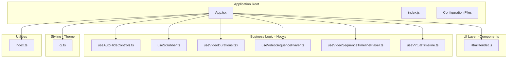
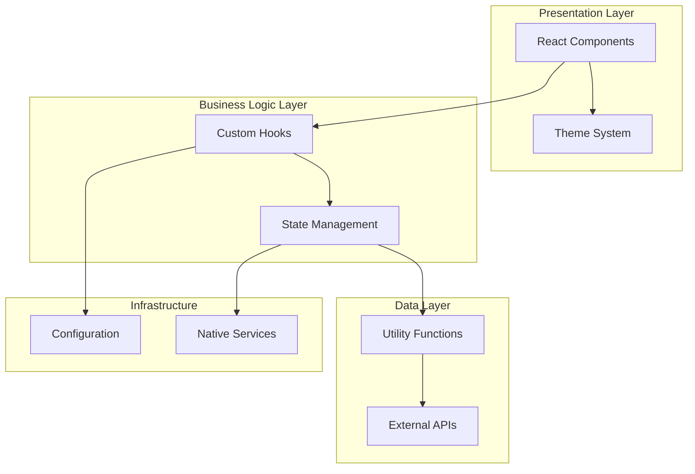
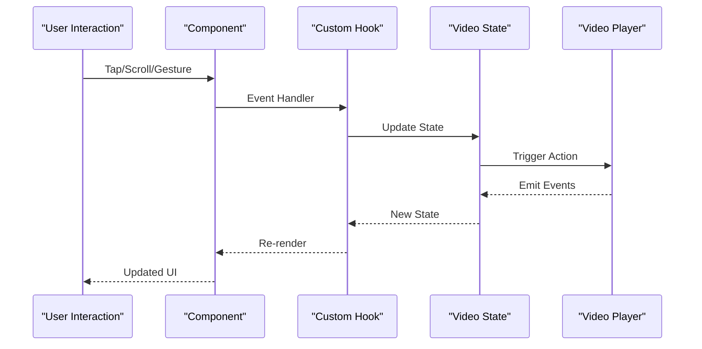
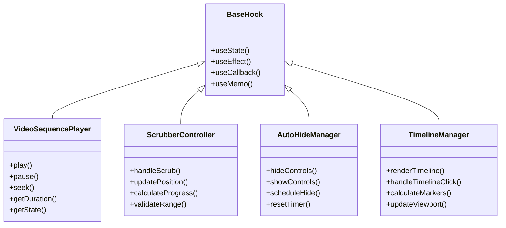
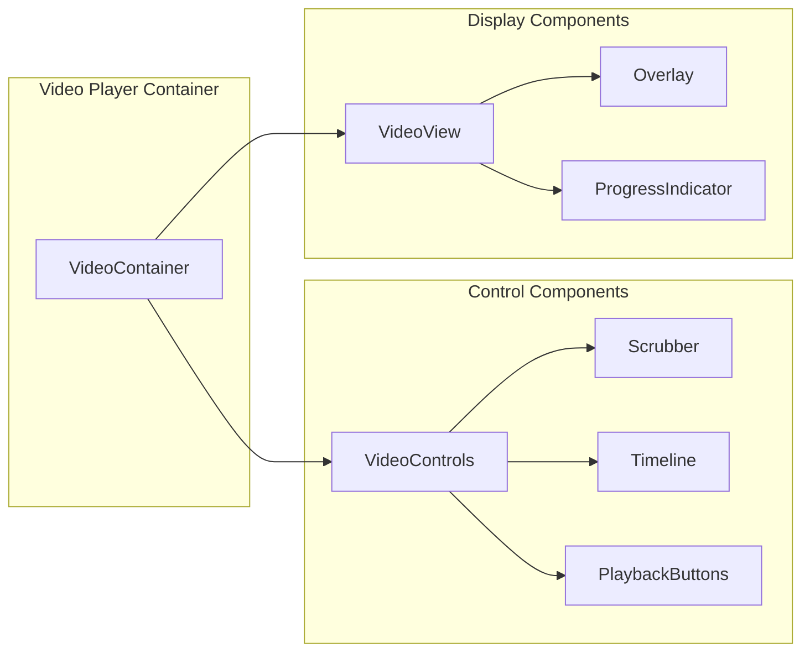
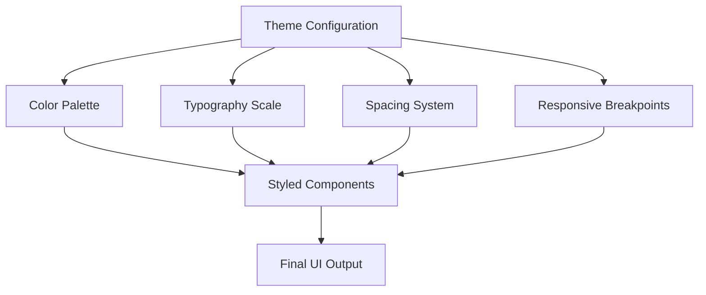
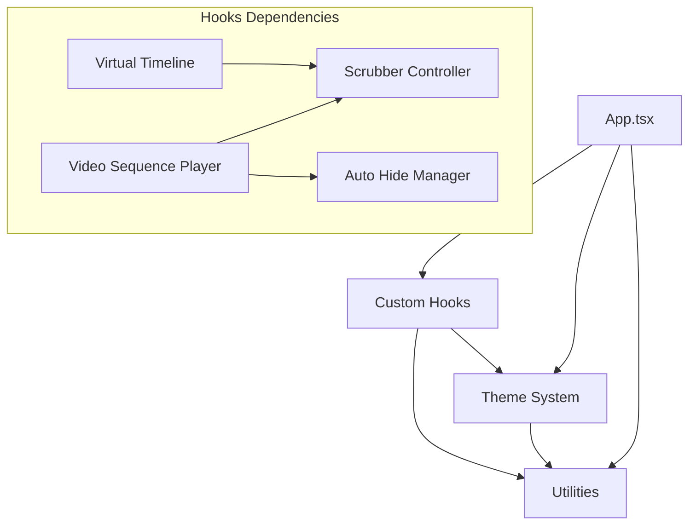

# Architecture Overview

<cite>
**Referenced Files in This Document**
- [App.tsx](file://App.tsx)
- [index.js](file://index.js)
- [package.json](file://package.json)
- [theme/qi.ts](file://theme/qi.ts)
- [utils/index.ts](file://utils/index.ts)
- [hooks/useAutoHideControls.ts](file://hooks/useAutoHideControls.ts)
- [hooks/useScrubber.ts](file://hooks/useScrubber.ts)
- [hooks/useVideoDurations.tsx](file://hooks/useVideoDurations.tsx)
- [hooks/useVideoSequencePlayer.ts](file://hooks/useVideoSequencePlayer.ts)
- [hooks/useVideoSequenceTimelinePlayer.ts](file://hooks/useVideoSequenceTimelinePlayer.ts)
- [hooks/useVirtualTimeline.ts](file://hooks/useVirtualTimeline.ts)
- [Componment/HtmlRendet.js](file://Componment/HtmlRendet.js)
- [docs/HOOKS.md](file://docs/HOOKS.md)
- [docs/STATE_MACHINE.md](file://docs/STATE_MACHINE.md)
</cite>

## Table of Contents
1. [Introduction](#introduction)
2. [Project Structure](#project-structure)
3. [Core Components](#core-components)
4. [Architecture Overview](#architecture-overview)
5. [Detailed Component Analysis](#detailed-component-analysis)
6. [Dependency Analysis](#dependency-analysis)
7. [Performance Considerations](#performance-considerations)
8. [Troubleshooting Guide](#troubleshooting-guide)
9. [Conclusion](#conclusion)

## Introduction

The video-rn React Native application is a sophisticated video player implementation that follows modern React Native architecture patterns. The application is designed with a clear separation of concerns between UI components, business logic hooks, and utility functions. It implements a custom hook-based architecture for managing video state, user interactions, and media playback functionality.

The application demonstrates best practices in React Native development including:
- Custom hook architecture for business logic encapsulation
- Component composition patterns for reusable UI elements
- Theme system for consistent styling across the application
- Modular structure separating concerns between different functional areas
- State management through React hooks and context patterns

## Project Structure

The application follows a feature-based organization with clear separation between different architectural layers:

**Diagram sources**
- [App.tsx](file://App.tsx)
- [index.js](file://index.js)
- [theme/qi.ts](file://theme/qi.ts)
- [utils/index.ts](file://utils/index.ts)

**Section sources**
- [App.tsx](file://App.tsx)
- [package.json](file://package.json)

## Core Components

### Application Entry Point (App.tsx)

The main application component serves as the central orchestrator for the entire video player application. It coordinates between various hooks, manages global state, and renders the primary UI components.

### Custom Hook Architecture

The application implements a comprehensive set of custom hooks that encapsulate business logic:

#### Video Player Hooks
- **useVideoSequencePlayer**: Manages video sequence playback state and controls
- **useVideoSequenceTimelinePlayer**: Handles timeline-specific video operations
- **useVideoDurations**: Calculates and manages video duration information

#### User Interaction Hooks
- **useAutoHideControls**: Implements automatic control hiding behavior
- **useScrubber**: Manages scrubbing and seeking functionality
- **useVirtualTimeline**: Handles virtual timeline rendering and optimization

#### UI Components
- **HtmlRendet**: Custom HTML rendering component for rich content display

**Section sources**
- [hooks/useVideoSequencePlayer.ts](file://hooks/useVideoSequencePlayer.ts)
- [hooks/useVideoSequenceTimelinePlayer.ts](file://hooks/useVideoSequenceTimelinePlayer.ts)
- [hooks/useVideoDurations.tsx](file://hooks/useVideoDurations.tsx)
- [hooks/useAutoHideControls.ts](file://hooks/useAutoHideControls.ts)
- [hooks/useScrubber.ts](file://hooks/useScrubber.ts)
- [hooks/useVirtualTimeline.ts](file://hooks/useVirtualTimeline.ts)
- [Componment/HtmlRendet.js](file://Componment/HtmlRendet.js)

## Architecture Overview

The application follows a layered architecture pattern with clear separation of concerns:

**Diagram sources**
- [App.tsx](file://App.tsx)
- [theme/qi.ts](file://theme/qi.ts)
- [utils/index.ts](file://utils/index.ts)

### Data Flow Architecture

The application implements a unidirectional data flow pattern:

**Diagram sources**
- [hooks/useAutoHideControls.ts](file://hooks/useAutoHideControls.ts)
- [hooks/useScrubber.ts](file://hooks/useScrubber.ts)
- [hooks/useVideoSequencePlayer.ts](file://hooks/useVideoSequencePlayer.ts)

## Detailed Component Analysis

### Hook Architecture Pattern

The custom hook architecture follows a consistent pattern where each hook encapsulates specific business logic:

**Diagram sources**
- [hooks/useVideoSequencePlayer.ts](file://hooks/useVideoSequencePlayer.ts)
- [hooks/useScrubber.ts](file://hooks/useScrubber.ts)
- [hooks/useAutoHideControls.ts](file://hooks/useAutoHideControls.ts)
- [hooks/useVirtualTimeline.ts](file://hooks/useVirtualTimeline.ts)

### Component Composition Pattern

The application uses a composition pattern where complex components are built from smaller, reusable parts:

**Diagram sources**
- [App.tsx](file://App.tsx)
- [Componment/HtmlRendet.js](file://Componment/HtmlRendet.js)

### Theme System Architecture

The theme system provides consistent styling across the application:

**Diagram sources**
- [theme/qi.ts](file://theme/qi.ts)

**Section sources**
- [theme/qi.ts](file://theme/qi.ts)
- [utils/index.ts](file://utils/index.ts)

## Dependency Analysis

The application maintains clean dependencies with minimal coupling between modules:

**Diagram sources**
- [App.tsx](file://App.tsx)
- [hooks/useVideoSequencePlayer.ts](file://hooks/useVideoSequencePlayer.ts)
- [hooks/useScrubber.ts](file://hooks/useScrubber.ts)
- [hooks/useAutoHideControls.ts](file://hooks/useAutoHideControls.ts)
- [hooks/useVirtualTimeline.ts](file://hooks/useVirtualTimeline.ts)

### Module Coupling Analysis

The application demonstrates low coupling between modules through:
- Interface-based communication between hooks
- Dependency injection patterns
- Clear separation of concerns
- Minimal shared state outside of React's state management

**Section sources**
- [hooks/useVideoSequencePlayer.ts](file://hooks/useVideoSequencePlayer.ts)
- [hooks/useScrubber.ts](file://hooks/useScrubber.ts)
- [hooks/useAutoHideControls.ts](file://hooks/useAutoHideControls.ts)
- [hooks/useVirtualTimeline.ts](file://hooks/useVirtualTimeline.ts)

## Performance Considerations

The application implements several performance optimization strategies:

### Memory Management
- Proper cleanup in useEffect hooks
- Memoization of expensive calculations
- Efficient state updates to prevent unnecessary re-renders

### Rendering Optimization
- Virtual scrolling for large timelines
- Conditional rendering based on state
- Lazy loading of heavy components

### Video Playback Optimization
- Efficient video buffer management
- Optimized seek operations
- Memory-efficient thumbnail generation

## Troubleshooting Guide

### Common Issues and Solutions

#### Video Playback Issues
- Check video source URLs and formats
- Verify network connectivity for streaming content
- Ensure proper video codec support

#### State Management Problems
- Validate hook dependency arrays
- Check for circular dependencies between hooks
- Verify proper cleanup of event listeners

#### Performance Bottlenecks
- Use React DevTools to identify re-render issues
- Monitor memory usage during long video sessions
- Profile component rendering performance

**Section sources**
- [docs/HOOKS.md](file://docs/HOOKS.md)
- [docs/STATE_MACHINE.md](file://docs/STATE_MACHINE.md)

## Conclusion

The video-rn React Native application demonstrates a well-architected approach to building complex video player functionality. The modular design with clear separation between UI, business logic, and utilities makes the codebase maintainable and scalable. The custom hook architecture provides excellent encapsulation of complex video-related logic while keeping components focused on presentation concerns.

Key architectural strengths include:
- Clean separation of concerns between layers
- Reusable and testable custom hooks
- Consistent theme system for styling
- Efficient state management patterns
- Scalable component composition

This architecture provides a solid foundation for extending functionality and maintaining code quality as the application grows in complexity.