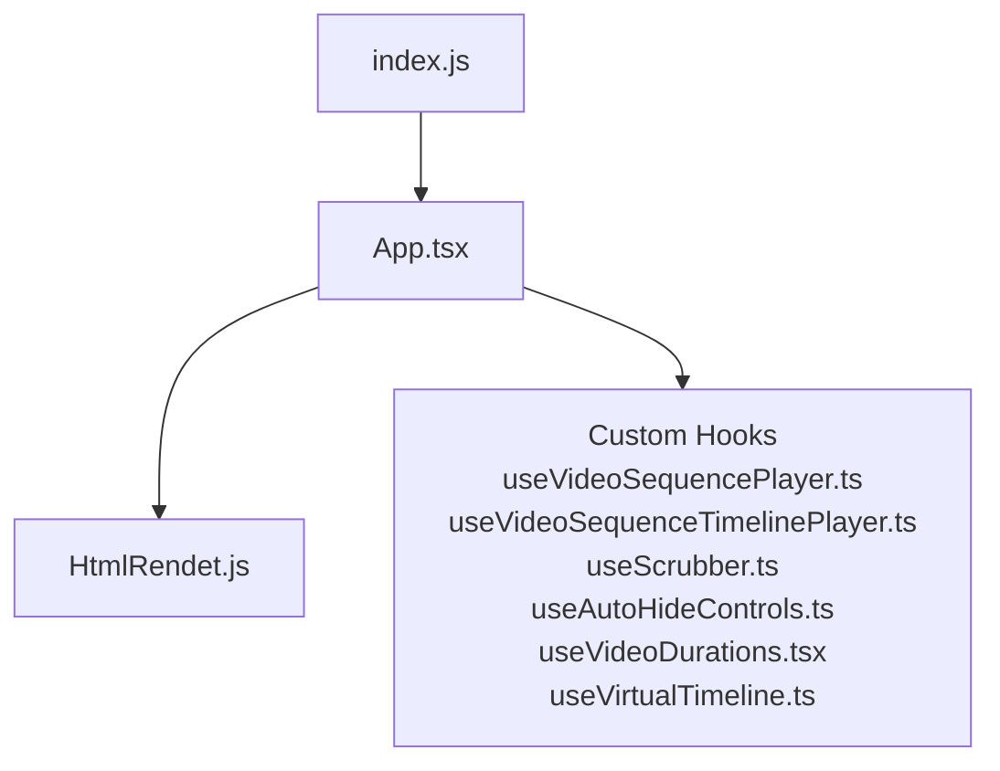
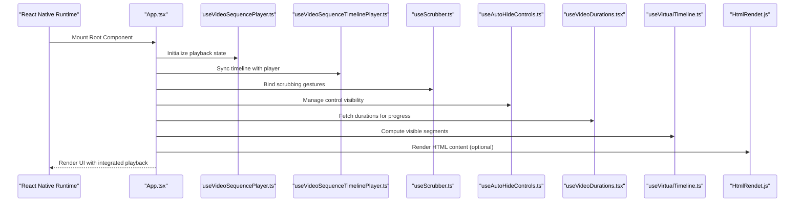
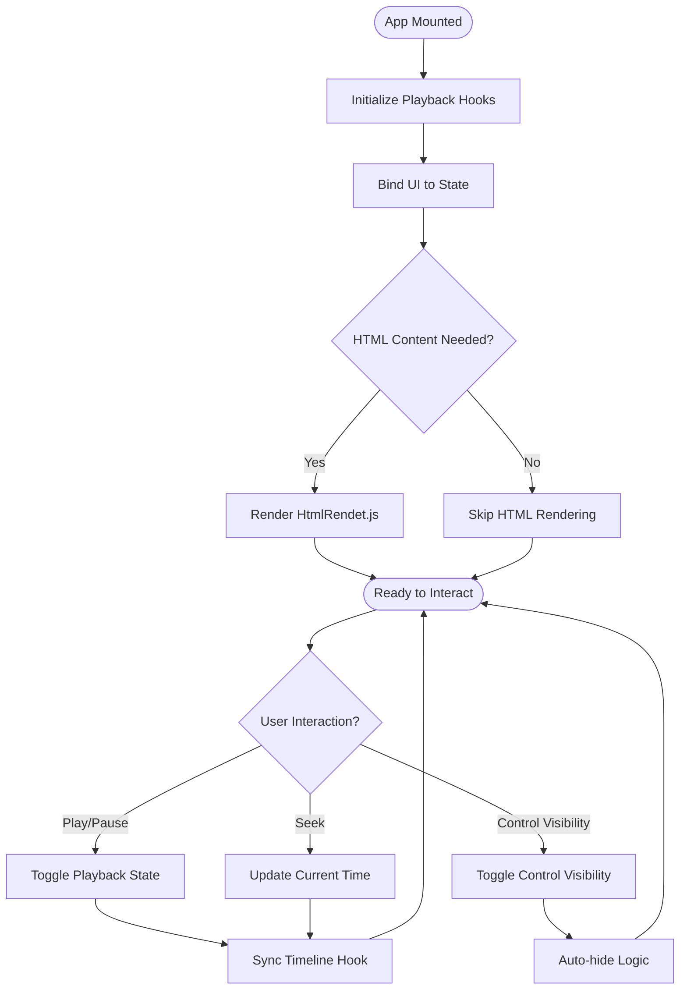
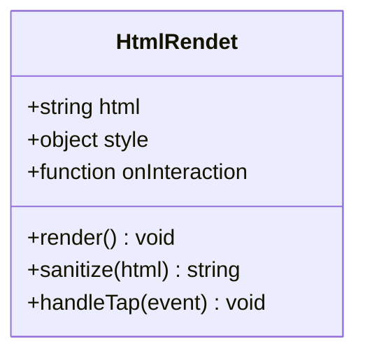
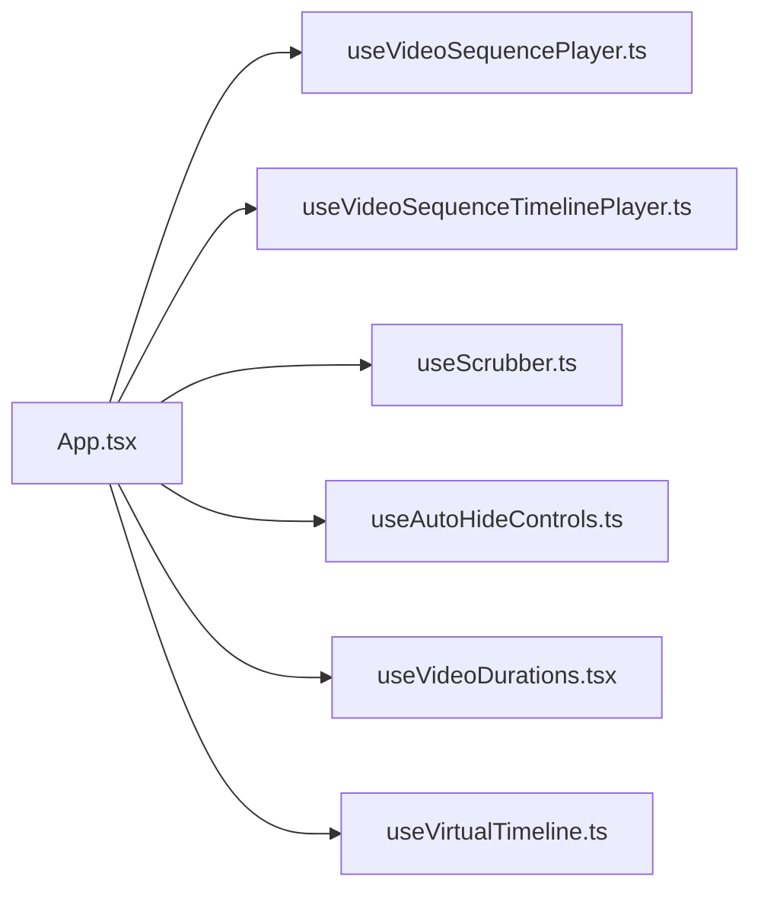
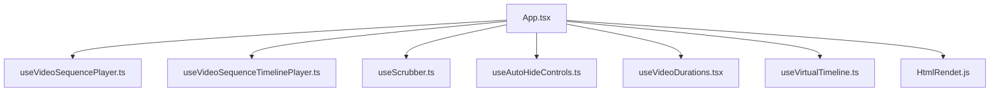

# Core Components

<cite>
**Referenced Files in This Document**
- [App.tsx](file://App.tsx)
- [HtmlRendet.js](file://Componment/HtmlRendet.js)
- [useAutoHideControls.ts](file://hooks/useAutoHideControls.ts)
- [useScrubber.ts](file://hooks/useScrubber.ts)
- [useVideoDurations.tsx](file://hooks/useVideoDurations.tsx)
- [useVideoSequencePlayer.ts](file://hooks/useVideoSequencePlayer.ts)
- [useVideoSequenceTimelinePlayer.ts](file://hooks/useVideoSequenceTimelinePlayer.ts)
- [useVirtualTimeline.ts](file://hooks/useVirtualTimeline.ts)
- [index.js](file://index.js)
- [package.json](file://package.json)
</cite>

## Table of Contents
1. [Introduction](#introduction)
2. [Project Structure](#project-structure)
3. [Core Components](#core-components)
4. [Architecture Overview](#architecture-overview)
5. [Detailed Component Analysis](#detailed-component-analysis)
6. [Dependency Analysis](#dependency-analysis)
7. [Performance Considerations](#performance-considerations)
8. [Troubleshooting Guide](#troubleshooting-guide)
9. [Conclusion](#conclusion)

## Introduction
This document explains the core components architecture of the video-rn application with a focus on:
- App.tsx as the main orchestrator coordinating video playback and managing overall application state
- HtmlRendet.js for rendering HTML content within React Native
- The component hierarchy, prop interfaces, and interactions with custom hooks
- Usage examples to integrate and extend functionality
- Lifecycle management and performance considerations

The goal is to provide both high-level understanding and actionable guidance for developers integrating or extending these components.

## Project Structure
At a high level, the app entry point initializes the React Native environment and mounts the root component. The root component (App.tsx) composes UI and behavior, leveraging custom hooks for video playback, scrubbing, timeline management, and control visibility. A separate component renders HTML content inside React Native via HtmlRendet.js.

**Diagram sources**
- [index.js](file://index.js)
- [App.tsx](file://App.tsx)
- [HtmlRendet.js](file://Componment/HtmlRendet.js)
- [useVideoSequencePlayer.ts](file://hooks/useVideoSequencePlayer.ts)
- [useVideoSequenceTimelinePlayer.ts](file://hooks/useVideoSequenceTimelinePlayer.ts)
- [useScrubber.ts](file://hooks/useScrubber.ts)
- [useAutoHideControls.ts](file://hooks/useAutoHideControls.ts)
- [useVideoDurations.tsx](file://hooks/useVideoDurations.tsx)
- [useVirtualTimeline.ts](file://hooks/useVirtualTimeline.ts)

**Section sources**
- [index.js](file://index.js)
- [package.json](file://package.json)

## Core Components
- App.tsx
  - Role: Main orchestrator that composes the UI, wires up playback controls, manages global state for video sequences, and integrates HTML rendering where needed.
  - Responsibilities:
    - Initialize and manage video sequence playback state
    - Coordinate scrubbing, timeline updates, and auto-hiding controls
    - Render HTML content through HtmlRendet.js when required
    - Expose props and handlers to child components and hooks
- HtmlRendet.js
  - Role: Renders HTML content within React Native by bridging to platform-specific HTML rendering capabilities.
  - Responsibilities:
    - Accept HTML string or structured content
    - Sanitize and render safely
    - Handle basic styling and layout constraints
    - Emit events for user interactions when applicable

Usage example patterns:
- Integrate App.tsx as the root component to enable full video playback features
- Embed HtmlRendet.js within screens or panels to display rich HTML descriptions, instructions, or metadata alongside videos

Lifecycle highlights:
- App.tsx sets up subscriptions and cleanup during mount/unmount
- HtmlRendet.js handles safe parsing and rendering lifecycle tied to its props changes

**Section sources**
- [App.tsx](file://App.tsx)
- [HtmlRendet.js](file://Componment/HtmlRendet.js)

## Architecture Overview
The application follows a component-driven architecture with clear separation between UI composition (App.tsx), HTML rendering (HtmlRendet.js), and business logic encapsulated in custom hooks.

**Diagram sources**
- [App.tsx](file://App.tsx)
- [useVideoSequencePlayer.ts](file://hooks/useVideoSequencePlayer.ts)
- [useVideoSequenceTimelinePlayer.ts](file://hooks/useVideoSequenceTimelinePlayer.ts)
- [useScrubber.ts](file://hooks/useScrubber.ts)
- [useAutoHideControls.ts](file://hooks/useAutoHideControls.ts)
- [useVideoDurations.tsx](file://hooks/useVideoDurations.tsx)
- [useVirtualTimeline.ts](file://hooks/useVirtualTimeline.ts)
- [HtmlRendet.js](file://Componment/HtmlRendet.js)

## Detailed Component Analysis

### App.tsx: Main Orchestrator
Responsibilities:
- Composes UI elements and binds them to playback state
- Wires custom hooks to handle complex behaviors like sequencing, scrubbing, and timeline updates
- Integrates HtmlRendet.js for HTML rendering needs
- Manages lifecycle events such as mounting, unmounting, and prop changes

Key interactions:
- Calls into useVideoSequencePlayer to start/pause/reset sequences
- Uses useVideoSequenceTimelinePlayer to keep UI timeline in sync
- Leverages useScrubber for gesture-based seeking
- Applies useAutoHideControls to hide/show controls based on user activity
- Consumes useVideoDurations to compute progress percentages
- Utilizes useVirtualTimeline to optimize rendering of large timelines

Prop interface overview:
- Props passed to App.tsx typically include configuration for initial playback, source media, and optional HTML content to render
- Internal state includes current time, duration, playing state, active sequence index, and control visibility flags

Lifecycle management:
- On mount: initialize hooks, set up event listeners, and prepare resources
- On update: react to prop changes (e.g., new media source) and re-sync state
- On unmount: clean up timers, listeners, and release resources

Performance considerations:
- Memoize expensive computations using hook results
- Avoid unnecessary re-renders by stabilizing props and derived state
- Use virtualization for long timelines to reduce render cost

**Diagram sources**
- [App.tsx](file://App.tsx)
- [useVideoSequencePlayer.ts](file://hooks/useVideoSequencePlayer.ts)
- [useVideoSequenceTimelinePlayer.ts](file://hooks/useVideoSequenceTimelinePlayer.ts)
- [useScrubber.ts](file://hooks/useScrubber.ts)
- [useAutoHideControls.ts](file://hooks/useAutoHideControls.ts)
- [useVideoDurations.tsx](file://hooks/useVideoDurations.tsx)
- [useVirtualTimeline.ts](file://hooks/useVirtualTimeline.ts)
- [HtmlRendet.js](file://Componment/HtmlRendet.js)

**Section sources**
- [App.tsx](file://App.tsx)

### HtmlRendet.js: HTML Renderer
Responsibilities:
- Accepts HTML input and renders it safely within React Native
- Handles basic styling and layout constraints
- Emits interaction events if needed (e.g., link taps)
- Ensures compatibility across platforms supported by React Native

Integration points:
- Used by App.tsx to display contextual HTML content alongside video UI
- Can be embedded in other screens or panels requiring rich text

Props interface overview:
- html: string or structured content to render
- style: optional styling overrides
- onInteraction: callback for user interactions within rendered HTML

Lifecycle management:
- Parses and sanitizes HTML on prop change
- Re-renders only when content or styles change
- Cleans up any temporary resources on unmount

Performance considerations:
- Minimize frequent HTML updates to avoid heavy re-parsing
- Cache parsed content when possible
- Limit complexity of HTML structures to reduce rendering overhead

**Diagram sources**
- [HtmlRendet.js](file://Componment/HtmlRendet.js)

**Section sources**
- [HtmlRendet.js](file://Componment/HtmlRendet.js)

### Custom Hooks Overview
These hooks encapsulate reusable logic for video playback, timeline synchronization, scrubbing, control visibility, duration computation, and virtualized timeline rendering.

- useVideoSequencePlayer.ts
  - Manages playback state for sequences, including play/pause, seek, and sequence transitions
- useVideoSequenceTimelinePlayer.ts
  - Keeps UI timeline synchronized with playback state and updates progress indicators
- useScrubber.ts
  - Handles touch/mouse gestures to scrub through video content
- useAutoHideControls.ts
  - Automatically hides controls after inactivity and shows them on interaction
- useVideoDurations.tsx
  - Computes total duration and segment durations for accurate progress calculation
- useVirtualTimeline.ts
  - Optimizes rendering of large timelines by virtualizing visible segments

Usage patterns:
- Combine multiple hooks in App.tsx to build cohesive playback experiences
- Extend hooks to add analytics, logging, or custom behaviors

**Diagram sources**
- [App.tsx](file://App.tsx)
- [useVideoSequencePlayer.ts](file://hooks/useVideoSequencePlayer.ts)
- [useVideoSequenceTimelinePlayer.ts](file://hooks/useVideoSequenceTimelinePlayer.ts)
- [useScrubber.ts](file://hooks/useScrubber.ts)
- [useAutoHideControls.ts](file://hooks/useAutoHideControls.ts)
- [useVideoDurations.tsx](file://hooks/useVideoDurations.tsx)
- [useVirtualTimeline.ts](file://hooks/useVirtualTimeline.ts)

**Section sources**
- [useVideoSequencePlayer.ts](file://hooks/useVideoSequencePlayer.ts)
- [useVideoSequenceTimelinePlayer.ts](file://hooks/useVideoSequenceTimelinePlayer.ts)
- [useScrubber.ts](file://hooks/useScrubber.ts)
- [useAutoHideControls.ts](file://hooks/useAutoHideControls.ts)
- [useVideoDurations.tsx](file://hooks/useVideoDurations.tsx)
- [useVirtualTimeline.ts](file://hooks/useVirtualTimeline.ts)

## Dependency Analysis
App.tsx depends on multiple custom hooks to implement playback logic and UI synchronization. HtmlRendet.js is an independent renderer used optionally by App.tsx.

**Diagram sources**
- [App.tsx](file://App.tsx)
- [useVideoSequencePlayer.ts](file://hooks/useVideoSequencePlayer.ts)
- [useVideoSequenceTimelinePlayer.ts](file://hooks/useVideoSequenceTimelinePlayer.ts)
- [useScrubber.ts](file://hooks/useScrubber.ts)
- [useAutoHideControls.ts](file://hooks/useAutoHideControls.ts)
- [useVideoDurations.tsx](file://hooks/useVideoDurations.tsx)
- [useVirtualTimeline.ts](file://hooks/useVirtualTimeline.ts)
- [HtmlRendet.js](file://Componment/HtmlRendet.js)

**Section sources**
- [App.tsx](file://App.tsx)
- [HtmlRendet.js](file://Componment/HtmlRendet.js)

## Performance Considerations
- Memoization: Stabilize hook outputs and derived state to prevent unnecessary re-renders
- Virtualization: Use useVirtualTimeline to limit DOM nodes for large timelines
- Efficient Updates: Batch state updates and avoid frequent HTML re-parsing in HtmlRendet.js
- Resource Management: Clean up timers and listeners in App.tsx lifecycle methods
- Platform Optimization: Ensure HTML rendering path is optimized for target platforms

[No sources needed since this section provides general guidance]

## Troubleshooting Guide
Common issues and resolutions:
- Playback not starting: Verify initialization order of hooks and ensure media sources are valid
- Timeline desynchronization: Check that useVideoSequenceTimelinePlayer is correctly bound to playback state
- Scrubbing unresponsive: Confirm gesture bindings in useScrubber and event propagation
- Controls not hiding: Inspect auto-hide logic in useAutoHideControls and user activity detection
- HTML rendering errors: Validate HTML content and sanitize inputs in HtmlRendet.js

Debugging tips:
- Log hook state changes to identify unexpected updates
- Isolate components by temporarily removing HtmlRendet.js to verify playback behavior
- Use React DevTools to inspect component tree and hook values

**Section sources**
- [App.tsx](file://App.tsx)
- [HtmlRendet.js](file://Componment/HtmlRendet.js)

## Conclusion
App.tsx serves as the central orchestrator for video playback and application state, while HtmlRendet.js provides robust HTML rendering within React Native. Together with a set of specialized custom hooks, they form a modular and extensible architecture. By following the integration patterns and performance guidelines outlined here, developers can effectively embed and enhance video playback experiences in their applications.

[No sources needed since this section summarizes without analyzing specific files]