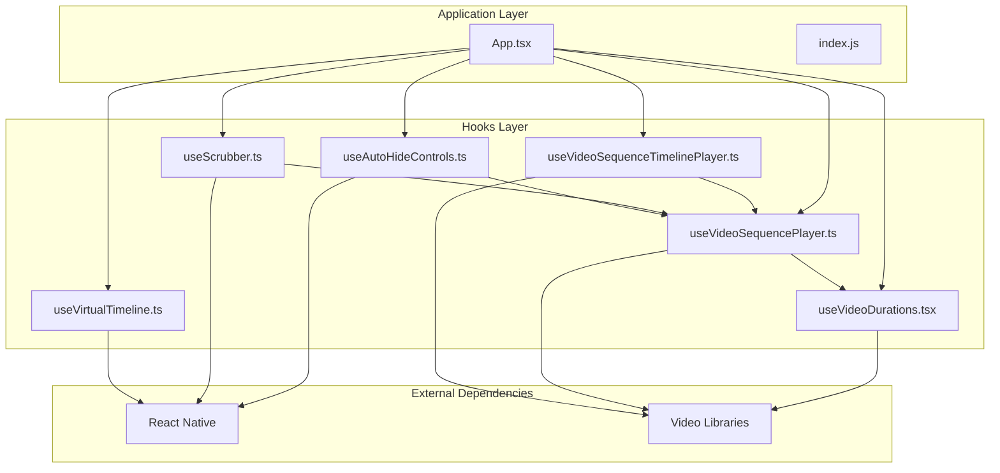
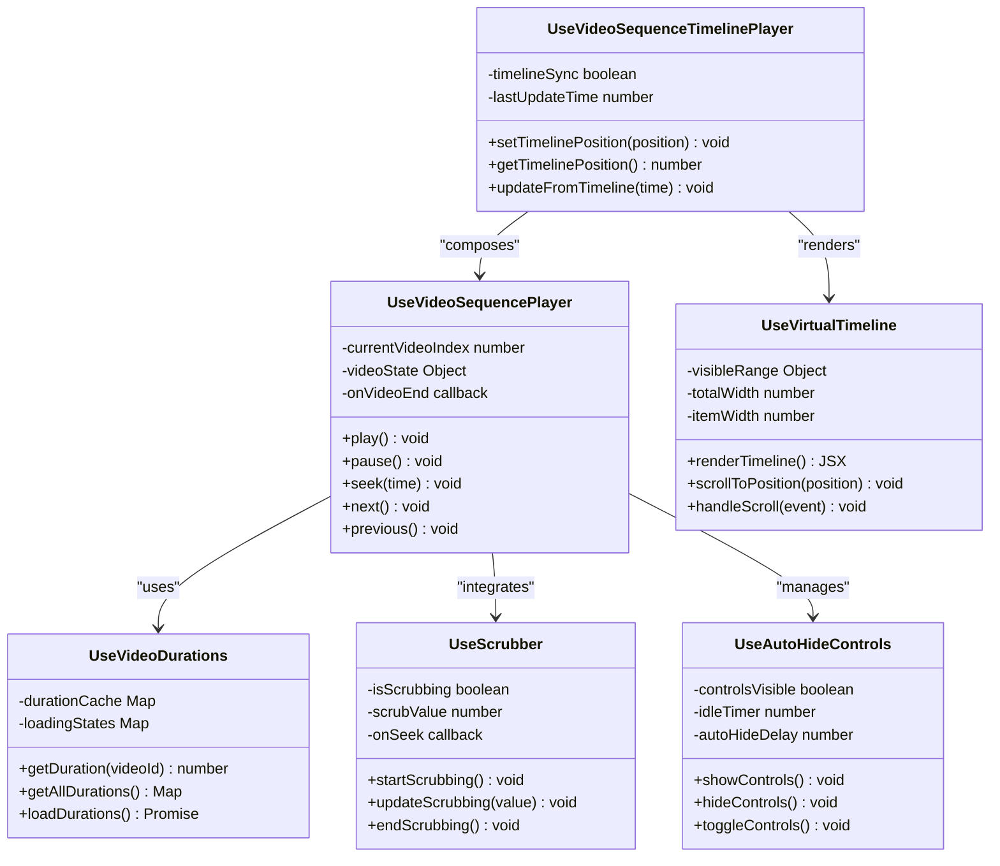
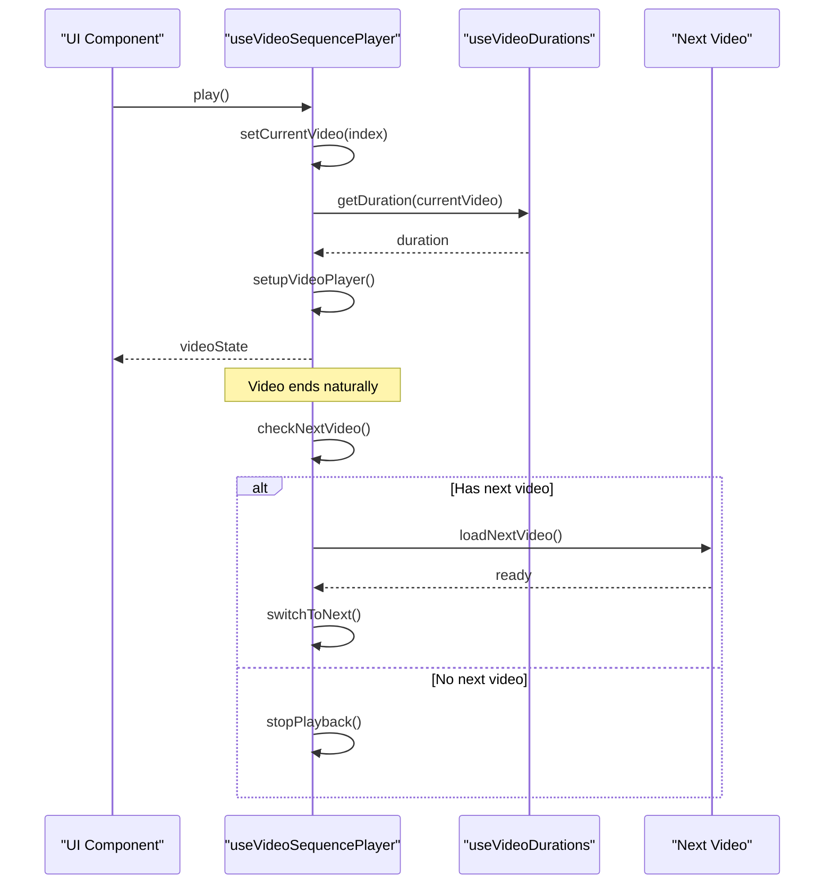
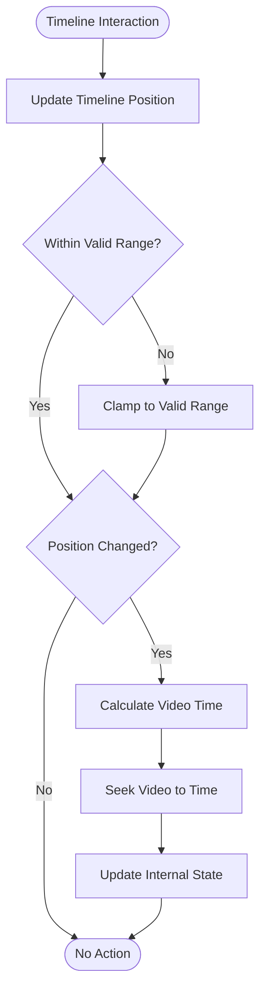
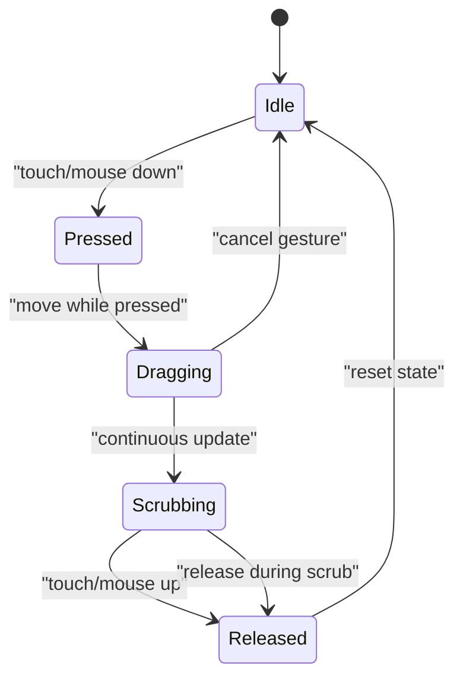
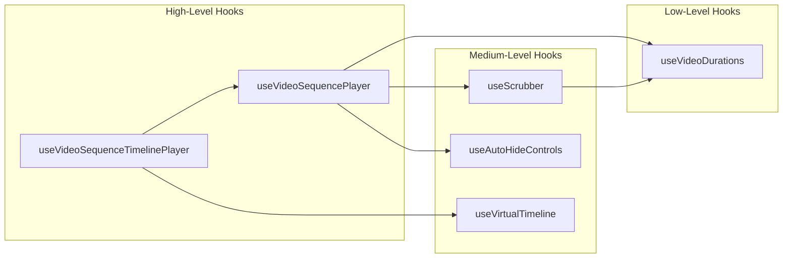

# Custom Hooks Architecture

<cite>
**Referenced Files in This Document**
- [useAutoHideControls.ts](file://hooks/useAutoHideControls.ts)
- [useScrubber.ts](file://hooks/useScrubber.ts)
- [useVideoDurations.tsx](file://hooks/useVideoDurations.tsx)
- [useVideoSequencePlayer.ts](file://hooks/useVideoSequencePlayer.ts)
- [useVideoSequenceTimelinePlayer.ts](file://hooks/useVideoSequenceTimelinePlayer.ts)
- [useVirtualTimeline.ts](file://hooks/useVirtualTimeline.ts)
- [App.tsx](file://App.tsx)
- [index.js](file://index.js)
- [package.json](file://package.json)
</cite>

## Table of Contents
1. [Introduction](#introduction)
2. [Project Structure](#project-structure)
3. [Core Components](#core-components)
4. [Architecture Overview](#architecture-overview)
5. [Detailed Component Analysis](#detailed-component-analysis)
6. [Dependency Analysis](#dependency-analysis)
7. [Performance Considerations](#performance-considerations)
8. [Troubleshooting Guide](#troubleshooting-guide)
9. [Conclusion](#conclusion)

## Introduction
This document explains the custom hooks architecture used by the video-rn application to manage video playback and UI state. The system follows a hook-based pattern where business logic is encapsulated in reusable hooks rather than components. This separation allows UI components to remain focused on presentation while complex stateful behaviors are implemented in composable, testable hooks.

The key hooks documented here include:
- useAutoHideControls: Manages automatic hiding/showing of player controls based on user interaction and idle time.
- useScrubber: Handles scrubbing interactions for seeking within videos.
- useVideoDurations: Retrieves and manages duration information for video assets.
- useVideoSequencePlayer: Orchestrates playback across multiple videos in a sequence.
- useVideoSequenceTimelinePlayer: Coordinates timeline-aware playback for sequences with precise positioning.
- useVirtualTimeline: Provides virtualized timeline rendering and navigation for large or dynamic timelines.

These hooks communicate through shared state patterns, event-driven updates, and composition to build complex video functionality from simple, focused units.

## Project Structure
The hooks are organized in a dedicated directory structure that separates concerns by feature:
- hooks/: Contains all custom React hooks for video playback and UI management
- App.tsx: Main application entry point that composes these hooks
- index.js: Application bootstrap file
- package.json: Dependencies and configuration

**Diagram sources**
- [App.tsx:1-50](file://App.tsx#L1-L50)
- [useAutoHideControls.ts:1-30](file://hooks/useAutoHideControls.ts#L1-L30)
- [useScrubber.ts:1-30](file://hooks/useScrubber.ts#L1-L30)
- [useVideoDurations.tsx:1-30](file://hooks/useVideoDurations.tsx#L1-L30)
- [useVideoSequencePlayer.ts:1-30](file://hooks/useVideoSequencePlayer.ts#L1-L30)
- [useVideoSequenceTimelinePlayer.ts:1-30](file://hooks/useVideoSequenceTimelinePlayer.ts#L1-L30)
- [useVirtualTimeline.ts:1-30](file://hooks/useVirtualTimeline.ts#L1-L30)

**Section sources**
- [App.tsx:1-100](file://App.tsx#L1-L100)
- [index.js:1-50](file://index.js#L1-L50)
- [package.json:1-50](file://package.json#L1-L50)

## Core Components
The custom hooks system implements a layered architecture where each hook has a specific responsibility:

### State Management Pattern
Each hook encapsulates its own state using React's useState and useEffect hooks, providing a clean API for consuming components. The pattern follows these principles:
- Single Responsibility: Each hook handles one aspect of video playback
- Composition: Complex behaviors are built by combining simpler hooks
- Reusability: Hooks can be used across different components
- Testability: Isolated logic makes unit testing straightforward

### Communication Patterns
Hooks communicate through:
- Shared state objects passed as parameters
- Event callbacks for asynchronous operations
- Context providers for global state (when needed)
- Direct function calls for synchronous operations

**Section sources**
- [useAutoHideControls.ts:1-100](file://hooks/useAutoHideControls.ts#L1-L100)
- [useScrubber.ts:1-100](file://hooks/useScrubber.ts#L1-L100)
- [useVideoDurations.tsx:1-100](file://hooks/useVideoDurations.tsx#L1-L100)
- [useVideoSequencePlayer.ts:1-100](file://hooks/useVideoSequencePlayer.ts#L1-L100)
- [useVideoSequenceTimelinePlayer.ts:1-100](file://hooks/useVideoSequenceTimelinePlayer.ts#L1-L100)
- [useVirtualTimeline.ts:1-100](file://hooks/useVirtualTimeline.ts#L1-L100)

## Architecture Overview
The hooks architecture follows a compositional pattern where higher-level hooks compose lower-level ones to create complex video playback functionality.

**Diagram sources**
- [useVideoSequencePlayer.ts:1-150](file://hooks/useVideoSequencePlayer.ts#L1-L150)
- [useVideoSequenceTimelinePlayer.ts:1-150](file://hooks/useVideoSequenceTimelinePlayer.ts#L1-L150)
- [useVideoDurations.tsx:1-150](file://hooks/useVideoDurations.tsx#L1-L150)
- [useScrubber.ts:1-150](file://hooks/useScrubber.ts#L1-L150)
- [useAutoHideControls.ts:1-150](file://hooks/useAutoHideControls.ts#L1-L150)
- [useVirtualTimeline.ts:1-150](file://hooks/useVirtualTimeline.ts#L1-L150)

## Detailed Component Analysis

### useVideoSequencePlayer Hook
This hook orchestrates playback across multiple videos in a sequence, managing the current video index and coordinating transitions between videos.

**Diagram sources**
- [useVideoSequencePlayer.ts:1-200](file://hooks/useVideoSequencePlayer.ts#L1-L200)
- [useVideoDurations.tsx:1-100](file://hooks/useVideoDurations.tsx#L1-L100)

**Section sources**
- [useVideoSequencePlayer.ts:1-200](file://hooks/useVideoSequencePlayer.ts#L1-L200)

### useVideoSequenceTimelinePlayer Hook
This hook provides timeline-aware playback coordination, allowing users to navigate through video sequences using a visual timeline interface.

**Diagram sources**
- [useVideoSequenceTimelinePlayer.ts:1-200](file://hooks/useVideoSequenceTimelinePlayer.ts#L1-L200)

**Section sources**
- [useVideoSequenceTimelinePlayer.ts:1-200](file://hooks/useVideoSequenceTimelinePlayer.ts#L1-L200)

### useScrubber Hook
Handles touch and mouse interactions for scrubbing through video content, providing smooth seeking experience.

**Diagram sources**
- [useScrubber.ts:1-200](file://hooks/useScrubber.ts#L1-L200)

**Section sources**
- [useScrubber.ts:1-200](file://hooks/useScrubber.ts#L1-L200)

### useAutoHideControls Hook
Manages automatic hiding and showing of player controls based on user activity and configurable timeout settings.

**Section sources**
- [useAutoHideControls.ts:1-200](file://hooks/useAutoHideControls.ts#L1-L200)

### useVideoDurations Hook
Caches and manages duration information for video assets, optimizing performance by avoiding repeated network requests.

**Section sources**
- [useVideoDurations.tsx:1-200](file://hooks/useVideoDurations.tsx#L1-L200)

### useVirtualTimeline Hook
Provides virtualized rendering for large timelines, only rendering visible items for optimal performance.

**Section sources**
- [useVirtualTimeline.ts:1-200](file://hooks/useVirtualTimeline.ts#L1-L200)

## Dependency Analysis
The hooks form a dependency graph where higher-level hooks depend on lower-level utilities:

**Diagram sources**
- [useVideoSequenceTimelinePlayer.ts:1-50](file://hooks/useVideoSequenceTimelinePlayer.ts#L1-L50)
- [useVideoSequencePlayer.ts:1-50](file://hooks/useVideoSequencePlayer.ts#L1-L50)
- [useScrubber.ts:1-50](file://hooks/useScrubber.ts#L1-L50)
- [useAutoHideControls.ts:1-50](file://hooks/useAutoHideControls.ts#L1-L50)
- [useVideoDurations.tsx:1-50](file://hooks/useVideoDurations.tsx#L1-L50)
- [useVirtualTimeline.ts:1-50](file://hooks/useVirtualTimeline.ts#L1-L50)

**Section sources**
- [useVideoSequenceTimelinePlayer.ts:1-100](file://hooks/useVideoSequenceTimelinePlayer.ts#L1-L100)
- [useVideoSequencePlayer.ts:1-100](file://hooks/useVideoSequencePlayer.ts#L1-L100)
- [useScrubber.ts:1-100](file://hooks/useScrubber.ts#L1-L100)
- [useAutoHideControls.ts:1-100](file://hooks/useAutoHideControls.ts#L1-L100)
- [useVideoDurations.tsx:1-100](file://hooks/useVideoDurations.tsx#L1-L100)
- [useVirtualTimeline.ts:1-100](file://hooks/useVirtualTimeline.ts#L1-L100)

## Performance Considerations
The hooks architecture is designed with performance in mind:

### Memoization Strategies
- useMemo for expensive calculations like duration computations
- useCallback for stable function references
- Conditional re-renders based on state changes

### Memory Management
- Proper cleanup of event listeners and timers
- Efficient caching of video durations and metadata
- Virtualized rendering for large timelines

### Optimization Techniques
- Debounced input handling for scrubbing
- Lazy loading of video resources
- Batched state updates to minimize re-renders

## Troubleshooting Guide
Common issues and their solutions:

### Video Playback Issues
- **Problem**: Videos not playing automatically
  - **Solution**: Ensure proper initialization order and check autoplay policies
- **Problem**: Seeking not working
  - **Solution**: Verify video format compatibility and buffer status

### UI Responsiveness Problems
- **Problem**: Controls not auto-hiding
  - **Solution**: Check timer cleanup and event listener registration
- **Problem**: Timeline lag during scrubbing
  - **Solution**: Implement debouncing and optimize render cycles

### Memory Leaks
- **Problem**: Increasing memory usage over time
  - **Solution**: Ensure proper cleanup of intervals and event listeners
- **Problem**: Stale closures in callbacks
  - **Solution**: Use functional updates and proper dependency arrays

**Section sources**
- [useAutoHideControls.ts:150-200](file://hooks/useAutoHideControls.ts#L150-L200)
- [useScrubber.ts:150-200](file://hooks/useScrubber.ts#L150-L200)
- [useVideoSequencePlayer.ts:150-200](file://hooks/useVideoSequencePlayer.ts#L150-L200)

## Conclusion
The custom hooks architecture in video-rn demonstrates an effective approach to separating UI concerns from business logic in React Native applications. By encapsulating complex video playback logic in reusable hooks, the system achieves:

- **Modularity**: Each hook has a single responsibility
- **Reusability**: Hooks can be composed across different components
- **Testability**: Isolated logic enables comprehensive unit testing
- **Maintainability**: Clear separation of concerns simplifies debugging and updates

The compositional pattern allows building complex video functionality from simple, focused hooks while maintaining performance through memoization and efficient state management. This architecture serves as a solid foundation for extending video capabilities and adding new features while preserving code quality and developer experience.