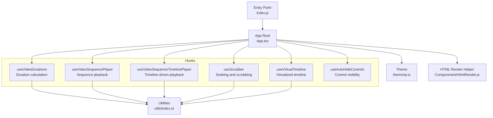
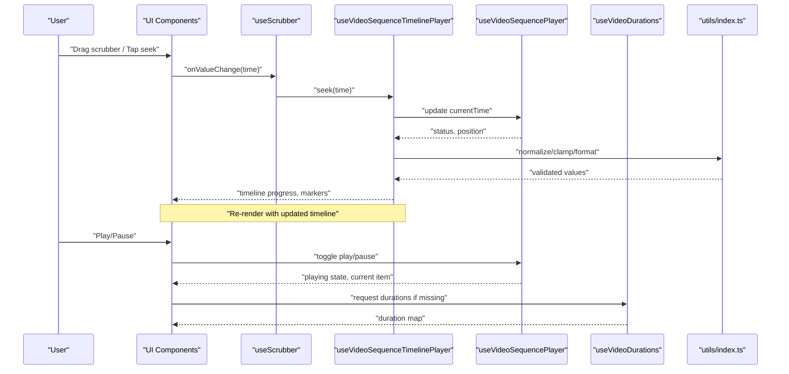
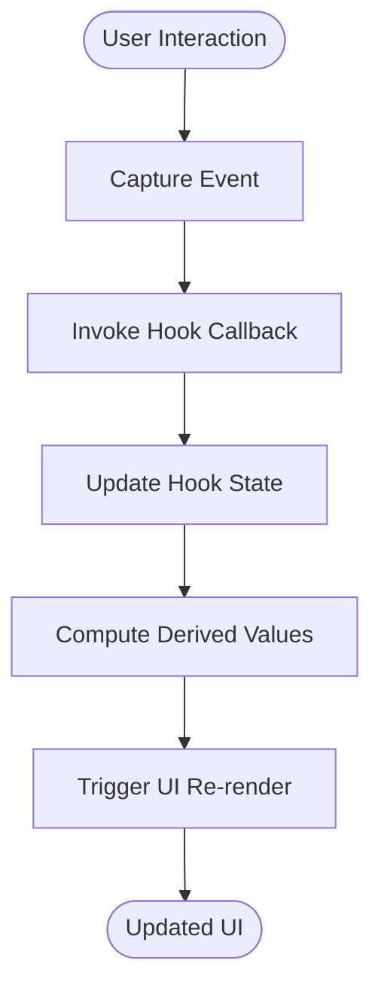
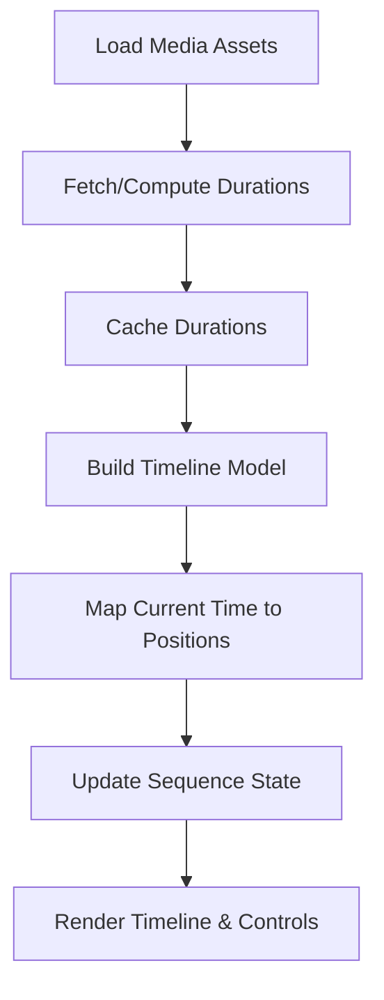
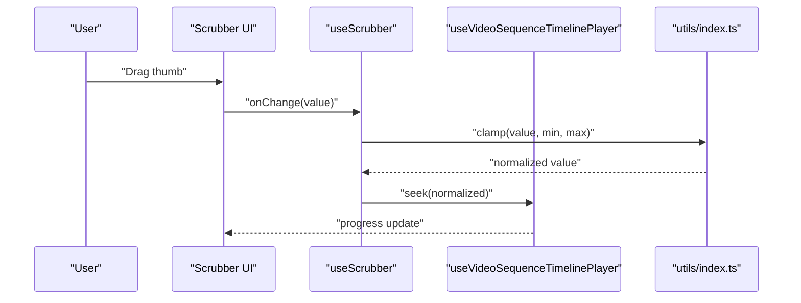
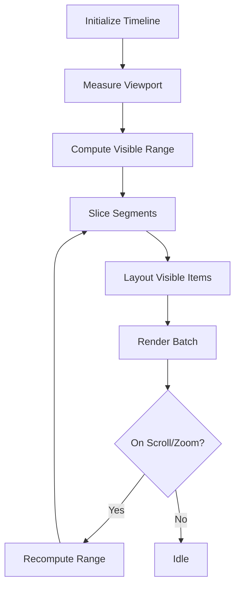
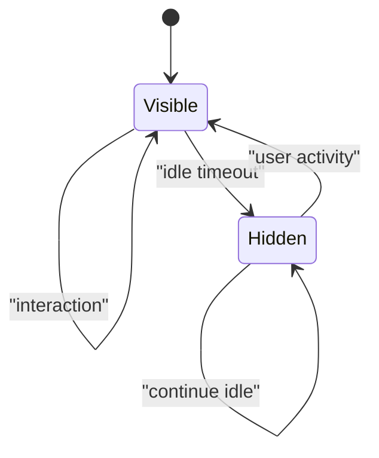
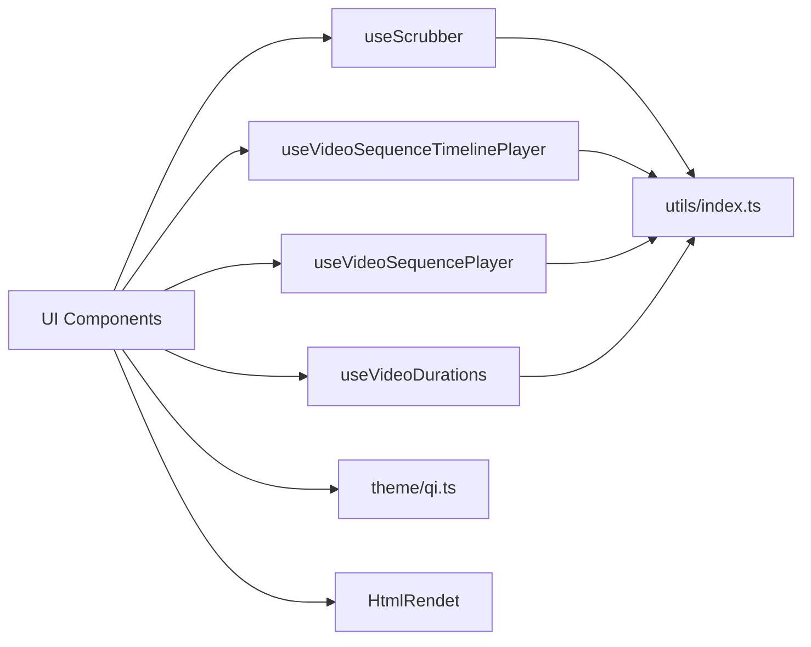

# Data Flow Patterns

<cite>
**Referenced Files in This Document**
- [App.tsx](file://App.tsx)
- [index.js](file://index.js)
- [useVideoDurations.tsx](file://hooks/useVideoDurations.tsx)
- [useVideoSequencePlayer.ts](file://hooks/useVideoSequencePlayer.ts)
- [useVideoSequenceTimelinePlayer.ts](file://hooks/useVideoSequenceTimelinePlayer.ts)
- [useScrubber.ts](file://hooks/useScrubber.ts)
- [useVirtualTimeline.ts](file://hooks/useVirtualTimeline.ts)
- [useAutoHideControls.ts](file://hooks/useAutoHideControls.ts)
- [utils/index.ts](file://utils/index.ts)
- [theme/qi.ts](file://theme/qi.ts)
- [Componment/HtmlRendet.js](file://Componment/HtmlRendet.js)
- [package.json](file://package.json)
</cite>

## Table of Contents
1. [Introduction](#introduction)
2. [Project Structure](#project-structure)
3. [Core Components](#core-components)
4. [Architecture Overview](#architecture-overview)
5. [Detailed Component Analysis](#detailed-component-analysis)
6. [Dependency Analysis](#dependency-analysis)
7. [Performance Considerations](#performance-considerations)
8. [Troubleshooting Guide](#troubleshooting-guide)
9. [Conclusion](#conclusion)

## Introduction
This document explains the data flow patterns in the video-rn application, focusing on how user interactions trigger state changes through custom hooks and update UI components. It details the unidirectional data flow from user input to hooks, state updates, and UI re-rendering. It also documents how video metadata flows through the system, including duration calculations, timeline positioning, and sequence management, and highlights the role of utility functions in maintaining consistency. Finally, it addresses error handling patterns and performance considerations for large datasets and real-time updates.

## Project Structure
The project is organized around a React Native entry point, a set of custom hooks that encapsulate stateful logic, shared utilities, theming, and a minimal component module. The hooks are the central orchestrators of data flow, while the UI consumes derived state and callbacks.

**Diagram sources**
- [index.js:1-20](file://index.js#L1-L20)
- [App.tsx:1-50](file://App.tsx#L1-L50)
- [hooks/useVideoDurations.tsx:1-40](file://hooks/useVideoDurations.tsx#L1-L40)
- [hooks/useVideoSequencePlayer.ts:1-40](file://hooks/useVideoSequencePlayer.ts#L1-L40)
- [hooks/useVideoSequenceTimelinePlayer.ts:1-40](file://hooks/useVideoSequenceTimelinePlayer.ts#L1-L40)
- [hooks/useScrubber.ts:1-40](file://hooks/useScrubber.ts#L1-L40)
- [hooks/useVirtualTimeline.ts:1-40](file://hooks/useVirtualTimeline.ts#L1-L40)
- [hooks/useAutoHideControls.ts:1-40](file://hooks/useAutoHideControls.ts#L1-L40)
- [utils/index.ts:1-40](file://utils/index.ts#L1-L40)
- [theme/qi.ts:1-40](file://theme/qi.ts#L1-L40)
- [Componment/HtmlRendet.js:1-40](file://Componment/HtmlRendet.js#L1-L40)

**Section sources**
- [index.js:1-20](file://index.js#L1-L20)
- [App.tsx:1-50](file://App.tsx#L1-L50)
- [package.json:1-40](file://package.json#L1-L40)

## Core Components
- Custom hooks encapsulate all stateful logic and side effects:
  - Duration calculation and caching for media assets.
  - Sequence playback control (play/pause, next/previous).
  - Timeline-driven playback with precise time mapping.
  - Scrubbing and seeking behavior.
  - Virtualization for large timelines.
  - Auto-hiding controls based on interaction.
- Utilities provide pure functions for consistent data processing (e.g., formatting, clamping, normalization).
- Theming provides design tokens consumed by UI components.
- A small HTML render helper supports rendering rich content when needed.

**Section sources**
- [hooks/useVideoDurations.tsx:1-40](file://hooks/useVideoDurations.tsx#L1-L40)
- [hooks/useVideoSequencePlayer.ts:1-40](file://hooks/useVideoSequencePlayer.ts#L1-L40)
- [hooks/useVideoSequenceTimelinePlayer.ts:1-40](file://hooks/useVideoSequenceTimelinePlayer.ts#L1-L40)
- [hooks/useScrubber.ts:1-40](file://hooks/useScrubber.ts#L1-L40)
- [hooks/useVirtualTimeline.ts:1-40](file://hooks/useVirtualTimeline.ts#L1-L40)
- [hooks/useAutoHideControls.ts:1-40](file://hooks/useAutoHideControls.ts#L1-L40)
- [utils/index.ts:1-40](file://utils/index.ts#L1-L40)
- [theme/qi.ts:1-40](file://theme/qi.ts#L1-L40)
- [Componment/HtmlRendet.js:1-40](file://Componment/HtmlRendet.js#L1-L40)

## Architecture Overview
The application follows a unidirectional data flow pattern:
- User interactions (taps, drags, gestures) are captured by UI components.
- Interactions invoke callbacks provided by custom hooks.
- Hooks update internal state and coordinate side effects (e.g., media loading, timers).
- Derived state is computed via utilities and exposed back to the UI.
- UI re-renders reactively based on hook state changes.

**Diagram sources**
- [hooks/useScrubber.ts:1-40](file://hooks/useScrubber.ts#L1-L40)
- [hooks/useVideoSequenceTimelinePlayer.ts:1-40](file://hooks/useVideoSequenceTimelinePlayer.ts#L1-L40)
- [hooks/useVideoSequencePlayer.ts:1-40](file://hooks/useVideoSequencePlayer.ts#L1-L40)
- [hooks/useVideoDurations.tsx:1-40](file://hooks/useVideoDurations.tsx#L1-L40)
- [utils/index.ts:1-40](file://utils/index.ts#L1-L40)

## Detailed Component Analysis

### Unidirectional Data Flow: Input → Hooks → State → UI
- Inputs: Touch events, gesture recognizers, and button presses in UI components.
- Hooks: Encapsulate state transitions and side effects; expose stable APIs to UI.
- State: Local hook state plus derived values computed via utilities.
- UI: Consumes hook outputs and invokes callbacks; no direct mutation of external state.

[No sources needed since this diagram shows conceptual workflow, not actual code structure]

### Video Metadata Flow: Duration Calculation, Timeline Positioning, Sequence Management
- Duration calculation:
  - Media assets request or cache durations.
  - Caching avoids repeated expensive operations.
- Timeline positioning:
  - Current time maps to normalized positions across segments.
  - Utilities clamp and format values for display.
- Sequence management:
  - Playback state tracks active segment, index, and status.
  - Transitions between items are coordinated by sequence player.

**Section sources**
- [hooks/useVideoDurations.tsx:1-40](file://hooks/useVideoDurations.tsx#L1-L40)
- [hooks/useVideoSequenceTimelinePlayer.ts:1-40](file://hooks/useVideoSequenceTimelinePlayer.ts#L1-L40)
- [hooks/useVideoSequencePlayer.ts:1-40](file://hooks/useVideoSequencePlayer.ts#L1-L40)
- [utils/index.ts:1-40](file://utils/index.ts#L1-L40)

### Scrubber and Seeking
- Captures drag/tap events and converts them to target times.
- Validates inputs using utilities (clamping to valid ranges).
- Emits seek actions to timeline player and updates UI feedback immediately.

**Diagram sources**
- [hooks/useScrubber.ts:1-40](file://hooks/useScrubber.ts#L1-L40)
- [hooks/useVideoSequenceTimelinePlayer.ts:1-40](file://hooks/useVideoSequenceTimelinePlayer.ts#L1-L40)
- [utils/index.ts:1-40](file://utils/index.ts#L1-L40)

**Section sources**
- [hooks/useScrubber.ts:1-40](file://hooks/useScrubber.ts#L1-L40)
- [utils/index.ts:1-40](file://utils/index.ts#L1-L40)

### Virtual Timeline for Large Datasets
- Renders only visible segments to reduce memory and layout costs.
- Computes offsets and scales based on total duration and viewport.
- Updates on scroll/zoom to maintain smooth interaction.

**Section sources**
- [hooks/useVirtualTimeline.ts:1-40](file://hooks/useVirtualTimeline.ts#L1-L40)

### Auto-Hide Controls
- Tracks idle time and user activity to show/hide controls.
- Debounces hide actions to avoid flicker.
- Integrates with playback state to respect playing/paused modes.

**Section sources**
- [hooks/useAutoHideControls.ts:1-40](file://hooks/useAutoHideControls.ts#L1-L40)

### Utility Functions
- Provide pure transformations: formatting, clamping, normalization, safe parsing.
- Ensure consistent behavior across hooks and UI.
- Reduce duplication and centralize edge-case handling.

**Section sources**
- [utils/index.ts:1-40](file://utils/index.ts#L1-L40)

### Theme Integration
- Design tokens applied consistently across UI elements.
- Ensures visual coherence and simplifies customization.

**Section sources**
- [theme/qi.ts:1-40](file://theme/qi.ts#L1-L40)

### HTML Render Helper
- Provides a lightweight mechanism to render HTML-like content within the app where necessary.

**Section sources**
- [Componment/HtmlRendet.js:1-40](file://Componment/HtmlRendet.js#L1-L40)

## Dependency Analysis
Custom hooks depend on utilities for data processing and may coordinate with each other through well-defined interfaces. The UI layer depends on hooks for state and callbacks, while theme and helpers support presentation concerns.

**Diagram sources**
- [hooks/useScrubber.ts:1-40](file://hooks/useScrubber.ts#L1-L40)
- [hooks/useVideoSequenceTimelinePlayer.ts:1-40](file://hooks/useVideoSequenceTimelinePlayer.ts#L1-L40)
- [hooks/useVideoSequencePlayer.ts:1-40](file://hooks/useVideoSequencePlayer.ts#L1-L40)
- [hooks/useVideoDurations.tsx:1-40](file://hooks/useVideoDurations.tsx#L1-L40)
- [utils/index.ts:1-40](file://utils/index.ts#L1-L40)
- [theme/qi.ts:1-40](file://theme/qi.ts#L1-L40)
- [Componment/HtmlRendet.js:1-40](file://Componment/HtmlRendet.js#L1-L40)

**Section sources**
- [hooks/useScrubber.ts:1-40](file://hooks/useScrubber.ts#L1-L40)
- [hooks/useVideoSequenceTimelinePlayer.ts:1-40](file://hooks/useVideoSequenceTimelinePlayer.ts#L1-L40)
- [hooks/useVideoSequencePlayer.ts:1-40](file://hooks/useVideoSequencePlayer.ts#L1-L40)
- [hooks/useVideoDurations.tsx:1-40](file://hooks/useVideoDurations.tsx#L1-L40)
- [utils/index.ts:1-40](file://utils/index.ts#L1-L40)
- [theme/qi.ts:1-40](file://theme/qi.ts#L1-L40)
- [Componment/HtmlRendet.js:1-40](file://Componment/HtmlRendet.js#L1-L40)

## Performance Considerations
- Memoization: Derive expensive computations and memoize results to prevent unnecessary recalculations.
- Virtualization: Use virtualized lists for large timelines to limit rendered nodes.
- Debouncing/Throttling: Apply debounced handlers for frequent events like scrubbing and scrolling.
- Lazy Loading: Load durations and heavy metadata lazily and cache results.
- Batching Updates: Group state updates to minimize re-renders.
- Memory Management: Release references to large objects when no longer needed.
- Real-Time Updates: Prefer incremental updates and avoid full reflows; use refs for mutable values during high-frequency updates.

[No sources needed since this section provides general guidance]

## Troubleshooting Guide
Common issues and strategies:
- Invalid time values: Validate and clamp inputs before seeking; log out-of-range attempts.
- Missing durations: Handle asynchronous duration resolution; guard against undefined values.
- Stale references: Ensure callbacks and state are up-to-date; avoid capturing outdated variables.
- Excessive re-renders: Identify unnecessary renders; split hooks and memoize derived values.
- Memory leaks: Clean up timers and event listeners in hook teardown.
- Error boundaries: Wrap critical sections to catch and recover from unexpected errors.

**Section sources**
- [hooks/useScrubber.ts:1-40](file://hooks/useScrubber.ts#L1-L40)
- [hooks/useVideoDurations.tsx:1-40](file://hooks/useVideoDurations.tsx#L1-L40)
- [hooks/useVideoSequenceTimelinePlayer.ts:1-40](file://hooks/useVideoSequenceTimelinePlayer.ts#L1-L40)
- [hooks/useVideoSequencePlayer.ts:1-40](file://hooks/useVideoSequencePlayer.ts#L1-L40)
- [utils/index.ts:1-40](file://utils/index.ts#L1-L40)

## Conclusion
The video-rn application implements a clear unidirectional data flow centered around custom hooks. User interactions are transformed into state changes within hooks, which compute derived values using utilities and update the UI predictably. Video metadata flows through duration calculation, timeline positioning, and sequence management, ensuring accurate playback and responsive controls. By applying virtualization, memoization, and robust error handling, the system remains performant even with large datasets and real-time updates.