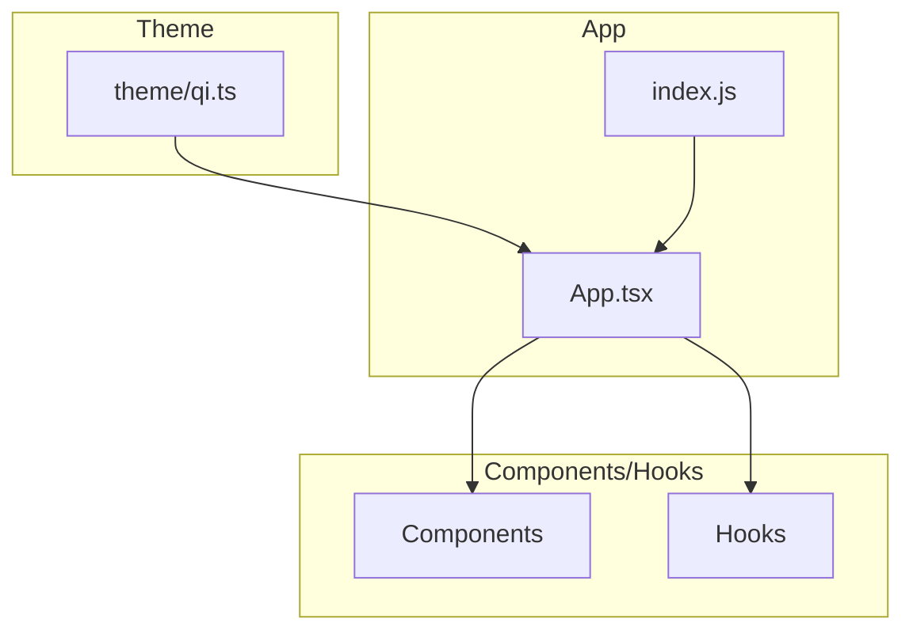
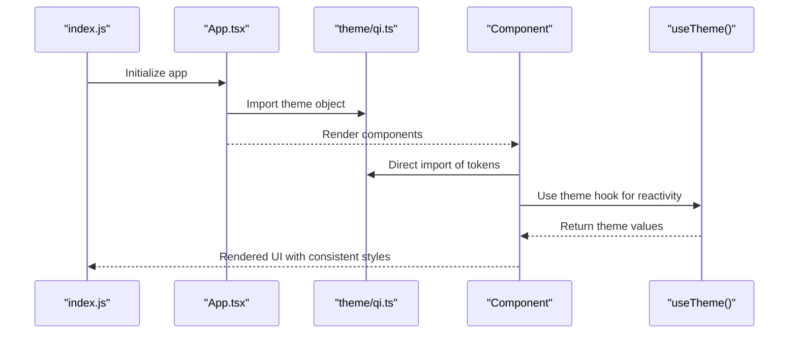
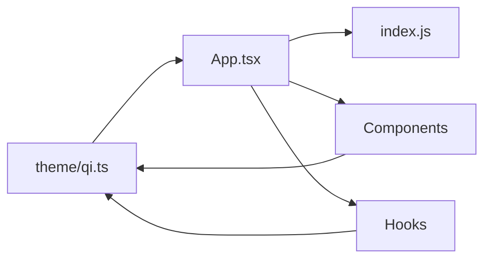

# Theme System

<cite>
**Referenced Files in This Document**
- [qi.ts](file://theme/qi.ts)
- [App.tsx](file://App.tsx)
- [index.js](file://index.js)
- [package.json](file://package.json)
</cite>

## Table of Contents
1. [Introduction](#introduction)
2. [Project Structure](#project-structure)
3. [Core Components](#core-components)
4. [Architecture Overview](#architecture-overview)
5. [Detailed Component Analysis](#detailed-component-analysis)
6. [Dependency Analysis](#dependency-analysis)
7. [Performance Considerations](#performance-considerations)
8. [Troubleshooting Guide](#troubleshooting-guide)
9. [Conclusion](#conclusion)
10. [Appendices](#appendices)

## Introduction
This document explains the theme system architecture in the video-rn application, focusing on how styling definitions, design tokens, and visual consistency are centralized and consumed across components. The primary source of truth for theming is located in the theme directory, with a single file that defines colors, typography, spacing, and component-specific styles. These tokens are then consumed by React Native components and hooks to ensure consistent visuals and behavior throughout the app.

The goal is to provide:
- A clear understanding of where and how themes are defined
- How components consume them via hooks or direct imports
- Best practices for customization and maintenance
- Guidance for responsive design and accessibility within React Native

## Project Structure
The theme system is organized around a dedicated theme directory containing the central theme definition file. Application entry points import and configure the theme at startup, while components and hooks consume it through either direct imports or custom hooks.

**Diagram sources**
- [qi.ts](file://theme/qi.ts)
- [App.tsx](file://App.tsx)
- [index.js](file://index.js)

**Section sources**
- [qi.ts](file://theme/qi.ts)
- [App.tsx](file://App.tsx)
- [index.js](file://index.js)

## Core Components
At the heart of the theme system is a single file that centralizes all design tokens and style primitives. It typically includes:
- Colors: semantic color tokens (e.g., backgrounds, text, borders, states)
- Typography: font families, sizes, weights, line heights
- Spacing: consistent spacing scale for margins, paddings, gaps
- Component-specific styles: reusable style objects for common UI elements

These tokens are exported as a structured object so they can be imported directly or wrapped in a hook for reactive consumption.

Key responsibilities:
- Provide a single source of truth for visual design
- Enforce consistency across screens and components
- Enable easy customization and future scaling

**Section sources**
- [qi.ts](file://theme/qi.ts)

## Architecture Overview
The theme system follows a simple, scalable pattern:
- Centralized theme definition in one file
- App initialization imports and configures the theme
- Components and hooks consume the theme via imports or hooks
- Optional providers or context can be used to switch themes dynamically

**Diagram sources**
- [index.js](file://index.js)
- [App.tsx](file://App.tsx)
- [qi.ts](file://theme/qi.ts)

## Detailed Component Analysis

### Theme Definition File (theme/qi.ts)
This file is the core of the theme system. It should define:
- Color palette with semantic naming
- Typography scale and font configuration
- Spacing scale for layout consistency
- Component-level style presets (buttons, cards, inputs, etc.)

Best practices:
- Use semantic names (e.g., primaryText, surfaceBackground) instead of literal colors
- Group related tokens logically
- Keep component styles minimal and composable
- Avoid hardcoding values; derive from base tokens when possible

Consumption patterns:
- Direct import for static usage
- Hook-based access for dynamic updates or memoization

**Section sources**
- [qi.ts](file://theme/qi.ts)

### App Integration (App.tsx)
The application root imports the theme and may:
- Configure global styles
- Wrap the app with a theme provider if needed
- Expose theme values to child components

Considerations:
- Ensure theme is available before rendering
- Avoid unnecessary re-renders by memoizing theme-derived values
- Separate theme setup from business logic

**Section sources**
- [App.tsx](file://App.tsx)

### Entry Point (index.js)
The entry point initializes the app and ensures the theme is ready. It may:
- Register fonts or platform-specific configurations
- Set up any necessary polyfills or environment variables
- Bootstrap the theme provider if used

**Section sources**
- [index.js](file://index.js)

## Dependency Analysis
The theme system has minimal external dependencies but relies on React Native’s styling system. Components depend on the theme file for consistent styling, while the app bootstrap depends on proper theme initialization.

**Diagram sources**
- [qi.ts](file://theme/qi.ts)
- [App.tsx](file://App.tsx)
- [index.js](file://index.js)

**Section sources**
- [qi.ts](file://theme/qi.ts)
- [App.tsx](file://App.tsx)
- [index.js](file://index.js)

## Performance Considerations
- Memoize theme values when passed to multiple components
- Avoid importing large theme objects in frequently re-rendered components
- Use hooks to subscribe only to relevant parts of the theme
- Precompute derived styles where possible

[No sources needed since this section provides general guidance]

## Troubleshooting Guide
Common issues and solutions:
- Theme not found: Ensure the theme file path is correct and exported properly
- Inconsistent styles: Verify all components use the same theme tokens
- Performance issues: Check for unnecessary theme re-renders
- Accessibility problems: Ensure sufficient color contrast and readable typography

Debugging tips:
- Log theme values during development
- Use React DevTools to inspect component props
- Test with different screen sizes and orientations

[No sources needed since this section provides general guidance]

## Conclusion
The theme system in video-rn provides a centralized approach to managing design tokens and visual consistency. By keeping all styling definitions in a single file and consuming them through imports or hooks, the application maintains clean separation of concerns and enables easy customization. Following the best practices outlined here will help maintain a scalable and accessible theming system.

[No sources needed since this section summarizes without analyzing specific files]

## Appendices

### Customizing Themes
To customize the theme:
1. Modify the theme file to add new tokens or adjust existing ones
2. Use semantic naming for better maintainability
3. Test changes across different components and screen sizes

### Adding New Design Tokens
When adding new tokens:
1. Define them in the appropriate category (colors, typography, spacing)
2. Export them from the theme file
3. Update components to use the new tokens
4. Document the token’s purpose and usage

### Responsive Design Patterns
For responsive design:
- Use relative units and flexible layouts
- Implement breakpoints based on screen dimensions
- Test on various device sizes and orientations
- Consider using React Native’s Dimensions API

### Accessibility Requirements
Ensure accessibility by:
- Maintaining sufficient color contrast ratios
- Providing meaningful labels and descriptions
- Supporting dynamic type and font scaling
- Testing with screen readers and assistive technologies

[No sources needed since this section provides general guidance]