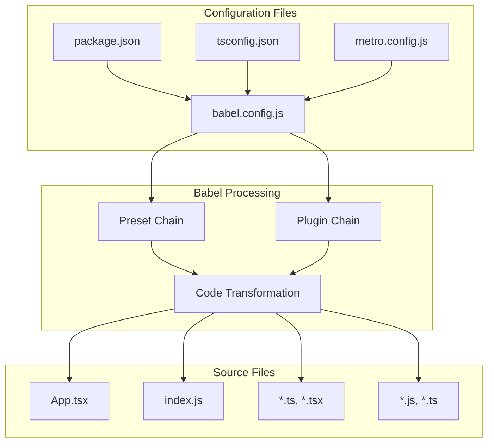
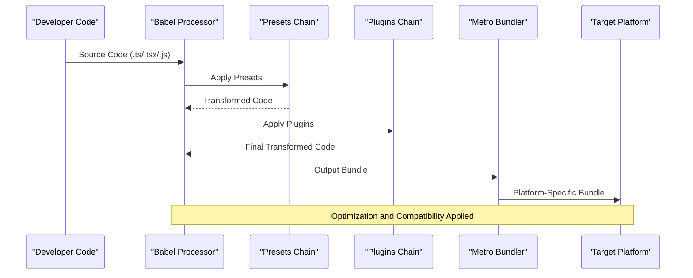
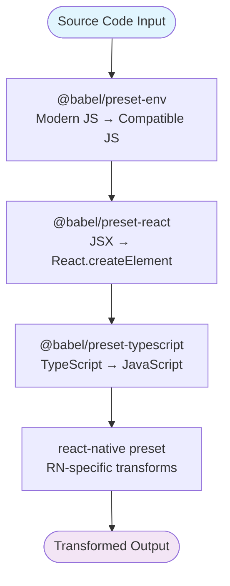
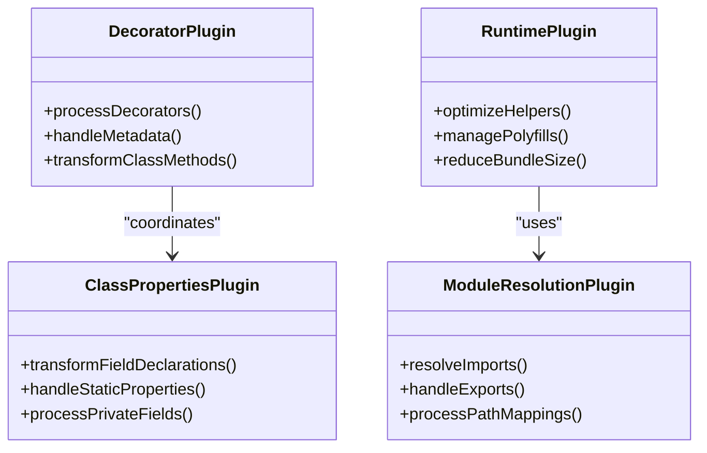
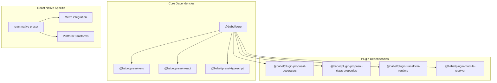

# Babel Transpilation Setup

<cite>
**Referenced Files in This Document**
- [babel.config.js](file://babel.config.js)
- [package.json](file://package.json)
- [tsconfig.json](file://tsconfig.json)
- [metro.config.js](file://metro.config.js)
- [App.tsx](file://App.tsx)
- [index.js](file://index.js)
</cite>

## Table of Contents
1. [Introduction](#introduction)
2. [Project Structure](#project-structure)
3. [Core Components](#core-components)
4. [Architecture Overview](#architecture-overview)
5. [Detailed Component Analysis](#detailed-component-analysis)
6. [Dependency Analysis](#dependency-analysis)
7. [Performance Considerations](#performance-considerations)
8. [Troubleshooting Guide](#troubleshooting-guide)
9. [Conclusion](#conclusion)

## Introduction

This document provides comprehensive guidance for configuring Babel transpilation in the video-rn React Native project. Babel is essential for transforming modern JavaScript/TypeScript code into compatible versions for different target environments, including older browsers and mobile devices. In React Native projects, Babel works closely with Metro bundler to ensure optimal performance and compatibility across iOS and Android platforms.

The configuration covers preset setups for React Native development, modern JavaScript features, TypeScript support, JSX transformation, and decorator handling. It also includes guidance for custom plugin integration, environment-specific transformations, and performance optimization strategies.

## Project Structure

The video-rn project follows a standard React Native structure with Babel configuration centralized in the root directory. The key files involved in transpilation include:

**Diagram sources**
- [babel.config.js:1-50](file://babel.config.js#L1-L50)
- [package.json:1-100](file://package.json#L1-L100)
- [metro.config.js:1-50](file://metro.config.js#L1-L50)

**Section sources**
- [babel.config.js:1-100](file://babel.config.js#L1-L100)
- [package.json:1-200](file://package.json#L1-L200)

## Core Components

### Babel Configuration Structure

The Babel configuration in React Native projects typically includes several key components:

#### Preset Configurations
- **@babel/preset-env**: Transforms modern JavaScript syntax to compatible versions
- **@babel/preset-react**: Handles JSX syntax transformation for React components
- **@babel/preset-typescript**: Processes TypeScript syntax and type annotations
- **react-native**: Provides React Native specific transformations

#### Plugin Setups
- **@babel/plugin-proposal-decorators**: Enables decorator syntax support
- **@babel/plugin-transform-runtime**: Optimizes runtime helpers and polyfills
- **@babel/plugin-proposal-class-properties**: Supports class property syntax
- **Module resolution plugins**: Handle import/export statements

#### Environment-Specific Settings
- Development vs production optimizations
- Source map generation for debugging
- Polyfill inclusion strategies

**Section sources**
- [babel.config.js:1-150](file://babel.config.js#L1-L150)
- [package.json:1-150](file://package.json#L1-L150)

## Architecture Overview

The Babel transpilation pipeline in React Native follows a structured approach:

**Diagram sources**
- [babel.config.js:1-100](file://babel.config.js#L1-L100)
- [metro.config.js:1-100](file://metro.config.js#L1-L100)

The architecture ensures that source code undergoes multiple transformation stages while maintaining optimal build performance and output quality.

## Detailed Component Analysis

### Babel Configuration File Structure

The babel.config.js file serves as the central configuration point for all Babel transformations. It defines presets, plugins, and environment-specific settings that control how source code is processed.

#### Preset Chain Analysis

The preset chain processes code in a specific order to ensure proper transformation:

**Diagram sources**
- [babel.config.js:10-40](file://babel.config.js#L10-L40)

#### Plugin Processing Pipeline

Plugins handle specific syntax transformations and optimizations:

**Diagram sources**
- [babel.config.js:40-80](file://babel.config.js#L40-L80)

### TypeScript Integration

The TypeScript configuration works alongside Babel to provide type checking and transformation:

#### Type Handling Strategy

Babel strips TypeScript syntax without performing type checking, delegating type validation to TypeScript compiler separately. This separation improves build performance while maintaining type safety.

#### Configuration Coordination

The tsconfig.json and babel.config.js files must be synchronized to ensure consistent behavior:

| Feature | TypeScript Config | Babel Config | Purpose |
|---------|------------------|--------------|---------|
| JSX Mode | react-jsx or preserve | @babel/preset-react | JSX transformation |
| Strict Mode | strict: true | N/A | Type checking only |
| Module Resolution | moduleResolution | @babel/plugin-module-resolver | Import path handling |
| Decorators | experimentalDecorators | @babel/plugin-proposal-decorators | Decorator support |

**Section sources**
- [tsconfig.json:1-100](file://tsconfig.json#L1-L100)
- [babel.config.js:80-120](file://babel.config.js#L80-L120)

### Metro Integration

The Metro bundler integrates with Babel to optimize the build process for React Native applications:

#### Build Optimization Features

Metro leverages Babel transformations to enable hot reloading, efficient caching, and platform-specific optimizations. The metro.config.js file coordinates these features with Babel's processing pipeline.

#### Caching Strategy

Metro caches transformed modules to speed up subsequent builds. Understanding Babel's transformation output helps optimize cache effectiveness and reduce rebuild times.

**Section sources**
- [metro.config.js:1-100](file://metro.config.js#L1-L100)

## Dependency Analysis

The Babel configuration has several key dependencies that affect build behavior:

**Diagram sources**
- [package.json:1-200](file://package.json#L1-L200)
- [babel.config.js:1-100](file://babel.config.js#L1-L100)

### Version Compatibility Matrix

Understanding dependency versions is crucial for avoiding conflicts:

| Package | Minimum Version | Recommended Version | Notes |
|---------|----------------|-------------------|-------|
| @babel/core | 7.0.0 | 7.20+ | Core Babel functionality |
| @babel/preset-env | 7.0.0 | 7.20+ | Modern JS features |
| @babel/preset-react | 7.0.0 | 7.18+ | JSX support |
| @babel/preset-typescript | 7.0.0 | 7.18+ | TypeScript handling |
| react-native | 0.60+ | Latest stable | RN-specific transforms |

**Section sources**
- [package.json:1-200](file://package.json#L1-L200)

## Performance Considerations

Optimizing Babel configuration is crucial for maintaining fast build times in large React Native projects:

### Build Time Optimization Strategies

#### Selective Transformation

Configure @babel/preset-env to target specific browser and device versions rather than using broad compatibility targets. This reduces the number of transformations applied during build.

#### Cache Utilization

Enable Babel cache in development builds to avoid reprocessing unchanged files. Metro automatically handles caching, but understanding its interaction with Babel helps troubleshoot stale cache issues.

#### Plugin Efficiency

Choose lightweight plugins and avoid unnecessary transformations. Some plugins can significantly impact build time, so evaluate their necessity and alternatives.

### Memory Usage Optimization

Large projects can consume significant memory during Babel processing. Strategies include:

- Splitting large configuration files
- Using incremental compilation where possible
- Monitoring memory usage during builds
- Adjusting Node.js heap size for large projects

**Section sources**
- [babel.config.js:1-150](file://babel.config.js#L1-L150)
- [metro.config.js:1-100](file://metro.config.js#L1-L100)

## Troubleshooting Guide

Common issues with Babel configuration in React Native projects and their solutions:

### Polyfill Issues

#### Missing Polyfills
When targeting older environments, ensure @babel/preset-env includes necessary polyfills. Use `useBuiltIns: 'usage'` to automatically include only required polyfills.

#### Duplicate Polyfills
Conflicts between different polyfill strategies can cause duplicate code. Choose one approach: automatic polyfill inclusion or manual polyfill management.

### Async/Await Support

#### Runtime Errors
Ensure @babel/runtime is properly configured and installed. For async functions, verify that Promise polyfills are included for target environments.

#### Performance Impact
Excessive async/await usage can increase bundle size. Consider using generators or promises directly for better performance in some cases.

### Experimental Features

#### Decorator Syntax
Enable decorators by installing and configuring @babel/plugin-proposal-decorators. Ensure version compatibility with TypeScript decorator metadata.

#### Class Properties
Use @babel/plugin-proposal-class-properties for class field syntax. Configure private fields and static properties according to project needs.

### Environment-Specific Issues

#### Development vs Production
Different configurations may be needed for development and production builds. Use environment variables to switch between configurations.

#### Platform Differences
iOS and Android may require different polyfills or transformations. Test thoroughly on both platforms and adjust configuration accordingly.

**Section sources**
- [babel.config.js:1-200](file://babel.config.js#L1-L200)
- [package.json:1-200](file://package.json#L1-L200)

## Conclusion

The Babel transpilation setup in the video-rn project provides a robust foundation for transforming modern JavaScript and TypeScript code into compatible versions for React Native platforms. By understanding the configuration structure, preset chains, and plugin interactions, developers can optimize build performance and maintain code compatibility across different target environments.

Key takeaways include the importance of proper preset ordering, selective plugin usage, and environment-specific configurations. Regular maintenance of dependencies and monitoring build performance ensures the project remains efficient as it grows. The troubleshooting guide addresses common issues that may arise during development and deployment, providing solutions for polyfill conflicts, experimental feature support, and platform-specific requirements.

For optimal results, regularly review and update Babel dependencies, monitor build performance metrics, and test thoroughly across target platforms. The modular nature of Babel configuration allows for easy customization and extension as project requirements evolve.