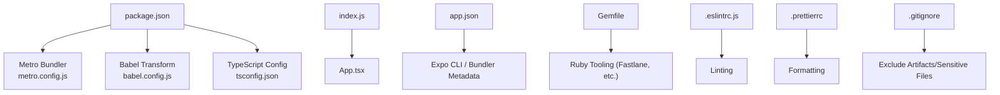
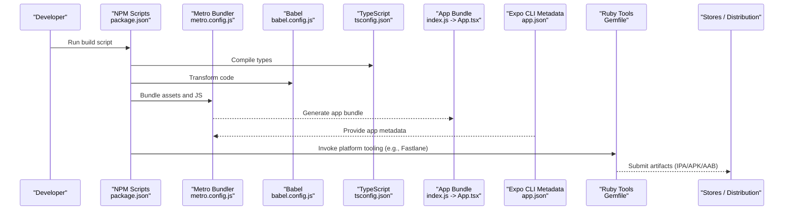
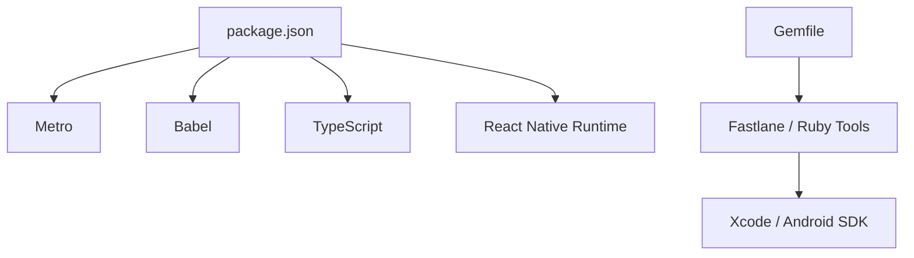

# Build Environments and Deployment

<cite>
**Referenced Files in This Document**
- [package.json](file://package.json)
- [app.json](file://app.json)
- [index.js](file://index.js)
- [App.tsx](file://App.tsx)
- [metro.config.js](file://metro.config.js)
- [babel.config.js](file://babel.config.js)
- [tsconfig.json](file://tsconfig.json)
- [Gemfile](file://Gemfile)
- [Gemfile.lock](file://Gemfile.lock)
- [.eslintrc.js](file://.eslintrc.js)
- [.prettierrc](file://.prettierrc)
- [.gitignore](file://.gitignore)
- [README.md](file://README.md)
</cite>

## Table of Contents
1. [Introduction](#introduction)
2. [Project Structure](#project-structure)
3. [Core Components](#core-components)
4. [Architecture Overview](#architecture-overview)
5. [Detailed Component Analysis](#detailed-component-analysis)
6. [Dependency Analysis](#dependency-analysis)
7. [Performance Considerations](#performance-considerations)
8. [Troubleshooting Guide](#troubleshooting-guide)
9. [Conclusion](#conclusion)
10. [Appendices](#appendices)

## Introduction
This document explains how build environments and deployment are configured in the video-rn application. It focuses on environment-specific configuration, build scripts, app metadata, CI/CD setup, environment variables, and platform-specific builds for iOS and Android. It also covers signing certificates, provisioning profiles, and deployment strategies for app stores and internal distribution channels.

## Project Structure
The project is a React Native application with standard tooling and configuration files that influence builds and deployments:
- package.json defines scripts and dependencies used by Metro, Babel, TypeScript, and testing tools.
- app.json contains app metadata consumed by Expo CLI and bundlers.
- metro.config.js configures the Metro bundler for JS assets.
- babel.config.js configures Babel transformations.
- tsconfig.json configures TypeScript compilation behavior.
- index.js is the entry point for the app bundle.
- App.tsx is the root component loaded by the entry point.
- Gemfile and Gemfile.lock manage Ruby-based tooling (e.g., Fastlane).
- .eslintrc.js and .prettierrc enforce code quality and formatting.
- .gitignore excludes generated or sensitive files from version control.
- README.md provides general project context.

**Diagram sources**
- [package.json](file://package.json)
- [metro.config.js](file://metro.config.js)
- [babel.config.js](file://babel.config.js)
- [tsconfig.json](file://tsconfig.json)
- [index.js](file://index.js)
- [App.tsx](file://App.tsx)
- [app.json](file://app.json)
- [Gemfile](file://Gemfile)
- [.eslintrc.js](file://.eslintrc.js)
- [.prettierrc](file://.prettierrc)
- [.gitignore](file://.gitignore)

**Section sources**
- [package.json](file://package.json)
- [app.json](file://app.json)
- [index.js](file://index.js)
- [App.tsx](file://App.tsx)
- [metro.config.js](file://metro.config.js)
- [babel.config.js](file://babel.config.js)
- [tsconfig.json](file://tsconfig.json)
- [Gemfile](file://Gemfile)
- [.eslintrc.js](file://.eslintrc.js)
- [.prettierrc](file://.prettierrc)
- [.gitignore](file://.gitignore)
- [README.md](file://README.md)

## Core Components
- Build Scripts: Defined in package.json to run development server, production builds, linting, formatting, and tests. These scripts drive Metro, Babel, and TypeScript during different phases.
- App Metadata: Defined in app.json for Expo CLI and bundlers to generate correct app identifiers, names, and icons.
- Entry Point and Root Component: index.js bootstraps the app; App.tsx renders the root UI.
- Bundler and Transpiler: metro.config.js and babel.config.js configure asset handling and code transformation.
- Type Checking: tsconfig.json controls TypeScript behavior for builds.
- Ruby Tooling: Gemfile manages Ruby gems commonly used for automation (e.g., Fastlane).

**Section sources**
- [package.json](file://package.json)
- [app.json](file://app.json)
- [index.js](file://index.js)
- [App.tsx](file://App.tsx)
- [metro.config.js](file://metro.config.js)
- [babel.config.js](file://babel.config.js)
- [tsconfig.json](file://tsconfig.json)
- [Gemfile](file://Gemfile)

## Architecture Overview
The build and deployment pipeline integrates JavaScript tooling with platform-specific steps:

**Diagram sources**
- [package.json](file://package.json)
- [metro.config.js](file://metro.config.js)
- [babel.config.js](file://babel.config.js)
- [tsconfig.json](file://tsconfig.json)
- [index.js](file://index.js)
- [App.tsx](file://App.tsx)
- [app.json](file://app.json)
- [Gemfile](file://Gemfile)

## Detailed Component Analysis

### Build Scripts and Profiles
- Development profile: Typically runs a dev server with hot reloading and minimal optimizations.
- Staging profile: Builds with staging-specific flags and environment variables for QA testing.
- Production profile: Enables optimizations, minification, and generates release artifacts.

Use environment variables to switch endpoints, feature flags, and logging levels across profiles. Keep secrets out of source control and inject them at build time via CI/CD or local secret managers.

**Section sources**
- [package.json](file://package.json)

### App Metadata Configuration
- app.json defines app name, slug, version, icon, and other Expo-related settings.
- Ensure identifiers match your store listings and provisioning configurations.
- Update metadata per environment if needed (e.g., staging vs production display names).

**Section sources**
- [app.json](file://app.json)

### Entry Point and Root Component
- index.js initializes the React Native runtime and loads App.tsx.
- App.tsx is the root component where environment-dependent logic can be gated using environment variables.

**Section sources**
- [index.js](file://index.js)
- [App.tsx](file://App.tsx)

### Metro and Babel Configuration
- metro.config.js controls asset resolution, transformers, and bundling behavior.
- babel.config.js sets up transforms required by React Native and TypeScript.

Optimize these configs for faster builds in CI and ensure consistent behavior across environments.

**Section sources**
- [metro.config.js](file://metro.config.js)
- [babel.config.js](file://babel.config.js)

### TypeScript Configuration
- tsconfig.json affects type checking and output behavior.
- Align compiler options with your build targets and libraries.

**Section sources**
- [tsconfig.json](file://tsconfig.json)

### Ruby Tooling and Automation
- Gemfile manages Ruby gems used for automation such as Fastlane, certificate management, and store uploads.
- Use it to streamline signing, provisioning, and distribution workflows.

**Section sources**
- [Gemfile](file://Gemfile)
- [Gemfile.lock](file://Gemfile.lock)

### Code Quality and Formatting
- .eslintrc.js enforces linting rules to catch issues early.
- .prettierrc ensures consistent formatting across the codebase.

**Section sources**
- [.eslintrc.js](file://.eslintrc.js)
- [.prettierrc](file://.prettierrc)

### Version Control and Secrets
- .gitignore excludes generated artifacts and sensitive files from version control.
- Never commit secrets; use environment variables and secure storage.

**Section sources**
- [.gitignore](file://.gitignore)

## Dependency Analysis
Build-time dependencies include Node.js packages defined in package.json, Metro, Babel, TypeScript, and optional Ruby gems. Platform tooling (Xcode, Android SDK) is required for native builds.

**Diagram sources**
- [package.json](file://package.json)
- [Gemfile](file://Gemfile)

**Section sources**
- [package.json](file://package.json)
- [Gemfile](file://Gemfile)

## Performance Considerations
- Enable incremental builds and caching in CI to speed up repeated runs.
- Configure Metro and Babel for production optimizations only in release builds.
- Minimize heavy assets and avoid unnecessary polyfills.
- Use environment variables to disable verbose logging in production.

[No sources needed since this section provides general guidance]

## Troubleshooting Guide
Common issues and resolutions:
- Missing environment variables: Ensure all required variables are set locally and in CI. Validate their presence before running builds.
- Signing failures: Verify certificates, provisioning profiles, and keychain access. Use automated tooling to refresh credentials.
- Metro/Babel errors: Clear caches and reinstall dependencies. Check transformer and plugin versions.
- TypeScript errors: Fix type mismatches and ensure tsconfig aligns with library versions.
- Platform build failures: Confirm Xcode and Android SDK installations, paths, and permissions.

**Section sources**
- [.gitignore](file://.gitignore)
- [package.json](file://package.json)
- [metro.config.js](file://metro.config.js)
- [babel.config.js](file://babel.config.js)
- [tsconfig.json](file://tsconfig.json)

## Conclusion
By organizing build scripts, app metadata, and platform tooling consistently, you can maintain reliable development, staging, and production pipelines. Use environment variables for configuration, automate signing and distribution with Ruby tooling, and optimize bundler settings for performance. This approach supports both app store releases and internal distribution channels while keeping secrets secure and builds reproducible.

[No sources needed since this section summarizes without analyzing specific files]

## Appendices

### Environment Variables Strategy
- Define variables for each environment (development, staging, production).
- Inject variables at build time via CI/CD or local secret managers.
- Avoid committing .env files; add them to .gitignore.

**Section sources**
- [.gitignore](file://.gitignore)
- [package.json](file://package.json)

### CI/CD Pipeline Outline
- Install dependencies and cache node_modules.
- Run linting and tests.
- Build with environment-specific flags.
- Sign and package for iOS and Android.
- Upload artifacts to stores or internal distribution.

[No sources needed since this section provides general guidance]

### Platform-Specific Builds
- iOS: Requires Xcode, certificates, and provisioning profiles. Use Fastlane for automation.
- Android: Requires Android SDK and signing keys. Use Fastlane or Gradle tasks.

**Section sources**
- [Gemfile](file://Gemfile)
- [package.json](file://package.json)

### Signing Certificates and Provisioning Profiles
- Generate and install certificates for development and distribution.
- Create provisioning profiles matching app identifiers.
- Store securely and reference in CI/CD securely.

[No sources needed since this section provides general guidance]

### Deployment Strategies
- App Stores: Submit signed binaries via Fastlane or store consoles.
- Internal Distribution: Use TestFlight, Google Play Internal Testing, or enterprise distribution channels.

[No sources needed since this section provides general guidance]