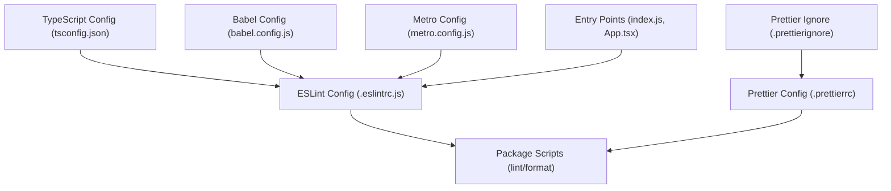
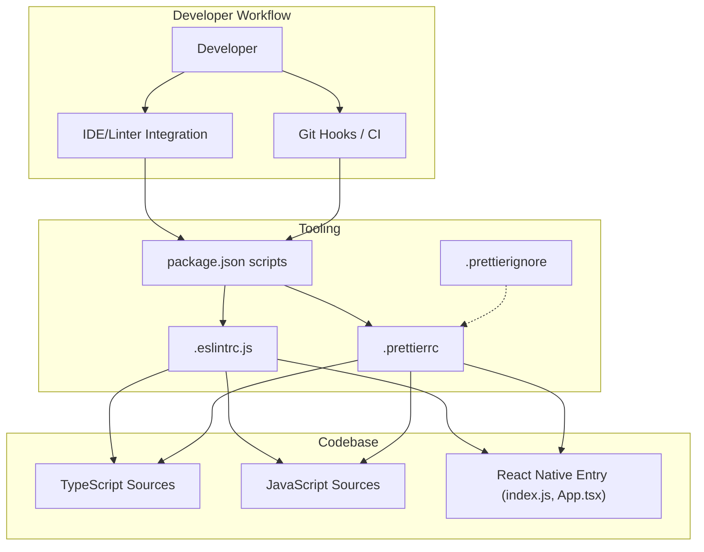
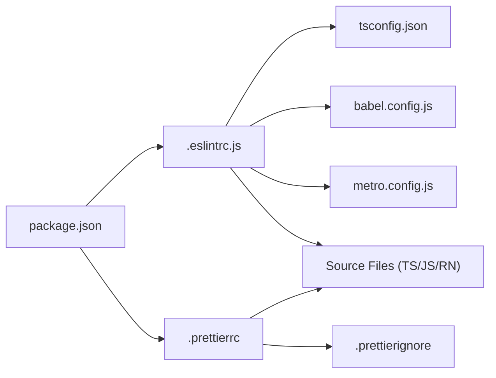

# Code Quality and Formatting

<cite>
**Referenced Files in This Document**
- [.eslintrc.js](file://.eslintrc.js)
- [.prettierrc](file://.prettierrc)
- [.prettierignore](file://.prettierignore)
- [package.json](file://package.json)
- [App.tsx](file://App.tsx)
- [index.js](file://index.js)
- [babel.config.js](file://babel.config.js)
- [metro.config.js](file://metro.config.js)
- [tsconfig.json](file://tsconfig.json)
</cite>

## Table of Contents
1. [Introduction](#introduction)
2. [Project Structure](#project-structure)
3. [Core Components](#core-components)
4. [Architecture Overview](#architecture-overview)
5. [Detailed Component Analysis](#detailed-component-analysis)
6. [Dependency Analysis](#dependency-analysis)
7. [Performance Considerations](#performance-considerations)
8. [Troubleshooting Guide](#troubleshooting-guide)
9. [Conclusion](#conclusion)
10. [Appendices](#appendices)

## Introduction
This document explains how code quality and formatting are configured and used in the video-rn project. It focuses on ESLint for static analysis and rule enforcement, and Prettier for consistent code formatting. It also provides guidance for integrating these tools into development workflows, including pre-commit hooks and IDE setup, as well as strategies for custom rules, sharing configurations across projects, and troubleshooting common issues.

## Project Structure
The code quality and formatting configuration is centralized in a small set of files at the repository root:
- ESLint configuration file
- Prettier configuration file and ignore list
- Package scripts that run linting and formatting
- TypeScript and React Native tooling configs that influence behavior (e.g., parser options, module resolution)

**Diagram sources**
- [.eslintrc.js](file://.eslintrc.js)
- [.prettierrc](file://.prettierrc)
- [.prettierignore](file://.prettierignore)
- [package.json](file://package.json)
- [tsconfig.json](file://tsconfig.json)
- [babel.config.js](file://babel.config.js)
- [metro.config.js](file://metro.config.js)
- [index.js](file://index.js)
- [App.tsx](file://App.tsx)

**Section sources**
- [.eslintrc.js](file://.eslintrc.js)
- [.prettierrc](file://.prettierrc)
- [.prettierignore](file://.prettierignore)
- [package.json](file://package.json)
- [tsconfig.json](file://tsconfig.json)
- [babel.config.js](file://babel.config.js)
- [metro.config.js](file://metro.config.js)
- [index.js](file://index.js)
- [App.tsx](file://App.tsx)

## Core Components
- ESLint: Enforces coding standards, detects potential errors, and ensures consistency across JavaScript/TypeScript files.
- Prettier: Automatically formats code to a consistent style without requiring manual intervention.
- Package scripts: Provide convenient commands to run ESLint and Prettier from the terminal or CI.
- Tooling integration: TypeScript, Babel, and Metro settings influence parsing and resolution for both ESLint and Prettier.

Key responsibilities:
- ESLint rules define what is allowed and what should be flagged.
- Prettier settings define how code should look when formatted.
- Ignore files exclude generated or third-party code from processing.
- Scripts orchestrate execution and reporting.

**Section sources**
- [.eslintrc.js](file://.eslintrc.js)
- [.prettierrc](file://.prettierrc)
- [.prettierignore](file://.prettierignore)
- [package.json](file://package.json)

## Architecture Overview
The following diagram shows how ESLint and Prettier integrate with the project’s build and development toolchain.

**Diagram sources**
- [.eslintrc.js](file://.eslintrc.js)
- [.prettierrc](file://.prettierrc)
- [.prettierignore](file://.prettierignore)
- [package.json](file://package.json)
- [index.js](file://index.js)
- [App.tsx](file://App.tsx)

## Detailed Component Analysis

### ESLint Configuration
ESLint is configured via a dedicated configuration file. The configuration typically includes:
- Parser selection for TypeScript and JSX support
- Environment definitions for React Native and Node
- Extends for shared rule sets (e.g., recommended rulesets)
- Custom rules tailored to the project’s conventions
- Plugin usage for additional capabilities (e.g., React, import ordering)
- Overrides for specific directories or file patterns

How it integrates with the project:
- TypeScript parsing aligns with tsconfig settings
- Babel/Metro environments ensure compatibility with React Native syntax
- Scripts invoke ESLint against source files and report violations

Best practices:
- Keep environment and parser settings aligned with tsconfig and metro config
- Use extends for baseline rules and add project-specific overrides
- Prefer human-readable error messages and actionable suggestions

**Section sources**
- [.eslintrc.js](file://.eslintrc.js)
- [tsconfig.json](file://tsconfig.json)
- [babel.config.js](file://babel.config.js)
- [metro.config.js](file://metro.config.js)
- [package.json](file://package.json)

### Prettier Configuration
Prettier enforces consistent formatting through a configuration file and an ignore list:
- Style rules such as indentation, quotes, semicolons, and trailing commas
- Line length limits for readability
- Language-specific options for TypeScript, JavaScript, and JSON
- Ignore patterns to skip generated or vendored files

Integration points:
- Run via package scripts for formatting entire codebases
- Configure IDE integrations to format on save
- Optionally integrate with pre-commit hooks to enforce formatting before commits

Guidelines:
- Align line length with team preferences and editor width
- Avoid conflicting rules between ESLint and Prettier by disabling formatter-related ESLint rules where appropriate
- Use .prettierignore to exclude build outputs and third-party code

**Section sources**
- [.prettierrc](file://.prettierrc)
- [.prettierignore](file://.prettierignore)
- [package.json](file://package.json)

### Package Scripts and Workflows
Scripts in package.json provide standardized commands for linting and formatting:
- Linting command runs ESLint with chosen flags and reports results
- Formatting command runs Prettier with configuration and optionally writes changes
- Optional scripts for checking vs fixing, or running both in sequence

Recommended workflow:
- Pre-commit hook runs both lint and format checks to prevent bad code from entering the branch
- CI pipeline runs the same checks to maintain consistency across environments
- IDE integration formats on save and highlights ESLint issues inline

**Section sources**
- [package.json](file://package.json)

### TypeScript and Build Tooling Influence
- tsconfig.json defines target, module, and JSX settings that affect parsing and type-aware linting
- babel.config.js enables transformation of modern syntax, ensuring ESLint can parse correctly
- metro.config.js influences module resolution and bundling behavior relevant to React Native apps

Alignment tips:
- Ensure ESLint parser options match tsconfig and babel transformations
- Avoid duplicate configuration between ESLint and Prettier; let Prettier handle formatting and ESLint handle logic/style rules

**Section sources**
- [tsconfig.json](file://tsconfig.json)
- [babel.config.js](file://babel.config.js)
- [metro.config.js](file://metro.config.js)

### Entry Points and Source Coverage
- index.js serves as the app entry point for React Native
- App.tsx contains application-level components and logic
- ESLint and Prettier should cover these files according to their configured patterns

Coverage considerations:
- Ensure glob patterns include all relevant directories (e.g., src, hooks, utils)
- Exclude node_modules and generated folders via ignore files

**Section sources**
- [index.js](file://index.js)
- [App.tsx](file://App.tsx)
- [.prettierignore](file://.prettierignore)

## Dependency Analysis
The following diagram illustrates dependencies among configuration files and scripts.

**Diagram sources**
- [package.json](file://package.json)
- [.eslintrc.js](file://.eslintrc.js)
- [.prettierrc](file://.prettierrc)
- [.prettierignore](file://.prettierignore)
- [tsconfig.json](file://tsconfig.json)
- [babel.config.js](file://babel.config.js)
- [metro.config.js](file://metro.config.js)

**Section sources**
- [package.json](file://package.json)
- [.eslintrc.js](file://.eslintrc.js)
- [.prettierrc](file://.prettierrc)
- [.prettierignore](file://.prettierignore)
- [tsconfig.json](file://tsconfig.json)
- [babel.config.js](file://babel.config.js)
- [metro.config.js](file://metro.config.js)

## Performance Considerations
- Use selective file globs to avoid scanning unnecessary directories
- Enable parallel execution where supported by ESLint and Prettier
- Cache results in CI to speed up repeated runs
- Keep rule sets minimal and focused to reduce overhead
- Avoid heavy plugins unless necessary; prefer built-in rules

[No sources needed since this section provides general guidance]

## Troubleshooting Guide
Common issues and resolutions:
- Parsing errors:
  - Ensure ESLint parser matches TypeScript and JSX settings in tsconfig and babel config
  - Verify babel plugin chain supports current syntax
- Conflicts between ESLint and Prettier:
  - Disable formatter-related ESLint rules and rely on Prettier for formatting
  - Use eslint-config-prettier if applicable
- Ignored files not being processed:
  - Check .prettierignore and ESLint ignore patterns
  - Confirm file paths match configured globs
- Inconsistent formatting across editors:
  - Install Prettier extensions and configure format-on-save
  - Ensure shared configuration is installed and referenced consistently
- Slow linting:
  - Narrow file patterns and disable unused rules
  - Leverage caching and incremental checks

**Section sources**
- [.eslintrc.js](file://.eslintrc.js)
- [.prettierrc](file://.prettierrc)
- [.prettierignore](file://.prettierignore)
- [tsconfig.json](file://tsconfig.json)
- [babel.config.js](file://babel.config.js)

## Conclusion
By centralizing ESLint and Prettier configurations and integrating them into development workflows, the video-rn project maintains consistent code quality and formatting. Aligning parser and environment settings with TypeScript, Babel, and Metro ensures reliable analysis. Adopting pre-commit hooks and IDE integrations further reduces friction and prevents regressions. For long-term success, keep rule sets focused, share configurations across projects, and regularly review and update settings to match evolving standards.

[No sources needed since this section summarizes without analyzing specific files]

## Appendices

### Integrating with Development Workflows
- Pre-commit hooks:
  - Run ESLint and Prettier checks before allowing commits
  - Fail the commit if violations are found, prompting local fixes
- CI pipelines:
  - Execute lint and format checks on pull requests
  - Block merges when quality gates fail

### IDE Integrations
- VS Code:
  - Install Prettier extension and enable format-on-save
  - Install ESLint extension and configure it to use project settings
- Other editors:
  - Configure language servers and formatters to respect project configs
  - Ensure consistent settings across team members’ environments

### Custom Rule Creation and Sharing
- Custom ESLint rules:
  - Create reusable rules for project-specific patterns
  - Publish or bundle them for reuse across repositories
- Shared configurations:
  - Maintain a shared npm package with ESLint and Prettier presets
  - Reference the shared package in each project’s configuration

### Common Pitfalls
- Overly strict rules causing noise:
  - Tune rules to balance safety and developer experience
- Misaligned parsers:
  - Keep ESLint, TypeScript, and Babel versions compatible
- Inconsistent ignores:
  - Centralize ignore patterns and document exclusions

[No sources needed since this section provides general guidance]