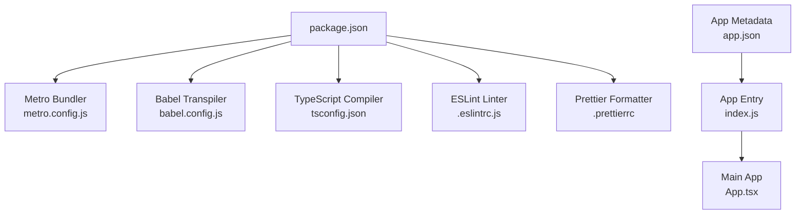
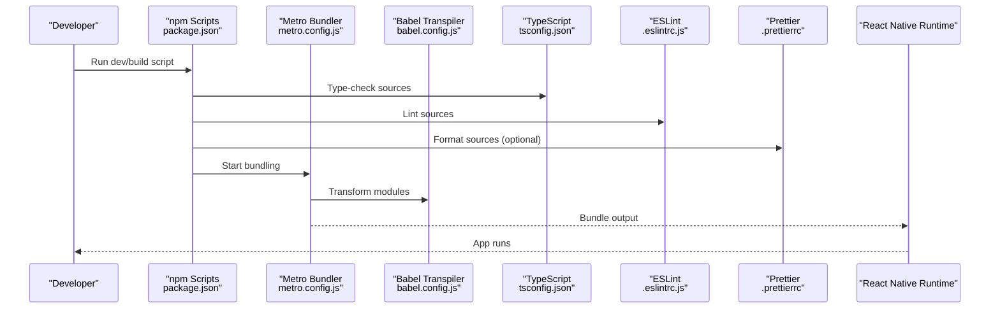
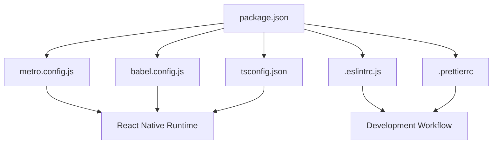

# Configuration and Setup

<cite>
**Referenced Files in This Document**
- [package.json](file://package.json)
- [metro.config.js](file://metro.config.js)
- [babel.config.js](file://babel.config.js)
- [tsconfig.json](file://tsconfig.json)
- [.eslintrc.js](file://.eslintrc.js)
- [.prettierrc](file://.prettierrc)
- [.prettierignore](file://.prettierignore)
- [app.json](file://app.json)
- [index.js](file://index.js)
- [App.tsx](file://App.tsx)
</cite>

## Table of Contents
1. [Introduction](#introduction)
2. [Project Structure](#project-structure)
3. [Core Components](#core-components)
4. [Architecture Overview](#architecture-overview)
5. [Detailed Component Analysis](#detailed-component-analysis)
6. [Dependency Analysis](#dependency-analysis)
7. [Performance Considerations](#performance-considerations)
8. [Troubleshooting Guide](#troubleshooting-guide)
9. [Conclusion](#conclusion)

## Introduction
This document explains the configuration and build setup for the video-rn React Native application. It covers Metro bundler configuration, Babel transpilation settings, TypeScript compilation options, ESLint rules, and Prettier formatting. It also provides guidance on customizing these configurations for different environments and deployment targets, including platform-specific considerations for iOS and Android builds.

## Project Structure
The project is a standard React Native app with configuration files at the root level:
- package.json defines dependencies and scripts
- metro.config.js configures the Metro bundler
- babel.config.js configures Babel transformations
- tsconfig.json configures TypeScript compilation
- .eslintrc.js configures ESLint rules
- .prettierrc and .prettierignore configure code formatting
- app.json contains Expo/React Native app metadata
- index.js is the entry point for the bundle
- App.tsx is the main application component

**Diagram sources**
- [package.json](file://package.json)
- [metro.config.js](file://metro.config.js)
- [babel.config.js](file://babel.config.js)
- [tsconfig.json](file://tsconfig.json)
- [.eslintrc.js](file://.eslintrc.js)
- [.prettierrc](file://.prettierrc)
- [app.json](file://app.json)
- [index.js](file://index.js)
- [App.tsx](file://App.tsx)

**Section sources**
- [package.json](file://package.json)
- [metro.config.js](file://metro.config.js)
- [babel.config.js](file://babel.config.js)
- [tsconfig.json](file://tsconfig.json)
- [.eslintrc.js](file://.eslintrc.js)
- [.prettierrc](file://.prettierrc)
- [.prettierignore](file://.prettierignore)
- [app.json](file://app.json)
- [index.js](file://index.js)
- [App.tsx](file://App.tsx)

## Core Components
- Metro Bundler: Configured via metro.config.js to handle module resolution, asset handling, and environment-specific behavior for React Native development and production.
- Babel Transpiler: Configured via babel.config.js to transform TypeScript and modern JavaScript features into compatible code for target platforms.
- TypeScript Compiler: Configured via tsconfig.json to enforce type checking, module resolution, and output settings.
- ESLint: Configured via .eslintrc.js to enforce code quality and consistency across the codebase.
- Prettier: Configured via .prettierrc and .prettierignore to ensure consistent code formatting.
- App Metadata: Defined in app.json for Expo/React Native app identification and platform-specific settings.
- Entry Point: index.js bootstraps the app and registers it with React Native; App.tsx contains the main UI logic.

**Section sources**
- [metro.config.js](file://metro.config.js)
- [babel.config.js](file://babel.config.js)
- [tsconfig.json](file://tsconfig.json)
- [.eslintrc.js](file://.eslintrc.js)
- [.prettierrc](file://.prettierrc)
- [.prettierignore](file://.prettierignore)
- [app.json](file://app.json)
- [index.js](file://index.js)
- [App.tsx](file://App.tsx)

## Architecture Overview
The build pipeline integrates multiple tools orchestrated by npm scripts defined in package.json:
- Development: Metro serves the app with hot reloading, Babel transforms source files, TypeScript checks types, ESLint validates code, and Prettier formats changes.
- Production: Metro bundles assets and JS, Babel minifies and optimizes, TypeScript performs strict type checks, and ESLint ensures code quality before packaging for iOS/Android.

**Diagram sources**
- [package.json](file://package.json)
- [metro.config.js](file://metro.config.js)
- [babel.config.js](file://babel.config.js)
- [tsconfig.json](file://tsconfig.json)
- [.eslintrc.js](file://.eslintrc.js)
- [.prettierrc](file://.prettierrc)

## Detailed Component Analysis

### Metro Bundler Configuration
- Purpose: Configure module resolution, asset handling, and environment-specific behaviors for React Native.
- Key aspects:
  - Module resolver extensions and aliases
  - Asset transformers for images, fonts, and media
  - Environment flags for development vs production
  - Integration with Babel and TypeScript
- Customization tips:
  - Add custom resolvers for third-party libraries
  - Enable/disable caching based on environment
  - Configure separate configs for iOS and Android if needed

**Section sources**
- [metro.config.js](file://metro.config.js)

### Babel Transpilation Settings
- Purpose: Transform TypeScript and modern JavaScript into compatible code for target platforms.
- Key aspects:
  - Presets for React Native, TypeScript, and modern JS features
  - Plugins for JSX, decorators, or other syntax
  - Environment-specific plugins for development vs production
- Customization tips:
  - Add polyfills for older platforms
  - Exclude heavy plugins in production builds
  - Use conditional presets based on NODE_ENV

**Section sources**
- [babel.config.js](file://babel.config.js)

### TypeScript Compilation Options
- Purpose: Enforce type safety, control module resolution, and define output settings.
- Key aspects:
  - Target ES version and module system
  - Strict mode and additional type checks
  - Path mappings and library references
  - Excluding test files or generated code
- Customization tips:
  - Adjust strictness for legacy codebases
  - Configure incremental builds for performance
  - Separate tsconfig files per platform if necessary

**Section sources**
- [tsconfig.json](file://tsconfig.json)

### ESLint Rules for Code Quality
- Purpose: Enforce consistent coding standards and catch potential issues early.
- Key aspects:
  - Base configurations for React Native and TypeScript
  - Custom rules for project-specific patterns
  - Integrations with Prettier to avoid conflicts
- Customization tips:
  - Add rules for video-related components and hooks
  - Disable rules selectively with comments when justified
  - Use CI pipelines to enforce linting

**Section sources**
- [.eslintrc.js](file://.eslintrc.js)

### Prettier Configuration for Formatting
- Purpose: Ensure consistent code style across the project.
- Key aspects:
  - Indentation, quotes, semicolons, and line width
  - Ignored files and directories via .prettierignore
  - Editor integration for automatic formatting
- Customization tips:
  - Align with team preferences
  - Integrate with pre-commit hooks
  - Use format-on-save in editors

**Section sources**
- [.prettierrc](file://.prettierrc)
- [.prettierignore](file://.prettierignore)

### App Metadata and Entry Points
- Purpose: Define app identity and bootstrap the runtime.
- Key aspects:
  - app.json contains app name, version, and platform-specific settings
  - index.js registers the app with React Native
  - App.tsx contains the main UI logic
- Customization tips:
  - Set environment-specific app names and icons
  - Configure deep linking and permissions in app.json
  - Split large components for better performance

**Section sources**
- [app.json](file://app.json)
- [index.js](file://index.js)
- [App.tsx](file://App.tsx)

## Dependency Analysis
The build pipeline depends on several tools coordinated through npm scripts:
- package.json orchestrates scripts that invoke Metro, Babel, TypeScript, ESLint, and Prettier
- metro.config.js and babel.config.js are central to bundling and transformation
- tsconfig.json controls type checking and module resolution
- .eslintrc.js and .prettierrc enforce code quality and formatting

**Diagram sources**
- [package.json](file://package.json)
- [metro.config.js](file://metro.config.js)
- [babel.config.js](file://babel.config.js)
- [tsconfig.json](file://tsconfig.json)
- [.eslintrc.js](file://.eslintrc.js)
- [.prettierrc](file://.prettierrc)

**Section sources**
- [package.json](file://package.json)
- [metro.config.js](file://metro.config.js)
- [babel.config.js](file://babel.config.js)
- [tsconfig.json](file://tsconfig.json)
- [.eslintrc.js](file://.eslintrc.js)
- [.prettierrc](file://.prettierrc)

## Performance Considerations
- Metro:
  - Enable watchman for faster file watching on macOS/Linux
  - Use persistent cache to speed up rebuilds
  - Minimize large assets and use appropriate image formats
- Babel:
  - Avoid unnecessary plugins in production
  - Use environment-specific presets to reduce bundle size
- TypeScript:
  - Enable incremental compilation for faster builds
  - Keep strict mode enabled to catch errors early
- ESLint/Prettier:
  - Run linting in CI to prevent regressions
  - Use editor integrations to format on save

[No sources needed since this section provides general guidance]

## Troubleshooting Guide
- Metro fails to resolve modules:
  - Clear Metro cache and restart the server
  - Verify module paths and aliases in metro.config.js
- Babel transformation errors:
  - Check plugin/preset versions and compatibility
  - Ensure NODE_ENV is set correctly for environment-specific configs
- TypeScript type errors:
  - Review tsconfig.json settings and strictness levels
  - Update type definitions for third-party libraries
- ESLint/Prettier conflicts:
  - Align ESLint rules with Prettier settings
  - Use eslint-config-prettier to disable conflicting rules
- Platform-specific build issues:
  - Verify app.json metadata and permissions
  - Check platform toolchains and SDK versions

**Section sources**
- [metro.config.js](file://metro.config.js)
- [babel.config.js](file://babel.config.js)
- [tsconfig.json](file://tsconfig.json)
- [.eslintrc.js](file://.eslintrc.js)
- [.prettierrc](file://.prettierrc)
- [app.json](file://app.json)

## Conclusion
The video-rn application uses a well-structured configuration setup centered around Metro, Babel, TypeScript, ESLint, and Prettier. By understanding each tool’s role and customization options, you can tailor the build pipeline for development, testing, and production while addressing platform-specific requirements for iOS and Android. Consistent enforcement of code quality and formatting ensures maintainability and scalability across the project lifecycle.

[No sources needed since this section summarizes without analyzing specific files]