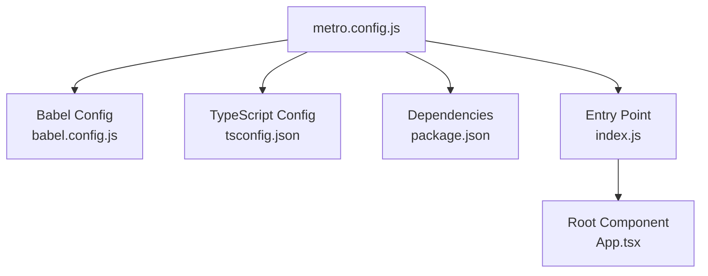
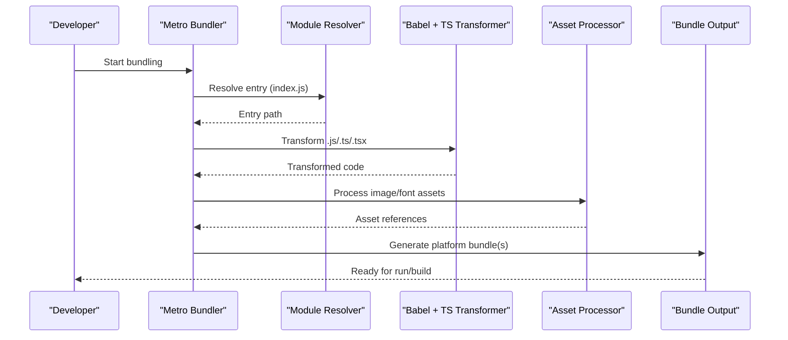
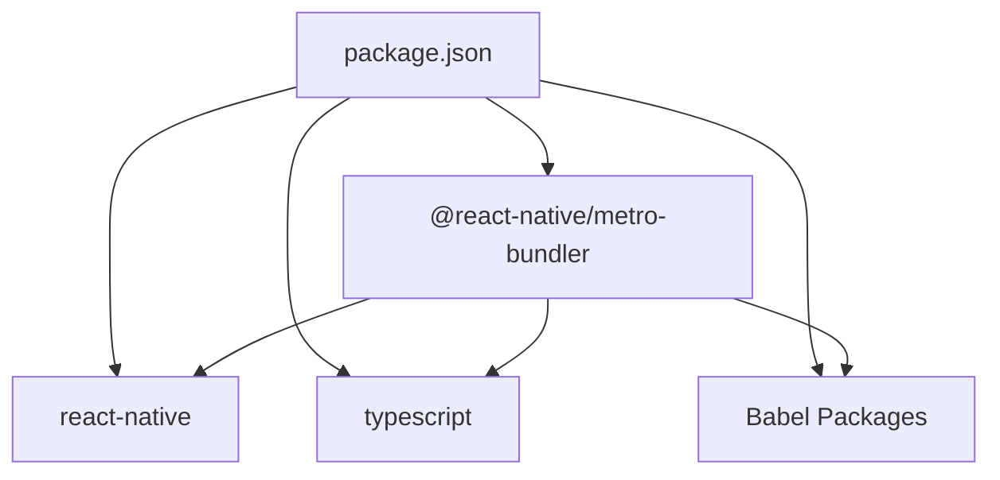

# Metro Bundler Configuration

<cite>
**Referenced Files in This Document**
- [metro.config.js](file://metro.config.js)
- [babel.config.js](file://babel.config.js)
- [tsconfig.json](file://tsconfig.json)
- [package.json](file://package.json)
- [index.js](file://index.js)
- [App.tsx](file://App.tsx)
</cite>

## Table of Contents
1. [Introduction](#introduction)
2. [Project Structure](#project-structure)
3. [Core Components](#core-components)
4. [Architecture Overview](#architecture-overview)
5. [Detailed Component Analysis](#detailed-component-analysis)
6. [Dependency Analysis](#dependency-analysis)
7. [Performance Considerations](#performance-considerations)
8. [Troubleshooting Guide](#troubleshooting-guide)
9. [Conclusion](#conclusion)

## Introduction
This document explains the Metro bundler configuration for the video-rn React Native application. It covers module resolution, transformer setup, asset processing, platform-specific code splitting, and optimization options. It also provides guidance on customizing transformers for TypeScript, images, and other assets, along with performance tuning, cache management, and debugging techniques. Practical customization scenarios are included to help you extend or modify the build pipeline safely.

## Project Structure
The project is a React Native app that uses Metro as its default bundler. The key files related to Metro include:
- metro.config.js: Metro’s main configuration file
- babel.config.js: Babel preset and plugins used by Metro’s transformer
- tsconfig.json: TypeScript compiler options that influence how Metro resolves and transforms TS/TSX
- package.json: Dependencies that affect Metro behavior (e.g., @react-native/metro-bundler, react-native, typescript)
- index.js: App entry point consumed by Metro during bundling
- App.tsx: Root component loaded by the entry point

**Diagram sources**
- [metro.config.js](file://metro.config.js)
- [babel.config.js](file://babel.config.js)
- [tsconfig.json](file://tsconfig.json)
- [package.json](file://package.json)
- [index.js](file://index.js)
- [App.tsx](file://App.tsx)

**Section sources**
- [metro.config.js](file://metro.config.js)
- [babel.config.js](file://babel.config.js)
- [tsconfig.json](file://tsconfig.json)
- [package.json](file://package.json)
- [index.js](file://index.js)
- [App.tsx](file://App.tsx)

## Core Components
Metro’s configuration typically includes:
- Module resolver settings: extensions, platforms, and custom resolvers
- Transformer settings: Babel presets/plugins, source map control, and custom transform pipelines
- Asset handling: supported extensions and custom asset processors
- Optimization flags: minification, dead code elimination, and bundle size controls
- Cache and watch options: development vs production caching strategies

In this project, Metro integrates with Babel and TypeScript through their respective configs. The entry point and root component define what gets bundled.

**Section sources**
- [metro.config.js](file://metro.config.js)
- [babel.config.js](file://babel.config.js)
- [tsconfig.json](file://tsconfig.json)
- [package.json](file://package.json)
- [index.js](file://index.js)
- [App.tsx](file://App.tsx)

## Architecture Overview
Metro processes your app by:
- Resolving modules based on configured extensions and platforms
- Transforming source files via Babel and TypeScript
- Handling assets (images, fonts, etc.) according to supported extensions
- Generating bundles optimized for target platforms (iOS/Android)

**Diagram sources**
- [metro.config.js](file://metro.config.js)
- [babel.config.js](file://babel.config.js)
- [tsconfig.json](file://tsconfig.json)
- [package.json](file://package.json)
- [index.js](file://index.js)
- [App.tsx](file://App.tsx)

## Detailed Component Analysis

### Module Resolution
- Extensions: Configure which file extensions Metro recognizes (e.g., .js, .ts, .tsx, .json). Ensure these align with your TypeScript and Babel setup.
- Platforms: Define platform-specific suffixes (e.g., .ios, .android) to enable platform-specific code splitting.
- Custom resolvers: Extend resolution logic to support aliases, virtual modules, or non-standard paths.

Typical considerations:
- Keep extension lists minimal to reduce resolution overhead.
- Use platform suffixes consistently for iOS/Android differences.
- Avoid circular dependencies; use explicit imports.

**Section sources**
- [metro.config.js](file://metro.config.js)
- [tsconfig.json](file://tsconfig.json)
- [package.json](file://package.json)

### Transformers
- Babel integration: Metro uses Babel via babel.config.js. Configure presets and plugins here to handle JSX, class properties, decorators, and modern JS features.
- TypeScript transformation: Metro leverages TypeScript for type checking and transformation. Align tsconfig.json with your project needs (target, module, strictness).
- Source maps: Enable source maps for debugging; disable in production builds for smaller bundles.
- Custom transformers: Add or replace transformers for specialized file types or advanced transformations.

Best practices:
- Keep Babel plugins focused and avoid heavy transformations in dev.
- Use TypeScript’s incremental compilation where possible.
- Validate transformer order to prevent conflicts.

**Section sources**
- [metro.config.js](file://metro.config.js)
- [babel.config.js](file://babel.config.js)
- [tsconfig.json](file://tsconfig.json)

### Asset Processing
- Supported extensions: Configure which assets Metro handles (e.g., images, fonts, SVGs).
- Custom asset processors: Implement custom handlers for proprietary formats or special processing steps.
- Platform-specific assets: Use platform suffixes to provide different assets per platform.

Guidelines:
- Prefer vector assets (SVG) when possible to reduce bundle size.
- Optimize images before bundling to minimize payload.
- Separate large assets into separate packages or lazy-load them.

**Section sources**
- [metro.config.js](file://metro.config.js)
- [package.json](file://package.json)

### Bundle Optimization
- Minification: Enable minification in production builds to reduce bundle size.
- Dead code elimination: Ensure unused code is stripped; verify tree-shaking compatibility.
- Code splitting: Split large modules into smaller chunks for faster startup.
- Platform-specific bundles: Generate separate bundles for iOS and Android to exclude irrelevant code.

Recommendations:
- Profile bundle sizes using Metro’s built-in reporting tools.
- Remove unused dependencies and libraries.
- Lazy-load heavy components and screens.

**Section sources**
- [metro.config.js](file://metro.config.js)
- [package.json](file://package.json)

### Cache Management
- Development cache: Metro caches transformed modules to speed up rebuilds. Clear cache if encountering stale issues.
- Production cache: Ensure consistent builds by validating cache state across environments.
- Cache invalidation: Update configurations or dependencies to force cache refresh when needed.

Tips:
- Use environment variables to toggle cache behavior between dev and prod.
- Monitor cache hit rates to identify bottlenecks.

**Section sources**
- [metro.config.js](file://metro.config.js)
- [package.json](file://package.json)

### Debugging Techniques
- Verbose logging: Enable detailed logs to trace resolution and transformation issues.
- Source maps: Use source maps to debug transformed code effectively.
- Metro inspector: Utilize Metro’s inspector for runtime debugging.
- Isolation tests: Test custom transformers and resolvers in isolation.

Common pitfalls:
- Mismatched file extensions causing resolution failures.
- Incorrect Babel plugin ordering leading to transform errors.
- Stale cache preventing updates from appearing.

**Section sources**
- [metro.config.js](file://metro.config.js)
- [babel.config.js](file://babel.config.js)
- [tsconfig.json](file://tsconfig.json)

## Dependency Analysis
Metro relies on several dependencies defined in package.json, including:
- @react-native/metro-bundler: Core Metro bundler for React Native
- react-native: Provides platform-specific integrations
- typescript: Enables TypeScript support
- Babel-related packages: Presets and plugins for transformation

Ensure versions are compatible to avoid resolution and transformation issues.

**Diagram sources**
- [package.json](file://package.json)

**Section sources**
- [package.json](file://package.json)

## Performance Considerations
- Reduce bundle size by removing unused code and optimizing assets.
- Use platform-specific code splitting to exclude irrelevant modules.
- Enable incremental builds and leverage caching effectively.
- Profile and monitor bundle growth over time.

[No sources needed since this section provides general guidance]

## Troubleshooting Guide
Common issues and resolutions:
- Module not found: Verify extensions and platform suffixes; check custom resolvers.
- Transform errors: Review Babel plugins and TypeScript settings; ensure correct order.
- Stale cache: Clear Metro cache and rebuild; validate dependency versions.
- Slow builds: Analyze bundle size; optimize imports and assets.

**Section sources**
- [metro.config.js](file://metro.config.js)
- [babel.config.js](file://babel.config.js)
- [tsconfig.json](file://tsconfig.json)

## Conclusion
Metro’s configuration in the video-rn app integrates seamlessly with Babel and TypeScript to deliver efficient, platform-aware bundles. By carefully managing module resolution, transformers, assets, and optimizations, you can achieve fast builds and smooth runtime performance. Use the guidance above to customize transformers, add resolvers, and tune performance while maintaining a robust debugging workflow.

[No sources needed since this section summarizes without analyzing specific files]