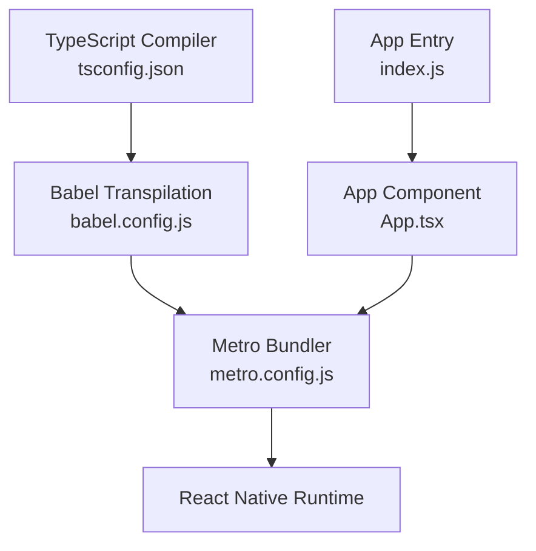
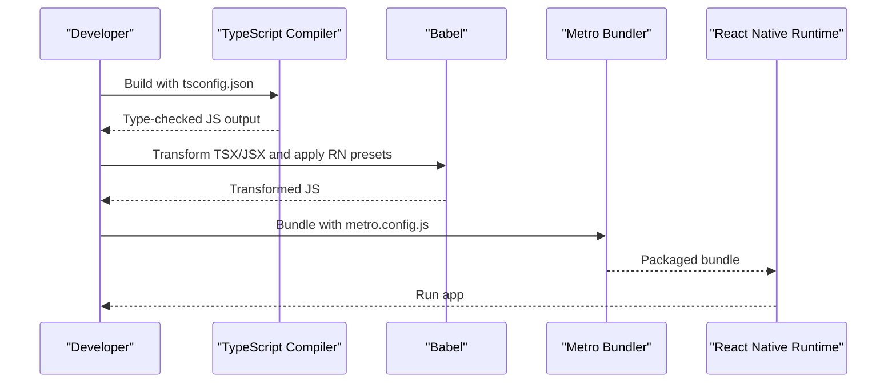
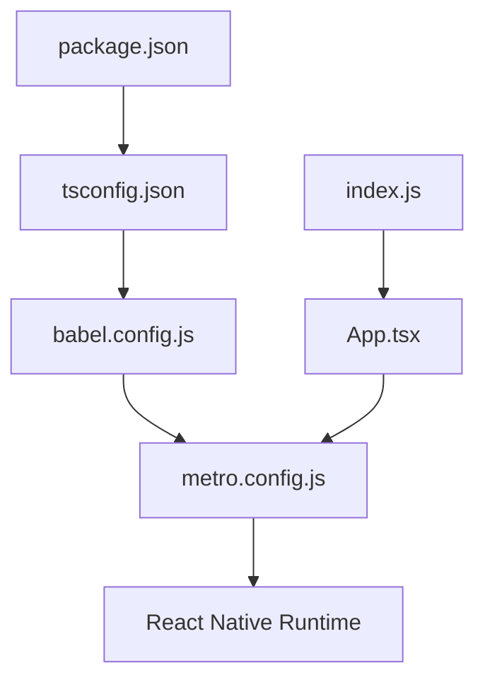

# TypeScript Compilation Settings

<cite>
**Referenced Files in This Document**
- [tsconfig.json](file://tsconfig.json)
- [package.json](file://package.json)
- [babel.config.js](file://babel.config.js)
- [metro.config.js](file://metro.config.js)
- [App.tsx](file://App.tsx)
- [index.js](file://index.js)
- [.eslintrc.js](file://.eslintrc.js)
</cite>

## Table of Contents
1. [Introduction](#introduction)
2. [Project Structure](#project-structure)
3. [Core Components](#core-components)
4. [Architecture Overview](#architecture-overview)
5. [Detailed Component Analysis](#detailed-component-analysis)
6. [Dependency Analysis](#dependency-analysis)
7. [Performance Considerations](#performance-considerations)
8. [Troubleshooting Guide](#troubleshooting-guide)
9. [Conclusion](#conclusion)
10. [Appendices](#appendices)

## Introduction
This document explains how TypeScript is configured and integrated in the video-rn application. It focuses on the tsconfig.json settings, module resolution, path mappings, type checking rules, JSX transformation, and integration with React Native via Babel and Metro. It also provides guidance for enabling strict mode, experimental features, configuring path aliases, addressing common issues, optimizing performance, and setting up IDE integration.

## Project Structure
The project follows a standard React Native layout with TypeScript files alongside JavaScript configuration files that drive compilation and bundling:
- TypeScript configuration lives in tsconfig.json.
- Runtime transformation and bundling are handled by Babel (babel.config.js) and Metro (metro.config.js).
- The app entry points are index.js and App.tsx.
- Linting is configured via .eslintrc.js.

**Diagram sources**
- [tsconfig.json](file://tsconfig.json)
- [babel.config.js](file://babel.config.js)
- [metro.config.js](file://metro.config.js)
- [index.js](file://index.js)
- [App.tsx](file://App.tsx)

**Section sources**
- [tsconfig.json](file://tsconfig.json)
- [package.json](file://package.json)
- [babel.config.js](file://babel.config.js)
- [metro.config.js](file://metro.config.js)
- [index.js](file://index.js)
- [App.tsx](file://App.tsx)

## Core Components
- TypeScript Configuration (tsconfig.json): Defines compiler options, target, module system, JSX handling, strictness, and path mappings.
- Babel Configuration (babel.config.js): Transforms TSX/JSX and applies React Native presets.
- Metro Configuration (metro.config.js): Resolves modules and handles extensions for React Native.
- Package Dependencies (package.json): Declares TypeScript version and related tooling.
- ESLint Configuration (.eslintrc.js): Enforces code style and integrates with TypeScript parsing.

Key responsibilities:
- tsconfig.json ensures type safety and controls output behavior.
- babel.config.js transforms source code to a format compatible with the React Native runtime.
- metro.config.js configures module resolution and asset handling.
- package.json centralizes dependency versions and scripts.
- .eslintrc.js enforces consistent code quality across TS/TSX files.

**Section sources**
- [tsconfig.json](file://tsconfig.json)
- [babel.config.js](file://babel.config.js)
- [metro.config.js](file://metro.config.js)
- [package.json](file://package.json)
- [.eslintrc.js](file://.eslintrc.js)

## Architecture Overview
TypeScript compiles type-checked source into JavaScript that Babel further transforms for React Native. Metro then bundles the transformed code for the device or simulator.

**Diagram sources**
- [tsconfig.json](file://tsconfig.json)
- [babel.config.js](file://babel.config.js)
- [metro.config.js](file://metro.config.js)

## Detailed Component Analysis

### TypeScript Configuration (tsconfig.json)
- Compiler Options:
  - Target and module system selection ensure compatibility with React Native’s environment.
  - JSX configuration enables TSX support and aligns with React Native’s expectations.
  - Strict mode flags improve type safety; enable additional checks as needed.
  - Module resolution strategy supports Node-style imports and React Native-specific resolutions.
  - Path mappings allow clean imports using aliases.
- Type Checking Rules:
  - Enable strictNullChecks, noImplicitAny, and other strict flags for robust typing.
  - Configure skipLibCheck if necessary to speed up builds while keeping core checks.
- Experimental Features:
  - Use decorators or other experimental flags only when required and pinned to stable versions.
- Integration Notes:
  - Ensure paths match actual directory structure and are mirrored in Metro/Babel where applicable.

**Section sources**
- [tsconfig.json](file://tsconfig.json)

### Babel Integration (babel.config.js)
- Presets and Plugins:
  - Apply React Native preset to transform TSX/JSX and polyfill features.
  - Ensure TypeScript syntax is supported during transformation.
- Interaction with tsconfig.json:
  - Babel typically does not enforce tsconfig types; rely on TypeScript for type-checking separately.
- Performance Tips:
  - Avoid heavy plugins unless necessary; keep transformations minimal for faster builds.

**Section sources**
- [babel.config.js](file://babel.config.js)

### Metro Integration (metro.config.js)
- Module Resolution:
  - Configure resolver to handle .ts/.tsx and other extensions.
  - Align with tsconfig path mappings for consistent import resolution.
- Asset Handling:
  - Ensure assets used by components are correctly resolved.
- Compatibility:
  - Verify Metro version matches React Native requirements.

**Section sources**
- [metro.config.js](file://metro.config.js)

### App Entry Points (index.js and App.tsx)
- index.js bootstraps the React Native app and mounts the root component.
- App.tsx contains the main application logic written in TSX.
- Ensure both files are included in the build pipeline and type-checked.

**Section sources**
- [index.js](file://index.js)
- [App.tsx](file://App.tsx)

### Package Dependencies (package.json)
- Declares TypeScript version and related tooling.
- Scripts may include commands for type-checking and building.
- Keep dependencies aligned with React Native’s supported versions.

**Section sources**
- [package.json](file://package.json)

### ESLint Integration (.eslintrc.js)
- Parser and plugins should be configured for TypeScript and TSX.
- Integrate with TypeScript to avoid duplicate errors and leverage tsconfig rules.
- Maintain consistent linting across the project.

**Section sources**
- [.eslintrc.js](file://.eslintrc.js)

## Dependency Analysis
The following diagram shows how configuration files interact to compile and run the app.

**Diagram sources**
- [package.json](file://package.json)
- [tsconfig.json](file://tsconfig.json)
- [babel.config.js](file://babel.config.js)
- [metro.config.js](file://metro.config.js)
- [index.js](file://index.js)
- [App.tsx](file://App.tsx)

**Section sources**
- [package.json](file://package.json)
- [tsconfig.json](file://tsconfig.json)
- [babel.config.js](file://babel.config.js)
- [metro.config.js](file://metro.config.js)
- [index.js](file://index.js)
- [App.tsx](file://App.tsx)

## Performance Considerations
- Incremental Builds:
  - Enable incremental compilation to speed up repeated builds.
- Skip Library Checks:
  - Consider skipping library checks for third-party packages when appropriate.
- Minimize Transform Overhead:
  - Keep Babel plugins minimal and avoid unnecessary transformations.
- Cache Metro:
  - Clear Metro cache when encountering stale module resolution issues.
- Parallel Tooling:
  - Run type-checking and linting in parallel where possible.

[No sources needed since this section provides general guidance]

## Troubleshooting Guide
Common issues and resolutions:
- Module Not Found:
  - Verify tsconfig paths and Metro resolver settings match actual directories.
- JSX Errors:
  - Ensure JSX configuration aligns with React Native expectations.
- Type Errors in Third-Party Libraries:
  - Install missing @types packages or adjust skipLibCheck cautiously.
- Slow Builds:
  - Disable unnecessary plugins, use incremental builds, and clear caches.
- IDE Integration:
  - Point your editor to the correct tsconfig.json and ensure TypeScript server is running.

**Section sources**
- [tsconfig.json](file://tsconfig.json)
- [babel.config.js](file://babel.config.js)
- [metro.config.js](file://metro.config.js)
- [.eslintrc.js](file://.eslintrc.js)

## Conclusion
Properly configuring TypeScript in a React Native project involves aligning tsconfig.json with Babel and Metro settings, enabling strict type checks, and maintaining consistent module resolution. Following the guidance here will help you achieve reliable type safety, smooth development workflows, and optimized build performance.

[No sources needed since this section summarizes without analyzing specific files]

## Appendices

### Configuring Strict Mode
- Enable strictNullChecks, noImplicitAny, and other strict flags for stronger type safety.
- Gradually adopt stricter rules to minimize disruption.

**Section sources**
- [tsconfig.json](file://tsconfig.json)

### Enabling Experimental Features
- Use experimental flags only when necessary and pin versions to avoid instability.
- Validate changes with tests and CI pipelines.

**Section sources**
- [tsconfig.json](file://tsconfig.json)

### Setting Up Path Aliases
- Define path mappings in tsconfig.json.
- Ensure Metro resolves aliases consistently.
- Update IDE settings to recognize aliases for IntelliSense.

**Section sources**
- [tsconfig.json](file://tsconfig.json)
- [metro.config.js](file://metro.config.js)

### IDE Integration Settings
- Configure your editor to use the project’s TypeScript version and tsconfig.json.
- Enable TypeScript diagnostics and integrate with ESLint for unified feedback.

**Section sources**
- [.eslintrc.js](file://.eslintrc.js)
- [tsconfig.json](file://tsconfig.json)