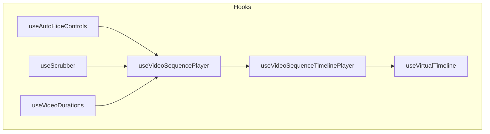
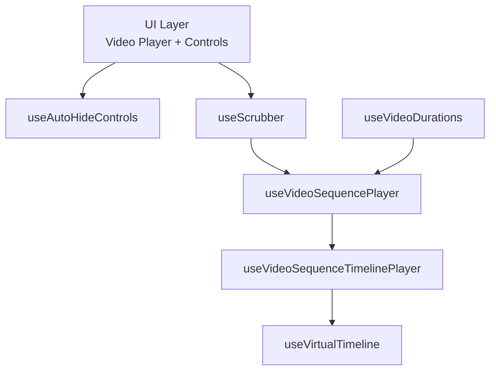
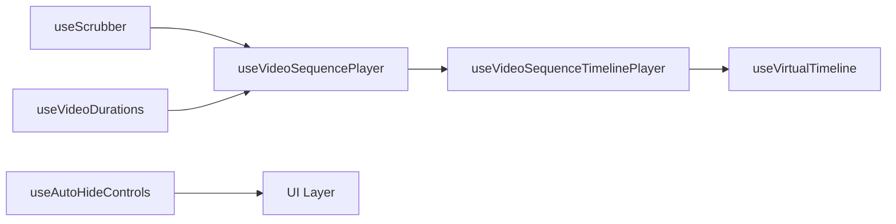

# Custom Hooks Library

<cite>
**Referenced Files in This Document**
- [useAutoHideControls.ts](file://hooks/useAutoHideControls.ts)
- [useScrubber.ts](file://hooks/useScrubber.ts)
- [useVideoDurations.tsx](file://hooks/useVideoDurations.tsx)
- [useVideoSequencePlayer.ts](file://hooks/useVideoSequencePlayer.ts)
- [useVideoSequenceTimelinePlayer.ts](file://hooks/useVideoSequenceTimelinePlayer.ts)
- [useVirtualTimeline.ts](file://hooks/useVirtualTimeline.ts)
- [README.md](file://README.md)
</cite>

## Table of Contents
1. [Introduction](#introduction)
2. [Project Structure](#project-structure)
3. [Core Components](#core-components)
4. [Architecture Overview](#architecture-overview)
5. [Detailed Component Analysis](#detailed-component-analysis)
6. [Dependency Analysis](#dependency-analysis)
7. [Performance Considerations](#performance-considerations)
8. [Troubleshooting Guide](#troubleshooting-guide)
9. [Conclusion](#conclusion)

## Introduction
This document provides comprehensive documentation for the custom hooks library used in the video-rn application. It explains each hook’s purpose, API interface, parameters, return values, and usage patterns. The focus is on how these hooks collaborate to manage control visibility, scrubbing/seeking, duration tracking, playlist playback, timeline-based coordination, and memory-efficient rendering for large video collections.

## Project Structure
The hooks are organized under a dedicated directory and follow a consistent naming convention that reflects their responsibilities:
- Control visibility: useAutoHideControls
- Touch-based seeking: useScrubber
- Duration tracking: useVideoDurations
- Playlist management: useVideoSequencePlayer
- Timeline coordination: useVideoSequenceTimelinePlayer
- Memory optimization: useVirtualTimeline

**Diagram sources**
- [useAutoHideControls.ts](file://hooks/useAutoHideControls.ts)
- [useScrubber.ts](file://hooks/useScrubber.ts)
- [useVideoDurations.tsx](file://hooks/useVideoDurations.tsx)
- [useVideoSequencePlayer.ts](file://hooks/useVideoSequencePlayer.ts)
- [useVideoSequenceTimelinePlayer.ts](file://hooks/useVideoSequenceTimelinePlayer.ts)
- [useVirtualTimeline.ts](file://hooks/useVirtualTimeline.ts)

**Section sources**
- [README.md](file://README.md)

## Core Components
Below is a concise overview of each hook’s role within the system:
- useAutoHideControls: Manages automatic hiding/showing of player controls based on user activity and timeouts.
- useScrubber: Handles touch gestures to seek through the current video by interpreting drag events and updating playback position.
- useVideoDurations: Tracks total duration and current time of videos, emitting updates as metadata becomes available or playback progresses.
- useVideoSequencePlayer: Orchestrates playlist playback, including playing, pausing, skipping, looping, and maintaining active index/state.
- useVideoSequenceTimelinePlayer: Coordinates timeline-driven playback across the sequence, synchronizing with durations and scrubbing interactions.
- useVirtualTimeline: Optimizes memory usage when dealing with large collections by virtualizing visible items and managing lifecycle of heavy resources.

These hooks compose together to provide a robust, performant video experience.

[No sources needed since this section provides a conceptual overview]

## Architecture Overview
The hooks form a layered architecture where lower-level concerns (duration tracking, scrubbing, auto-hiding) feed into higher-level orchestration (sequence player and timeline coordinator), which in turn leverages virtualization for scalability.

**Diagram sources**
- [useAutoHideControls.ts](file://hooks/useAutoHideControls.ts)
- [useScrubber.ts](file://hooks/useScrubber.ts)
- [useVideoDurations.tsx](file://hooks/useVideoDurations.tsx)
- [useVideoSequencePlayer.ts](file://hooks/useVideoSequencePlayer.ts)
- [useVideoSequenceTimelinePlayer.ts](file://hooks/useVideoSequenceTimelinePlayer.ts)
- [useVirtualTimeline.ts](file://hooks/useVirtualTimeline.ts)

## Detailed Component Analysis

### useAutoHideControls
Purpose:
- Automatically hides and shows player controls based on user interaction and configurable timeouts.

API Interface:
- Parameters:
  - options?: object with properties such as hideDelayMs (number), showOnInteraction (boolean), and any additional flags to customize behavior.
- Returns:
  - isVisible: boolean indicating whether controls should be shown.
  - handleInteraction: function to call when user interacts with the screen to reset the hide timer.
  - maybeHide: function to trigger hiding logic immediately if desired.

Usage Patterns:
- Wrap controls with a container that listens for touch/mouse events and calls handleInteraction.
- Use isVisible to conditionally render controls.
- Combine with other hooks to ensure controls reappear during playback state changes.

Common Pitfalls:
- Forgetting to call handleInteraction on all relevant interactions can cause controls to remain hidden.
- Setting hideDelayMs too low may lead to flickering; too high may delay necessary hiding.

**Section sources**
- [useAutoHideControls.ts](file://hooks/useAutoHideControls.ts)

### useScrubber
Purpose:
- Provides touch-based scrubbing to seek through the current video by interpreting drag gestures and translating them into playback positions.

API Interface:
- Parameters:
  - duration: number representing the total duration of the current media.
  - currentTime: number representing the current playback time.
  - onSeek?: function callback invoked with the target time when scrubbing ends.
- Returns:
  - gesture handlers: functions suitable for attaching to panResponder or gesture systems.
  - scrubState: object containing fields like isDragging, progress (0..1), and estimatedTime.

Usage Patterns:
- Attach returned gesture handlers to a full-screen overlay or control bar.
- Update currentTime via an external controller or pass it back to the player.
- Use scrubState.isDragging to temporarily disable auto-hide while scrubbing.

Common Pitfalls:
- Not clamping progress to valid ranges can cause invalid seek targets.
- Ignoring duration updates can result in incorrect mapping from gesture to time.

**Section sources**
- [useScrubber.ts](file://hooks/useScrubber.ts)

### useVideoDurations
Purpose:
- Tracks and exposes duration and current time information for one or more videos, emitting updates as metadata loads and playback progresses.

API Interface:
- Parameters:
  - source: object or string identifying the media source.
  - enabled?: boolean to enable/disable tracking.
- Returns:
  - duration: number or null until metadata is available.
  - currentTime: number reflecting current playback position.
  - isReady: boolean indicating whether duration metadata has been resolved.
  - onUpdate?: callback invoked whenever duration/currentTime change.

Usage Patterns:
- Feed duration into useScrubber to map gestures to time.
- Use isReady to gate UI elements that depend on accurate timing (e.g., progress bars).
- Combine with useVideoSequencePlayer to synchronize per-item durations.

Common Pitfalls:
- Assuming duration is always available without checking isReady.
- Not handling rapid updates to currentTime in performance-sensitive components.

**Section sources**
- [useVideoDurations.tsx](file://hooks/useVideoDurations.tsx)

### useVideoSequencePlayer
Purpose:
- Manages playlist-style playback, including controlling play/pause, advancing to next/previous items, looping behavior, and maintaining the active index.

API Interface:
- Parameters:
  - items: array of media entries (e.g., { id, uri, title }).
  - initialIndex?: number to set starting item.
  - loop?: boolean to enable looping across the sequence.
  - autoplay?: boolean to start playback automatically.
- Returns:
  - currentIndex: number of the currently active item.
  - currentItem: object representing the active media entry.
  - isPlaying: boolean indicating playback state.
  - actions: object with methods like play(), pause(), next(), previous(), goTo(index), setLoop(flag).
  - meta: optional aggregate info such as total length, remaining count, etc.

Usage Patterns:
- Render the active item using currentItem and control playback via actions.
- Integrate with useVideoDurations to display accurate progress per item.
- Coordinate with useVideoSequenceTimelinePlayer for timeline-driven transitions.

Common Pitfalls:
- Mutating items array directly without notifying the hook can break synchronization.
- Not handling asynchronous loading states for media sources.

**Section sources**
- [useVideoSequencePlayer.ts](file://hooks/useVideoSequencePlayer.ts)

### useVideoSequenceTimelinePlayer
Purpose:
- Coordinates timeline-based playback across the sequence, ensuring smooth transitions between items and aligning playback with global timeline state.

API Interface:
- Parameters:
  - sequencePlayer: instance or reference provided by useVideoSequencePlayer.
  - timelineConfig?: object with properties like snapToNearest (boolean), transitionDurationMs (number), and scrollOffset (number).
- Returns:
  - timelineState: object with fields like activeIndex, progress, and isTransitioning.
  - scrollToItem: function to programmatically navigate to a specific index.
  - onTimelineUpdate: callback invoked when timeline state changes.

Usage Patterns:
- Bind timelineState.progress to UI indicators (e.g., segmented progress bars).
- Use scrollToItem to implement programmatic navigation triggered by gestures or timers.
- Combine with useVirtualTimeline to optimize rendering of large lists.

Common Pitfalls:
- Ignoring transitionDurationMs can cause jarring jumps between items.
- Not debouncing rapid timeline updates can lead to unnecessary re-renders.

**Section sources**
- [useVideoSequenceTimelinePlayer.ts](file://hooks/useVideoSequenceTimelinePlayer.ts)

### useVirtualTimeline
Purpose:
- Optimizes memory usage for large video collections by virtualizing visible items and managing lifecycle of heavy resources.

API Interface:
- Parameters:
  - items: array of media entries to virtualize.
  - config?: object with properties like windowSize (number), itemHeight (number), overscan (number), and onMount/onUnmount callbacks.
- Returns:
  - visibleItems: subset of items currently within the viewport.
  - listProps: props suitable for passing to a virtualized list component.
  - metrics: object with computed offsets, heights, and indices for precise positioning.

Usage Patterns:
- Pass visibleItems to your renderer to avoid creating offscreen components.
- Use onMount/onUnmount to initialize and dispose of expensive resources per item.
- Combine with useVideoSequencePlayer to keep only active and nearby items loaded.

Common Pitfalls:
- Incorrectly calculating itemHeight can cause layout shifts.
- Not cleaning up resources in onUnmount leads to memory leaks.

**Section sources**
- [useVirtualTimeline.ts](file://hooks/useVirtualTimeline.ts)

## Dependency Analysis
The hooks exhibit clear separation of concerns with well-defined dependencies:
- useVideoSequencePlayer depends on lower-level concerns (duration tracking, scrubbing) indirectly via composition.
- useVideoSequenceTimelinePlayer depends on useVideoSequencePlayer to coordinate timeline state.
- useVirtualTimeline depends on item arrays and configuration to compute visible subsets.

**Diagram sources**
- [useScrubber.ts](file://hooks/useScrubber.ts)
- [useVideoDurations.tsx](file://hooks/useVideoDurations.tsx)
- [useVideoSequencePlayer.ts](file://hooks/useVideoSequencePlayer.ts)
- [useVideoSequenceTimelinePlayer.ts](file://hooks/useVideoSequenceTimelinePlayer.ts)
- [useVirtualTimeline.ts](file://hooks/useVirtualTimeline.ts)
- [useAutoHideControls.ts](file://hooks/useAutoHideControls.ts)

**Section sources**
- [useVideoSequencePlayer.ts](file://hooks/useVideoSequencePlayer.ts)
- [useVideoSequenceTimelinePlayer.ts](file://hooks/useVideoSequenceTimelinePlayer.ts)
- [useVirtualTimeline.ts](file://hooks/useVirtualTimeline.ts)

## Performance Considerations
- Debounce or throttle frequent updates from useVideoDurations to avoid excessive re-renders.
- Use useVirtualTimeline to limit the number of active components in large playlists.
- Avoid unnecessary state mutations in useVideoSequencePlayer; prefer immutable updates.
- Ensure gesture handlers in useScrubber are optimized for smooth dragging without blocking the main thread.
- Configure hideDelayMs in useAutoHideControls to balance responsiveness and UX.

[No sources needed since this section provides general guidance]

## Troubleshooting Guide
Common issues and resolutions:
- Controls do not reappear after interaction:
  - Verify handleInteraction is called on all relevant events.
  - Check that showOnInteraction is enabled and hideDelayMs is reasonable.
- Scrubbing does not update playback:
  - Confirm duration is available and currentTime is being updated.
  - Ensure onSeek is wired correctly and clamps values to valid ranges.
- Duration remains null:
  - Wait for isReady to become true before relying on duration.
  - Validate media source format and permissions.
- Playlist skips unexpectedly:
  - Inspect loop and autoplay settings.
  - Ensure items array is stable and not mutated unexpectedly.
- Memory spikes with large playlists:
  - Enable useVirtualTimeline and configure windowSize/overscan appropriately.
  - Implement onMount/onUnmount to release resources.

**Section sources**
- [useAutoHideControls.ts](file://hooks/useAutoHideControls.ts)
- [useScrubber.ts](file://hooks/useScrubber.ts)
- [useVideoDurations.tsx](file://hooks/useVideoDurations.tsx)
- [useVideoSequencePlayer.ts](file://hooks/useVideoSequencePlayer.ts)
- [useVideoSequenceTimelinePlayer.ts](file://hooks/useVideoSequenceTimelinePlayer.ts)
- [useVirtualTimeline.ts](file://hooks/useVirtualTimeline.ts)

## Conclusion
The custom hooks library provides a modular, composable foundation for building responsive and scalable video experiences in React Native. By separating concerns—control visibility, scrubbing, duration tracking, playlist orchestration, timeline coordination, and virtualization—the hooks enable flexible integration and maintainable code. Proper composition and attention to performance considerations will yield smooth playback even with large collections.

[No sources needed since this section summarizes without analyzing specific files]