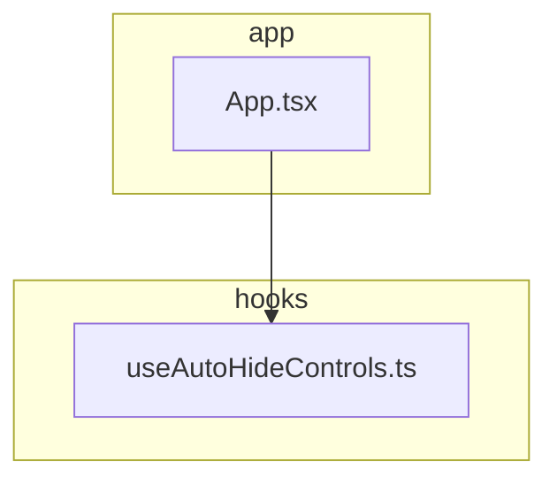
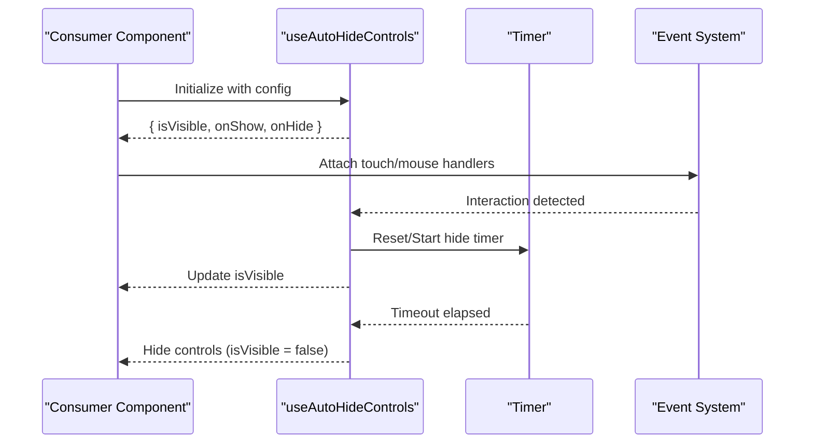
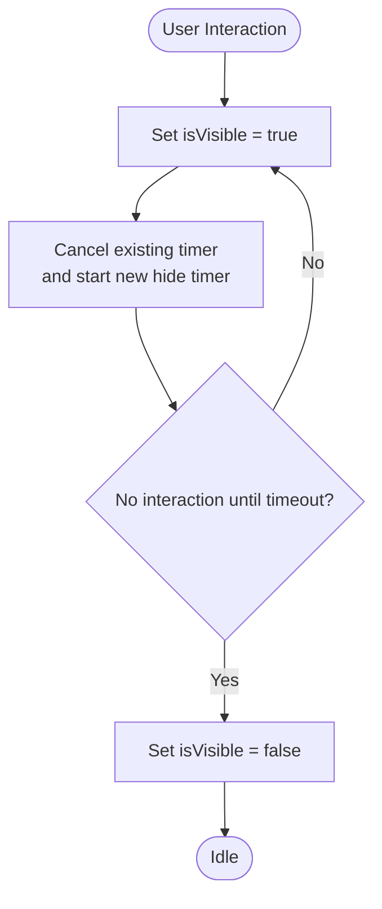
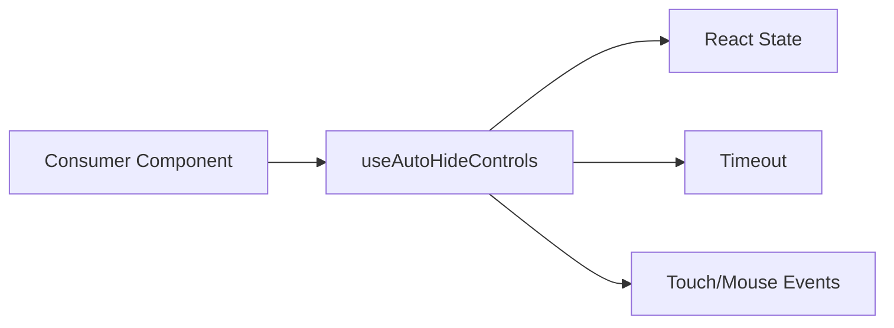

# useAutoHideControls Hook

<cite>
**Referenced Files in This Document**
- [useAutoHideControls.ts](file://hooks/useAutoHideControls.ts)
- [App.tsx](file://App.tsx)
- [README.md](file://README.md)
</cite>

## Table of Contents
1. [Introduction](#introduction)
2. [Project Structure](#project-structure)
3. [Core Components](#core-components)
4. [Architecture Overview](#architecture-overview)
5. [Detailed Component Analysis](#detailed-component-analysis)
6. [Dependency Analysis](#dependency-analysis)
7. [Performance Considerations](#performance-considerations)
8. [Troubleshooting Guide](#troubleshooting-guide)
9. [Conclusion](#conclusion)

## Introduction
This document explains the useAutoHideControls hook, which automatically hides and shows video player controls based on user interaction patterns. It covers the hook’s API (parameters, return values, state management), configuration options for hide delay and show triggers, and common implementation patterns including touch event handling and timeout mechanisms. It also provides troubleshooting tips to ensure smooth control transitions.

## Project Structure
The hook is implemented as a standalone TypeScript file under hooks/. Consumers typically import it into their screen or component files where the video player UI lives. The project’s root includes an App entry point that demonstrates how such hooks are used in practice.

**Diagram sources**
- [useAutoHideControls.ts](file://hooks/useAutoHideControls.ts)
- [App.tsx](file://App.tsx)

**Section sources**
- [useAutoHideControls.ts](file://hooks/useAutoHideControls.ts)
- [App.tsx](file://App.tsx)

## Core Components
- Hook purpose: Manage visibility of video player controls by tracking user interactions and applying timeouts to hide controls after inactivity.
- Typical inputs: Configuration object specifying hide delay, show triggers, and optional custom visibility logic.
- Typical outputs: A boolean indicating whether controls should be visible, and handlers to reset the auto-hide timer when the user interacts with the player.

Key responsibilities:
- Track user activity (e.g., tap, swipe, hover).
- Start or reset a timer to hide controls after a configured delay.
- Expose a visibility state and functions to immediately show or hide controls.
- Provide integration points for touch and mouse events to keep controls visible during active usage.

**Section sources**
- [useAutoHideControls.ts](file://hooks/useAutoHideControls.ts)

## Architecture Overview
At a high level, the hook encapsulates:
- State: current visibility of controls.
- Timer: a timeout mechanism to hide controls after inactivity.
- Event listeners: attach/detach handlers for touch/mouse events to trigger showing controls and resetting the timer.
- API: a set of props/state and callbacks returned to consumers.

[No diagram sources needed since this diagram shows conceptual workflow]

## Detailed Component Analysis

### Hook API
- Parameters:
  - Config object with fields such as:
    - hideDelayMs: number — milliseconds before controls are hidden after inactivity.
    - showTriggers: string[] — list of event types that should show controls (e.g., "touch", "mouse").
    - customVisibility?: (state) => boolean — optional function to override default visibility logic.
- Return values:
  - isVisible: boolean — whether controls should be shown.
  - onShow(): void — callback to show controls and reset the hide timer.
  - onHide(): void — callback to hide controls immediately.
  - onInteraction(): void — callback to call on user interactions to keep controls visible.

State management:
- Internal state tracks visibility and the active timer ID.
- Interactions clear any pending hide timer and set visibility to true.
- When no interactions occur within hideDelayMs, visibility becomes false.

Common usage pattern:
- Wrap the video player container with a handler that calls onInteraction on touch/mouse events.
- Render controls conditionally based on isVisible.

**Section sources**
- [useAutoHideControls.ts](file://hooks/useAutoHideControls.ts)

### Implementation Patterns

#### Touch Event Handling
- Attach touchstart/touchmove handlers to the player container.
- Each interaction invokes onInteraction to refresh the visibility state and restart the hide timer.
- Ensure passive listeners where appropriate to avoid blocking scrolling.

#### Mouse and Keyboard Triggers
- For desktop, handle mouseover/mousemove and keydown events to show controls and reset the timer.
- Optionally ignore events outside the player area to prevent unintended visibility changes.

#### Timeout Mechanism
- Use a single timer instance; cancel previous timers before starting new ones.
- On hideDelayMs expiration, set visibility to false.

**Diagram sources**
- [useAutoHideControls.ts](file://hooks/useAutoHideControls.ts)

**Section sources**
- [useAutoHideControls.ts](file://hooks/useAutoHideControls.ts)

### Example Usage Scenarios
- Basic auto-hiding:
  - Initialize the hook with a hide delay.
  - Pass onInteraction to the player container’s touch/mouse handlers.
  - Render controls when isVisible is true.
- Custom visibility logic:
  - Provide customVisibility to decide visibility based on playback state, fullscreen mode, or other conditions.
- Explicit show/hide:
  - Call onShow/onHide from external buttons or gestures to override automatic behavior temporarily.

[No sources needed since this section describes general usage patterns]

## Dependency Analysis
- The hook depends on React state and timing primitives.
- Consumers depend on the hook’s returned state and handlers.
- External dependencies include event systems for touch/mouse input.

**Diagram sources**
- [useAutoHideControls.ts](file://hooks/useAutoHideControls.ts)
- [App.tsx](file://App.tsx)

**Section sources**
- [useAutoHideControls.ts](file://hooks/useAutoHideControls.ts)
- [App.tsx](file://App.tsx)

## Performance Considerations
- Debounce frequent interactions if necessary to avoid excessive re-renders.
- Avoid creating new handler instances on every render; memoize callbacks where possible.
- Ensure timers are properly canceled to prevent memory leaks.
- Use passive event listeners for touch/move events to improve scroll performance.

[No sources needed since this section provides general guidance]

## Troubleshooting Guide
- Controls not hiding:
  - Verify hideDelayMs is set correctly and not overridden by continuous interactions.
  - Check that onInteraction is called on all relevant events.
- Controls flickering:
  - Ensure only one timer instance is active; cancel previous timers before starting new ones.
  - Avoid toggling visibility directly without using onShow/onHide.
- Touch events ignored:
  - Confirm event listeners are attached to the correct container and are not blocked by other overlays.
  - Use passive listeners for touchmove to maintain responsiveness.
- Custom visibility conflicts:
  - Review customVisibility logic to ensure it aligns with expected states (e.g., paused vs playing, fullscreen).

**Section sources**
- [useAutoHideControls.ts](file://hooks/useAutoHideControls.ts)

## Conclusion
The useAutoHideControls hook centralizes the logic for automatically managing video player controls visibility. By configuring hide delays, defining show triggers, and optionally providing custom visibility rules, developers can implement smooth, responsive control behaviors across touch and mouse environments. Proper event handling and timer management are essential to avoid flicker and ensure consistent UX.

[No sources needed since this section summarizes without analyzing specific files]