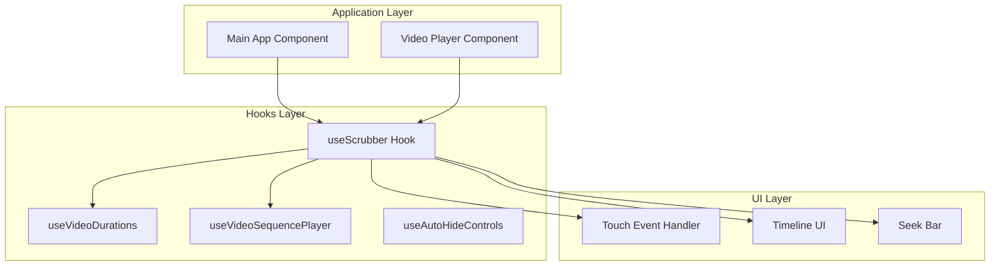
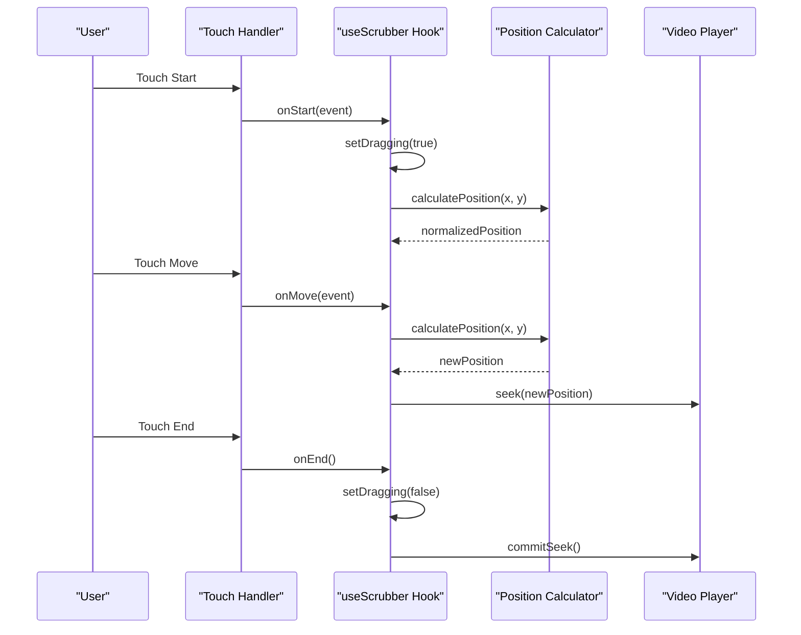
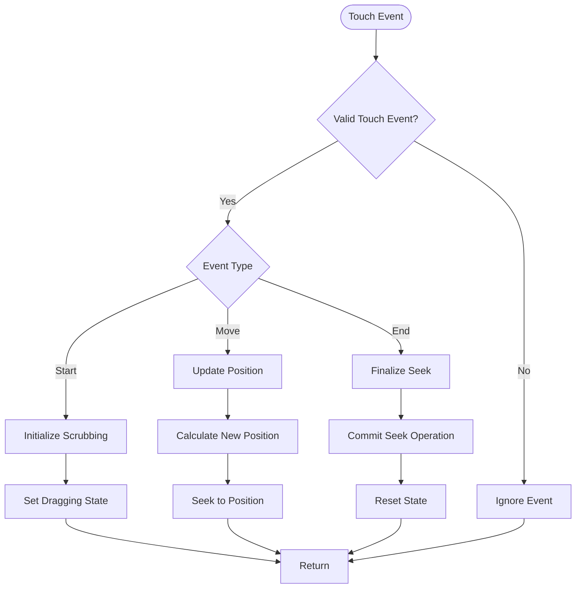
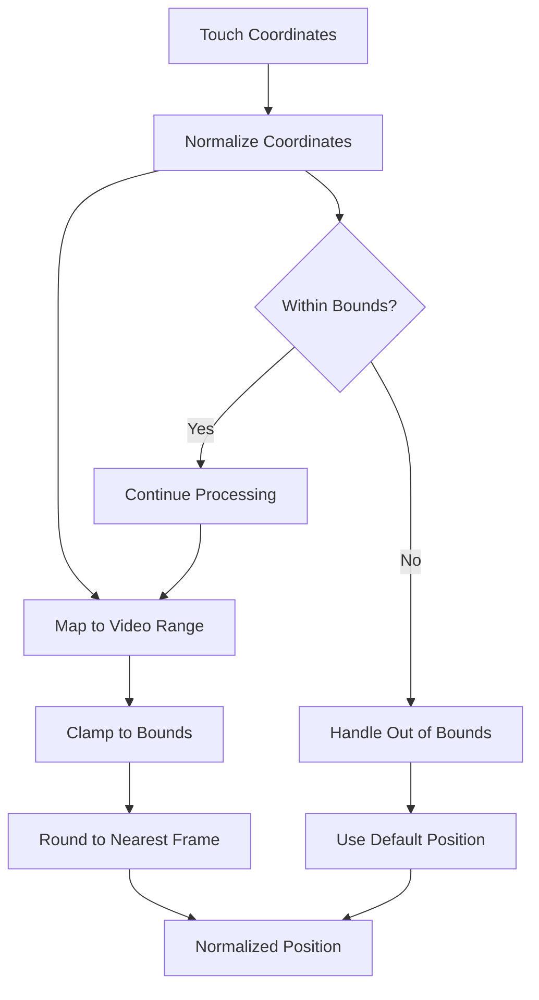
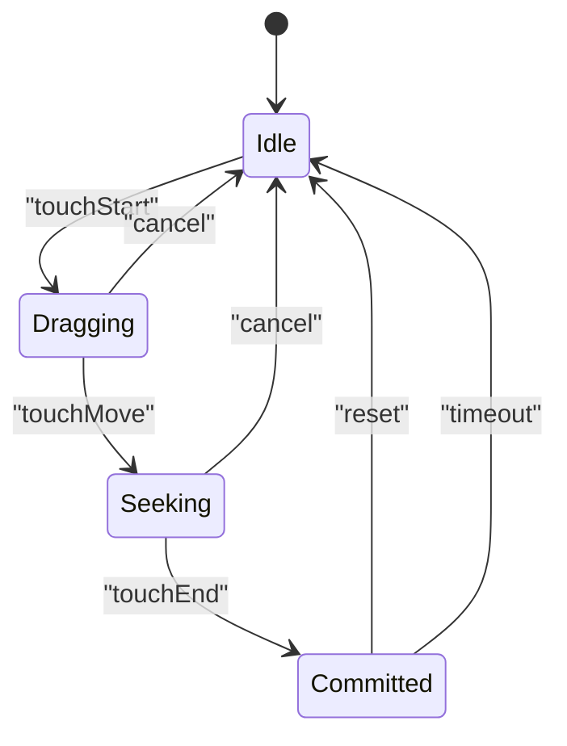
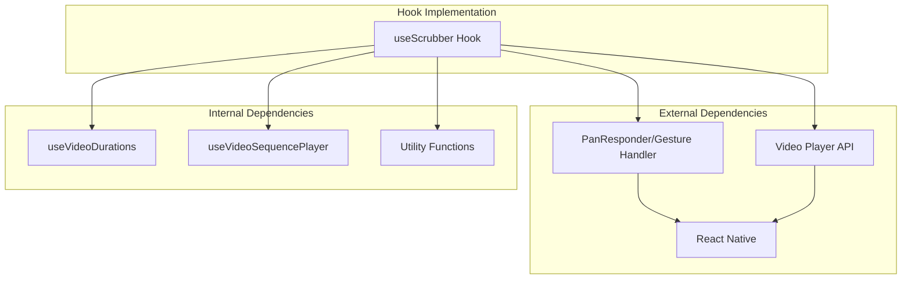

# useScrubber Hook

<cite>
**Referenced Files in This Document**
- [useScrubber.ts](file://hooks/useScrubber.ts)
- [HOOKS.md](file://docs/HOOKS.md)
- [App.tsx](file://App.tsx)
- [useVideoDurations.tsx](file://hooks/useVideoDurations.tsx)
- [useVideoSequencePlayer.ts](file://hooks/useVideoSequencePlayer.ts)
</cite>

## Table of Contents
1. [Introduction](#introduction)
2. [Project Structure](#project-structure)
3. [Core Components](#core-components)
4. [Architecture Overview](#architecture-overview)
5. [Detailed Component Analysis](#detailed-component-analysis)
6. [Dependency Analysis](#dependency-analysis)
7. [Performance Considerations](#performance-considerations)
8. [Troubleshooting Guide](#troubleshooting-guide)
9. [Conclusion](#conclusion)
10. [Appendices](#appendices)

## Introduction
The useScrubber hook provides interactive video scrubbing functionality for React Native applications. It handles touch events to enable users to seek through video content by dragging across the screen or timeline. The hook manages position tracking, drag handling, and provides callbacks for seeking operations while maintaining smooth performance during long video interactions.

## Project Structure
The useScrubber hook is part of a larger video player system that includes multiple hooks for managing video state, durations, and sequence playback. The hook integrates with the main application component and works alongside other video-related hooks to provide a complete scrubbing experience.

**Diagram sources**
- [useScrubber.ts](file://hooks/useScrubber.ts)
- [App.tsx](file://App.tsx)
- [useVideoDurations.tsx](file://hooks/useVideoDurations.tsx)

**Section sources**
- [useScrubber.ts](file://hooks/useScrubber.ts)
- [App.tsx](file://App.tsx)

## Core Components
The useScrubber hook implements several key components to handle video scrubbing:

### Touch Event Management
The hook captures and processes various touch events including:
- Touch start events to initiate scrubbing
- Touch move events to calculate seek positions
- Touch end events to finalize seeking operations
- Gesture recognition for smooth dragging experiences

### Position Calculation Engine
Implements mathematical calculations to convert touch coordinates into video time positions:
- Coordinate transformation from screen space to video timeline
- Boundary detection to prevent out-of-range seeking
- Percentage-based position mapping for consistent behavior across different screen sizes

### State Management
Maintains internal state for:
- Current scrubbing position
- Dragging status (active/inactive)
- Previous position tracking for delta calculations
- Animation state for smooth transitions

**Section sources**
- [useScrubber.ts](file://hooks/useScrubber.ts)

## Architecture Overview
The useScrubber hook follows a modular architecture pattern that separates concerns between event handling, position calculation, and state management.

**Diagram sources**
- [useScrubber.ts](file://hooks/useScrubber.ts)
- [useVideoSequencePlayer.ts](file://hooks/useVideoSequencePlayer.ts)

## Detailed Component Analysis

### Touch Event Processing
The hook implements comprehensive touch event handling with support for multi-touch scenarios and gesture recognition. It processes raw touch data and converts it into meaningful scrubbing actions.

#### Touch Event Flow

**Diagram sources**
- [useScrubber.ts](file://hooks/useScrubber.ts)

### Position Calculation Algorithm
The position calculation engine transforms touch coordinates into video timeline positions using linear interpolation and boundary detection.

#### Position Calculation Process

**Diagram sources**
- [useScrubber.ts](file://hooks/useScrubber.ts)

### State Management Pattern
The hook uses React's useState and useEffect hooks to manage internal state and side effects efficiently.

#### State Transitions

**Diagram sources**
- [useScrubber.ts](file://hooks/useScrubber.ts)

**Section sources**
- [useScrubber.ts](file://hooks/useScrubber.ts)

## Dependency Analysis
The useScrubber hook has specific dependencies on React Native APIs and video player interfaces.

**Diagram sources**
- [useScrubber.ts](file://hooks/useScrubber.ts)
- [useVideoDurations.tsx](file://hooks/useVideoDurations.tsx)
- [useVideoSequencePlayer.ts](file://hooks/useVideoSequencePlayer.ts)

**Section sources**
- [useScrubber.ts](file://hooks/useScrubber.ts)
- [useVideoDurations.tsx](file://hooks/useVideoDurations.tsx)

## Performance Considerations
The useScrubber hook implements several optimization strategies to ensure smooth scrubbing performance:

### Memory Management
- Efficient cleanup of event listeners and timers
- Proper disposal of animation frames
- Memory leak prevention through proper unmounting

### Rendering Optimization
- Debounced updates to prevent excessive re-renders
- Memoization of calculated values
- Conditional rendering based on scrubbing state

### Touch Performance
- Optimized touch event processing
- Reduced layout recalculations
- Smooth animation frame scheduling

## Troubleshooting Guide

### Common Issues and Solutions

#### Touch Events Not Responding
- Verify touch handler registration
- Check for conflicting gesture recognizers
- Ensure proper event propagation

#### Inaccurate Position Calculation
- Validate coordinate transformation logic
- Check boundary conditions
- Verify video duration availability

#### Performance Issues During Scrubbing
- Monitor memory usage during long sessions
- Check for unnecessary re-renders
- Optimize callback frequency

**Section sources**
- [useScrubber.ts](file://hooks/useScrubber.ts)

## Conclusion
The useScrubber hook provides a robust foundation for implementing interactive video scrubbing in React Native applications. Its modular design, comprehensive touch handling, and performance optimizations make it suitable for both simple and complex video player implementations. The hook's interface allows for easy integration with various video player components while maintaining consistent user experience across different devices and screen sizes.

## Appendices

### Integration Examples

#### Basic Usage Pattern
The hook can be integrated into video player components by calling it within the component's render function and passing the necessary configuration options.

#### Advanced Configuration
For custom scrubbing behaviors, the hook supports configuration options for sensitivity, boundaries, and callback functions.

[No sources needed since this section provides general guidance]