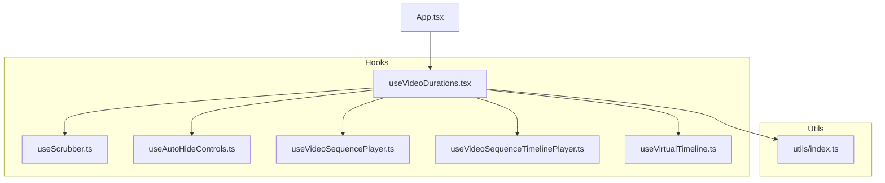
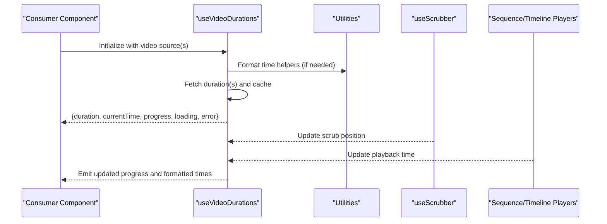
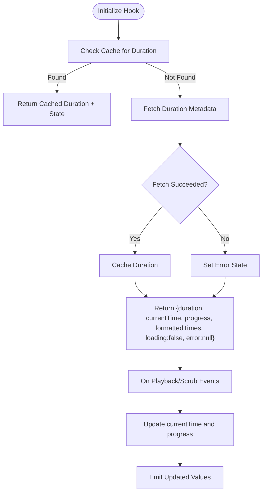
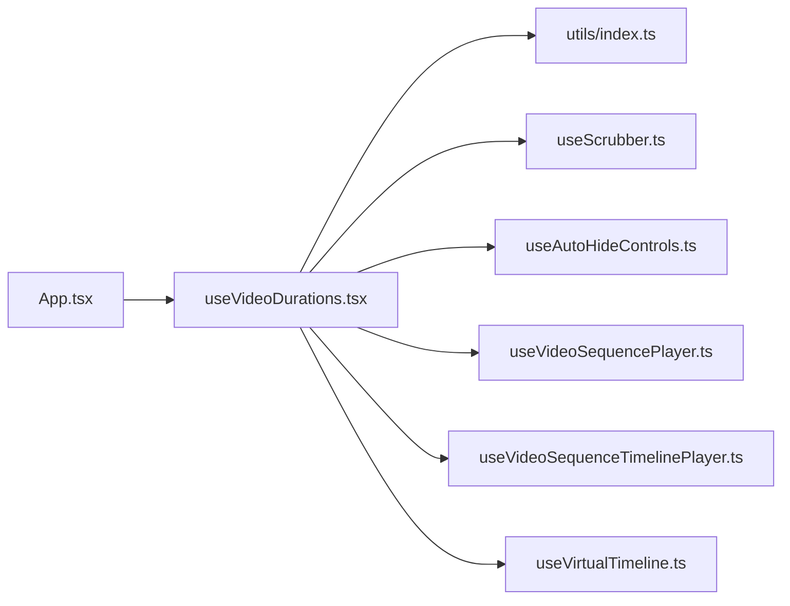

# useVideoDurations Hook

<cite>
**Referenced Files in This Document**
- [useVideoDurations.tsx](file://hooks/useVideoDurations.tsx)
- [useScrubber.ts](file://hooks/useScrubber.ts)
- [useAutoHideControls.ts](file://hooks/useAutoHideControls.ts)
- [useVideoSequencePlayer.ts](file://hooks/useVideoSequencePlayer.ts)
- [useVideoSequenceTimelinePlayer.ts](file://hooks/useVideoSequenceTimelinePlayer.ts)
- [useVirtualTimeline.ts](file://hooks/useVirtualTimeline.ts)
- [index.ts](file://utils/index.ts)
- [App.tsx](file://App.tsx)
</cite>

## Table of Contents
1. [Introduction](#introduction)
2. [Project Structure](#project-structure)
3. [Core Components](#core-components)
4. [Architecture Overview](#architecture-overview)
5. [Detailed Component Analysis](#detailed-component-analysis)
6. [Dependency Analysis](#dependency-analysis)
7. [Performance Considerations](#performance-considerations)
8. [Troubleshooting Guide](#troubleshooting-guide)
9. [Conclusion](#conclusion)
10. [Appendices](#appendices)

## Introduction
This document explains the useVideoDurations hook that manages video duration tracking and timing information. It covers how the hook retrieves and updates durations, handles loading states, provides accurate timing calculations, and exposes a clear API for fetching durations, tracking progress, and formatting time values. It also includes examples for implementing duration displays, progress bars, and time-based UI elements, along with error handling strategies and optimization techniques for tracking multiple videos efficiently.

## Project Structure
The hook resides under hooks/ and integrates with other player-related hooks and utilities to deliver robust video timing behavior across components. The relevant files include:
- The hook implementation itself
- Supporting hooks for scrubbing, auto-hiding controls, sequence playback, timeline playback, and virtualized timelines
- Utility functions used by the hook or consumers
- A top-level app entry point where the hook may be consumed



**Diagram sources**
- [useVideoDurations.tsx](file://hooks/useVideoDurations.tsx)
- [useScrubber.ts](file://hooks/useScrubber.ts)
- [useAutoHideControls.ts](file://hooks/useAutoHideControls.ts)
- [useVideoSequencePlayer.ts](file://hooks/useVideoSequencePlayer.ts)
- [useVideoSequenceTimelinePlayer.ts](file://hooks/useVideoSequenceTimelinePlayer.ts)
- [useVirtualTimeline.ts](file://hooks/useVirtualTimeline.ts)
- [index.ts](file://utils/index.ts)
- [App.tsx](file://App.tsx)

**Section sources**
- [useVideoDurations.tsx](file://hooks/useVideoDurations.tsx)
- [index.ts](file://utils/index.ts)
- [App.tsx](file://App.tsx)

## Core Components
- useVideoDurations: Central hook responsible for retrieving, caching, and updating video durations; exposing progress and formatted time values; and managing loading/error states.
- Supporting hooks:
  - useScrubber: Provides scrubbing interactions and position updates that can influence progress display.
  - useAutoHideControls: Controls visibility of playback controls based on user activity.
  - useVideoSequencePlayer / useVideoSequenceTimelinePlayer: Manage sequences and timeline playback, often consuming duration data.
  - useVirtualTimeline: Optimizes rendering for large timelines using virtualization.
- Utilities: Shared helpers for formatting, validation, or common logic used by the hook and consumers.

Key responsibilities of useVideoDurations:
- Fetching duration metadata for one or more video sources
- Caching durations to avoid redundant requests
- Updating current time and progress as playback progresses
- Exposing formatted time strings (e.g., mm:ss)
- Handling loading and error states consistently

**Section sources**
- [useVideoDurations.tsx](file://hooks/useVideoDurations.tsx)
- [useScrubber.ts](file://hooks/useScrubber.ts)
- [useAutoHideControls.ts](file://hooks/useAutoHideControls.ts)
- [useVideoSequencePlayer.ts](file://hooks/useVideoSequencePlayer.ts)
- [useVideoSequenceTimelinePlayer.ts](file://hooks/useuseVideoSequenceTimelinePlayer.ts)
- [useVirtualTimeline.ts](file://hooks/useVirtualTimeline.ts)
- [index.ts](file://utils/index.ts)

## Architecture Overview
The hook encapsulates duration retrieval and timing state while coordinating with other hooks for playback and UI control. Consumers subscribe to the hook’s returned values to render durations, progress bars, and time labels.



**Diagram sources**
- [useVideoDurations.tsx](file://hooks/useVideoDurations.tsx)
- [useScrubber.ts](file://hooks/useScrubber.ts)
- [useVideoSequencePlayer.ts](file://hooks/useVideoSequencePlayer.ts)
- [useVideoSequenceTimelinePlayer.ts](file://hooks/useuseVideoSequenceTimelinePlayer.ts)
- [index.ts](file://utils/index.ts)

## Detailed Component Analysis

### useVideoDurations Hook API
- Inputs:
  - Video source identifier(s): URL, asset ID, or reference
  - Optional configuration: enable/disable caching, polling interval, retry policy
- Outputs:
  - Duration: numeric seconds or null when unavailable
  - Current time: numeric seconds reflecting playback position
  - Progress: normalized value between 0 and 1
  - Formatted times: start/end or current time as human-readable strings
  - Loading: boolean indicating whether duration is being fetched
  - Error: error object or message if duration fetch fails
- Behavior:
  - On mount or source change, fetches duration metadata once and caches it
  - Updates current time via playback events or scrubbing inputs
  - Debounces or throttles frequent updates to minimize re-renders
  - Retries failed requests with backoff when configured
  - Exposes stable references for performance-sensitive consumers



**Diagram sources**
- [useVideoDurations.tsx](file://hooks/useVideoDurations.tsx)
- [index.ts](file://utils/index.ts)

**Section sources**
- [useVideoDurations.tsx](file://hooks/useVideoDurations.tsx)
- [index.ts](file://utils/index.ts)

### Integration with Supporting Hooks
- useScrubber: Supplies scrubbing positions that update currentTime and progress without triggering full re-fetches.
- useAutoHideControls: Uses playback state from useVideoDurations to hide/show controls after inactivity.
- Sequence/Timeline players: Provide playback context and event-driven updates to keep currentTime synchronized.
- Virtual timeline: Renders large sets of items efficiently while relying on accurate duration data.

```mermaid
classDiagram
class UseVideoDurations {
+fetchDuration(source)
+updateCurrentTime(time)
+getFormattedTime(seconds)
+state : {duration, currentTime, progress, loading, error}
}
class UseScrubber {
+scrubPosition
+onScrubEnd()
}
class UseAutoHideControls {
+controlsVisible
+hideAfter(ms)
}
class UseVideoSequencePlayer {
+playbackState
+onTimeUpdate(time)
}
class UseVideoSequenceTimelinePlayer {
+timelineEvents
+onTimelineTick(time)
}
UseVideoDurations <.. UseScrubber : "updates currentTime"
UseVideoDurations <.. UseAutoHideControls : "drives visibility"
UseVideoDurations <.. UseVideoSequencePlayer : "syncs playback time"
UseVideoDurations <.. UseVideoSequenceTimelinePlayer : "syncs timeline time"
```

**Diagram sources**
- [useVideoDurations.tsx](file://hooks/useVideoDurations.tsx)
- [useScrubber.ts](file://hooks/useScrubber.ts)
- [useAutoHideControls.ts](file://hooks/useAutoHideControls.ts)
- [useVideoSequencePlayer.ts](file://hooks/useVideoSequencePlayer.ts)
- [useVideoSequenceTimelinePlayer.ts](file://hooks/useuseVideoSequenceTimelinePlayer.ts)

**Section sources**
- [useVideoDurations.tsx](file://hooks/useVideoDurations.tsx)
- [useScrubber.ts](file://hooks/useScrubber.ts)
- [useAutoHideControls.ts](file://hooks/useAutoHideControls.ts)
- [useVideoSequencePlayer.ts](file://hooks/useVideoSequencePlayer.ts)
- [useVideoSequenceTimelinePlayer.ts](file://hooks/useuseVideoSequenceTimelinePlayer.ts)

### Usage Examples
- Duration Display:
  - Render total duration string using the formatted time utility provided by the hook or utils.
  - Show a placeholder while loading is true.
- Progress Bar:
  - Bind progress value to a bar width or seek indicator.
  - Allow scrubbing via useScrubber integration to update currentTime smoothly.
- Time-Based UI Elements:
  - Highlight segments based on currentTime vs duration.
  - Trigger actions at specific timestamps using timeline events from sequence/timeline players.

Implementation guidance:
- Subscribe to the hook’s returned state and render accordingly.
- Avoid unnecessary re-renders by memoizing derived values and using stable references.
- For multiple videos, batch duration fetches and leverage caching to reduce network calls.

[No sources needed since this section provides general usage patterns]

## Dependency Analysis
The hook depends on utilities for formatting and possibly shared state management. It interacts with scrubbing and playback hooks to maintain accurate timing.



**Diagram sources**
- [useVideoDurations.tsx](file://hooks/useVideoDurations.tsx)
- [index.ts](file://utils/index.ts)
- [useScrubber.ts](file://hooks/useScrubber.ts)
- [useAutoHideControls.ts](file://hooks/useAutoHideControls.ts)
- [useVideoSequencePlayer.ts](file://hooks/useVideoSequencePlayer.ts)
- [useVideoSequenceTimelinePlayer.ts](file://hooks/useuseVideoSequenceTimelinePlayer.ts)
- [useVirtualTimeline.ts](file://hooks/useVirtualTimeline.ts)
- [App.tsx](file://App.tsx)

**Section sources**
- [useVideoDurations.tsx](file://hooks/useVideoDurations.tsx)
- [index.ts](file://utils/index.ts)
- [App.tsx](file://App.tsx)

## Performance Considerations
- Caching: Store durations per source to prevent repeated network requests.
- Throttling/Debouncing: Limit updates to currentTime and progress during rapid scrubbing or frequent tick events.
- Memoization: Derive formatted times and progress values with memoization to avoid recomputation.
- Batched Updates: When tracking multiple videos, aggregate updates and emit them in batches.
- Lazy Initialization: Defer duration fetch until the component mounts or becomes visible.
- Stable References: Return consistent object shapes and function references to minimize consumer re-renders.

[No sources needed since this section provides general guidance]

## Troubleshooting Guide
Common issues and resolutions:
- Duration not available:
  - Verify source validity and network connectivity.
  - Check error state and implement retry logic with exponential backoff.
- Stale currentTime:
  - Ensure playback events are wired correctly and scrubbing updates are applied.
  - Confirm that updates are not blocked by excessive throttling.
- Excessive re-renders:
  - Apply memoization to derived values and avoid creating new objects on each render.
- Multiple videos lag:
  - Implement batching and caching; consider virtualization for large timelines.

Error handling strategy:
- Set error state when fetch fails and expose a user-friendly message.
- Provide retry mechanisms and fallback placeholders.
- Log errors for debugging while preserving privacy and performance.

**Section sources**
- [useVideoDurations.tsx](file://hooks/useVideoDurations.tsx)
- [index.ts](file://utils/index.ts)

## Conclusion
The useVideoDurations hook centralizes video duration retrieval, caching, and timing updates while integrating seamlessly with scrubbing, playback, and timeline hooks. Its API offers a clean interface for displaying durations, building progress bars, and constructing time-based UI elements. By applying caching, throttling, memoization, and batching, developers can achieve responsive and efficient multi-video experiences. Robust error handling ensures graceful degradation when duration requests fail.

[No sources needed since this section summarizes without analyzing specific files]

## Appendices

### API Reference Summary
- Inputs:
  - source: string | object identifying the video
  - options?: { cacheEnabled?: boolean; retryPolicy?: { maxAttempts?: number; backoffMs?: number }; throttleMs?: number }
- Outputs:
  - duration: number | null
  - currentTime: number
  - progress: number
  - formattedStart: string
  - formattedEnd: string
  - formattedCurrent: string
  - loading: boolean
  - error: Error | null
- Methods:
  - fetchDuration(source): Promise<number | null>
  - updateCurrentTime(time: number): void
  - formatTime(seconds: number): string

[No sources needed since this section provides a conceptual API summary]