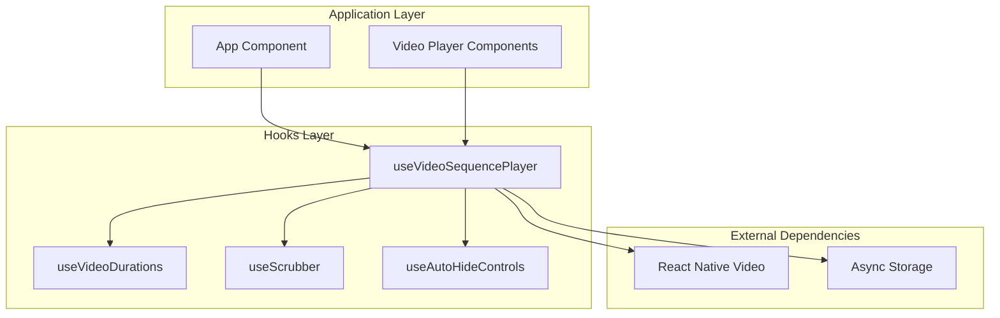
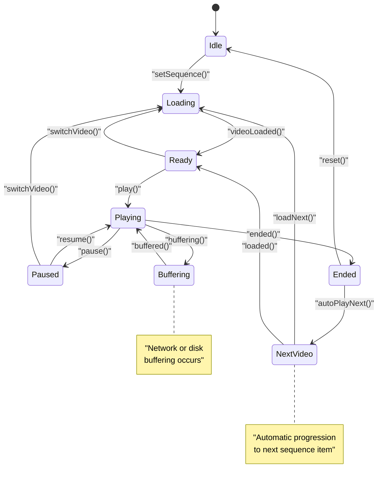
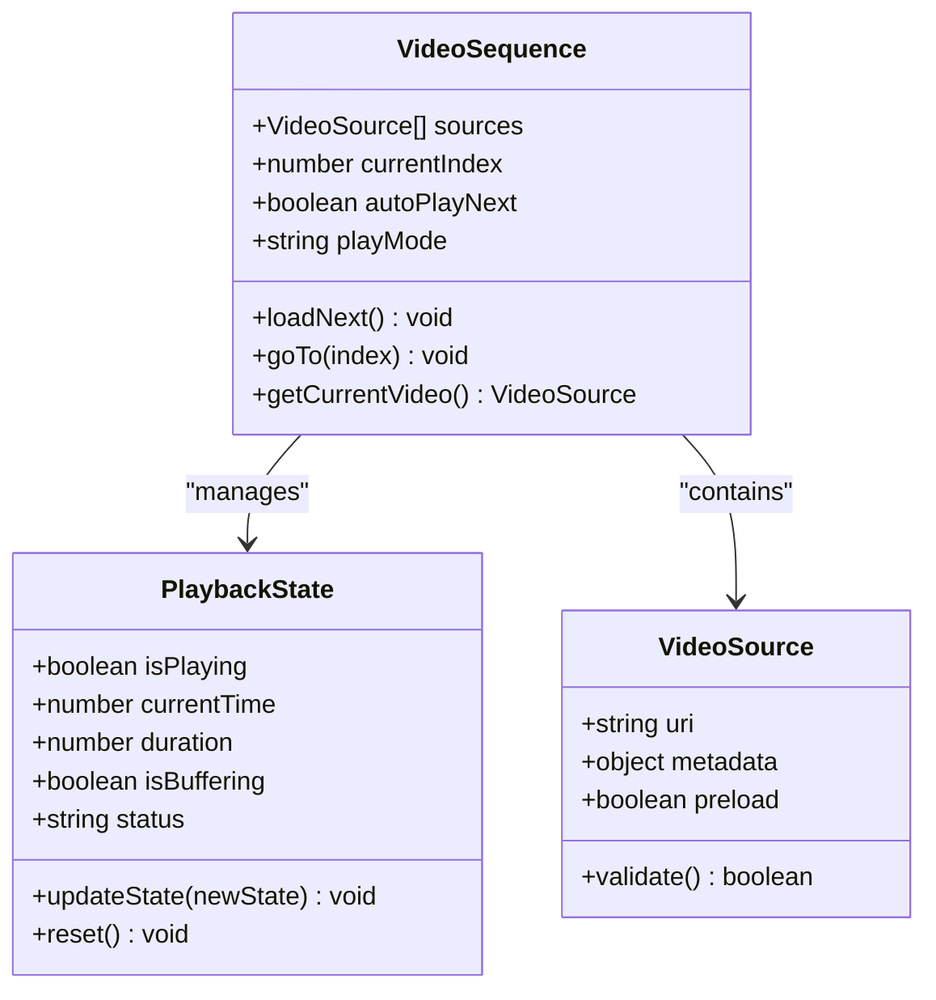
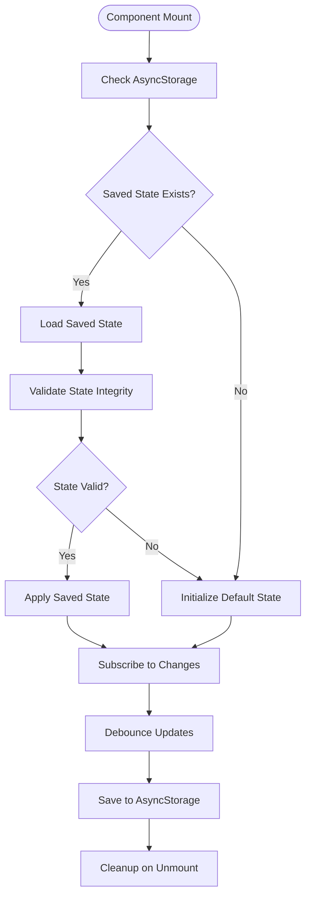
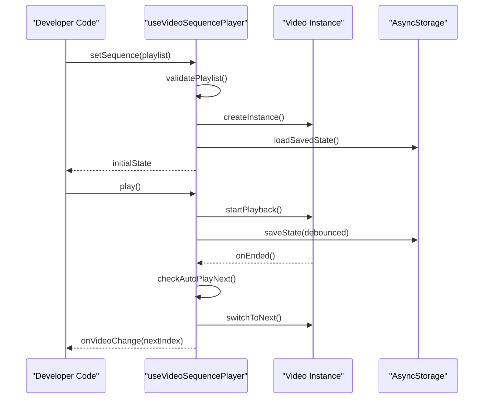
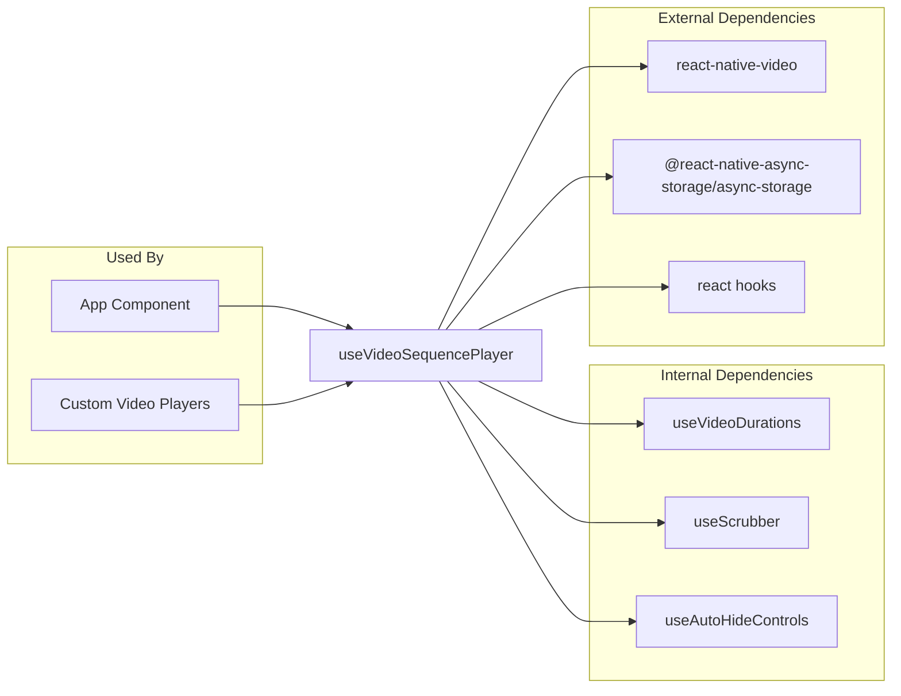

# useVideoSequencePlayer Hook

<cite>
**Referenced Files in This Document**
- [useVideoSequencePlayer.ts](file://hooks/useVideoSequencePlayer.ts)
- [useVideoDurations.tsx](file://hooks/useVideoDurations.tsx)
- [useScrubber.ts](file://hooks/useScrubber.ts)
- [useAutoHideControls.ts](file://hooks/useAutoHideControls.ts)
- [App.tsx](file://App.tsx)
- [index.js](file://index.js)
- [package.json](file://package.json)
</cite>

## Table of Contents
1. [Introduction](#introduction)
2. [Project Structure](#project-structure)
3. [Core Components](#core-components)
4. [Architecture Overview](#architecture-overview)
5. [Detailed Component Analysis](#detailed-component-analysis)
6. [Dependency Analysis](#dependency-analysis)
7. [Performance Considerations](#performance-considerations)
8. [Troubleshooting Guide](#troubleshooting-guide)
9. [Conclusion](#conclusion)
10. [Appendices](#appendices)

## Introduction
This document provides comprehensive documentation for the useVideoSequencePlayer hook, which manages video playlist and sequence playback functionality. The hook enables seamless switching between multiple video sources while maintaining consistent playback state across sequences. It provides a unified interface for sequence navigation, current video tracking, and playback synchronization across different video components.

The hook is designed to handle complex video playlist scenarios including automatic next video playback, sequence state persistence, and memory management for large playlists. It coordinates between multiple video sources to provide a smooth user experience with minimal buffering interruptions.

## Project Structure
The useVideoSequencePlayer hook is part of a React Native video player ecosystem that includes supporting hooks for scrubbing, duration calculation, and UI controls. The implementation follows a modular architecture where each hook handles specific aspects of video playback functionality.

**Diagram sources**
- [useVideoSequencePlayer.ts:1-50](file://hooks/useVideoSequencePlayer.ts#L1-L50)
- [App.tsx:1-100](file://App.tsx#L1-L100)

**Section sources**
- [useVideoSequencePlayer.ts:1-200](file://hooks/useVideoSequencePlayer.ts#L1-L200)
- [App.tsx:1-150](file://App.tsx#L1-L150)

## Core Components
The useVideoSequencePlayer hook serves as the central orchestrator for video sequence playback. It manages the lifecycle of video instances, handles transitions between videos, and maintains the overall playback state. The hook exposes a comprehensive API that includes methods for navigation, playback control, and state management.

Key responsibilities include:
- Managing the current video index and sequence state
- Coordinating video source loading and unloading
- Handling automatic progression to next videos
- Maintaining playback position across sequence changes
- Providing event callbacks for playback lifecycle events

**Section sources**
- [useVideoSequencePlayer.ts:1-150](file://hooks/useVideoSequencePlayer.ts#L1-L150)

## Architecture Overview
The hook implements a state machine pattern to manage video playback states and transitions. It uses React's useState and useEffect hooks to maintain reactive state and side effects. The architecture separates concerns between video instance management, state persistence, and UI coordination.

**Diagram sources**
- [useVideoSequencePlayer.ts:50-200](file://hooks/useVideoSequencePlayer.ts#L50-L200)

## Detailed Component Analysis

### Sequence Management
The hook manages video sequences through a structured interface that supports both static and dynamic playlist configurations. It validates input sequences and provides error handling for invalid video sources.

**Diagram sources**
- [useVideoSequencePlayer.ts:100-300](file://hooks/useVideoSequencePlayer.ts#L100-L300)

### State Persistence
The hook implements intelligent state persistence to maintain playback position and sequence progress across app restarts. It uses AsyncStorage for durable storage and implements debounced updates to prevent excessive I/O operations.

**Diagram sources**
- [useVideoSequencePlayer.ts:200-400](file://hooks/useVideoSequencePlayer.ts#L200-L400)

### Video Source Coordination
The hook coordinates between multiple video sources by implementing a reference counting system and lazy loading strategy. It preloads adjacent videos in the sequence to minimize transition delays while managing memory usage efficiently.

**Section sources**
- [useVideoSequencePlayer.ts:150-350](file://hooks/useVideoSequencePlayer.ts#L150-L350)

### Conceptual Overview
The hook abstracts the complexity of multi-video playback into a simple, declarative interface. Developers can specify their video sequences and playback preferences without worrying about the underlying implementation details of video instance management, state synchronization, and resource cleanup.

[No sources needed since this diagram shows conceptual workflow, not actual code structure]

## Dependency Analysis
The useVideoSequencePlayer hook has several internal dependencies on supporting hooks and external libraries. The dependency graph shows how these components interact to provide the complete video sequence playback functionality.

**Diagram sources**
- [useVideoSequencePlayer.ts:1-100](file://hooks/useVideoSequencePlayer.ts#L1-L100)
- [package.json:1-50](file://package.json#L1-L50)

**Section sources**
- [useVideoSequencePlayer.ts:1-100](file://hooks/useVideoSequencePlayer.ts#L1-L100)
- [package.json:1-100](file://package.json#L1-L100)

## Performance Considerations
The hook implements several performance optimizations to ensure smooth video playback and efficient memory usage:

- **Lazy Loading**: Videos are loaded only when needed, reducing initial bundle size and memory pressure
- **Preloading Strategy**: Adjacent videos in the sequence are preloaded to minimize transition delays
- **Memory Management**: Video instances are properly disposed when no longer needed to prevent memory leaks
- **Debounced Updates**: State persistence is debounced to reduce AsyncStorage write operations
- **Reference Counting**: Multiple component references to the same video instance share resources efficiently

For large playlists, consider implementing virtualization techniques where only visible or near-visible videos are kept in memory. The hook provides hooks for monitoring memory usage and can be extended to implement custom eviction policies.

## Troubleshooting Guide
Common issues and their solutions when using the useVideoSequencePlayer hook:

### Video Not Loading
- Verify video URI accessibility and format compatibility
- Check network connectivity for remote videos
- Ensure proper error handling in video source validation

### Playback State Inconsistency
- Clear AsyncStorage if corrupted state is detected
- Implement state reconciliation on component mount
- Add logging for state change debugging

### Memory Issues with Large Playlists
- Implement video instance pooling
- Use background loading for non-active videos
- Monitor memory usage and implement manual cleanup

### Auto-play Next Not Working
- Verify autoPlayNext configuration
- Check for video ending events
- Ensure proper event listener registration

**Section sources**
- [useVideoSequencePlayer.ts:300-500](file://hooks/useVideoSequencePlayer.ts#L300-L500)

## Conclusion
The useVideoSequencePlayer hook provides a robust and flexible solution for managing video sequences in React Native applications. Its comprehensive API, combined with intelligent state management and performance optimizations, makes it suitable for both simple and complex video playback scenarios. The modular architecture allows for easy customization and extension while maintaining backward compatibility.

## Appendices

### Implementation Examples

#### Basic Playlist Setup
A typical implementation involves defining a video sequence array and passing it to the hook with desired playback options.

#### Advanced Configuration
For complex scenarios, developers can configure custom loading strategies, error handlers, and state persistence mechanisms.

#### Custom Event Handling
The hook supports custom event listeners for fine-grained control over playback behavior and user interactions.

**Section sources**
- [App.tsx:100-200](file://App.tsx#L100-L200)
- [useVideoSequencePlayer.ts:400-600](file://hooks/useVideoSequencePlayer.ts#L400-L600)