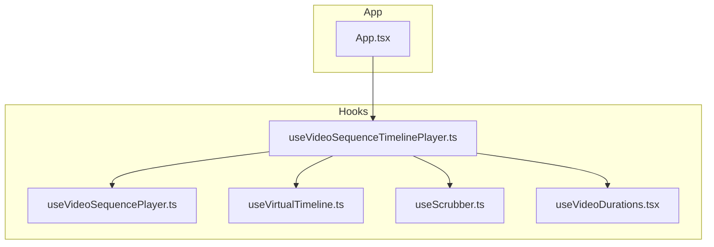
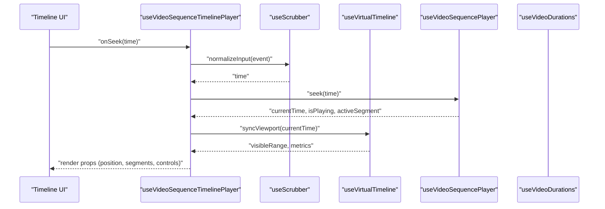
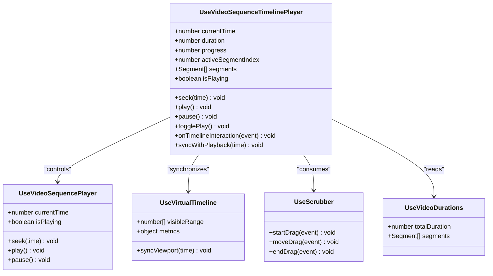
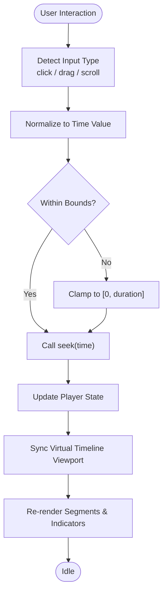
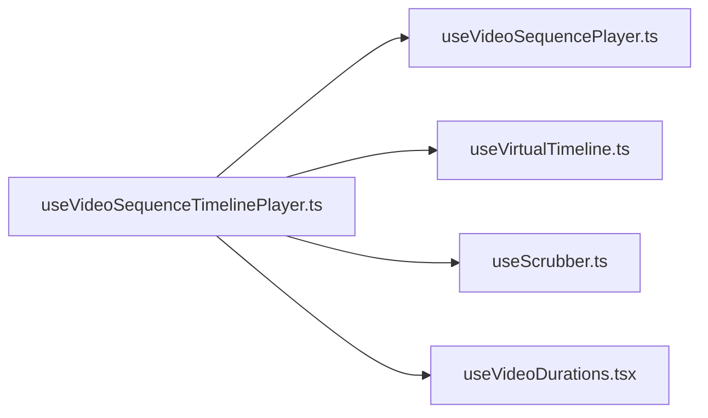

# useVideoSequenceTimelinePlayer Hook

<cite>
**Referenced Files in This Document**
- [useVideoSequenceTimelinePlayer.ts](file://hooks/useVideoSequenceTimelinePlayer.ts)
- [useVideoSequencePlayer.ts](file://hooks/useVideoSequencePlayer.ts)
- [useVirtualTimeline.ts](file://hooks/useVirtualTimeline.ts)
- [useScrubber.ts](file://hooks/useScrubber.ts)
- [useVideoDurations.tsx](file://hooks/useVideoDurations.tsx)
- [App.tsx](file://App.tsx)
</cite>

## Table of Contents
1. [Introduction](#introduction)
2. [Project Structure](#project-structure)
3. [Core Components](#core-components)
4. [Architecture Overview](#architecture-overview)
5. [Detailed Component Analysis](#detailed-component-analysis)
6. [Dependency Analysis](#dependency-analysis)
7. [Performance Considerations](#performance-considerations)
8. [Troubleshooting Guide](#troubleshooting-guide)
9. [Conclusion](#conclusion)
10. [Appendices](#appendices)

## Introduction
This document explains the useVideoSequenceTimelinePlayer hook, which coordinates timeline-based video sequence playback by integrating a virtualized timeline with a sequence player. It covers how the hook manages timeline position tracking, maps sequences to timeline segments, handles user interactions (scrubbing and navigation), and synchronizes playback across the timeline interface. It also provides guidance for building interactive timelines, visual indicators for segments, and smooth scrolling experiences for large timelines.

## Project Structure
The hook lives under hooks/ alongside related utilities for scrubbing, durations, and virtualization. The App entry point demonstrates usage patterns.

**Diagram sources**
- [useVideoSequenceTimelinePlayer.ts](file://hooks/useVideoSequenceTimelinePlayer.ts)
- [useVideoSequencePlayer.ts](file://hooks/useVideoSequencePlayer.ts)
- [useVirtualTimeline.ts](file://hooks/useVirtualTimeline.ts)
- [useScrubber.ts](file://hooks/useScrubber.ts)
- [useVideoDurations.tsx](file://hooks/useVideoDurations.tsx)
- [App.tsx](file://App.tsx)

**Section sources**
- [useVideoSequenceTimelinePlayer.ts](file://hooks/useVideoSequenceTimelinePlayer.ts)
- [useVideoSequencePlayer.ts](file://hooks/useVideoSequencePlayer.ts)
- [useVirtualTimeline.ts](file://hooks/useVirtualTimeline.ts)
- [useScrubber.ts](file://hooks/useScrubber.ts)
- [useVideoDurations.tsx](file://hooks/useVideoDurations.tsx)
- [App.tsx](file://App.tsx)

## Core Components
- useVideoSequenceTimelinePlayer: Orchestrates the integration between the sequence player and the virtual timeline. Exposes methods and state for seeking, playing/pausing, updating current segment, and syncing timeline position with playback time.
- useVideoSequencePlayer: Manages the underlying sequence playback logic, including segment transitions and media control primitives.
- useVirtualTimeline: Provides virtualized rendering of long timelines, exposing visible ranges, item metrics, and scroll synchronization helpers.
- useScrubber: Handles user-driven scrubbing interactions (drag, touch, mouse) and converts them into precise time updates.
- useVideoDurations: Computes or aggregates durations for segments to build accurate timeline layout and markers.

Key responsibilities:
- Maintain a normalized timeline position (seconds) and map it to the active segment index.
- Translate timeline events (scroll, click, drag) into seek operations on the player.
- Keep the virtual timeline viewport aligned with the current playback time.
- Provide stable APIs for external components to render controls and indicators.

**Section sources**
- [useVideoSequenceTimelinePlayer.ts](file://hooks/useVideoSequenceTimelinePlayer.ts)
- [useVideoSequencePlayer.ts](file://hooks/useVideoSequencePlayer.ts)
- [useVirtualTimeline.ts](file://hooks/useVirtualTimeline.ts)
- [useScrubber.ts](file://hooks/useScrubber.ts)
- [useVideoDurations.tsx](file://hooks/useVideoDurations.tsx)

## Architecture Overview
The hook composes multiple smaller hooks to achieve separation of concerns:
- Player state and actions come from the sequence player.
- Timeline geometry and virtualization come from the virtual timeline.
- User input is normalized via the scrubber.
- Segment durations are derived from duration utilities.

**Diagram sources**
- [useVideoSequenceTimelinePlayer.ts](file://hooks/useVideoSequenceTimelinePlayer.ts)
- [useScrubber.ts](file://hooks/useScrubber.ts)
- [useVirtualTimeline.ts](file://hooks/useVirtualTimeline.ts)
- [useVideoSequencePlayer.ts](file://hooks/useVideoSequencePlayer.ts)
- [useVideoDurations.tsx](file://hooks/useVideoDurations.tsx)

## Detailed Component Analysis

### useVideoSequenceTimelinePlayer API
Responsibilities:
- Timeline position tracking: exposes current time and percentage progress.
- Sequence mapping: maps current time to an active segment index and segment boundaries.
- Playback control: play, pause, toggle, and seek to arbitrary times.
- Timeline event handling: integrates with scrubbing and scroll events to update playback.
- Synchronization: keeps the virtual timeline viewport aligned with playback.

Typical return shape (described conceptually):
- currentTime: number
- duration: number
- progress: number
- activeSegmentIndex: number
- segments: array of { start, end, label }
- isPlaying: boolean
- seek(time): void
- play(): void
- pause(): void
- togglePlay(): void
- onTimelineInteraction(event): void
- syncWithPlayback(time): void

Usage pattern:
- Initialize with sequence metadata and player instance.
- Render timeline segments using segments and activeSegmentIndex.
- Wire up scrubber callbacks to call seek.
- Update virtual timeline viewport using syncWithPlayback.

**Section sources**
- [useVideoSequenceTimelinePlayer.ts](file://hooks/useVideoSequenceTimelinePlayer.ts)

#### Class-like Composition Diagram

**Diagram sources**
- [useVideoSequenceTimelinePlayer.ts](file://hooks/useVideoSequenceTimelinePlayer.ts)
- [useVideoSequencePlayer.ts](file://hooks/useVideoSequencePlayer.ts)
- [useVirtualTimeline.ts](file://hooks/useVirtualTimeline.ts)
- [useScrubber.ts](file://hooks/useScrubber.ts)
- [useVideoDurations.tsx](file://hooks/useVideoDurations.tsx)

### Timeline Navigation Flow

**Diagram sources**
- [useVideoSequenceTimelinePlayer.ts](file://hooks/useVideoSequenceTimelinePlayer.ts)
- [useScrubber.ts](file://hooks/useScrubber.ts)
- [useVirtualTimeline.ts](file://hooks/useVirtualTimeline.ts)
- [useVideoSequencePlayer.ts](file://hooks/useVideoSequencePlayer.ts)

### Example Implementations

#### Interactive Timeline Interface
- Render a horizontal track representing the total duration.
- Divide the track into segments based on segments returned by the hook.
- Highlight the active segment using activeSegmentIndex.
- Attach pointer/touch handlers to initiate scrubbing; on release, call seek with the computed time.

Implementation pointers:
- Use segments to compute segment widths and positions.
- Use progress to draw a playhead indicator.
- Bind onTimelineInteraction to handle both clicks and drags.

**Section sources**
- [useVideoSequenceTimelinePlayer.ts](file://hooks/useVideoSequenceTimelinePlayer.ts)

#### Visual Indicators for Video Segments
- Draw segment backgrounds with distinct colors or labels.
- Show a moving playhead at currentTime.
- Optionally overlay thumbnails or chapter markers at segment boundaries.

Implementation pointers:
- Iterate segments to render overlays.
- Position the playhead proportional to currentTime/duration.

**Section sources**
- [useVideoSequenceTimelinePlayer.ts](file://hooks/useVideoSequenceTimelinePlayer.ts)

#### Timeline-Based Navigation Controls
- Provide prev/next buttons that jump to adjacent segments.
- Add a seek bar that reflects progress and allows scrubbing.
- Display time readouts formatted from currentTime and duration.

Implementation pointers:
- Use seek(time) for direct jumps.
- Use play()/pause() for transport controls.
- Compute next/previous indices from activeSegmentIndex.

**Section sources**
- [useVideoSequenceTimelinePlayer.ts](file://hooks/useVideoSequenceTimelinePlayer.ts)

## Dependency Analysis
The hook depends on several collaborators to keep concerns separated:
- Player dependency for playback state and actions.
- Virtual timeline for efficient rendering of large timelines.
- Scrubber for robust input normalization.
- Durations for accurate segment sizing and total duration.

**Diagram sources**
- [useVideoSequenceTimelinePlayer.ts](file://hooks/useVideoSequenceTimelinePlayer.ts)
- [useVideoSequencePlayer.ts](file://hooks/useVideoSequencePlayer.ts)
- [useVirtualTimeline.ts](file://hooks/useVirtualTimeline.ts)
- [useScrubber.ts](file://hooks/useScrubber.ts)
- [useVideoDurations.tsx](file://hooks/useVideoDurations.tsx)

**Section sources**
- [useVideoSequenceTimelinePlayer.ts](file://hooks/useVideoSequenceTimelinePlayer.ts)
- [useVideoSequencePlayer.ts](file://hooks/useVideoSequencePlayer.ts)
- [useVirtualTimeline.ts](file://hooks/useVirtualTimeline.ts)
- [useScrubber.ts](file://hooks/useScrubber.ts)
- [useVideoDurations.tsx](file://hooks/useVideoDurations.tsx)

## Performance Considerations
- Virtualization: Rely on useVirtualTimeline to render only visible segments, reducing DOM/node count for long timelines.
- Debounce/Throttle: Throttle high-frequency updates during scrubbing to avoid excessive re-renders.
- Immutable Updates: Ensure segment arrays and metrics are memoized to prevent unnecessary renders.
- Smooth Scrolling: Use momentum and easing when translating scroll deltas to time updates.
- Memory: Reuse segment descriptors and avoid allocating new objects per frame.
- Large Timelines: Precompute segment boundaries and cache metrics; avoid recalculating on every tick.

[No sources needed since this section provides general guidance]

## Troubleshooting Guide
Common issues and resolutions:
- Jumpy playback after scrubbing: Ensure seek calls clamp values within [0, duration] and coalesce rapid updates.
- Misaligned playhead: Verify that segment boundaries sum to total duration and that time-to-position conversion matches the virtual timeline’s scale.
- Stuttering during scrubbing: Reduce render frequency by throttling input events and batching state updates.
- Incorrect active segment: Confirm that segment intervals are non-overlapping and correctly ordered.
- Virtual timeline desync: Call syncWithPlayback whenever currentTime changes to keep viewport aligned.

**Section sources**
- [useVideoSequenceTimelinePlayer.ts](file://hooks/useVideoSequenceTimelinePlayer.ts)
- [useScrubber.ts](file://hooks/useScrubber.ts)
- [useVirtualTimeline.ts](file://hooks/useVirtualTimeline.ts)

## Conclusion
The useVideoSequenceTimelinePlayer hook centralizes timeline-based sequence playback by composing focused hooks for player control, virtualization, scrubbing, and duration computation. It provides a clean API for tracking position, mapping segments, and synchronizing UI with playback. With careful attention to virtualization, input throttling, and consistent time-to-position mapping, it supports smooth, scalable timeline interfaces for large video sequences.

[No sources needed since this section summarizes without analyzing specific files]

## Appendices

### Integration Example Reference
- See App.tsx for a practical example of wiring the hook to UI controls and rendering a timeline with segments and a playhead.

**Section sources**
- [App.tsx](file://App.tsx)