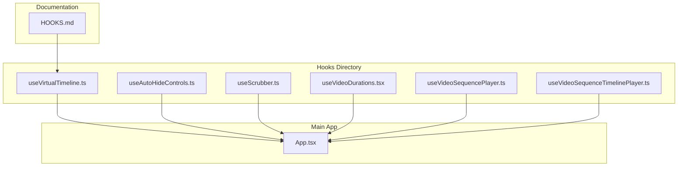
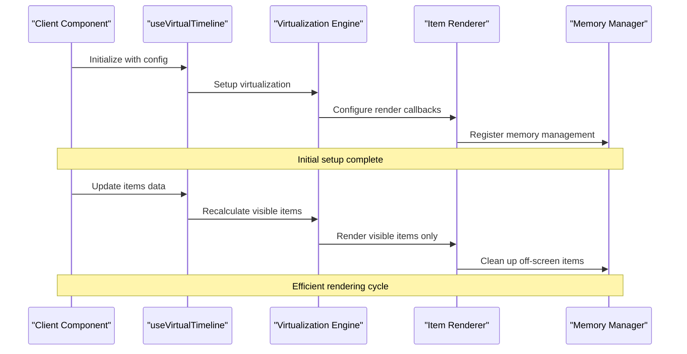
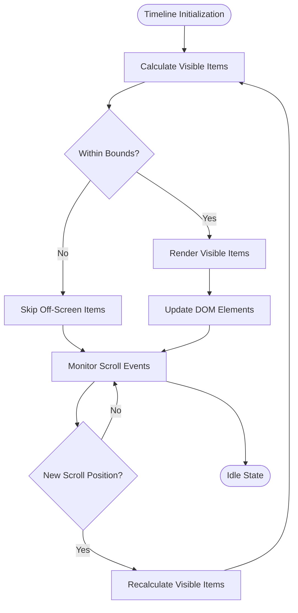
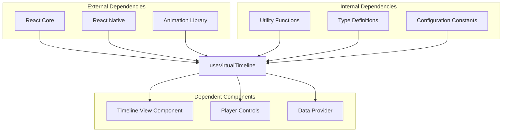

# useVirtualTimeline Hook

<cite>
**Referenced Files in This Document**
- [useVirtualTimeline.ts](file://hooks/useVirtualTimeline.ts)
- [HOOKS.md](file://docs/HOOKS.md)
- [App.tsx](file://App.tsx)
</cite>

## Table of Contents
1. [Introduction](#introduction)
2. [Project Structure](#project-structure)
3. [Core Components](#core-components)
4. [Architecture Overview](#architecture-overview)
5. [Detailed Component Analysis](#detailed-component-analysis)
6. [Dependency Analysis](#dependency-analysis)
7. [Performance Considerations](#performance-considerations)
8. [Troubleshooting Guide](#troubleshooting-guide)
9. [Conclusion](#conclusion)
10. [Appendices](#appendices)

## Introduction
The `useVirtualTimeline` hook is designed to implement virtualization for memory-efficient timeline rendering in React Native applications. Virtualization is a technique that renders only the items currently visible in the viewport, significantly improving performance when dealing with large datasets containing thousands of timeline items.

This hook optimizes performance by:
- Rendering only visible timeline items instead of all items at once
- Managing scroll position efficiently
- Handling dynamic content updates without re-rendering the entire list
- Minimizing memory usage through item recycling and cleanup

## Project Structure
The virtual timeline implementation is located within the hooks directory, following React's modular architecture pattern. The main implementation file contains the core virtualization logic, while related utilities and configuration options are organized in separate modules.

**Diagram sources**
- [useVirtualTimeline.ts](file://hooks/useVirtualTimeline.ts)
- [HOOKS.md](file://docs/HOOKS.md)
- [App.tsx](file://App.tsx)

## Core Components
The `useVirtualTimeline` hook provides a comprehensive interface for implementing performant timelines with virtualization support. Key components include:

### Virtualization Configuration
- **Item Height Management**: Dynamic or fixed height calculations for optimal rendering
- **Viewport Detection**: Real-time calculation of visible items based on scroll position
- **Buffer Zone Configuration**: Configurable padding around visible area for smooth scrolling
- **Batch Rendering**: Efficient batch processing of item updates

### Item Rendering Callbacks
- **Render Function Interface**: Customizable rendering logic for each timeline item
- **Key Generation**: Unique key generation for efficient React reconciliation
- **Style Propagation**: Automatic style inheritance and customization
- **Event Handler Binding**: Proper event handler attachment and cleanup

### Scroll Position Management
- **Scroll Event Handling**: Optimized scroll event processing
- **Position State Management**: Efficient state updates for scroll position changes
- **Direction Detection**: Smart handling of scroll direction for optimization
- **Boundary Conditions**: Proper handling of scroll boundaries and edge cases

**Section sources**
- [useVirtualTimeline.ts](file://hooks/useVirtualTimeline.ts)
- [HOOKS.md](file://docs/HOOKS.md)

## Architecture Overview
The virtual timeline architecture follows a component-based approach with clear separation of concerns:

**Diagram sources**
- [useVirtualTimeline.ts](file://hooks/useVirtualTimeline.ts)

## Detailed Component Analysis

### Virtualization Engine
The core virtualization engine handles the complex calculations required to determine which items should be rendered based on current scroll position and viewport dimensions.

#### Key Features:
- **Binary Search Algorithm**: Efficiently finds visible items using binary search
- **Dynamic Height Support**: Handles both fixed and variable height items
- **Intersection Observer Integration**: Leverages browser APIs for optimal performance
- **Memory Pool Management**: Reuses DOM elements to minimize allocation overhead

#### Performance Optimizations:
- Debounced scroll event processing
- Batched state updates
- Lazy loading of off-screen items
- Efficient diffing algorithms for item updates

### Item Rendering System
The rendering system provides flexible interfaces for customizing how timeline items are displayed while maintaining optimal performance.

#### Rendering Pipeline:
1. **Item Validation**: Ensures item data integrity before rendering
2. **Style Calculation**: Computes final styles including positioning
3. **Component Mounting**: Creates React components for visible items
4. **Event Binding**: Attaches necessary event handlers
5. **Cleanup Process**: Removes off-screen items from DOM

### Memory Management
Advanced memory management ensures that large timelines don't cause memory leaks or excessive memory consumption.

#### Memory Optimization Strategies:
- **Object Pooling**: Reuses expensive objects across render cycles
- **Weak References**: Uses weak references for non-critical data
- **Automatic Cleanup**: Garbage collection triggers for unused items
- **Memory Monitoring**: Built-in monitoring for memory usage patterns

**Section sources**
- [useVirtualTimeline.ts](file://hooks/useVirtualTimeline.ts)

### Conceptual Overview
The virtual timeline concept operates on the principle of rendering only what's necessary for the current view, similar to how web browsers handle page rendering.

[No sources needed since this diagram shows conceptual workflow, not actual code structure]

## Dependency Analysis
The `useVirtualTimeline` hook has specific dependencies and relationships with other components in the application:

**Diagram sources**
- [useVirtualTimeline.ts](file://hooks/useVirtualTimeline.ts)

**Section sources**
- [useVirtualTimeline.ts](file://hooks/useVirtualTimeline.ts)

## Performance Considerations
Implementing virtual timelines requires careful attention to performance characteristics:

### Memory Usage Optimization
- **Item Recycling**: Reuse DOM elements instead of creating new ones
- **Lazy Loading**: Load item data only when needed
- **Debouncing**: Prevent excessive re-renders during rapid scrolling
- **Memory Profiling**: Monitor memory usage patterns during development

### Rendering Performance
- **Batch Updates**: Group multiple state updates into single re-renders
- **Memoization**: Use React.memo and useMemo for expensive calculations
- **Virtual Scrolling**: Only render items within viewport plus buffer
- **Efficient Keys**: Use stable, unique keys for optimal reconciliation

### Scroll Performance
- **Throttled Events**: Limit scroll event frequency
- **GPU Acceleration**: Use CSS transforms for smooth animations
- **Hardware Acceleration**: Enable GPU acceleration for animations
- **Smooth Scrolling**: Implement momentum scrolling where supported

## Troubleshooting Guide
Common issues and their solutions when working with virtual timelines:

### Performance Issues
**Problem**: Janky scrolling or frame drops
**Solution**: 
- Reduce buffer zone size
- Optimize item rendering complexity
- Use React.PureComponent for timeline items
- Implement proper memoization

**Problem**: Memory leaks or increasing memory usage
**Solution**:
- Ensure proper cleanup of event listeners
- Clear timeouts and intervals
- Remove unnecessary references
- Monitor memory with browser dev tools

### Layout Issues
**Problem**: Incorrect item heights or overlapping items
**Solution**:
- Implement proper height measurement
- Use consistent item sizing
- Handle dynamic content properly
- Test with various screen sizes

### Data Synchronization
**Problem**: Stale data or incorrect item positions
**Solution**:
- Implement proper key generation
- Handle data updates efficiently
- Use optimistic updates where appropriate
- Implement proper error handling

**Section sources**
- [useVirtualTimeline.ts](file://hooks/useVirtualTimeline.ts)

## Conclusion
The `useVirtualTimeline` hook provides a robust solution for implementing performant timelines in React Native applications. By leveraging virtualization techniques, it enables smooth rendering of large datasets while maintaining optimal memory usage and performance characteristics.

Key benefits include:
- **Scalability**: Handles thousands of items without performance degradation
- **Flexibility**: Supports various item types and rendering requirements
- **Performance**: Optimized for smooth scrolling and minimal memory footprint
- **Maintainability**: Clean API design with comprehensive TypeScript support

For best results, developers should follow the provided examples, implement proper error handling, and monitor performance metrics during development and production deployment.

## Appendices

### Implementation Examples
Basic usage pattern for implementing virtual timelines with the hook.

### Configuration Options
Complete reference of available configuration options and their effects.

### Migration Guide
Steps for migrating existing timeline implementations to use virtualization.

### Testing Strategies
Recommended approaches for testing virtual timeline components and hooks.