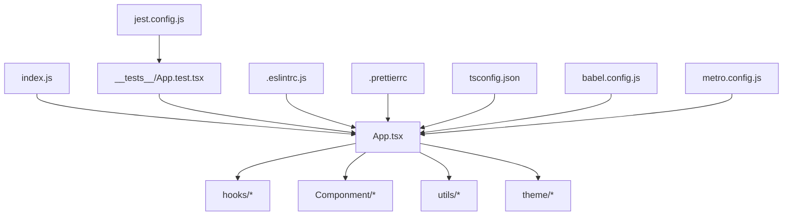
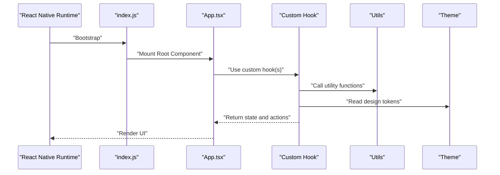
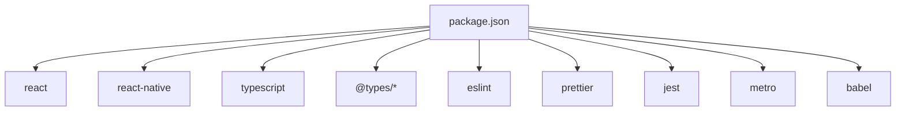

# Coding Standards and Conventions

<cite>
**Referenced Files in This Document**
- [package.json](file://package.json)
- [tsconfig.json](file://tsconfig.json)
- [.eslintrc.js](file://.eslintrc.js)
- [.prettierrc](file://.prettierrc)
- [.prettierignore](file://.prettierignore)
- [App.tsx](file://App.tsx)
- [index.js](file://index.js)
- [babel.config.js](file://babel.config.js)
- [metro.config.js](file://metro.config.js)
- [jest.config.js](file://jest.config.js)
- [hooks/useAutoHideControls.ts](file://hooks/useAutoHideControls.ts)
- [hooks/useScrubber.ts](file://hooks/useScrubber.ts)
- [hooks/useVideoDurations.tsx](file://hooks/useVideoDurations.tsx)
- [hooks/useVideoSequencePlayer.ts](file://hooks/useVideoSequencePlayer.ts)
- [hooks/useVideoSequenceTimelinePlayer.ts](file://hooks/useVideoSequenceTimelinePlayer.ts)
- [hooks/useVirtualTimeline.ts](file://hooks/useVirtualTimeline.ts)
- [utils/index.ts](file://utils/index.ts)
- [theme/qi.ts](file://theme/qi.ts)
- [Componment/HtmlRendet.js](file://Componment/HtmlRendet.js)
- [__tests__/App.test.tsx](file://__tests__/App.test.tsx)
</cite>

## Table of Contents
1. [Introduction](#introduction)
2. [Project Structure](#project-structure)
3. [Core Components](#core-components)
4. [Architecture Overview](#architecture-overview)
5. [Detailed Component Analysis](#detailed-component-analysis)
6. [Dependency Analysis](#dependency-analysis)
7. [Performance Considerations](#performance-considerations)
8. [Troubleshooting Guide](#troubleshooting-guide)
9. [Conclusion](#conclusion)
10. [Appendices](#appendices)

## Introduction
This document defines the coding standards and conventions for the video-rn project. It covers TypeScript conventions, React Native best practices, component architecture patterns, ESLint rules, Prettier formatting settings, and TypeScript configuration. It also provides naming conventions for files, components, hooks, and utilities; code organization principles; import/export patterns; and examples of proper formatting, error handling, and documentation comments.

## Project Structure
The project follows a feature-oriented structure with clear separation between platform entry points, UI components, hooks, utilities, theme, and tests:
- Entry points: index.js (React Native bootstrap), App.tsx (root application component)
- Hooks: hooks/ directory containing reusable logic as custom hooks
- Utilities: utils/ for shared helpers
- Theme: theme/ for design tokens and styling constants
- Components: Componment/ for UI components
- Tests: __tests__/ for Jest-based unit tests
- Configuration: .eslintrc.js, .prettierrc, tsconfig.json, babel.config.js, metro.config.js, jest.config.js, package.json

**Diagram sources**
- [index.js](file://index.js)
- [App.tsx](file://App.tsx)
- [hooks/useAutoHideControls.ts](file://hooks/useAutoHideControls.ts)
- [hooks/useScrubber.ts](file://hooks/useScrubber.ts)
- [hooks/useVideoDurations.tsx](file://hooks/useVideoDurations.tsx)
- [hooks/useVideoSequencePlayer.ts](file://hooks/useVideoSequencePlayer.ts)
- [hooks/useVideoSequenceTimelinePlayer.ts](file://hooks/useVideoSequenceTimelinePlayer.ts)
- [hooks/useVirtualTimeline.ts](file://hooks/useVirtualTimeline.ts)
- [utils/index.ts](file://utils/index.ts)
- [theme/qi.ts](file://theme/qi.ts)
- [Componment/HtmlRendet.js](file://Componment/HtmlRendet.js)
- [__tests__/App.test.tsx](file://__tests__/App.test.tsx)
- [.eslintrc.js](file://.eslintrc.js)
- [.prettierrc](file://.prettierrc)
- [tsconfig.json](file://tsconfig.json)
- [babel.config.js](file://babel.config.js)
- [metro.config.js](file://metro.config.js)
- [jest.config.js](file://jest.config.js)

**Section sources**
- [index.js](file://index.js)
- [App.tsx](file://App.tsx)
- [package.json](file://package.json)

## Core Components
- Root Application: App.tsx is the main React Native application component that wires up navigation, state, and global providers.
- Custom Hooks: The hooks/ directory contains all business logic encapsulated as custom hooks following React’s composition model. Examples include useAutoHideControls, useScrubber, useVideoDurations, useVideoSequencePlayer, useVideoSequenceTimelinePlayer, and useVirtualTimeline.
- Utilities: utils/index.ts provides shared helper functions used across components and hooks.
- Theme: theme/qi.ts centralizes design tokens such as colors, spacing, typography, and other style primitives.
- Components: Componment/HtmlRendet.js demonstrates a UI component implementation.

Naming conventions:
- Components: PascalCase file names and default or named exports with matching names (e.g., HtmlRendet.js).
- Hooks: camelCase file names prefixed with use (e.g., useAutoHideControls.ts).
- Utilities: camelCase file names with descriptive nouns (e.g., index.ts).
- Theme: camelCase file names representing design tokens (e.g., qi.ts).

Import/export patterns:
- Prefer named exports for utilities and hooks to enable tree-shaking and explicit imports.
- Use relative imports within modules and avoid deep nesting.
- Keep barrel exports minimal and purposeful.

Error handling:
- Throw typed errors for invalid arguments and unexpected states.
- Return error objects or status flags from async functions when appropriate.
- Wrap external calls in try/catch blocks and surface user-friendly messages.

Documentation comments:
- Use JSDoc-style comments for public APIs, including parameters, return types, and usage notes.
- Add inline comments for complex logic and edge cases.

**Section sources**
- [App.tsx](file://App.tsx)
- [hooks/useAutoHideControls.ts](file://hooks/useAutoHideControls.ts)
- [hooks/useScrubber.ts](file://hooks/useScrubber.ts)
- [hooks/useVideoDurations.tsx](file://hooks/useVideoDurations.tsx)
- [hooks/useVideoSequencePlayer.ts](file://hooks/useVideoSequencePlayer.ts)
- [hooks/useVideoSequenceTimelinePlayer.ts](file://hooks/useVideoSequenceTimelinePlayer.ts)
- [hooks/useVirtualTimeline.ts](file://hooks/useVirtualTimeline.ts)
- [utils/index.ts](file://utils/index.ts)
- [theme/qi.ts](file://theme/qi.ts)
- [Componment/HtmlRendet.js](file://Componment/HtmlRendet.js)

## Architecture Overview
The application follows a unidirectional data flow pattern:
- Entry point bootstraps the app and mounts the root component.
- Root component composes screens and providers.
- Business logic resides in hooks, which are consumed by components.
- Shared utilities and theme provide cross-cutting concerns.

**Diagram sources**
- [index.js](file://index.js)
- [App.tsx](file://App.tsx)
- [hooks/useAutoHideControls.ts](file://hooks/useAutoHideControls.ts)
- [utils/index.ts](file://utils/index.ts)
- [theme/qi.ts](file://theme/qi.ts)

## Detailed Component Analysis

### TypeScript Conventions
- Strict mode enabled via tsconfig.json to enforce type safety.
- Explicit typing for function parameters and return values.
- Avoid any; prefer unknown or specific union types when necessary.
- Use interfaces for object shapes and enums for enumerated values.
- Leverage generics for reusable utilities and hooks.

TypeScript configuration highlights:
- Target modern JavaScript versions compatible with React Native.
- Enable strict null checks and module resolution for ESNext.
- Configure path aliases if needed for cleaner imports.

**Section sources**
- [tsconfig.json](file://tsconfig.json)

### ESLint Rules
- Enforce consistent code style and prevent common mistakes.
- Recommended rules:
  - no-unused-vars: catch unused variables.
  - no-console: restrict console usage in production builds.
  - semi: require semicolons for consistency.
  - quotes: enforce single or double quotes consistently.
  - arrow-parens: standardize arrow function parentheses.
  - comma-spacing: ensure consistent comma spacing.
  - indent: enforce indentation rules.
  - no-trailing-spaces: remove trailing whitespace.
  - eol-last: ensure newline at end of file.
  - react-hooks/exhaustive-deps: validate dependency arrays in hooks.
  - @typescript-eslint/no-explicit-any: discourage explicit any.
  - @typescript-eslint/strict-boolean-expressions: enforce boolean expressions.

Configuration file: .eslintrc.js

**Section sources**
- [.eslintrc.js](file://.eslintrc.js)

### Prettier Formatting Settings
- Consistent formatting across the codebase.
- Key settings:
  - printWidth: line length limit.
  - tabWidth: indentation width.
  - useTabs: prefer tabs or spaces.
  - singleQuote: quote style.
  - trailingComma: trailing commas where valid.
  - bracketSpacing: object literal spacing.
  - jsxBracketSameLine: JSX bracket alignment.
  - arrowParens: parentheses around arrow function params.
  - semi: semicolon usage.
  - endOfLine: line ending style.

Configuration file: .prettierrc
Ignore patterns: .prettierignore

**Section sources**
- [.prettierrc](file://.prettierrc)
- [.prettierignore](file://.prettierignore)

### React Native Best Practices
- Functional components with hooks for state and side effects.
- Memoization with useMemo and useCallback to optimize re-renders.
- Safe area handling and responsive layouts using theme tokens.
- Performance profiling with React DevTools and Flipper.
- Platform-specific code using Platform.select or separate files.

**Section sources**
- [App.tsx](file://App.tsx)
- [theme/qi.ts](file://theme/qi.ts)

### Component Architecture Patterns
- Presentational vs container components:
  - Presentational components focus on rendering UI based on props.
  - Container components manage state and behavior, delegating to presentational components.
- Composition over inheritance:
  - Compose small, reusable components.
  - Pass callbacks and data via props.
- Error boundaries:
  - Wrap critical sections with error boundaries to prevent crashes.

Example component: HtmlRendet.js

**Section sources**
- [Componment/HtmlRendet.js](file://Componment/HtmlRendet.js)

### Hooks Patterns
- Naming: use prefix for custom hooks.
- Single responsibility: each hook should encapsulate one piece of logic.
- Dependencies: declare dependencies explicitly in useEffect and related hooks.
- Testing: test hooks with React Testing Library or custom renderers.

Examples:
- useAutoHideControls.ts
- useScrubber.ts
- useVideoDurations.tsx
- useVideoSequencePlayer.ts
- useVideoSequenceTimelinePlayer.ts
- useVirtualTimeline.ts

**Section sources**
- [hooks/useAutoHideControls.ts](file://hooks/useAutoHideControls.ts)
- [hooks/useScrubber.ts](file://hooks/useScrubber.ts)
- [hooks/useVideoDurations.tsx](file://hooks/useVideoDurations.tsx)
- [hooks/useVideoSequencePlayer.ts](file://hooks/useVideoSequencePlayer.ts)
- [hooks/useVideoSequenceTimelinePlayer.ts](file://hooks/useVideoSequenceTimelinePlayer.ts)
- [hooks/useVirtualTimeline.ts](file://hooks/useVirtualTimeline.ts)

### Utility Functions
- Pure functions where possible.
- Input validation and error throwing for invalid arguments.
- Exported via barrel file for centralized access.

Example: utils/index.ts

**Section sources**
- [utils/index.ts](file://utils/index.ts)

### Theme and Design Tokens
- Centralized tokens for colors, spacing, typography, and breakpoints.
- Typed definitions to ensure consistency.
- Usage throughout components and hooks for consistent styling.

Example: theme/qi.ts

**Section sources**
- [theme/qi.ts](file://theme/qi.ts)

### Testing Conventions
- Jest configuration for React Native.
- Unit tests for hooks and utilities.
- Snapshot tests for UI components where appropriate.

Example: __tests__/App.test.tsx

**Section sources**
- [jest.config.js](file://jest.config.js)
- [__tests__/App.test.tsx](file://__tests__/App.test.tsx)

## Dependency Analysis
External dependencies are managed via package.json. Key categories:
- React and React Native core libraries.
- TypeScript tooling and type definitions.
- ESLint and Prettier for linting and formatting.
- Jest for testing.
- Metro and Babel for bundling and transpilation.

**Diagram sources**
- [package.json](file://package.json)

**Section sources**
- [package.json](file://package.json)

## Performance Considerations
- Minimize re-renders with memoization and selective updates.
- Use FlatList or SectionList for large lists.
- Debounce expensive operations like network requests or analytics.
- Profile with React Profiler and Flipper to identify bottlenecks.
- Optimize images and assets with appropriate formats and sizes.

[No sources needed since this section provides general guidance]

## Troubleshooting Guide
Common issues and resolutions:
- TypeScript errors: Ensure strict mode and correct type definitions.
- ESLint warnings: Run linter and fix violations automatically where possible.
- Prettier conflicts: Configure editor to format on save and align with .prettierrc.
- Metro build errors: Clear cache and reinstall dependencies.
- Jest failures: Verify configuration and mock external dependencies.

**Section sources**
- [.eslintrc.js](file://.eslintrc.js)
- [.prettierrc](file://.prettierrc)
- [tsconfig.json](file://tsconfig.json)
- [jest.config.js](file://jest.config.js)

## Conclusion
Adhering to these coding standards ensures consistency, maintainability, and performance across the video-rn project. By following TypeScript conventions, React Native best practices, and established patterns for components, hooks, and utilities, teams can collaborate effectively and deliver high-quality mobile applications.

[No sources needed since this section summarizes without analyzing specific files]

## Appendices

### Import/Export Patterns
- Prefer named exports for clarity and tree-shaking.
- Use relative imports within modules.
- Avoid circular dependencies by refactoring shared logic into utilities or hooks.

### Code Formatting Examples
- Follow Prettier settings for consistent formatting.
- Use ESLint rules to enforce style and catch errors.
- Configure editors to auto-format on save.

### Documentation Comments
- Document public APIs with JSDoc comments.
- Include parameter descriptions, return types, and usage examples.
- Update documentation when APIs change.

[No sources needed since this section provides general guidance]