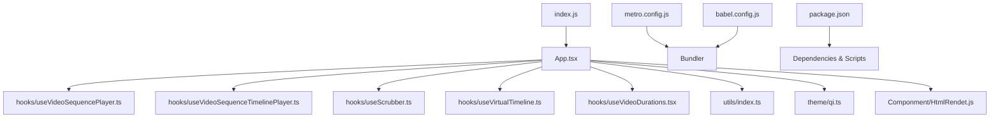
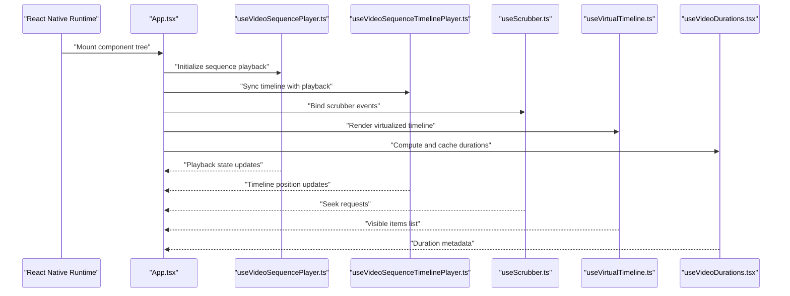
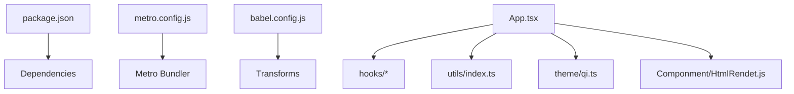

# Debugging and Performance Profiling

<cite>
**Referenced Files in This Document**
- [App.tsx](file://App.tsx)
- [index.js](file://index.js)
- [package.json](file://package.json)
- [metro.config.js](file://metro.config.js)
- [babel.config.js](file://babel.config.js)
- [hooks/useVideoSequencePlayer.ts](file://hooks/useVideoSequencePlayer.ts)
- [hooks/useVideoSequenceTimelinePlayer.ts](file://hooks/useVideoSequenceTimelinePlayer.ts)
- [hooks/useScrubber.ts](file://hooks/useScrubber.ts)
- [hooks/useVirtualTimeline.ts](file://hooks/useVirtualTimeline.ts)
- [hooks/useVideoDurations.tsx](file://hooks/useVideoDurations.tsx)
- [utils/index.ts](file://utils/index.ts)
- [theme/qi.ts](file://theme/qi.ts)
- [Componment/HtmlRendet.js](file://Componment/HtmlRendet.js)
- [docs/HOOKS.md](file://docs/HOOKS.md)
- [docs/STATE_MACHINE.md](file://docs/STATE_MACHINE.md)
- [docs/LOADING.md](file://docs/LOADING.md)
- [docs/FLOWCHARTS.md](file://docs/FLOWCHARTS.md)
</cite>

## Table of Contents
1. [Introduction](#introduction)
2. [Project Structure](#project-structure)
3. [Core Components](#core-components)
4. [Architecture Overview](#architecture-overview)
5. [Detailed Component Analysis](#detailed-component-analysis)
6. [Dependency Analysis](#dependency-analysis)
7. [Performance Considerations](#performance-considerations)
8. [Troubleshooting Guide](#troubleshooting-guide)
9. [Conclusion](#conclusion)
10. [Appendices](#appendices)

## Introduction
This document provides a comprehensive guide to debugging and performance profiling for the video-rn React Native project. It covers:
- Debugging techniques for React Native applications, including React DevTools and Flipper integration
- Console logging strategies tailored to video playback scenarios
- Performance profiling methods for video playback, memory usage analysis, and bundle size optimization
- Troubleshooting guides for common video playback issues, hook-related problems, and UI rendering performance
- Tools and techniques for identifying bottlenecks in video processing and timeline management

The guidance is grounded in the project’s structure and implementation, with references to specific files and sections where applicable.

## Project Structure
The project follows a modular organization centered around hooks for video sequence playback, timeline management, scrubbing, and duration handling. The entry points are index.js and App.tsx, while configuration files manage bundling and development tooling. Documentation under docs/ provides additional context on hooks, state machines, loading behavior, and flowcharts.

**Diagram sources**
- [index.js](file://index.js)
- [App.tsx](file://App.tsx)
- [hooks/useVideoSequencePlayer.ts](file://hooks/useVideoSequencePlayer.ts)
- [hooks/useVideoSequenceTimelinePlayer.ts](file://hooks/useVideoSequenceTimelinePlayer.ts)
- [hooks/useScrubber.ts](file://hooks/useScrubber.ts)
- [hooks/useVirtualTimeline.ts](file://hooks/useVirtualTimeline.ts)
- [hooks/useVideoDurations.tsx](file://hooks/useVideoDurations.tsx)
- [utils/index.ts](file://utils/index.ts)
- [theme/qi.ts](file://theme/qi.ts)
- [Componment/HtmlRendet.js](file://Componment/HtmlRendet.js)
- [metro.config.js](file://metro.config.js)
- [babel.config.js](file://babel.config.js)
- [package.json](file://package.json)

**Section sources**
- [index.js](file://index.js)
- [App.tsx](file://App.tsx)
- [package.json](file://package.json)
- [metro.config.js](file://metro.config.js)
- [babel.config.js](file://babel.config.js)

## Core Components
This section outlines the core components involved in video playback and timeline management, focusing on their roles in debugging and performance profiling.

- Video Sequence Player Hook: Orchestrates playback state and lifecycle events for sequences. Useful for tracing playback transitions and errors.
- Timeline Player Hook: Manages timeline synchronization, seeking, and frame updates. Critical for diagnosing seek latency and frame drops.
- Scrubber Hook: Handles user interactions for scrubbing through the timeline. Important for measuring input responsiveness and UI updates.
- Virtual Timeline Hook: Optimizes rendering by virtualizing timeline elements. Key for reducing re-renders during long timelines.
- Duration Hook: Computes and caches video durations. Essential for preloading and layout stability.
- Utilities and Theme: Shared helpers and styling tokens that can affect rendering performance and memory footprint.

**Section sources**
- [hooks/useVideoSequencePlayer.ts](file://hooks/useVideoSequencePlayer.ts)
- [hooks/useVideoSequenceTimelinePlayer.ts](file://hooks/useVideoSequenceTimelinePlayer.ts)
- [hooks/useScrubber.ts](file://hooks/useScrubber.ts)
- [hooks/useVirtualTimeline.ts](file://hooks/useVirtualTimeline.ts)
- [hooks/useVideoDurations.tsx](file://hooks/useVideoDurations.tsx)
- [utils/index.ts](file://utils/index.ts)
- [theme/qi.ts](file://theme/qi.ts)

## Architecture Overview
The application architecture centers on React hooks that encapsulate video playback logic and timeline management. The main app integrates these hooks to render the player UI and handle user interactions. Configuration files control the build pipeline and development tools.

**Diagram sources**
- [App.tsx](file://App.tsx)
- [hooks/useVideoSequencePlayer.ts](file://hooks/useVideoSequencePlayer.ts)
- [hooks/useVideoSequenceTimelinePlayer.ts](file://hooks/useVideoSequenceTimelinePlayer.ts)
- [hooks/useScrubber.ts](file://hooks/useScrubber.ts)
- [hooks/useVirtualTimeline.ts](file://hooks/useVirtualTimeline.ts)
- [hooks/useVideoDurations.tsx](file://hooks/useVideoDurations.tsx)

## Detailed Component Analysis

### Video Sequence Player Hook
Responsibilities:
- Manage playback state (playing, paused, ended)
- Handle lifecycle events (onReady, onError, onEnd)
- Coordinate with timeline and scrubbing hooks

Debugging techniques:
- Log state transitions and event triggers to trace playback flow
- Use React DevTools to inspect hook state changes over time
- Validate error boundaries around media operations

Performance considerations:
- Avoid unnecessary re-renders by memoizing derived values
- Debounce frequent state updates during rapid seeks or scrubbing

**Section sources**
- [hooks/useVideoSequencePlayer.ts](file://hooks/useVideoSequencePlayer.ts)

### Timeline Player Hook
Responsibilities:
- Synchronize timeline position with playback progress
- Handle seeking and frame updates
- Emit timeline change events for UI updates

Debugging techniques:
- Measure seek latency and frame drop frequency
- Inspect timeline update intervals and throttling
- Use console logs to track seek requests and resulting positions

Performance considerations:
- Throttle timeline updates to reduce UI churn
- Optimize frame calculations to minimize heavy computations per tick

**Section sources**
- [hooks/useVideoSequenceTimelinePlayer.ts](file://hooks/useVideoSequenceTimelinePlayer.ts)

### Scrubber Hook
Responsibilities:
- Capture user drag events for scrubbing
- Convert gesture coordinates to timeline positions
- Trigger seek operations with debounced updates

Debugging techniques:
- Log gesture start, move, and end events
- Verify coordinate-to-position conversion accuracy
- Monitor seek request frequency and debounce effectiveness

Performance considerations:
- Debounce seek calls to prevent excessive re-renders
- Use native driver for smooth animations where possible

**Section sources**
- [hooks/useScrubber.ts](file://hooks/useScrubber.ts)

### Virtual Timeline Hook
Responsibilities:
- Virtualize timeline items to optimize rendering
- Compute visible range based on scroll position
- Provide efficient item rendering callbacks

Debugging techniques:
- Inspect visible range calculations and item counts
- Validate scroll position mapping to timeline indices
- Profile render times for large timelines

Performance considerations:
- Ensure stable keys and minimal re-renders for visible items
- Cache computed ranges to avoid recalculations on minor updates

**Section sources**
- [hooks/useVirtualTimeline.ts](file://hooks/useVirtualTimeline.ts)

### Duration Hook
Responsibilities:
- Compute and cache video durations
- Provide duration metadata for timeline sizing
- Handle async duration resolution

Debugging techniques:
- Log duration computation results and caching behavior
- Verify duration availability before timeline initialization
- Track async resolution timing to identify slow sources

Performance considerations:
- Cache durations to avoid redundant computations
- Preload durations for better initial layout stability

**Section sources**
- [hooks/useVideoDurations.tsx](file://hooks/useVideoDurations.tsx)

### Utilities and Theme
Responsibilities:
- Shared helper functions for common operations
- Styling tokens for consistent UI appearance

Debugging techniques:
- Audit utility functions for performance hotspots
- Validate theme token usage for rendering consistency

Performance considerations:
- Memoize expensive utility computations
- Minimize theme object churn to reduce re-renders

**Section sources**
- [utils/index.ts](file://utils/index.ts)
- [theme/qi.ts](file://theme/qi.ts)

## Dependency Analysis
The project’s dependencies include React Native runtime, bundler configurations, and third-party libraries specified in package.json. Metro and Babel configurations influence build performance and debugging capabilities.

**Diagram sources**
- [package.json](file://package.json)
- [metro.config.js](file://metro.config.js)
- [babel.config.js](file://babel.config.js)
- [App.tsx](file://App.tsx)
- [hooks/useVideoSequencePlayer.ts](file://hooks/useVideoSequencePlayer.ts)
- [hooks/useVideoSequenceTimelinePlayer.ts](file://hooks/useVideoSequenceTimelinePlayer.ts)
- [hooks/useScrubber.ts](file://hooks/useScrubber.ts)
- [hooks/useVirtualTimeline.ts](file://hooks/useVirtualTimeline.ts)
- [hooks/useVideoDurations.tsx](file://hooks/useVideoDurations.tsx)
- [utils/index.ts](file://utils/index.ts)
- [theme/qi.ts](file://theme/qi.ts)
- [Componment/HtmlRendet.js](file://Componment/HtmlRendet.js)

**Section sources**
- [package.json](file://package.json)
- [metro.config.js](file://metro.config.js)
- [babel.config.js](file://babel.config.js)

## Performance Considerations
Key areas to monitor for performance:
- Video playback smoothness: Measure frame rate and seek latency
- Memory usage: Track allocations during playback and timeline rendering
- Bundle size: Analyze dependencies and code splitting opportunities
- Re-render frequency: Identify unnecessary updates in hooks and UI components

Recommendations:
- Use React DevTools Profiler to capture render timelines
- Enable Flipper plugins for network and memory insights
- Implement virtualization for large timelines
- Debounce and throttle frequent updates during scrubbing and seeking
- Cache computed values like durations and visible ranges

[No sources needed since this section provides general guidance]

## Troubleshooting Guide

### Common Video Playback Issues
Symptoms:
- Playback fails to start or stalls frequently
- Seek operations cause delays or incorrect positions
- Audio/video desynchronization

Diagnostic steps:
- Check network requests for media assets using Flipper Network plugin
- Validate source URLs and formats supported by the platform
- Inspect error boundaries and log messages from playback hooks
- Test with different media sources to isolate format-specific issues

**Section sources**
- [hooks/useVideoSequencePlayer.ts](file://hooks/useVideoSequencePlayer.ts)
- [hooks/useVideoSequenceTimelinePlayer.ts](file://hooks/useVideoSequenceTimelinePlayer.ts)

### Hook-Related Problems
Symptoms:
- State not updating as expected
- Excessive re-renders causing UI lag
- Incorrect timeline synchronization

Diagnostic steps:
- Use React DevTools to inspect hook state and props over time
- Add console logs at key decision points in hooks
- Verify dependency arrays in useEffect and useMemo
- Ensure proper cleanup of timers and listeners

**Section sources**
- [hooks/useScrubber.ts](file://hooks/useScrubber.ts)
- [hooks/useVirtualTimeline.ts](file://hooks/useVirtualTimeline.ts)
- [hooks/useVideoDurations.tsx](file://hooks/useVideoDurations.tsx)

### UI Rendering Performance
Symptoms:
- Choppy scrolling or scrubbing
- High CPU usage during timeline interactions
- Memory leaks over extended sessions

Diagnostic steps:
- Profile renders with React DevTools Profiler
- Monitor memory snapshots in Flipper or Chrome DevTools
- Identify heavy computations and offload to Web Workers if applicable
- Optimize list rendering with virtualization and stable keys

**Section sources**
- [hooks/useVirtualTimeline.ts](file://hooks/useVirtualTimeline.ts)
- [utils/index.ts](file://utils/index.ts)

### Tools and Techniques for Bottleneck Identification
Techniques:
- Use React DevTools Profiler to capture render trees and flame graphs
- Enable Flipper Memory and Network plugins for resource monitoring
- Implement custom logging in critical paths of hooks
- Measure time spent in video decoding and rendering pipelines

[No sources needed since this section provides general guidance]

## Conclusion
Effective debugging and performance profiling in the video-rn project require a combination of React Native tools, targeted logging, and systematic analysis of hook behaviors. By leveraging React DevTools, Flipper, and profiling techniques, developers can identify and resolve issues related to video playback, timeline management, and UI rendering. Continuous monitoring and optimization of memory usage, bundle size, and render performance will ensure a smooth user experience.

[No sources needed since this section summarizes without analyzing specific files]

## Appendices

### Additional Documentation References
- Hooks documentation: [docs/HOOKS.md](file://docs/HOOKS.md)
- State machine details: [docs/STATE_MACHINE.md](file://docs/STATE_MACHINE.md)
- Loading behavior: [docs/LOADING.md](file://docs/LOADING.md)
- Flowcharts: [docs/FLOWCHARTS.md](file://docs/FLOWCHARTS.md)

**Section sources**
- [docs/HOOKS.md](file://docs/HOOKS.md)
- [docs/STATE_MACHINE.md](file://docs/STATE_MACHINE.md)
- [docs/LOADING.md](file://docs/LOADING.md)
- [docs/FLOWCHARTS.md](file://docs/FLOWCHARTS.md)