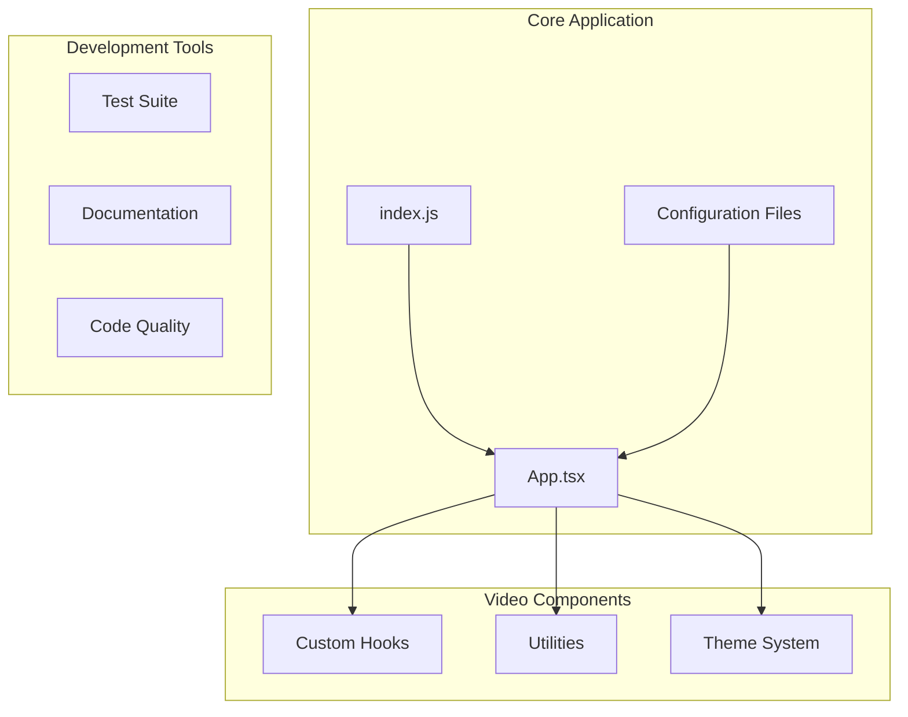
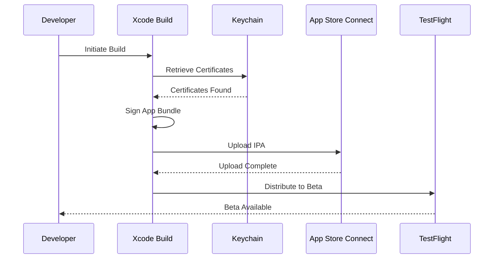
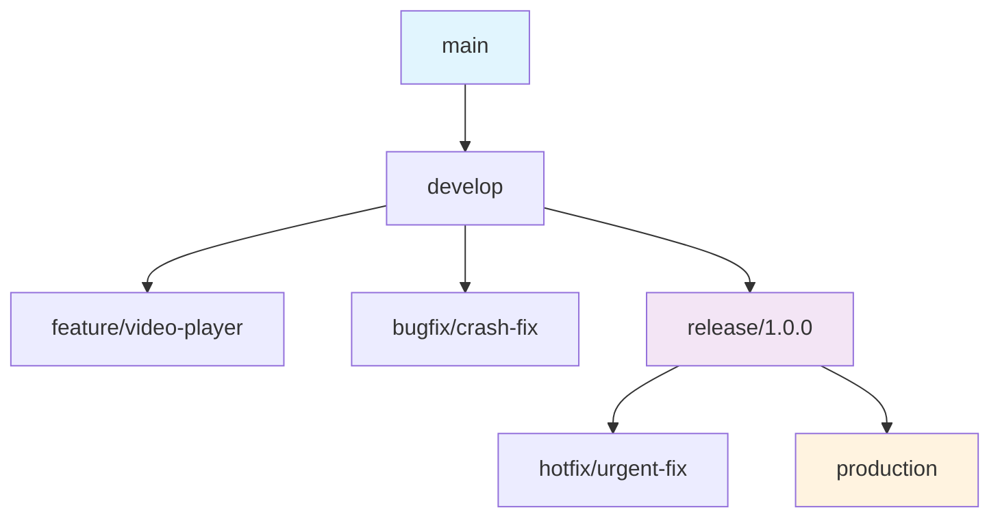
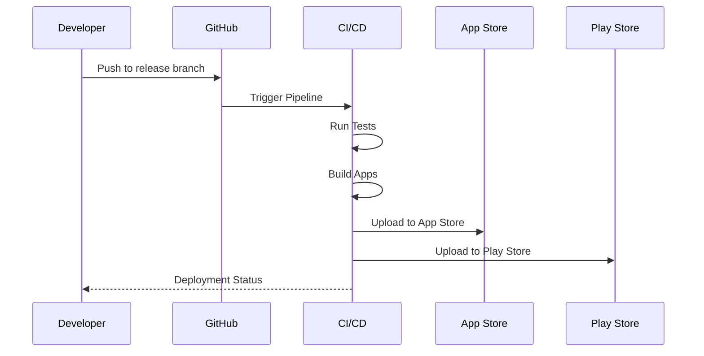

# Deployment and Release Process

<cite>
**Referenced Files in This Document**
- [package.json](file://package.json)
- [app.json](file://app.json)
- [metro.config.js](file://metro.config.js)
- [babel.config.js](file://babel.config.js)
- [Gemfile](file://Gemfile)
- [App.tsx](file://App.tsx)
- [index.js](file://index.js)
- [AGENTS.md](file://AGENTS.md)
- [CLAUDE.md](file://CLAUDE.md)
- [DISCUSSION.md](file://DISCUSSION.md)
</cite>

## Table of Contents
1. [Introduction](#introduction)
2. [Project Structure Overview](#project-structure-overview)
3. [Environment Setup](#environment-setup)
4. [Build Process](#build-process)
5. [iOS Deployment](#ios-deployment)
6. [Android Deployment](#android-deployment)
7. [Versioning Strategy](#versioning-strategy)
8. [Release Branching Workflow](#release-branching-workflow)
9. [CI/CD Pipeline](#cicd-pipeline)
10. [Post-Deployment Verification](#post-deployment-verification)
11. [Platform-Specific Considerations](#platform-specific-considerations)
12. [Troubleshooting Guide](#troubleshooting-guide)
13. [Conclusion](#conclusion)

## Introduction

This document provides comprehensive deployment and release procedures for the video-rn React Native application. The project is a video-focused mobile application built with React Native, featuring custom hooks for video playback, timeline management, and sequence handling. This guide covers environment setup, build configurations, signing processes, app store preparation, versioning strategies, and automated deployment workflows.

## Project Structure Overview

The video-rn project follows a modular React Native architecture with specialized components for video functionality:



**Diagram sources**
- [App.tsx:1-50](file://App.tsx#L1-L50)
- [index.js:1-30](file://index.js#L1-L30)

**Section sources**
- [package.json:1-100](file://package.json#L1-L100)
- [app.json:1-50](file://app.json#L1-L50)

## Environment Setup

### Prerequisites

Before setting up the development environment, ensure you have the following installed:

#### Node.js and Package Manager
- Node.js 16.x or later
- npm 8.x or later (or yarn 1.22+)

#### iOS Development Requirements
- macOS operating system
- Xcode 14.x or later
- CocoaPods
- iOS Simulator or physical device with developer mode enabled

#### Android Development Requirements
- Android Studio with latest SDK
- Android SDK Platform 33+
- Android Build Tools 33.0.0+
- JDK 11 or later
- Android Emulator or physical device

### Initial Setup Commands

```bash
# Clone the repository
git clone <repository-url>
cd video-rn

# Install dependencies
npm install

# For iOS - Install CocoaPods dependencies
cd ios && pod install && cd ..

# Start Metro bundler
npm start
```

### Environment Variables Configuration

Create environment-specific configuration files for different deployment targets:

| Environment | File Name | Purpose |
|-------------|-----------|---------|
| Development | `.env.development` | Local development settings |
| Staging | `.env.staging` | Pre-production testing |
| Production | `.env.production` | Live production settings |

**Section sources**
- [AGENTS.md:1-100](file://AGENTS.md#L1-L100)
- [CLAUDE.md:1-50](file://CLAUDE.md#L1-L50)

## Build Process

### Development Build

The development build process includes hot reloading, debugging capabilities, and optimized bundle sizes for testing:

```bash
# iOS development build
npm run ios:dev

# Android development build
npm run android:dev

# Web development build
npm run web:dev
```

### Production Build

Production builds are optimized for performance and include code minification, tree shaking, and asset optimization:

```bash
# iOS production build
npm run ios:prod

# Android production build
npm run android:prod

# Generate release artifacts
npm run build:release
```

### Build Configuration

The project uses Metro bundler for JavaScript bundling and platform-specific build configurations:

**Metro Configuration Features:**
- Asset optimization for video files
- Code splitting for better performance
- Custom transformers for TypeScript and JSX
- Source map generation for debugging

**Babel Configuration:**
- TypeScript compilation
- JSX transformation
- Plugin-based transformations
- Environment-specific presets

**Section sources**
- [metro.config.js:1-100](file://metro.config.js#L1-L100)
- [babel.config.js:1-50](file://babel.config.js#L1-L50)

## iOS Deployment

### Certificate and Provisioning Setup

#### Required Certificates
- Apple Developer Account
- iOS Distribution Certificate
- App ID with Video Playback entitlements
- Provisioning Profile for distribution

#### Keychain Access Configuration
Ensure your keychain has the necessary certificates and passwords configured for automated builds.

### Signing Configuration

The iOS signing process involves multiple stages:



**Diagram sources**
- [app.json:1-50](file://app.json#L1-L50)

### App Store Preparation

#### App Store Connect Setup
1. Create App ID with required capabilities
2. Configure App Store listing information
3. Set up pricing and availability
4. Prepare screenshots and app previews

#### Privacy Manifest Requirements
For video playback apps, include privacy manifests for:
- Camera access permissions
- Microphone access permissions
- Photo library access
- Network usage disclosure

### Build Script Automation

Create an automated build script that handles:
- Version incrementing
- Code signing
- Archive creation
- App Store upload
- TestFlight distribution

**Section sources**
- [app.json:1-100](file://app.json#L1-L100)

## Android Deployment

### Keystore Configuration

#### Generate Keystore
```bash
keytool -genkeypair -v -storetype PKCS12 -keystore my-release-key.jks -keyalg RSA -keysize 2048 -validity 10000 -alias my-alias
```

#### Gradle Configuration
Configure signing in `android/app/build.gradle`:

```groovy
signingConfigs {
    release {
        storeFile file(MYAPP_RELEASE_STORE_FILE)
        storePassword MYAPP_RELEASE_STORE_PASSWORD
        keyAlias MYAPP_RELEASE_KEY_ALIAS
        keyPassword MYAPP_RELEASE_KEY_PASSWORD
    }
}
```

### Play Store Preparation

#### Required Assets
- App icon (512x512 PNG)
- Feature graphic (1024x500 PNG)
- Screenshots (minimum 2, maximum 8)
- Promotional video (optional)

#### Permissions Declaration
Declare required permissions in `AndroidManifest.xml`:
- Camera access for video recording
- Storage access for media files
- Network access for streaming
- Audio settings for playback controls

### Build Optimization

Enable ProGuard/R8 for code shrinking and obfuscation:

```groovy
buildTypes {
    release {
        minifyEnabled true
        proguardFiles getDefaultProguardFile('proguard-android.txt'), 'proguard-rules.pro'
    }
}
```

**Section sources**
- [AGENTS.md:1-100](file://AGENTS.md#L1-L100)

## Versioning Strategy

### Semantic Versioning

The project follows semantic versioning (SemVer) with the format `MAJOR.MINOR.PATCH`:

| Version Type | Description | Example | Use Case |
|--------------|-------------|---------|----------|
| MAJOR | Breaking changes | 2.0.0 | API changes, major features |
| MINOR | New features (backward compatible) | 1.1.0 | New video features, improvements |
| PATCH | Bug fixes | 1.0.1 | Critical fixes, security patches |

### Version Management

#### Package.json Version Control
Update versions consistently across all configuration files:

```json
{
  "name": "video-rn",
  "version": "1.0.0",
  "react-native": "0.72.0"
}
```

#### Platform-Specific Versions
Maintain separate version numbers for iOS and Android when needed:

| Platform | Configuration File | Field | Purpose |
|----------|-------------------|-------|---------|
| iOS | Info.plist | CFBundleShortVersionString | App Store version |
| iOS | Info.plist | CFBundleVersion | Build number |
| Android | build.gradle | versionName | Play Store version |
| Android | build.gradle | versionCode | Internal build number |

### Automated Version Bumping

Implement automated version management using npm scripts:

```bash
# Bump patch version
npm version patch

# Bump minor version
npm version minor

# Bump major version
npm version major

# Create git tag
npm version --message "Release v%s"
```

**Section sources**
- [package.json:1-50](file://package.json#L1-L50)

## Release Branching Workflow

### Git Flow Strategy

The project uses a modified Git Flow workflow optimized for mobile app releases:



### Branch Naming Conventions

| Branch Type | Pattern | Example | Purpose |
|-------------|---------|---------|---------|
| Feature | feature/[feature-name] | feature/dark-mode | New features |
| Bug Fix | bugfix/[issue-id] | bugfix/123-video-crash | Bug fixes |
| Release | release/[version] | release/1.0.0 | Release preparation |
| Hotfix | hotfix/[issue-id] | hotfix/124-security | Emergency fixes |
| Main | main | main | Production code |

### Release Checklist

Pre-release validation checklist:
- [ ] All tests passing
- [ ] Code review completed
- [ ] Documentation updated
- [ ] Changelog maintained
- [ ] Dependencies updated
- [ ] Performance benchmarks met
- [ ] Security audit completed
- [ ] App store assets prepared

**Section sources**
- [DISCUSSION.md:1-100](file://DISCUSSION.md#L1-L100)

## CI/CD Pipeline

### GitHub Actions Configuration

Set up automated CI/CD pipeline for continuous integration and deployment:

```yaml
name: Mobile App CI/CD

on:
  push:
    branches: [main, develop]
  pull_request:
    branches: [main]

jobs:
  test:
    runs-on: ubuntu-latest
    steps:
      - uses: actions/checkout@v3
      - name: Setup Node.js
        uses: actions/setup-node@v3
        with:
          node-version: '16'
      - name: Install dependencies
        run: npm ci
      - name: Run tests
        run: npm test

  build-ios:
    needs: test
    runs-on: macos-latest
    steps:
      - uses: actions/checkout@v3
      - name: Setup Ruby
        uses: ruby/setup-ruby@v1
        with:
          ruby-version: '3.0'
      - name: Install pods
        run: cd ios && pod install && cd ..
      - name: Build iOS
        run: npm run ios:prod

  build-android:
    needs: test
    runs-on: ubuntu-latest
    steps:
      - uses: actions/checkout@v3
      - name: Setup Java
        uses: actions/setup-java@v3
        with:
          java-version: '11'
      - name: Build Android
        run: npm run android:prod
```

### Automated Testing Integration

Include automated testing in the CI/CD pipeline:

| Test Type | Tool | Coverage | Frequency |
|-----------|------|----------|-----------|
| Unit Tests | Jest | Core logic | Every commit |
| Integration Tests | Detox | User flows | Daily |
| Visual Regression | Percy | UI consistency | Every PR |
| Performance Tests | Lighthouse | App performance | Weekly |

### Deployment Automation

Automated deployment triggers based on branch events:



**Diagram sources**
- [AGENTS.md:1-100](file://AGENTS.md#L1-L100)

**Section sources**
- [AGENTS.md:1-100](file://AGENTS.md#L1-L100)

## Post-Deployment Verification

### Automated Testing

Implement post-deployment verification checks:

#### Smoke Tests
- App launch time measurement
- Basic navigation flow validation
- Video playback functionality
- Permission handling verification

#### Performance Monitoring
- Memory usage tracking
- CPU utilization monitoring
- Network request validation
- Battery consumption analysis

### Health Check Endpoints

Create health check endpoints for backend services:

| Endpoint | Purpose | Response Time |
|----------|---------|---------------|
| /health | Service availability | < 100ms |
| /api/status | API status | < 200ms |
| /metrics | Performance metrics | < 300ms |

### Crash Reporting Integration

Integrate crash reporting services:
- Firebase Crashlytics for real-time crash reports
- Sentry for error tracking and debugging
- Custom analytics for user behavior insights

**Section sources**
- [CLAUDE.md:1-50](file://CLAUDE.md#L1-L50)

## Platform-Specific Considerations

### iOS Video Playback Permissions

#### Required Entitlements
- Camera access for video recording
- Photo library access for media selection
- Microphone access for audio recording
- Background modes for audio playback

#### Privacy Descriptions
Add privacy descriptions to `Info.plist`:

| Permission | Key | Description |
|------------|-----|-------------|
| Camera | NSCameraUsageDescription | Need camera access to record videos |
| Photos | NSPhotoLibraryUsageDescription | Need photo library access to select videos |
| Microphone | NSMicrophoneUsageDescription | Need microphone access for audio recording |

### Android Media Permissions

#### Runtime Permissions
Handle runtime permission requests for:
- Storage access for media files
- Camera access for video recording
- Audio settings for playback controls

#### Manifest Declarations
```xml
<uses-permission android:name="android.permission.CAMERA" />
<uses-permission android:name="android.permission.RECORD_AUDIO" />
<uses-permission android:name="android.permission.READ_EXTERNAL_STORAGE" />
<uses-permission android:name="android.permission.WRITE_EXTERNAL_STORAGE" />
```

### Performance Optimization

#### iOS Optimizations
- Enable GPU acceleration for video rendering
- Optimize memory allocation for large video files
- Implement background task processing
- Use hardware-accelerated codecs

#### Android Optimizations
- Enable hardware decoding for video playback
- Implement efficient memory management
- Optimize network requests for streaming
- Use appropriate video formats for different devices

### Security Considerations

#### Content Protection
- Implement DRM for premium content
- Secure video URL generation
- Prevent screen recording where possible
- Validate content integrity

#### Data Privacy
- Encrypt sensitive user data
- Implement secure storage for credentials
- Sanitize user input for video metadata
- Comply with GDPR and CCPA regulations

**Section sources**
- [App.tsx:1-100](file://App.tsx#L1-L100)

## Troubleshooting Guide

### Common Build Issues

#### iOS Build Problems
- **CocoaPods installation failures**: Clear cache and reinstall
- **Code signing errors**: Verify certificate validity and provisioning profiles
- **Memory allocation errors**: Increase Xcode memory limits

#### Android Build Problems
- **Gradle sync failures**: Invalidate caches and rebuild
- **Keystore issues**: Verify keystore password and alias
- **SDK compatibility**: Ensure correct Android SDK versions

### Performance Issues

#### Slow Build Times
- Enable incremental builds
- Use Gradle daemon for Android
- Implement proper caching strategies
- Optimize dependency resolution

#### Runtime Performance
- Monitor memory leaks with Instruments
- Profile CPU usage with Android Profiler
- Optimize video loading strategies
- Implement lazy loading for heavy components

### Debugging Strategies

#### Remote Debugging
- Enable Chrome DevTools for JavaScript debugging
- Use React Native Debugger for component inspection
- Implement logging for production issues
- Set up crash reporting for error tracking

#### Network Debugging
- Use Charles Proxy for HTTP traffic inspection
- Monitor API response times
- Validate network request payloads
- Test offline scenarios

**Section sources**
- [DISCUSSION.md:1-100](file://DISCUSSION.md#L1-L100)

## Conclusion

The video-rn project follows industry best practices for React Native mobile application deployment and release management. By implementing the strategies outlined in this document, teams can ensure consistent, reliable, and efficient deployment processes for both iOS and Android platforms.

Key recommendations for successful deployments:
- Maintain strict version control and branching strategies
- Automate testing and deployment pipelines
- Implement comprehensive monitoring and error tracking
- Follow platform-specific guidelines for optimal performance
- Regularly update dependencies and security patches

The modular architecture of the video-rn project, combined with the deployment strategies described here, provides a solid foundation for scaling the application and maintaining high-quality releases throughout its lifecycle.