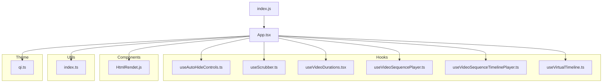
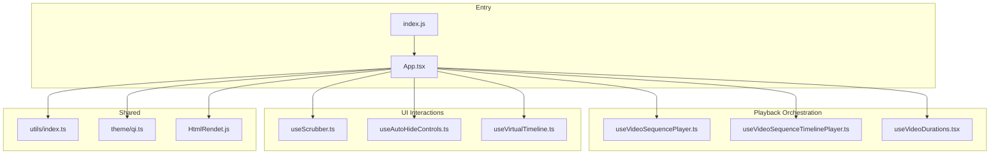
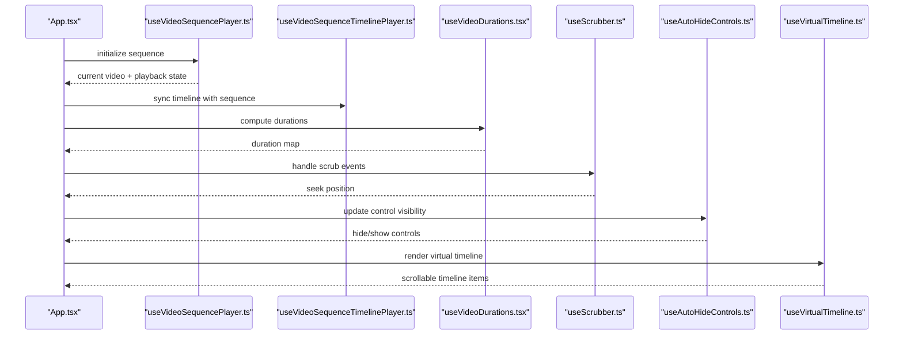
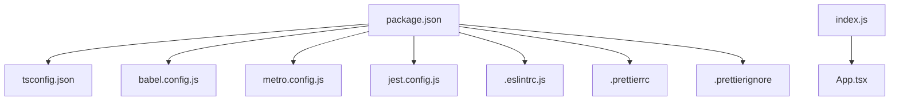

# Development Guide

<cite>
**Referenced Files in This Document**
- [package.json](file://package.json)
- [App.tsx](file://App.tsx)
- [index.js](file://index.js)
- [babel.config.js](file://babel.config.js)
- [metro.config.js](file://metro.config.js)
- [tsconfig.json](file://tsconfig.json)
- [.eslintrc.js](file://.eslintrc.js)
- [.prettierrc](file://.prettierrc)
- [.prettierignore](file://.prettierignore)
- [jest.config.js](file://jest.config.js)
- [AGENTS.md](file://AGENTS.md)
- [CLAUDE.md](file://CLAUDE.md)
- [DISCUSSION.md](file://DISCUSSION.md)
- [README.md](file://README.md)
- [app.json](file://app.json)
- [Gemfile](file://Gemfile)
- [hooks/useAutoHideControls.ts](file://hooks/useAutoHideControls.ts)
- [hooks/useScrubber.ts](file://hooks/useScrubber.ts)
- [hooks/useVideoDurations.tsx](file://hooks/useVideoDurations.tsx)
- [hooks/useVideoSequencePlayer.ts](file://hooks/useVideoSequencePlayer.ts)
- [hooks/useVideoSequenceTimelinePlayer.ts](file://hooks/useVideoSequenceTimelinePlayer.ts)
- [hooks/useVirtualTimeline.ts](file://hooks/useVirtualTimeline.ts)
- [Componment/HtmlRendet.js](file://Componment/HtmlRendet.js)
- [utils/index.ts](file://utils/index.ts)
- [theme/qi.ts](file://theme/qi.ts)
- [__tests__/App.test.tsx](file://__tests__/App.test.tsx)
</cite>

## Table of Contents
1. [Introduction](#introduction)
2. [Project Structure](#project-structure)
3. [Core Components](#core-components)
4. [Architecture Overview](#architecture-overview)
5. [Detailed Component Analysis](#detailed-component-analysis)
6. [Dependency Analysis](#dependency-analysis)
7. [Performance Considerations](#performance-considerations)
8. [Troubleshooting Guide](#troubleshooting-guide)
9. [Conclusion](#conclusion)
10. [Appendices](#appendices)

## Introduction
This development guide explains how to contribute effectively to the video-rn project. It covers coding standards, development workflow, contribution guidelines, naming and architectural conventions, debugging techniques, performance profiling, troubleshooting, release and deployment procedures, code review practices, and quality assurance. The goal is to make it easy for contributors to understand the structure, follow best practices, and ship high-quality changes.

## Project Structure
The project follows a React Native application layout with TypeScript, ESLint, Prettier, Jest, and Metro configuration files at the root. Feature-specific logic is organized into hooks, components, utilities, and theme files. Documentation and discussion notes are kept under docs and root markdown files.

Key directories and files:
- Root configuration: package.json, tsconfig.json, babel.config.js, metro.config.js, jest.config.js, .eslintrc.js, .prettierrc, .prettierignore, app.json
- Entry points: index.js, App.tsx
- Hooks: hooks/* (video playback, scrubbing, timeline, durations, auto-hide controls)
- Components: Componment/* (HTML rendering component)
- Utilities: utils/* (shared helpers)
- Theme: theme/* (design tokens or styling)
- Tests: __tests__/* (Jest tests)
- Documentation: README.md, AGENTS.md, CLAUDE.md, DISCUSSION.md, docs/*

**Diagram sources**
- [index.js](file://index.js)
- [App.tsx](file://App.tsx)
- [hooks/useAutoHideControls.ts](file://hooks/useAutoHideControls.ts)
- [hooks/useScrubber.ts](file://hooks/useScrubber.ts)
- [hooks/useVideoDurations.tsx](file://hooks/useVideoDurations.tsx)
- [hooks/useVideoSequencePlayer.ts](file://hooks/useVideoSequencePlayer.ts)
- [hooks/useVideoSequenceTimelinePlayer.ts](file://hooks/useVideoSequenceTimelinePlayer.ts)
- [hooks/useVirtualTimeline.ts](file://hooks/useVirtualTimeline.ts)
- [Componment/HtmlRendet.js](file://Componment/HtmlRendet.js)
- [utils/index.ts](file://utils/index.ts)
- [theme/qi.ts](file://theme/qi.ts)

**Section sources**
- [package.json](file://package.json)
- [App.tsx](file://App.tsx)
- [index.js](file://index.js)
- [babel.config.js](file://babel.config.js)
- [metro.config.js](file://metro.config.js)
- [tsconfig.json](file://tsconfig.json)
- [.eslintrc.js](file://.eslintrc.js)
- [.prettierrc](file://.prettierrc)
- [.prettierignore](file://.prettierignore)
- [jest.config.js](file://jest.config.js)
- [app.json](file://app.json)

## Core Components
- Application entrypoint: index.js bootstraps the React Native app and mounts App.tsx as the root component.
- Root component: App.tsx composes UI and integrates hooks for video playback, scrubbing, timeline management, and control visibility.
- Hooks:
  - useAutoHideControls.ts: manages automatic hiding/showing of player controls based on user interaction and timeouts.
  - useScrubber.ts: handles scrubbing interactions and updates playback position.
  - useVideoDurations.tsx: computes and caches video durations for timeline rendering.
  - useVideoSequencePlayer.ts: orchestrates sequence playback across multiple videos.
  - useVideoSequenceTimelinePlayer.ts: synchronizes timeline state with sequence playback.
  - useVirtualTimeline.ts: provides virtualized timeline rendering and efficient scrolling.
- Component: HtmlRendet.js renders HTML content within the RN environment.
- Utils: index.ts contains shared helper functions used across features.
- Theme: qi.ts defines design tokens or styling primitives.

These pieces form a cohesive video playback experience with robust state management via custom hooks.

**Section sources**
- [index.js](file://index.js)
- [App.tsx](file://App.tsx)
- [hooks/useAutoHideControls.ts](file://hooks/useAutoHideControls.ts)
- [hooks/useScrubber.ts](file://hooks/useScrubber.ts)
- [hooks/useVideoDurations.tsx](file://hooks/useVideoDurations.tsx)
- [hooks/useVideoSequencePlayer.ts](file://hooks/useVideoSequencePlayer.ts)
- [hooks/useVideoSequenceTimelinePlayer.ts](file://hooks/useVideoSequenceTimelinePlayer.ts)
- [hooks/useVirtualTimeline.ts](file://hooks/useVirtualTimeline.ts)
- [Componment/HtmlRendet.js](file://Componment/HtmlRendet.js)
- [utils/index.ts](file://utils/index.ts)
- [theme/qi.ts](file://theme/qi.ts)

## Architecture Overview
The app follows a hook-driven architecture where UI components consume stateful behavior through custom hooks. Playback orchestration is centralized in sequence player hooks, while UI concerns like scrubbing and control visibility are isolated in dedicated hooks. Shared utilities and theme definitions keep cross-cutting concerns consistent.

**Diagram sources**
- [index.js](file://index.js)
- [App.tsx](file://App.tsx)
- [hooks/useVideoSequencePlayer.ts](file://hooks/useVideoSequencePlayer.ts)
- [hooks/useVideoSequenceTimelinePlayer.ts](file://hooks/useVideoSequenceTimelinePlayer.ts)
- [hooks/useVideoDurations.tsx](file://hooks/useVideoDurations.tsx)
- [hooks/useScrubber.ts](file://hooks/useScrubber.ts)
- [hooks/useAutoHideControls.ts](file://hooks/useAutoHideControls.ts)
- [hooks/useVirtualTimeline.ts](file://hooks/useVirtualTimeline.ts)
- [utils/index.ts](file://utils/index.ts)
- [theme/qi.ts](file://theme/qi.ts)
- [Componment/HtmlRendet.js](file://Componment/HtmlRendet.js)

## Detailed Component Analysis

### Hook-Based Video Playback Flow
Custom hooks encapsulate complex state and side effects for video playback. The sequence player coordinates transitions between videos, while the timeline player keeps the UI synchronized. Scrubbing updates playback position, and durations are computed once and cached. Control visibility is managed automatically.

**Diagram sources**
- [App.tsx](file://App.tsx)
- [hooks/useVideoSequencePlayer.ts](file://hooks/useVideoSequencePlayer.ts)
- [hooks/useVideoSequenceTimelinePlayer.ts](file://hooks/useVideoSequenceTimelinePlayer.ts)
- [hooks/useVideoDurations.tsx](file://hooks/useVideoDurations.tsx)
- [hooks/useScrubber.ts](file://hooks/useScrubber.ts)
- [hooks/useAutoHideControls.ts](file://hooks/useAutoHideControls.ts)
- [hooks/useVirtualTimeline.ts](file://hooks/useVirtualTimeline.ts)

**Section sources**
- [hooks/useVideoSequencePlayer.ts](file://hooks/useVideoSequencePlayer.ts)
- [hooks/useVideoSequenceTimelinePlayer.ts](file://hooks/useVideoSequenceTimelinePlayer.ts)
- [hooks/useVideoDurations.tsx](file://hooks/useVideoDurations.tsx)
- [hooks/useScrubber.ts](file://hooks/useScrubber.ts)
- [hooks/useAutoHideControls.ts](file://hooks/useAutoHideControls.ts)
- [hooks/useVirtualTimeline.ts](file://hooks/useVirtualTimeline.ts)

### HTML Rendering Component
HtmlRendet.js provides HTML rendering capabilities within the React Native context. Use this component when embedding rich text or HTML content in the app. Ensure proper sanitization and styling integration with the theme.

**Section sources**
- [Componment/HtmlRendet.js](file://Componment/HtmlRendet.js)

### Utilities and Theme
- utils/index.ts: Central place for shared helpers; prefer pure functions and clear signatures.
- theme/qi.ts: Design tokens and style primitives; keep colors, spacing, typography, and breakpoints consistent.

**Section sources**
- [utils/index.ts](file://utils/index.ts)
- [theme/qi.ts](file://theme/qi.ts)

## Dependency Analysis
Dependencies are declared in package.json. The project uses TypeScript, React Native tooling, Jest for testing, ESLint/Prettier for linting/formatting, and Metro for bundling. Keep dependencies minimal and aligned with feature needs. Prefer stable versions and document any native module requirements.

**Diagram sources**
- [package.json](file://package.json)
- [tsconfig.json](file://tsconfig.json)
- [babel.config.js](file://babel.config.js)
- [metro.config.js](file://metro.config.js)
- [jest.config.js](file://jest.config.js)
- [.eslintrc.js](file://.eslintrc.js)
- [.prettierrc](file://.prettierrc)
- [.prettierignore](file://.prettierignore)
- [App.tsx](file://App.tsx)
- [index.js](file://index.js)

**Section sources**
- [package.json](file://package.json)
- [tsconfig.json](file://tsconfig.json)
- [babel.config.js](file://babel.config.js)
- [metro.config.js](file://metro.config.js)
- [jest.config.js](file://jest.config.js)
- [.eslintrc.js](file://.eslintrc.js)
- [.prettierrc](file://.prettierrc)
- [.prettierignore](file://.prettierignore)

## Performance Considerations
- Memoization: Use React.memo and useMemo for expensive computations in components and hooks.
- Virtualization: Leverage useVirtualTimeline.ts for large lists to avoid re-render overhead.
- Debounce/Throttle: Apply debouncing for scrubbing and resize handlers to reduce frequent updates.
- Asset Optimization: Compress media assets and lazy-load heavy resources.
- Bundle Size: Analyze bundle with Metro and remove unused dependencies.
- Profiling: Use React DevTools profiler and Flipper to identify bottlenecks.

[No sources needed since this section provides general guidance]

## Troubleshooting Guide
Common issues and resolutions:
- Metro bundler errors: Clear cache with npm/yarn commands and restart Metro. Check metro.config.js for misconfiguration.
- TypeScript compilation errors: Validate tsconfig.json settings and ensure types are installed.
- Linting/formatting failures: Run ESLint and Prettier; fix reported issues before committing.
- Test failures: Inspect Jest output and ensure mocks/stubs match expected interfaces.
- Native module linking: Verify platform-specific configurations in app.json and native build steps.

Debugging tips:
- Enable verbose logging in development builds.
- Use console logs sparingly; prefer structured logging.
- Isolate issues by disabling hooks/components incrementally.

Quality checks:
- Run linters and formatters pre-commit.
- Write unit tests for critical hooks and utilities.
- Perform manual QA on key flows (playback, scrubbing, timeline).

**Section sources**
- [jest.config.js](file://jest.config.js)
- [.eslintrc.js](file://.eslintrc.js)
- [.prettierrc](file://.prettierrc)
- [tsconfig.json](file://tsconfig.json)
- [metro.config.js](file://metro.config.js)
- [app.json](file://app.json)

## Conclusion
Contributing to video-rn involves following the hook-driven architecture, adhering to coding standards, and maintaining performance and quality. Use the provided tools and workflows to develop, test, and deploy changes confidently. Collaborate through code reviews and documentation updates to keep the project maintainable and scalable.

[No sources needed since this section summarizes without analyzing specific files]

## Appendices

### Coding Standards
- TypeScript-first: Strong typing, explicit interfaces, and no implicit any.
- Naming: PascalCase for components/hooks, camelCase for variables/functions, kebab-case for file names where appropriate.
- File organization: Feature-based grouping; hooks in hooks/, components in Componment/, utils in utils/, theme in theme/.
- Comments: Inline comments for complex logic; JSDoc for public APIs.
- Error handling: Throw typed errors; catch and log appropriately; provide user-friendly messages.

**Section sources**
- [tsconfig.json](file://tsconfig.json)
- [.eslintrc.js](file://.eslintrc.js)
- [.prettierrc](file://.prettierrc)

### Development Workflow
- Setup: Install dependencies, configure environment, run Metro and simulator/emulator.
- Branching: Create feature branches from main; use descriptive branch names.
- Commits: Atomic commits with clear messages; reference issues when applicable.
- Testing: Write unit tests for new features; run full test suite before PR.
- Linting/Formatting: Enforce ESLint and Prettier rules; fix all warnings/errors.
- Review: Submit PRs with description, screenshots/videos if UI changes, and checklist.

**Section sources**
- [package.json](file://package.json)
- [jest.config.js](file://jest.config.js)
- [.eslintrc.js](file://.eslintrc.js)
- [.prettierrc](file://.prettierrc)

### Contribution Guidelines
- Read AGENTS.md and CLAUDE.md for AI-assisted development practices.
- Follow DISCUSSION.md for community norms and communication.
- Update README.md when adding features or changing setup.
- Keep docs up-to-date in docs/ for hooks, states, loading patterns, and flowcharts.

**Section sources**
- [AGENTS.md](file://AGENTS.md)
- [CLAUDE.md](file://CLAUDE.md)
- [DISCUSSION.md](file://DISCUSSION.md)
- [README.md](file://README.md)
- [docs/HOOKS.md](file://docs/HOOKS.md)
- [docs/STATE_MACHINE.md](file://docs/STATE_MACHINE.md)
- [docs/LOADING.md](file://docs/LOADING.md)
- [docs/FLOWCHARTS.md](file://docs/FLOWCHARTS.md)

### Release Process and Versioning
- Versioning: Semantic versioning (MAJOR.MINOR.PATCH); tag releases in Git.
- Changelog: Maintain a changelog summarizing notable changes per release.
- Build: Use CI to build artifacts for iOS/Android; validate tests and linting.
- Publish: Distribute via app stores or internal channels; document deployment steps.

[No sources needed since this section provides general guidance]

### Deployment Procedures
- Environment: Separate dev, staging, and prod environments.
- Configuration: Manage environment variables securely; avoid hardcoding secrets.
- Native builds: Configure signing and provisioning profiles for mobile platforms.
- Rollback: Prepare rollback plans and hotfix procedures.

**Section sources**
- [app.json](file://app.json)
- [package.json](file://package.json)

### Code Review and Quality Assurance
- Checklist: Functionality, performance, accessibility, security, and tests.
- Reviews: At least one reviewer; address feedback promptly.
- Automation: Enforce CI gates for tests, linting, and formatting.
- Metrics: Track coverage and performance regressions.

**Section sources**
- [jest.config.js](file://jest.config.js)
- [.eslintrc.js](file://.eslintrc.js)
- [.prettierrc](file://.prettierrc)