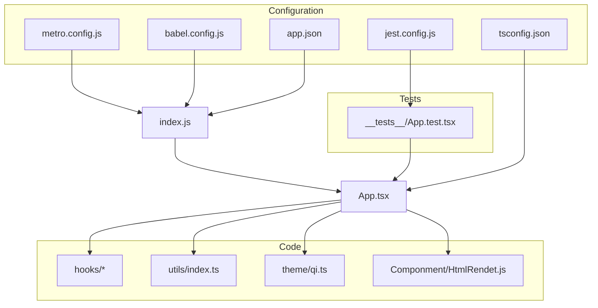
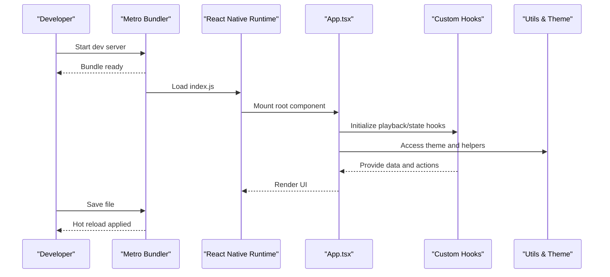
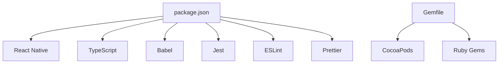

# Development Workflow and Setup

<cite>
**Referenced Files in This Document**
- [package.json](file://package.json)
- [metro.config.js](file://metro.config.js)
- [babel.config.js](file://babel.config.js)
- [jest.config.js](file://jest.config.js)
- [index.js](file://index.js)
- [App.tsx](file://App.tsx)
- [app.json](file://app.json)
- [tsconfig.json](file://tsconfig.json)
- [.eslintrc.js](file://.eslintrc.js)
- [.prettierrc](file://.prettierrc)
- [Gemfile](file://Gemfile)
- [README.md](file://README.md)
</cite>

## Table of Contents
1. [Introduction](#introduction)
2. [Project Structure](#project-structure)
3. [Core Components](#core-components)
4. [Architecture Overview](#architecture-overview)
5. [Detailed Component Analysis](#detailed-component-analysis)
6. [Dependency Analysis](#dependency-analysis)
7. [Performance Considerations](#performance-considerations)
8. [Troubleshooting Guide](#troubleshooting-guide)
9. [Conclusion](#conclusion)
10. [Appendices](#appendices)

## Introduction
This document provides a comprehensive development workflow for the video-rn project, covering environment setup, dependency installation, project initialization, Metro bundler configuration, hot reloading, build process, testing with Jest, debugging techniques, common commands, troubleshooting, and performance optimization tips during development. It is intended for both new contributors and experienced developers seeking a clear, step-by-step guide to working with this React Native application.

## Project Structure
The project follows a typical React Native structure with TypeScript support, custom hooks, theme utilities, and test coverage:
- Entry points: index.js (Metro entry), App.tsx (root component)
- Configuration: metro.config.js (Metro bundler), babel.config.js (Babel transforms), jest.config.js (Jest), tsconfig.json (TypeScript), app.json (React Native app metadata)
- Linting and formatting: .eslintrc.js, .prettierrc
- Utilities and hooks: utils/index.ts, hooks/*
- Theme: theme/qi.ts
- Tests: __tests__/App.test.tsx
- Documentation: docs/*

**Diagram sources**
- [index.js](file://index.js)
- [App.tsx](file://App.tsx)
- [metro.config.js](file://metro.config.js)
- [babel.config.js](file://babel.config.js)
- [jest.config.js](file://jest.config.js)
- [tsconfig.json](file://tsconfig.json)
- [app.json](file://app.json)
- [utils/index.ts](file://utils/index.ts)
- [theme/qi.ts](file://theme/qi.ts)
- [Componment/HtmlRendet.js](file://Componment/HtmlRendet.js)
- [__tests__/App.test.tsx](file://__tests__/App.test.tsx)

**Section sources**
- [README.md](file://README.md)

## Core Components
- Entry point and app bootstrap: index.js initializes the React Native app and mounts App.tsx as the root component.
- Root component: App.tsx defines the main UI tree and integrates hooks, theme, and utilities.
- Metro bundler: metro.config.js configures module resolution, transformers, and platform-specific behavior.
- Babel configuration: babel.config.js sets up transforms for TypeScript, JSX, and modern JavaScript features.
- Testing: jest.config.js configures Jest for TypeScript and React Native environments.
- TypeScript: tsconfig.json enforces type checking and compilation targets.
- App metadata: app.json contains app name, version, and platform-specific settings.

Key responsibilities:
- index.js: Bootstraps the app and registers it with React Native.
- App.tsx: Orchestrates components, hooks, and state management.
- metro.config.js: Ensures correct bundling for iOS/Android and custom modules.
- babel.config.js: Enables TSX/JSX parsing and polyfills.
- jest.config.js: Sets up test environment and module mapping for RN.
- tsconfig.json: Defines strictness, paths, and output options.
- app.json: Provides app identity and default configurations.

**Section sources**
- [index.js](file://index.js)
- [App.tsx](file://App.tsx)
- [metro.config.js](file://metro.config.js)
- [babel.config.js](file://babel.config.js)
- [jest.config.js](file://jest.config.js)
- [tsconfig.json](file://tsconfig.json)
- [app.json](file://app.json)

## Architecture Overview
At runtime, Metro bundles the app starting from index.js, which loads App.tsx. The app uses custom hooks for video playback logic, theme tokens for styling, and utility functions for shared logic. Jest runs tests against the same codebase using the configured transformer and environment.

**Diagram sources**
- [index.js](file://index.js)
- [App.tsx](file://App.tsx)
- [metro.config.js](file://metro.config.js)

## Detailed Component Analysis

### Environment Requirements and Setup
- Node.js: Use a recent LTS version compatible with your React Native CLI and dependencies.
- Ruby and CocoaPods: Required for iOS builds; ensure Gemfile dependencies are installed via bundle.
- Android/iOS toolchains: Install according to official React Native documentation for your OS.
- Git: For version control and collaboration.

Setup steps:
1. Clone the repository.
2. Install Node dependencies using the package manager defined in package.json.
3. If on macOS for iOS development, install Ruby gems specified in Gemfile using bundle install.
4. Verify Metro and React Native CLI availability.

Common pitfalls:
- Mismatched Node versions causing native module build failures.
- Missing CocoaPods or outdated gem versions leading to iOS build errors.
- Incompatible React Native CLI versions.

**Section sources**
- [package.json](file://package.json)
- [Gemfile](file://Gemfile)

### Dependency Installation
- Run the standard install command referenced by package.json scripts to fetch all dependencies.
- Ensure lock files (package-lock.json) are present to maintain deterministic installs.
- For iOS, run pod install after installing Node dependencies if required by native modules.

Verification:
- Confirm node_modules exists and key binaries are available.
- Test running the dev server to validate environment readiness.

**Section sources**
- [package.json](file://package.json)

### Project Initialization
- The app entry is index.js, which registers the app with React Native and renders App.tsx.
- app.json defines app metadata such as name and version.
- tsconfig.json configures TypeScript compilation and strictness.

Initialization checklist:
- Ensure index.js correctly imports and registers App.tsx.
- Validate app.json fields match your desired app identity.
- Confirm tsconfig.json includes necessary compiler options for React Native.

**Section sources**
- [index.js](file://index.js)
- [App.tsx](file://App.tsx)
- [app.json](file://app.json)
- [tsconfig.json](file://tsconfig.json)

### Development Server Startup and Metro Configuration
- Start the Metro dev server using the script defined in package.json.
- Metro reads metro.config.js for module resolution, transformers, and platform-specific settings.
- Babel transforms are applied via babel.config.js during bundling.

Hot reloading:
- Metro supports live reloading and fast refresh out of the box when configured correctly.
- Ensure no custom transformers conflict with Fast Refresh.

Commands:
- Start dev server: use the npm/yarn script from package.json.
- Launch on device/emulator: use React Native CLI commands as per platform.

**Section sources**
- [package.json](file://package.json)
- [metro.config.js](file://metro.config.js)
- [babel.config.js](file://babel.config.js)

### Build Process
- Production builds are typically initiated through React Native CLI commands for iOS and Android.
- Metro produces optimized bundles based on metro.config.js and babel.config.js.
- Ensure environment variables and flags are set appropriately for release builds.

Steps:
- Clean previous artifacts if needed.
- Run platform-specific build commands.
- Sign and distribute according to platform guidelines.

**Section sources**
- [metro.config.js](file://metro.config.js)
- [babel.config.js](file://babel.config.js)

### Testing Workflows with Jest
- Jest is configured via jest.config.js to work with TypeScript and React Native.
- Run tests using the script defined in package.json.
- Write tests under __tests__ directory; App.test.tsx demonstrates basic usage.

Tips:
- Mock native modules where necessary.
- Use snapshot testing sparingly and update snapshots intentionally.
- Leverage React Native Testing Library patterns for component tests.

**Section sources**
- [jest.config.js](file://jest.config.js)
- [package.json](file://package.json)
- [__tests__/App.test.tsx](file://__tests__/App.test.tsx)

### Debugging Techniques Specific to React Native
- Use React DevTools for inspecting component trees and state.
- Enable network logging and inspect Metro logs for bundling issues.
- On-device debugging: attach Chrome debugger for JS execution.
- Use console logging strategically and avoid excessive logs in production.

Best practices:
- Isolate issues by disabling custom hooks temporarily.
- Validate theme and utility functions independently.
- Use platform-specific logs for native crashes.

**Section sources**
- [App.tsx](file://App.tsx)
- [metro.config.js](file://metro.config.js)

### Common Development Commands
- Install dependencies: use the install script from package.json.
- Start dev server: use the start script from package.json.
- Run tests: use the test script from package.json.
- Lint and format: use ESLint and Prettier configurations.

Note: Replace placeholders with actual commands defined in package.json scripts.

**Section sources**
- [package.json](file://package.json)
- [.eslintrc.js](file://.eslintrc.js)
- [.prettierrc](file://.prettierrc)

### Troubleshooting Setup Issues
- Metro cannot resolve modules: verify metro.config.js and babel.config.js paths and plugins.
- iOS build fails: check CocoaPods installation and Gemfile.lock consistency.
- TypeScript errors: review tsconfig.json and ensure strict mode aligns with project needs.
- Jest test failures: confirm jest.config.js mappings and mocks for native modules.

Resolution strategies:
- Clear caches: remove node_modules and reinstall, clear Metro cache, and rebuild pods.
- Validate versions: ensure Node, Ruby, and CocoaPods versions meet requirements.
- Review logs: analyze error messages for missing dependencies or misconfigurations.

**Section sources**
- [metro.config.js](file://metro.config.js)
- [babel.config.js](file://babel.config.js)
- [jest.config.js](file://jest.config.js)
- [tsconfig.json](file://tsconfig.json)
- [Gemfile](file://Gemfile)

### Performance Optimization Tips During Development
- Minimize unnecessary re-renders by memoizing components and hooks.
- Avoid heavy computations in render paths; offload to Web Workers or background tasks where possible.
- Use lazy loading for large assets and modules.
- Profile with React Profiler to identify bottlenecks.
- Keep Metro transforms minimal to speed up bundling.

[No sources needed since this section provides general guidance]

## Dependency Analysis
The project’s core dependencies include React Native, TypeScript, Babel, Jest, ESLint, and Prettier. Platform-specific tooling like CocoaPods and Ruby gems are used for iOS development.

**Diagram sources**
- [package.json](file://package.json)
- [Gemfile](file://Gemfile)

**Section sources**
- [package.json](file://package.json)
- [Gemfile](file://Gemfile)

## Performance Considerations
- Optimize bundle size by removing unused dependencies and enabling tree shaking.
- Configure Metro to exclude non-essential modules from production builds.
- Use efficient data structures in hooks to reduce memory footprint.
- Monitor FPS and frame drops during development using profiling tools.

[No sources needed since this section provides general guidance]

## Troubleshooting Guide
- Metro bundling errors: Check transformer configuration and plugin compatibility.
- iOS build issues: Reinstall pods and ensure Ruby environment matches Gemfile.lock.
- TypeScript compilation failures: Align tsconfig.json with project structure and dependencies.
- Jest test environment problems: Verify mock setups and module mappings.

Actionable steps:
- Clear caches and reinstall dependencies.
- Validate environment versions and toolchain installations.
- Review error logs and isolate failing components or hooks.

**Section sources**
- [metro.config.js](file://metro.config.js)
- [babel.config.js](file://babel.config.js)
- [jest.config.js](file://jest.config.js)
- [tsconfig.json](file://tsconfig.json)
- [Gemfile](file://Gemfile)

## Conclusion
This guide outlines the complete development workflow for the video-rn project, from environment setup to building, testing, and debugging. By following these steps and leveraging the provided configurations, developers can efficiently iterate on features, maintain code quality, and optimize performance during development.

[No sources needed since this section summarizes without analyzing specific files]

## Appendices
- Additional documentation files: docs/* provide insights into flows, hooks, loading states, and state machines.
- Code style: Enforced via .eslintrc.js and .prettierrc for consistent formatting and linting.

**Section sources**
- [docs/STATE_MACHINE.md](file://docs/STATE_MACHINE.md)
- [docs/HOOKS.md](file://docs/HOOKS.md)
- [docs/LOADING.md](file://docs/LOADING.md)
- [docs/FLOWCHARTS.md](file://docs/FLOWCHARTS.md)
- [.eslintrc.js](file://.eslintrc.js)
- [.prettierrc](file://.prettierrc)