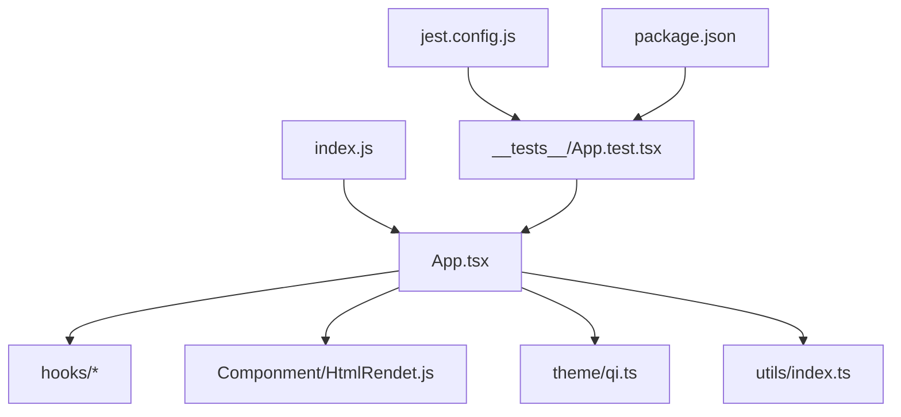
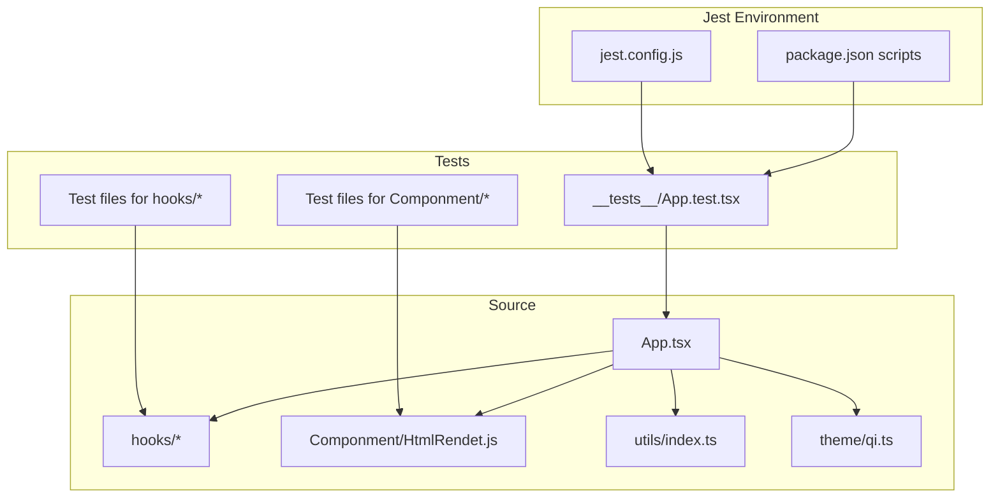
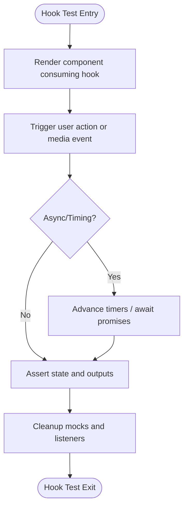
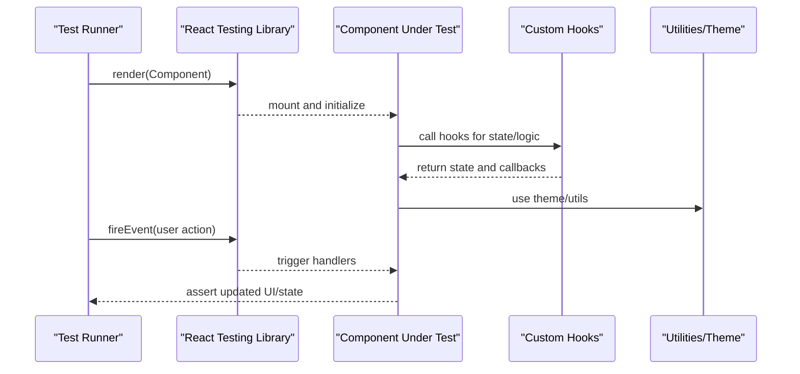
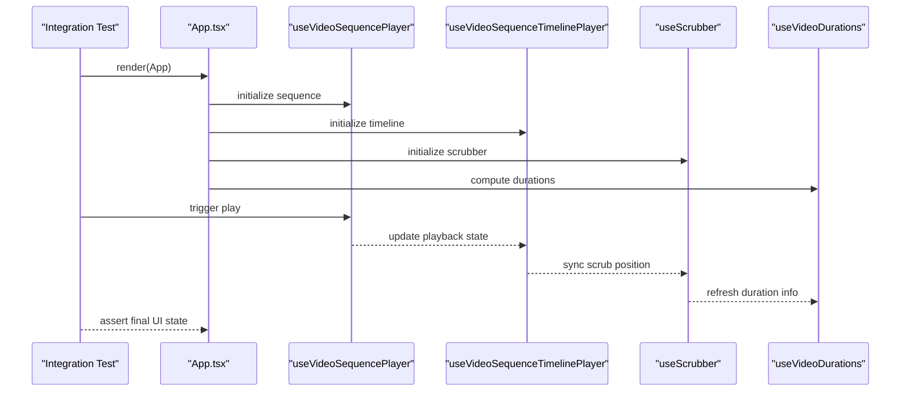
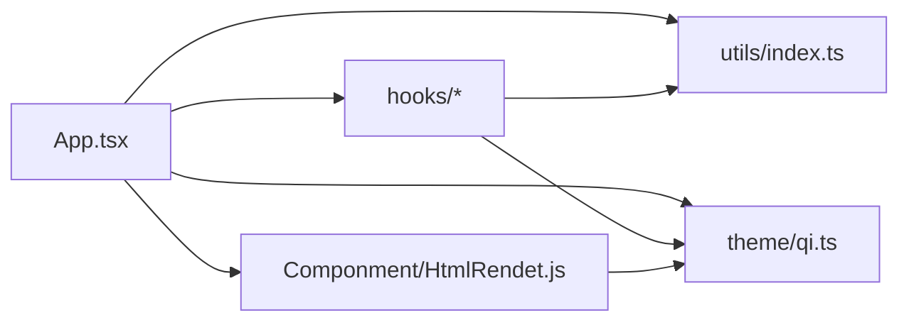

# Testing Strategy and Practices

<cite>
**Referenced Files in This Document**
- [App.test.tsx](file://__tests__/App.test.tsx)
- [jest.config.js](file://jest.config.js)
- [package.json](file://package.json)
- [useScrubber.ts](file://hooks/useScrubber.ts)
- [useVideoDurations.tsx](file://hooks/useVideoDurations.tsx)
- [useAutoHideControls.ts](file://hooks/useAutoHideControls.ts)
- [useVideoSequencePlayer.ts](file://hooks/useVideoSequencePlayer.ts)
- [useVideoSequenceTimelinePlayer.ts](file://hooks/useVideoSequenceTimelinePlayer.ts)
- [useVirtualTimeline.ts](file://hooks/useVirtualTimeline.ts)
- [index.js](file://index.js)
- [App.tsx](file://App.tsx)
- [HtmlRendet.js](file://Componment/HtmlRendet.js)
- [qi.ts](file://theme/qi.ts)
- [index.ts](file://utils/index.ts)
</cite>

## Table of Contents
1. [Introduction](#introduction)
2. [Project Structure](#project-structure)
3. [Core Components](#core-components)
4. [Architecture Overview](#architecture-overview)
5. [Detailed Component Analysis](#detailed-component-analysis)
6. [Dependency Analysis](#dependency-analysis)
7. [Performance Considerations](#performance-considerations)
8. [Troubleshooting Guide](#troubleshooting-guide)
9. [Conclusion](#conclusion)
10. [Appendices](#appendices)

## Introduction
This document defines the testing strategy for the video-rn project using Jest. It covers unit tests for custom hooks, component tests, and integration tests. It also explains test file organization, mocking strategies for video components, and approaches to testing asynchronous operations. Practical guidelines are provided for writing effective tests for video playback functionality, user interactions, and state management, with examples mapped to hooks such as useScrubber, useVideoDurations, and related components.

## Project Structure
The repository follows a clear separation between application code, hooks, utilities, theme, and tests:
- Application entry points: index.js, App.tsx
- Custom hooks under hooks/: useScrubber, useVideoDurations, useAutoHideControls, useVideoSequencePlayer, useVideoSequenceTimelinePlayer, useVirtualTimeline
- UI components under Componment/: HtmlRendet.js
- Theme and utilities under theme/ and utils/
- Tests under __tests__/ with an initial App.test.tsx
- Jest configuration via jest.config.js and package.json scripts

**Diagram sources**
- [index.js](file://index.js)
- [App.tsx](file://App.tsx)
- [useScrubber.ts](file://hooks/useScrubber.ts)
- [useVideoDurations.tsx](file://hooks/useVideoDurations.tsx)
- [useAutoHideControls.ts](file://hooks/useAutoHideControls.ts)
- [useVideoSequencePlayer.ts](file://hooks/useVideoSequencePlayer.ts)
- [useVideoSequenceTimelinePlayer.ts](file://hooks/useVideoSequenceTimelinePlayer.ts)
- [useVirtualTimeline.ts](file://hooks/useVirtualTimeline.ts)
- [HtmlRendet.js](file://Componment/HtmlRendet.js)
- [qi.ts](file://theme/qi.ts)
- [index.ts](file://utils/index.ts)
- [App.test.tsx](file://__tests__/App.test.tsx)
- [jest.config.js](file://jest.config.js)
- [package.json](file://package.json)

**Section sources**
- [index.js](file://index.js)
- [App.tsx](file://App.tsx)
- [App.test.tsx](file://__tests__/App.test.tsx)
- [jest.config.js](file://jest.config.js)
- [package.json](file://package.json)

## Core Components
Key areas that require testing include:
- Custom hooks for scrubbing, duration calculation, auto-hiding controls, sequence playback, timeline playback, and virtualized timeline
- UI components rendering HTML content
- Application entry and root component behavior
- Utilities and theme usage within components

Testing priorities:
- Hook logic correctness (state transitions, event handling, timing)
- Component rendering and user interactions
- Integration flows across hooks and components
- Asynchronous operations like media loading and events

**Section sources**
- [useScrubber.ts](file://hooks/useScrubber.ts)
- [useVideoDurations.tsx](file://hooks/useVideoDurations.tsx)
- [useAutoHideControls.ts](file://hooks/useAutoHideControls.ts)
- [useVideoSequencePlayer.ts](file://hooks/useVideoSequencePlayer.ts)
- [useVideoSequenceTimelinePlayer.ts](file://hooks/useVideoSequenceTimelinePlayer.ts)
- [useVirtualTimeline.ts](file://hooks/useVirtualTimeline.ts)
- [HtmlRendet.js](file://Componment/HtmlRendet.js)
- [App.tsx](file://App.tsx)

## Architecture Overview
The testing architecture centers on Jest configuration and modular test files aligned with source modules:
- Unit tests for hooks validate internal state and side effects
- Component tests render React components in isolation with mocked dependencies
- Integration tests verify end-to-end flows from App entry through hooks and components

**Diagram sources**
- [jest.config.js](file://jest.config.js)
- [package.json](file://package.json)
- [App.test.tsx](file://__tests__/App.test.tsx)
- [App.tsx](file://App.tsx)
- [useScrubber.ts](file://hooks/useScrubber.ts)
- [useVideoDurations.tsx](file://hooks/useVideoDurations.tsx)
- [useAutoHideControls.ts](file://hooks/useAutoHideControls.ts)
- [useVideoSequencePlayer.ts](file://hooks/useVideoSequencePlayer.ts)
- [useVideoSequenceTimelinePlayer.ts](file://hooks/useVideoSequenceTimelinePlayer.ts)
- [useVirtualTimeline.ts](file://hooks/useVirtualTimeline.ts)
- [HtmlRendet.js](file://Componment/HtmlRendet.js)
- [index.ts](file://utils/index.ts)
- [qi.ts](file://theme/qi.ts)

## Detailed Component Analysis

### Hook Testing Strategy
Focus areas for hook tests:
- State updates triggered by user actions or media events
- Timing-based behaviors (auto-hide controls, scrubbing progress)
- Sequence playback state transitions
- Virtual timeline calculations and boundaries

Recommended patterns:
- Use React Testing Library to render components that consume hooks
- Mock external APIs or native modules if required
- Assert state changes and callbacks over time using timers

Example test cases:
- useScrubber: Validate scrub position updates on input events; ensure correct boundary clamping and debounced updates
- useVideoDurations: Verify computed durations update when media metadata loads; handle missing or invalid metadata gracefully
- useAutoHideControls: Confirm controls hide after timeout and show on interaction
- useVideoSequencePlayer: Test play/pause, next/previous transitions, and error states
- useVideoSequenceTimelinePlayer: Ensure timeline positions sync with playback and scrubbing
- useVirtualTimeline: Check viewport calculations and item visibility ranges

[No sources needed since this diagram shows conceptual workflow, not actual code structure]

**Section sources**
- [useScrubber.ts](file://hooks/useScrubber.ts)
- [useVideoDurations.tsx](file://hooks/useVideoDurations.tsx)
- [useAutoHideControls.ts](file://hooks/useAutoHideControls.ts)
- [useVideoSequencePlayer.ts](file://hooks/useVideoSequencePlayer.ts)
- [useVideoSequenceTimelinePlayer.ts](file://hooks/useVideoSequenceTimelinePlayer.ts)
- [useVirtualTimeline.ts](file://hooks/useVirtualTimeline.ts)

### Component Testing Strategy
Focus areas for component tests:
- Rendering of HTML content via HtmlRendet.js
- Interaction handlers and visual feedback
- Correct integration with hooks and theme

Recommended patterns:
- Render components with minimal context providers if needed
- Mock any platform-specific APIs or third-party libraries
- Simulate user interactions and assert DOM changes

Example test cases:
- HtmlRendet: Verify rendered HTML structure and accessibility attributes
- App: Ensure root layout renders expected sections and integrates hooks correctly

**Diagram sources**
- [HtmlRendet.js](file://Componment/HtmlRendet.js)
- [App.tsx](file://App.tsx)
- [useScrubber.ts](file://hooks/useScrubber.ts)
- [useVideoDurations.tsx](file://hooks/useVideoDurations.tsx)
- [index.ts](file://utils/index.ts)
- [qi.ts](file://theme/qi.ts)

**Section sources**
- [HtmlRendet.js](file://Componment/HtmlRendet.js)
- [App.tsx](file://App.tsx)

### Integration Testing Strategy
Integration tests should cover:
- Full flow from App initialization through hooks and components
- Media loading lifecycle and state synchronization
- Error handling paths and recovery

Recommended patterns:
- Use a minimal setup similar to the app’s entry point
- Mock network or native modules only where necessary
- Assert end-to-end outcomes like final UI state and hook outputs

Example test cases:
- App bootstraps and renders core sections
- Video sequence playback completes and updates timeline
- Scrubbing updates duration display and current position

**Diagram sources**
- [App.tsx](file://App.tsx)
- [useVideoSequencePlayer.ts](file://hooks/useVideoSequencePlayer.ts)
- [useVideoSequenceTimelinePlayer.ts](file://hooks/useVideoSequenceTimelinePlayer.ts)
- [useScrubber.ts](file://hooks/useScrubber.ts)
- [useVideoDurations.tsx](file://hooks/useVideoDurations.tsx)

**Section sources**
- [App.tsx](file://App.tsx)
- [useVideoSequencePlayer.ts](file://hooks/useVideoSequencePlayer.ts)
- [useVideoSequenceTimelinePlayer.ts](file://hooks/useVideoSequenceTimelinePlayer.ts)
- [useScrubber.ts](file://hooks/useScrubber.ts)
- [useVideoDurations.tsx](file://hooks/useVideoDurations.tsx)

## Dependency Analysis
Dependencies relevant to testing:
- App depends on hooks, components, utilities, and theme
- Hooks may depend on utilities and theme
- Components may depend on hooks and theme

**Diagram sources**
- [App.tsx](file://App.tsx)
- [useScrubber.ts](file://hooks/useScrubber.ts)
- [useVideoDurations.tsx](file://hooks/useVideoDurations.tsx)
- [useAutoHideControls.ts](file://hooks/useAutoHideControls.ts)
- [useVideoSequencePlayer.ts](file://hooks/useVideoSequencePlayer.ts)
- [useVideoSequenceTimelinePlayer.ts](file://hooks/useVideoSequenceTimelinePlayer.ts)
- [useVirtualTimeline.ts](file://hooks/useVirtualTimeline.ts)
- [HtmlRendet.js](file://Componment/HtmlRendet.js)
- [index.ts](file://utils/index.ts)
- [qi.ts](file://theme/qi.ts)

**Section sources**
- [App.tsx](file://App.tsx)
- [useScrubber.ts](file://hooks/useScrubber.ts)
- [useVideoDurations.tsx](file://hooks/useVideoDurations.tsx)
- [useAutoHideControls.ts](file://hooks/useAutoHideControls.ts)
- [useVideoSequencePlayer.ts](file://hooks/useVideoSequencePlayer.ts)
- [useVideoSequenceTimelinePlayer.ts](file://hooks/useVideoSequenceTimelinePlayer.ts)
- [useVirtualTimeline.ts](file://hooks/useVirtualTimeline.ts)
- [HtmlRendet.js](file://Componment/HtmlRendet.js)
- [index.ts](file://utils/index.ts)
- [qi.ts](file://theme/qi.ts)

## Performance Considerations
- Keep tests fast by isolating logic and avoiding heavy rendering
- Use timers judiciously; prefer controlled timers for deterministic async tests
- Mock expensive operations (network, native modules) to reduce flakiness
- Prefer shallow or focused renders for component tests when possible

[No sources needed since this section provides general guidance]

## Troubleshooting Guide
Common issues and resolutions:
- Jest configuration errors: Verify jest.config.js settings and Node version compatibility
- Module resolution failures: Ensure proper module aliases and polyfills
- Flaky async tests: Stabilize timers and await promises explicitly
- Native module mocks: Provide consistent mocks for platform-specific APIs

Checklist:
- Confirm package.json scripts invoke Jest correctly
- Validate jest.config.js paths and transforms
- Ensure all mocks are cleaned up between tests
- Use console logs sparingly and rely on assertions

**Section sources**
- [jest.config.js](file://jest.config.js)
- [package.json](file://package.json)

## Conclusion
Adopting a structured testing strategy for video-rn ensures reliability across hooks, components, and integrations. By focusing on unit, component, and integration tests, and applying robust mocking and async handling, the team can maintain high confidence in video playback functionality, user interactions, and state management.

[No sources needed since this section summarizes without analyzing specific files]

## Appendices

### Test File Organization Guidelines
- Place hook tests near their source or under a dedicated hooks test directory
- Group component tests by feature or screen
- Maintain integration tests that mirror app entry flows
- Keep shared mocks and helpers in a common location

### Mocking Strategies for Video Components
- Mock media events and lifecycle methods
- Stub native modules or third-party libraries used by video components
- Provide deterministic data for durations and timelines

### Examples of Test Cases
- useScrubber: Validate scrub position updates and boundary constraints
- useVideoDurations: Assert duration computation on metadata load and error handling
- useAutoHideControls: Confirm hide/show behavior on timeouts and interactions
- useVideoSequencePlayer: Test play/pause and sequence navigation
- useVideoSequenceTimelinePlayer: Ensure timeline sync with playback
- useVirtualTimeline: Verify viewport calculations and visibility ranges
- HtmlRendet: Check rendered HTML structure and attributes
- App: Validate root rendering and hook integration

[No sources needed since this section provides general guidance]