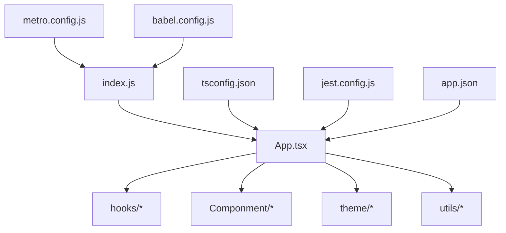
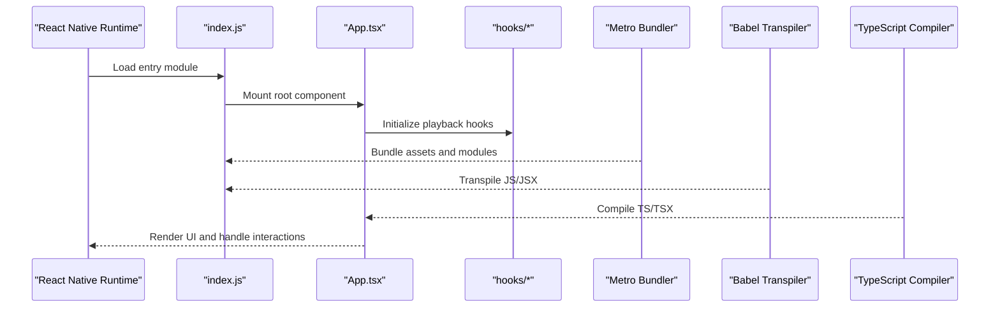
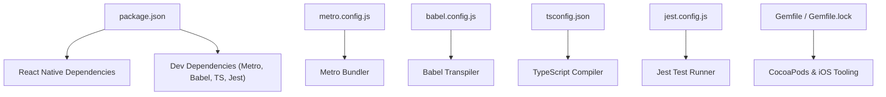

# Getting Started

<cite>
**Referenced Files in This Document**
- [README.md](file://README.md)
- [package.json](file://package.json)
- [App.tsx](file://App.tsx)
- [index.js](file://index.js)
- [metro.config.js](file://metro.config.js)
- [babel.config.js](file://babel.config.js)
- [tsconfig.json](file://tsconfig.json)
- [jest.config.js](file://jest.config.js)
- [app.json](file://app.json)
- [hooks/useVideoDurations.tsx](file://hooks/useVideoDurations.tsx)
- [hooks/useAutoHideControls.ts](file://hooks/useAutoHideControls.ts)
- [hooks/useScrubber.ts](file://hooks/useScrubber.ts)
- [hooks/useVideoSequencePlayer.ts](file://hooks/useVideoSequencePlayer.ts)
- [hooks/useVideoSequenceTimelinePlayer.ts](file://hooks/useVideoSequenceTimelinePlayer.ts)
- [hooks/useVirtualTimeline.ts](file://hooks/useVirtualTimeline.ts)
- [Componment/HtmlRendet.js](file://Componment/HtmlRendet.js)
- [theme/qi.ts](file://theme/qi.ts)
- [utils/index.ts](file://utils/index.ts)
- [.eslintrc.js](file://.eslintrc.js)
- [.prettierrc](file://.prettierrc)
- [.prettierignore](file://.prettierignore)
- [Gemfile](file://Gemfile)
- [Gemfile.lock](file://Gemfile.lock)
</cite>

## Table of Contents
1. [Introduction](#introduction)
2. [Project Structure](#project-structure)
3. [Core Components](#core-components)
4. [Architecture Overview](#architecture-overview)
5. [Detailed Component Analysis](#detailed-component-analysis)
6. [Dependency Analysis](#dependency-analysis)
7. [Performance Considerations](#performance-considerations)
8. [Troubleshooting Guide](#troubleshooting-guide)
9. [Conclusion](#conclusion)
10. [Appendices](#appendices)

## Introduction
This guide helps you set up and run the video-rn React Native project, configure Metro bundler and TypeScript, prepare for testing, and implement basic video playback using the provided hooks and components. It includes step-by-step instructions for iOS and Android, common setup issues, and quick start examples tailored to this codebase.

## Project Structure
The project is a React Native application with:
- Entry points: index.js (React Native entry), App.tsx (root component)
- Bundling and compilation: metro.config.js, babel.config.js, tsconfig.json
- Testing: jest.config.js
- Platform configuration: app.json
- Hooks and utilities under hooks/, utils/, theme/, Componment/
- Linting and formatting: .eslintrc.js, .prettierrc, .prettierignore
- Ruby dependencies for iOS tooling: Gemfile, Gemfile.lock

**Diagram sources**
- [index.js](file://index.js)
- [App.tsx](file://App.tsx)
- [metro.config.js](file://metro.config.js)
- [babel.config.js](file://babel.config.js)
- [tsconfig.json](file://tsconfig.json)
- [jest.config.js](file://jest.config.js)
- [app.json](file://app.json)

**Section sources**
- [README.md](file://README.md)
- [package.json](file://package.json)
- [index.js](file://index.js)
- [App.tsx](file://App.tsx)
- [metro.config.js](file://metro.config.js)
- [babel.config.js](file://babel.config.js)
- [tsconfig.json](file://tsconfig.json)
- [jest.config.js](file://jest.config.js)
- [app.json](file://app.json)

## Core Components
- Entry point and root component
  - index.js initializes the React Native app and mounts App.tsx as the root component.
  - App.tsx serves as the main UI entry and integrates hooks and components for video playback.
- Hooks for video playback
  - useVideoDurations.tsx: manages video duration calculations and metadata.
  - useAutoHideControls.ts: controls visibility of playback UI elements.
  - useScrubber.ts: handles scrubbing and seeking within the timeline.
  - useVideoSequencePlayer.ts: orchestrates sequential playback of multiple videos.
  - useVideoSequenceTimelinePlayer.ts: combines sequence playback with timeline navigation.
  - useVirtualTimeline.ts: provides virtualized timeline rendering and interaction.
- UI and theming
  - Componment/HtmlRendet.js: renders HTML-like content where needed.
  - theme/qi.ts: centralized theme definitions used across components.
- Utilities
  - utils/index.ts: shared helpers used by hooks and components.

**Section sources**
- [index.js](file://index.js)
- [App.tsx](file://App.tsx)
- [hooks/useVideoDurations.tsx](file://hooks/useVideoDurations.tsx)
- [hooks/useAutoHideControls.ts](file://hooks/useAutoHideControls.ts)
- [hooks/useScrubber.ts](file://hooks/useScrubber.ts)
- [hooks/useVideoSequencePlayer.ts](file://hooks/useVideoSequencePlayer.ts)
- [hooks/useVideoSequenceTimelinePlayer.ts](file://hooks/useVideoSequenceTimelinePlayer.ts)
- [hooks/useVirtualTimeline.ts](file://hooks/useVirtualTimeline.ts)
- [Componment/HtmlRendet.js](file://Componment/HtmlRendet.js)
- [theme/qi.ts](file://theme/qi.ts)
- [utils/index.ts](file://utils/index.ts)

## Architecture Overview
At runtime, index.js boots the React Native environment and loads App.tsx. The root component composes hooks from the hooks directory to manage state and behavior for video playback. Theming and utilities are consumed throughout the UI layer. Metro bundles assets and JS, while Babel transpiles modern syntax and TypeScript compiles TSX/TS files according to tsconfig.json. Jest is configured for unit tests.

**Diagram sources**
- [index.js](file://index.js)
- [App.tsx](file://App.tsx)
- [metro.config.js](file://metro.config.js)
- [babel.config.js](file://babel.config.js)
- [tsconfig.json](file://tsconfig.json)

## Detailed Component Analysis

### Installation and Environment Setup
- Prerequisites
  - Node.js and a package manager (npm or yarn).
  - For iOS: Xcode, CocoaPods, and Ruby gems specified by Gemfile.
  - For Android: Android Studio, JDK, and Android SDK configured.
- Install dependencies
  - Use your preferred package manager to install all project dependencies listed in package.json.
- Configure Metro
  - metro.config.js defines asset handling and resolver settings used by the bundler.
- Configure Babel and TypeScript
  - babel.config.js sets transformation rules for JS/JSX and other features.
  - tsconfig.json configures TypeScript compilation targets and paths.
- Prepare testing
  - jest.config.js sets up Jest for running tests against TS/TSX files.

**Section sources**
- [package.json](file://package.json)
- [metro.config.js](file://metro.config.js)
- [babel.config.js](file://babel.config.js)
- [tsconfig.json](file://tsconfig.json)
- [jest.config.js](file://jest.config.js)
- [Gemfile](file://Gemfile)
- [Gemfile.lock](file://Gemfile.lock)

### Running the Application
- Start the development server
  - Launch the Metro bundler via your package manager’s scripts defined in package.json.
- Run on devices/emulators
  - iOS: Build and launch using Xcode or CLI commands after installing CocoaPods dependencies.
  - Android: Build and launch using Android Studio or CLI tools.

**Section sources**
- [package.json](file://package.json)
- [index.js](file://index.js)
- [app.json](file://app.json)

### Basic Video Playback Quick Start
- Create a simple screen that uses the provided hooks to play a single video:
  - Import and initialize useVideoDurations to track durations.
  - Use useAutoHideControls to manage control visibility during playback.
  - Optionally integrate useScrubber for seeking functionality.
- Compose a minimal UI around these hooks to render the video player and controls.

**Section sources**
- [hooks/useVideoDurations.tsx](file://hooks/useVideoDurations.tsx)
- [hooks/useAutoHideControls.ts](file://hooks/useAutoHideControls.ts)
- [hooks/useScrubber.ts](file://hooks/useScrubber.ts)
- [App.tsx](file://App.tsx)

### Sequential Video Playback
- Use useVideoSequencePlayer to manage an array of video sources and playback order.
- Combine with useVideoSequenceTimelinePlayer to navigate through the sequence via timeline controls.
- Integrate useVirtualTimeline for efficient rendering when dealing with many items.

**Section sources**
- [hooks/useVideoSequencePlayer.ts](file://hooks/useVideoSequencePlayer.ts)
- [hooks/useVideoSequenceTimelinePlayer.ts](file://hooks/useVideoSequenceTimelinePlayer.ts)
- [hooks/useVirtualTimeline.ts](file://hooks/useVirtualTimeline.ts)

### Theming and Shared Utilities
- Centralize colors, typography, and spacing in theme/qi.ts and consume across components.
- Reuse helper functions from utils/index.ts to avoid duplication in hooks and components.

**Section sources**
- [theme/qi.ts](file://theme/qi.ts)
- [utils/index.ts](file://utils/index.ts)

### HTML Rendering Component
- If your app needs to render HTML-like content, import and use Componment/HtmlRendet.js where appropriate.

**Section sources**
- [Componment/HtmlRendet.js](file://Componment/HtmlRendet.js)

## Dependency Analysis
The project relies on:
- React Native core and platform-specific dependencies declared in package.json.
- Metro bundler configuration for asset resolution and transforms.
- Babel plugins for transpilation and JSX support.
- TypeScript compiler options for type checking and build outputs.
- Jest for unit testing with appropriate presets for React Native and TS.
- Ruby gems for iOS toolchain integration (CocoaPods, etc.).

**Diagram sources**
- [package.json](file://package.json)
- [metro.config.js](file://metro.config.js)
- [babel.config.js](file://babel.config.js)
- [tsconfig.json](file://tsconfig.json)
- [jest.config.js](file://jest.config.js)
- [Gemfile](file://Gemfile)
- [Gemfile.lock](file://Gemfile.lock)

**Section sources**
- [package.json](file://package.json)
- [metro.config.js](file://metro.config.js)
- [babel.config.js](file://babel.config.js)
- [tsconfig.json](file://tsconfig.json)
- [jest.config.js](file://jest.config.js)
- [Gemfile](file://Gemfile)
- [Gemfile.lock](file://Gemfile.lock)

## Performance Considerations
- Prefer using useVirtualTimeline when rendering large lists of videos to reduce memory usage and improve scroll performance.
- Avoid unnecessary re-renders by memoizing derived values and stabilizing hook inputs.
- Keep media assets optimized and leverage caching strategies where applicable.
- Monitor bundle size; ensure only necessary dependencies are included.

[No sources needed since this section provides general guidance]

## Troubleshooting Guide
Common setup issues and resolutions:
- Metro bundler errors
  - Clear Metro cache and restart the dev server.
  - Verify metro.config.js does not conflict with asset paths.
- TypeScript compilation failures
  - Ensure tsconfig.json matches your project structure and target platforms.
  - Confirm imports resolve correctly and types are installed.
- Babel transform issues
  - Check babel.config.js for required plugins and presets.
  - Restart the bundler after updating configuration.
- iOS build problems
  - Install/update CocoaPods dependencies using the Gemfile.
  - Ensure Xcode command line tools are set correctly.
- Android build problems
  - Validate Android SDK and JDK versions match project requirements.
  - Clean and rebuild if native builds fail.
- Testing setup
  - Verify jest.config.js presets for React Native and TS.
  - Run tests with the script defined in package.json.

**Section sources**
- [metro.config.js](file://metro.config.js)
- [babel.config.js](file://babel.config.js)
- [tsconfig.json](file://tsconfig.json)
- [jest.config.js](file://jest.config.js)
- [Gemfile](file://Gemfile)
- [Gemfile.lock](file://Gemfile.lock)
- [package.json](file://package.json)

## Conclusion
You now have the essential steps to install dependencies, configure Metro and TypeScript, run the app on iOS and Android, and implement basic video playback using the provided hooks. Refer to the troubleshooting section for common pitfalls and consult the hooks documentation for advanced playback scenarios.

[No sources needed since this section summarizes without analyzing specific files]

## Appendices

### Quick Start Examples
- Single video playback
  - Initialize useVideoDurations and useAutoHideControls in a new component.
  - Render a minimal player UI and wire up play/pause and scrubbing via useScrubber.
- Sequential playback
  - Provide an array of video sources to useVideoSequencePlayer.
  - Use useVideoSequenceTimelinePlayer to navigate between items and update the timeline.

**Section sources**
- [hooks/useVideoDurations.tsx](file://hooks/useVideoDurations.tsx)
- [hooks/useAutoHideControls.ts](file://hooks/useAutoHideControls.ts)
- [hooks/useScrubber.ts](file://hooks/useScrubber.ts)
- [hooks/useVideoSequencePlayer.ts](file://hooks/useVideoSequencePlayer.ts)
- [hooks/useVideoSequenceTimelinePlayer.ts](file://hooks/useVideoSequenceTimelinePlayer.ts)

### Code Quality Tools
- ESLint configuration is defined in .eslintrc.js.
- Prettier formatting is controlled by .prettierrc and .prettierignore.

**Section sources**
- [.eslintrc.js](file://.eslintrc.js)
- [.prettierrc](file://.prettierrc)
- [.prettierignore](file://.prettierignore)