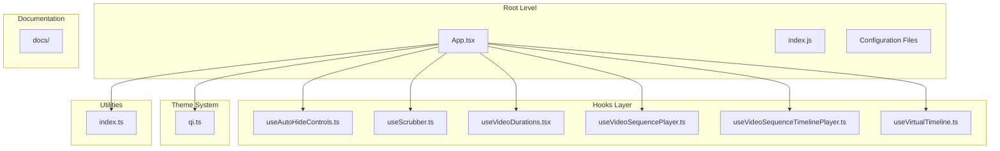
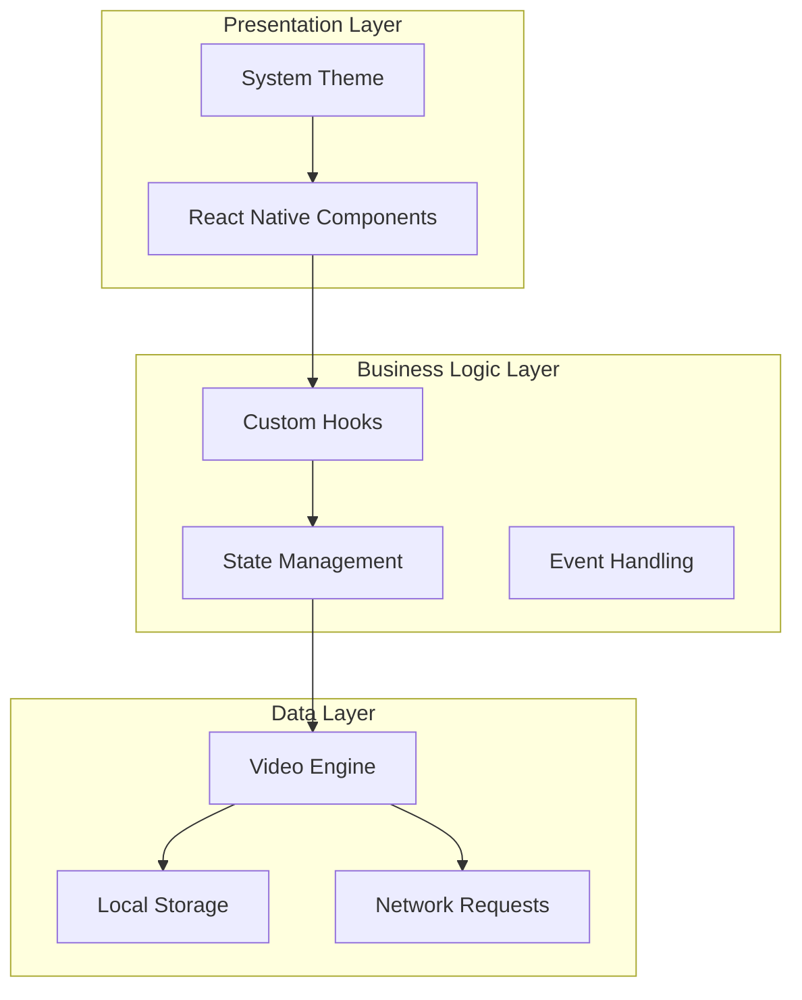
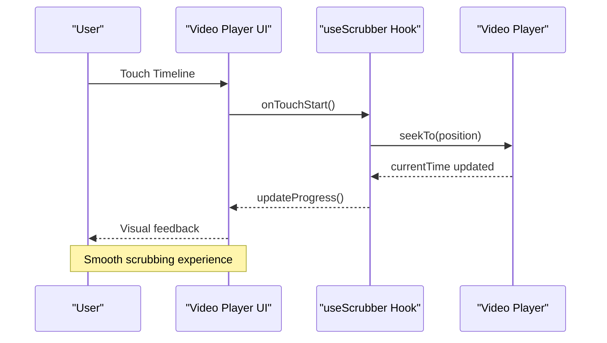
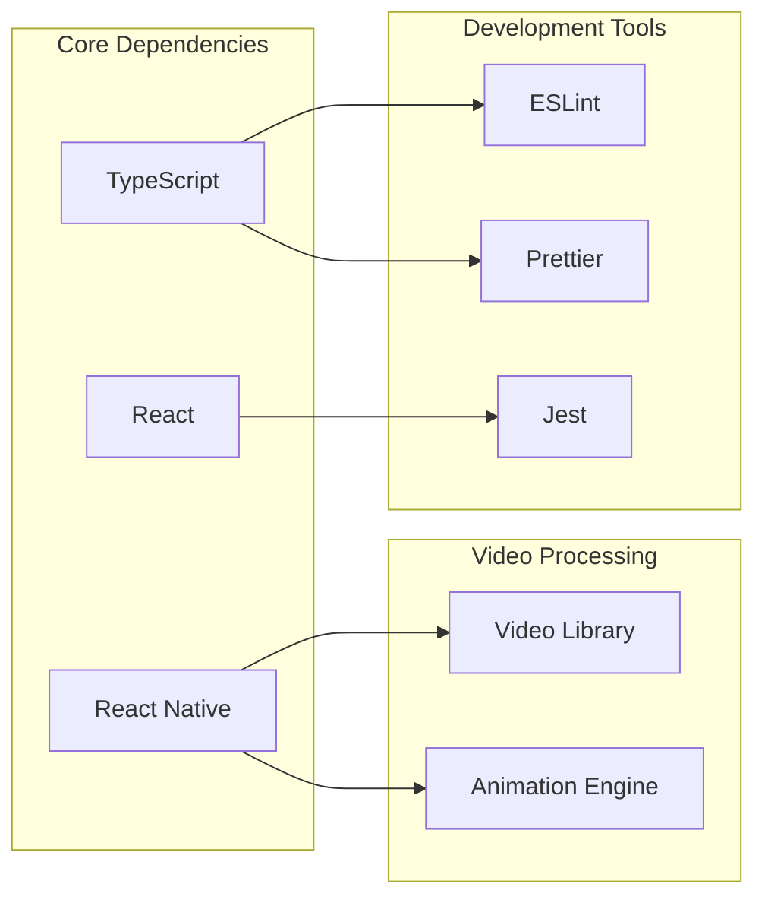

# Project Overview

<cite>
**Referenced Files in This Document**
- [App.tsx](file://App.tsx)
- [index.js](file://index.js)
- [package.json](file://package.json)
- [tsconfig.json](file://tsconfig.json)
- [useAutoHideControls.ts](file://hooks/useAutoHideControls.ts)
- [useScrubber.ts](file://hooks/useScrubber.ts)
- [useVideoDurations.tsx](file://hooks/useVideoDurations.tsx)
- [useVideoSequencePlayer.ts](file://hooks/useVideoSequencePlayer.ts)
- [useVideoSequenceTimelinePlayer.ts](file://hooks/useVideoSequenceTimelinePlayer.ts)
- [useVirtualTimeline.ts](file://hooks/useVirtualTimeline.ts)
- [qi.ts](file://theme/qi.ts)
- [index.ts](file://utils/index.ts)
- [FLOWCHARTS.md](file://docs/FLOWCHARTS.md)
- [HOOKS.md](file://docs/HOOKS.md)
- [LOADING.md](file://docs/LOADING.md)
- [STATE_MACHINE.md](file://docs/STATE_MACHINE.md)
</cite>

## Table of Contents
1. [Introduction](#introduction)
2. [Project Structure](#project-structure)
3. [Core Components](#core-components)
4. [Architecture Overview](#architecture-overview)
5. [Detailed Component Analysis](#detailed-component-analysis)
6. [Dependency Analysis](#dependency-analysis)
7. [Performance Considerations](#performance-considerations)
8. [Troubleshooting Guide](#troubleshooting-guide)
9. [Conclusion](#conclusion)

## Introduction

The video-rn project is a sophisticated mobile video player application built with React Native that provides advanced video playback capabilities for modern mobile applications. This project serves as a comprehensive solution for developers who need to implement professional-grade video players with custom controls, timeline navigation, and sequence playback functionality.

### Key Features

The application delivers several advanced features designed to enhance the user experience:

- **Custom Controls**: Fully customizable video player interface with responsive design
- **Interactive Scrubbing**: Smooth timeline navigation with real-time preview capabilities
- **Auto-hiding Controls**: Intelligent control visibility management for optimal viewing experience
- **Virtual Timeline**: Performance-optimized timeline rendering for large video libraries
- **Video Sequence Management**: Seamless playback of multiple videos in predefined sequences
- **Theme-based Styling**: Consistent visual design system across all components

### Target Audience

This project is specifically designed for mobile developers building video applications with React Native who require:

- Professional-grade video player functionality
- Customizable user interfaces
- High-performance video processing
- Modern development practices with TypeScript
- Comprehensive state management patterns

## Project Structure

The video-rn project follows a modular architecture pattern that promotes code reusability and maintainability. The structure is organized by functional areas rather than file types, making it easier to locate and understand related functionality.

**Diagram sources**
- [App.tsx](file://App.tsx)
- [index.js](file://index.js)
- [hooks/useAutoHideControls.ts](file://hooks/useAutoHideControls.ts)
- [hooks/useScrubber.ts](file://hooks/useScrubber.ts)
- [hooks/useVideoDurations.tsx](file://hooks/useVideoDurations.tsx)
- [hooks/useVideoSequencePlayer.ts](file://hooks/useVideoSequencePlayer.ts)
- [hooks/useVideoSequenceTimelinePlayer.ts](file://hooks/useVideoSequenceTimelinePlayer.ts)
- [hooks/useVirtualTimeline.ts](file://hooks/useVirtualTimeline.ts)
- [theme/qi.ts](file://theme/qi.ts)
- [utils/index.ts](file://utils/index.ts)

**Section sources**
- [App.tsx](file://App.tsx)
- [index.js](file://index.js)
- [package.json](file://package.json)

## Core Components

The video-rn project implements a custom hooks pattern that separates business logic from UI components, promoting reusability and testability. Each hook encapsulates specific functionality related to video playback and user interaction.

### Custom Hooks Architecture

The hooks layer provides the core functionality for the video player:

#### Video Control Hooks
- **useAutoHideControls**: Manages automatic hiding of player controls based on user inactivity
- **useScrubber**: Handles interactive timeline scrubbing with smooth animations
- **useVideoDurations**: Calculates and manages video duration information

#### Playback Management Hooks
- **useVideoSequencePlayer**: Orchestrates sequential video playback with transition effects
- **useVideoSequenceTimelinePlayer**: Combines sequence management with timeline navigation
- **useVirtualTimeline**: Implements virtualized timeline rendering for performance optimization

### State Management Pattern

The project uses React's useState and useEffect hooks extensively for state management, following modern React patterns. Each hook maintains its own state and provides methods to update that state, creating a clean separation of concerns.

**Section sources**
- [hooks/useAutoHideControls.ts](file://hooks/useAutoHideControls.ts)
- [hooks/useScrubber.ts](file://hooks/useScrubber.ts)
- [hooks/useVideoDurations.tsx](file://hooks/useVideoDurations.tsx)
- [hooks/useVideoSequencePlayer.ts](file://hooks/useVideoSequencePlayer.ts)
- [hooks/useVideoSequenceTimelinePlayer.ts](file://hooks/useVideoSequenceTimelinePlayer.ts)
- [hooks/useVirtualTimeline.ts](file://hooks/useVirtualTimeline.ts)

## Architecture Overview

The video-rn project follows a layered architecture pattern that emphasizes separation of concerns and modularity. The architecture consists of three primary layers: presentation, business logic, and data management.

**Diagram sources**
- [App.tsx](file://App.tsx)
- [theme/qi.ts](file://theme/qi.ts)
- [hooks/useVideoSequencePlayer.ts](file://hooks/useVideoSequencePlayer.ts)

### Design Patterns

The project implements several key design patterns:

1. **Custom Hooks Pattern**: Encapsulates reusable logic in function components
2. **Composition Pattern**: Combines smaller hooks to create complex functionality
3. **Observer Pattern**: Uses React's state system for reactive updates
4. **Factory Pattern**: Creates different video player configurations

**Section sources**
- [App.tsx](file://App.tsx)
- [theme/qi.ts](file://theme/qi.ts)

## Detailed Component Analysis

### Video Player Hook System

The custom hooks system forms the backbone of the video player functionality. Each hook is designed to be independent yet composable, allowing developers to use only the functionality they need.

#### Auto-Hide Controls Hook

The `useAutoHideControls` hook manages the automatic display and hiding of player controls based on user interaction patterns. It implements timeout-based logic to hide controls after periods of inactivity while maintaining responsiveness to user input.

#### Scrubber Hook

The `useScrubber` hook handles all timeline scrubbing interactions, including touch events, mouse events, and programmatic position changes. It provides smooth animations and accurate time positioning.

#### Virtual Timeline Hook

The `useVirtualTimeline` hook implements virtualization techniques to optimize performance when dealing with large video libraries or long timelines. It renders only visible elements and efficiently manages memory usage.

**Diagram sources**
- [hooks/useScrubber.ts](file://hooks/useScrubber.ts)
- [hooks/useVideoSequencePlayer.ts](file://hooks/useVideoSequencePlayer.ts)

### Theme System

The theme system provides a consistent styling approach across the entire application. The `qi.ts` file contains the theme configuration, defining colors, spacing, typography, and component-specific styles.

### Utility Functions

The utility functions in `utils/index.ts` provide common functionality used throughout the application, including formatting helpers, validation functions, and mathematical calculations for video timing.

**Section sources**
- [hooks/useAutoHideControls.ts](file://hooks/useAutoHideControls.ts)
- [hooks/useScrubber.ts](file://hooks/useScrubber.ts)
- [hooks/useVirtualTimeline.ts](file://hooks/useVirtualTimeline.ts)
- [theme/qi.ts](file://theme/qi.ts)
- [utils/index.ts](file://utils/index.ts)

## Dependency Analysis

The video-rn project has minimal external dependencies, focusing on React Native's built-in capabilities and carefully selected third-party libraries. The dependency structure emphasizes performance and reliability.

**Diagram sources**
- [package.json](file://package.json)
- [tsconfig.json](file://tsconfig.json)

### External Dependencies

The project leverages React Native's native video capabilities while adding custom functionality through well-tested libraries. The dependency tree is kept minimal to ensure optimal bundle size and performance.

**Section sources**
- [package.json](file://package.json)
- [tsconfig.json](file://tsconfig.json)

## Performance Considerations

The video-rn project prioritizes performance through several optimization strategies:

### Memory Management
- Efficient cleanup of video resources when components unmount
- Proper disposal of event listeners and timers
- Memory leak prevention through careful state management

### Rendering Optimization
- Virtual timeline implementation for large datasets
- Memoization of expensive calculations
- Conditional rendering based on component visibility

### Network Optimization
- Progressive video loading
- Caching strategies for frequently accessed content
- Error handling for network failures

## Troubleshooting Guide

Common issues and their solutions in the video-rn project:

### Video Loading Issues
- Check network connectivity and permissions
- Verify video file format compatibility
- Ensure proper error handling in video loading hooks

### Performance Problems
- Monitor memory usage during extended playback sessions
- Optimize timeline rendering for large video libraries
- Implement proper cleanup in custom hooks

### State Management Issues
- Debug hook state transitions
- Verify proper dependency arrays in useEffect hooks
- Check for circular dependencies between hooks

**Section sources**
- [docs/LOADING.md](file://docs/LOADING.md)
- [docs/STATE_MACHINE.md](file://docs/STATE_MACHINE.md)

## Conclusion

The video-rn project represents a comprehensive solution for building advanced video player applications in React Native. Its modular architecture, custom hooks pattern, and performance optimizations make it an excellent foundation for mobile video applications.

### Key Benefits

- **Modular Design**: Easy to extend and customize individual components
- **Performance Optimized**: Virtual timeline and efficient memory management
- **Developer Friendly**: TypeScript support and comprehensive documentation
- **Production Ready**: Robust error handling and testing infrastructure

### Future Enhancements

Potential areas for future development include:
- Advanced subtitle support
- Picture-in-picture mode
- Advanced analytics integration
- Cross-platform optimizations

The video-rn project serves as both a complete solution and a learning resource for developers building sophisticated video applications with React Native.