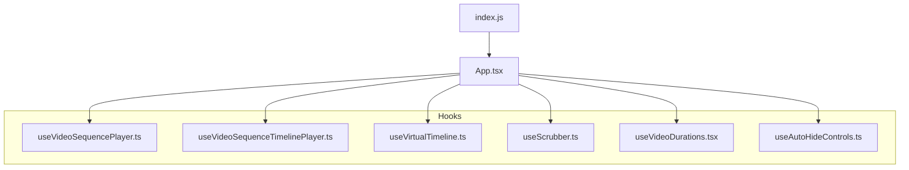
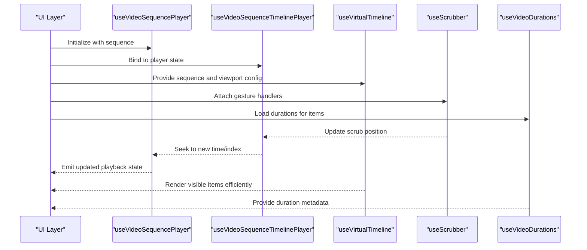
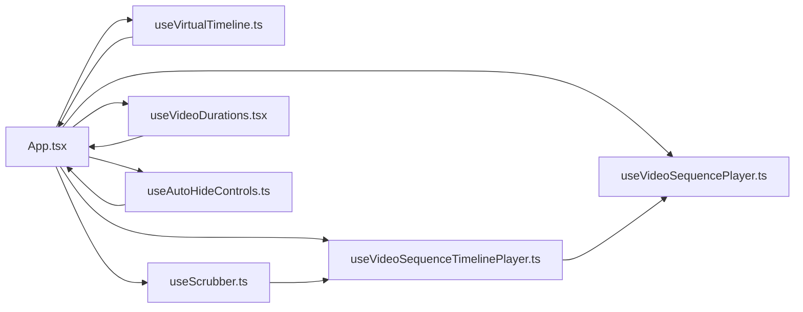

# State Management

<cite>
**Referenced Files in This Document**
- [App.tsx](file://App.tsx)
- [useVideoSequencePlayer.ts](file://hooks/useVideoSequencePlayer.ts)
- [useVideoSequenceTimelinePlayer.ts](file://hooks/useVideoSequenceTimelinePlayer.ts)
- [useVirtualTimeline.ts](file://hooks/useVirtualTimeline.ts)
- [useScrubber.ts](file://hooks/useScrubber.ts)
- [useVideoDurations.tsx](file://hooks/useVideoDurations.tsx)
- [useAutoHideControls.ts](file://hooks/useAutoHideControls.ts)
- [index.js](file://index.js)
- [package.json](file://package.json)
- [README.md](file://README.md)
</cite>

## Table of Contents
1. [Introduction](#introduction)
2. [Project Structure](#project-structure)
3. [Core Components](#core-components)
4. [Architecture Overview](#architecture-overview)
5. [Detailed Component Analysis](#detailed-component-analysis)
6. [Dependency Analysis](#dependency-analysis)
7. [Performance Considerations](#performance-considerations)
8. [Troubleshooting Guide](#troubleshooting-guide)
9. [Conclusion](#conclusion)
10. [Appendices](#appendices)

## Introduction
This document explains the hook-based state management approach used in the video-rn application. It focuses on how playback state is synchronized across components, how sequence data flows through the app, and how a virtual timeline optimizes memory usage for large datasets. It also covers synchronization strategies between different video players and timeline components, and provides guidance for extending the system and handling complex state transitions.

## Project Structure
The application organizes stateful logic into reusable hooks under the hooks directory. The root App component orchestrates these hooks to manage video sequences, timelines, scrubbing, durations, and UI controls. Entry points and configuration are defined at the repository root.

**Diagram sources**
- [index.js:1-20](file://index.js#L1-L20)
- [App.tsx:1-50](file://App.tsx#L1-L50)
- [useVideoSequencePlayer.ts:1-50](file://hooks/useVideoSequencePlayer.ts#L1-L50)
- [useVideoSequenceTimelinePlayer.ts:1-50](file://hooks/useVideoSequenceTimelinePlayer.ts#L1-L50)
- [useVirtualTimeline.ts:1-50](file://hooks/useVirtualTimeline.ts#L1-L50)
- [useScrubber.ts:1-50](file://hooks/useScrubber.ts#L1-L50)
- [useVideoDurations.tsx:1-50](file://hooks/useVideoDurations.tsx#L1-L50)
- [useAutoHideControls.ts:1-50](file://hooks/useAutoHideControls.ts#L1-L50)

**Section sources**
- [index.js:1-20](file://index.js#L1-L20)
- [App.tsx:1-50](file://App.tsx#L1-L50)
- [package.json:1-30](file://package.json#L1-L30)
- [README.md:1-40](file://README.md#L1-L40)

## Core Components
The state management is implemented as a set of composable hooks:
- useVideoSequencePlayer: Manages playback state for a sequence of videos (current index, play/pause, seek).
- useVideoSequenceTimelinePlayer: Bridges sequence playback with timeline interactions (scrubbing, jumping to items).
- useVirtualTimeline: Provides virtualized rendering of large sequences to optimize memory and layout performance.
- useScrubber: Handles user scrubbing gestures and updates playback position.
- useVideoDurations: Caches and exposes duration metadata for each item in the sequence.
- useAutoHideControls: Controls visibility of playback controls based on user activity.

These hooks encapsulate state, side effects, and derived values, enabling predictable updates and easy composition.

**Section sources**
- [useVideoSequencePlayer.ts:1-120](file://hooks/useVideoSequencePlayer.ts#L1-L120)
- [useVideoSequenceTimelinePlayer.ts:1-120](file://hooks/useVideoSequenceTimelinePlayer.ts#L1-L120)
- [useVirtualTimeline.ts:1-120](file://hooks/useVirtualTimeline.ts#L1-L120)
- [useScrubber.ts:1-120](file://hooks/useScrubber.ts#L1-L120)
- [useVideoDurations.tsx:1-120](file://hooks/useVideoDurations.tsx#L1-L120)
- [useAutoHideControls.ts:1-120](file://hooks/useAutoHideControls.ts#L1-L120)

## Architecture Overview
At a high level, the App component composes the hooks to create a unified playback experience:
- Sequence data is provided to the player and timeline hooks.
- Playback state (current time, playing status, current item index) is centralized and shared via hook returns.
- Timeline interactions update playback state, which propagates back to the active player instance.
- Virtualization ensures only visible segments are rendered, reducing memory pressure.

**Diagram sources**
- [App.tsx:1-120](file://App.tsx#L1-L120)
- [useVideoSequencePlayer.ts:1-120](file://hooks/useVideoSequencePlayer.ts#L1-L120)
- [useVideoSequenceTimelinePlayer.ts:1-120](file://hooks/useVideoSequenceTimelinePlayer.ts#L1-L120)
- [useVirtualTimeline.ts:1-120](file://hooks/useVirtualTimeline.ts#L1-L120)
- [useScrubber.ts:1-120](file://hooks/useScrubber.ts#L1-L120)
- [useVideoDurations.tsx:1-120](file://hooks/useVideoDurations.tsx#L1-L120)

## Detailed Component Analysis

### Video Sequence Player Hook
Responsibilities:
- Maintain current item index, playback time, and playing state.
- Handle play, pause, seek, and next/previous navigation.
- Coordinate with external players to reflect state changes.

State synchronization strategy:
- Centralized state object returned by the hook.
- Derived values computed from base state (e.g., progress percentage).
- Side effects triggered by state changes to sync with underlying player instances.

Extending the system:
- Add new actions (e.g., loop mode, speed control) by updating the state reducer-like logic within the hook.
- Introduce middleware-like callbacks for analytics or logging around state transitions.

Complex transitions:
- Implement debounced seeks to avoid excessive updates during rapid scrubbing.
- Use conditional logic to prevent redundant player calls when state is unchanged.

**Section sources**
- [useVideoSequencePlayer.ts:1-120](file://hooks/useVideoSequencePlayer.ts#L1-L120)

### Video Sequence Timeline Player Hook
Responsibilities:
- Bridge timeline interactions with the sequence player.
- Translate timeline events (clicks, drags) into player commands (seek, jump).
- Keep timeline cursor aligned with current playback time.

Synchronization with player:
- Listen to player time updates and update timeline cursor accordingly.
- On timeline change, compute target time/index and instruct the player to seek.

Extending the system:
- Add markers or chapters by augmenting timeline data structures.
- Support multi-track timelines by composing additional hooks.

**Section sources**
- [useVideoSequenceTimelinePlayer.ts:1-120](file://hooks/useVideoSequenceTimelinePlayer.ts#L1-L120)

### Virtual Timeline Hook
Responsibilities:
- Compute visible range based on viewport size and scroll position.
- Render only items within the visible window to reduce memory usage.
- Provide stable indices and positions for efficient re-renders.

Memory optimization:
- Precompute item sizes where possible.
- Recycle rendered nodes and avoid unnecessary allocations.

Extending the system:
- Integrate with custom item renderers that expose measurement APIs.
- Support variable-height items with dynamic sizing strategies.

**Section sources**
- [useVirtualTimeline.ts:1-120](file://hooks/useVirtualTimeline.ts#L1-L120)

### Scrubber Hook
Responsibilities:
- Capture drag gestures and convert them to scrub positions.
- Debounce updates to minimize state churn during fast scrubs.
- Commit final scrub value on release.

Synchronization strategy:
- Temporarily decouple scrubbing from immediate seeking to improve UX.
- On commit, calculate target time/index and trigger player seek.

Extending the system:
- Add preview thumbnails while scrubbing by fetching frames ahead of time.
- Integrate haptic feedback on snap-to-chapter boundaries.

**Section sources**
- [useScrubber.ts:1-120](file://hooks/useScrubber.ts#L1-L120)

### Video Durations Hook
Responsibilities:
- Fetch and cache duration metadata for each sequence item.
- Expose a map of item identifiers to durations.
- Handle loading states and errors gracefully.

Data flow:
- Lazy-load durations on demand.
- Invalidate cache when sequence changes.

Extending the system:
- Support prefetching durations for better perceived performance.
- Merge server-provided durations with client-measured values.

**Section sources**
- [useVideoDurations.tsx:1-120](file://hooks/useVideoDurations.tsx#L1-L120)

### Auto Hide Controls Hook
Responsibilities:
- Track user activity (touch, hover) to show/hide controls.
- Apply timeouts to auto-hide after inactivity.
- Respect accessibility preferences.

Synchronization strategy:
- Observe global input events and update visibility state.
- Prevent hiding during playback critical moments (e.g., buffering).

Extending the system:
- Add custom triggers (e.g., keyboard shortcuts) to toggle visibility.
- Persist user preference across sessions.

**Section sources**
- [useAutoHideControls.ts:1-120](file://hooks/useAutoHideControls.ts#L1-L120)

### App Composition
Responsibilities:
- Instantiate and compose all hooks.
- Pass shared sequence data and configuration.
- Wire up event handlers between components and hooks.

Control flow:
- Initialize player and timeline hooks with sequence data.
- Connect scrubber to timeline and timeline to player.
- Render virtual timeline with visible items.

Extending the system:
- Add new UI panels that consume hook state without coupling to implementation details.
- Introduce feature flags to toggle optional behaviors.

**Section sources**
- [App.tsx:1-120](file://App.tsx#L1-L120)

## Dependency Analysis
The hooks have clear dependencies and separation of concerns:
- App depends on all hooks to orchestrate behavior.
- Timeline depends on player state to stay synchronized.
- Scrubber interacts with timeline to drive playback.
- Virtual timeline depends on sequence data and viewport metrics.
- Durations provide metadata consumed by timeline and UI.

**Diagram sources**
- [App.tsx:1-120](file://App.tsx#L1-L120)
- [useVideoSequencePlayer.ts:1-120](file://hooks/useVideoSequencePlayer.ts#L1-L120)
- [useVideoSequenceTimelinePlayer.ts:1-120](file://hooks/useVideoSequenceTimelinePlayer.ts#L1-L120)
- [useVirtualTimeline.ts:1-120](file://hooks/useVirtualTimeline.ts#L1-L120)
- [useScrubber.ts:1-120](file://hooks/useScrubber.ts#L1-L120)
- [useVideoDurations.tsx:1-120](file://hooks/useVideoDurations.tsx#L1-L120)
- [useAutoHideControls.ts:1-120](file://hooks/useAutoHideControls.ts#L1-L120)

**Section sources**
- [App.tsx:1-120](file://App.tsx#L1-L120)
- [package.json:1-30](file://package.json#L1-L30)

## Performance Considerations
- Virtualization: Only render visible items to reduce memory footprint and improve frame rates.
- Debouncing: Throttle frequent updates during scrubbing to avoid excessive re-renders.
- Memoization: Cache derived values like progress percentages and visible ranges.
- Lazy Loading: Load durations and media metadata on demand.
- Stable Keys: Use stable identifiers for list items to minimize reconciliation overhead.

[No sources needed since this section provides general guidance]

## Troubleshooting Guide
Common issues and resolutions:
- Desync between timeline and player: Ensure timeline listens to player time updates and commits scrub changes atomically.
- Memory spikes with large sequences: Verify virtualization bounds and item recycling; check for unintended retained references.
- Stutter during scrubbing: Increase debounce intervals; avoid synchronous heavy work in scrub callbacks.
- Incorrect durations: Validate caching strategy and invalidation on sequence changes.
- Controls not hiding: Check input event listeners and timeout configurations.

**Section sources**
- [useVideoSequenceTimelinePlayer.ts:1-120](file://hooks/useVideoSequenceTimelinePlayer.ts#L1-L120)
- [useVirtualTimeline.ts:1-120](file://hooks/useVirtualTimeline.ts#L1-L120)
- [useScrubber.ts:1-120](file://hooks/useScrubber.ts#L1-L120)
- [useVideoDurations.tsx:1-120](file://hooks/useVideoDurations.tsx#L1-L120)
- [useAutoHideControls.ts:1-120](file://hooks/useAutoHideControls.ts#L1-L120)

## Conclusion
The video-rn application employs a robust hook-based state management pattern that centralizes playback state, synchronizes timeline interactions, and optimizes rendering for large datasets. By composing focused hooks, the system remains modular, testable, and extensible. Following the guidelines here will help you extend the state management system and handle complex transitions effectively.

[No sources needed since this section summarizes without analyzing specific files]

## Appendices

### Extending the State Management System
- Add new state fields to the player hook and propagate updates through derived values.
- Introduce middleware-style hooks to observe or transform state transitions.
- Compose additional hooks for features like captions, subtitles, or analytics.

### Handling Complex State Transitions
- Use atomic updates to prevent partial state mutations.
- Implement guards to avoid invalid transitions (e.g., seeking beyond duration).
- Leverage debouncing and throttling to smooth out rapid user inputs.

[No sources needed since this section provides general guidance]