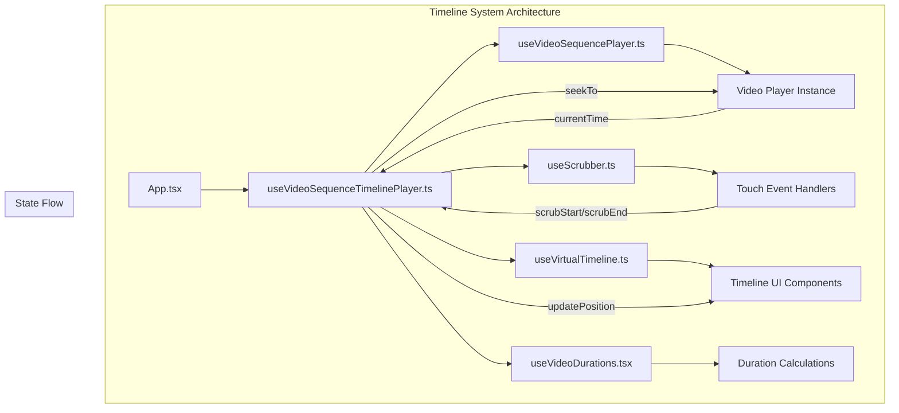
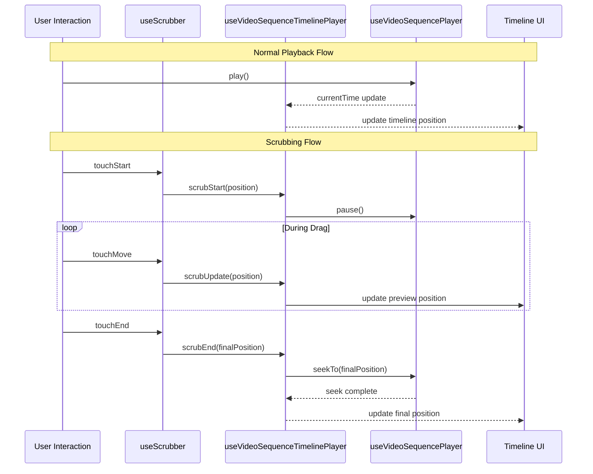
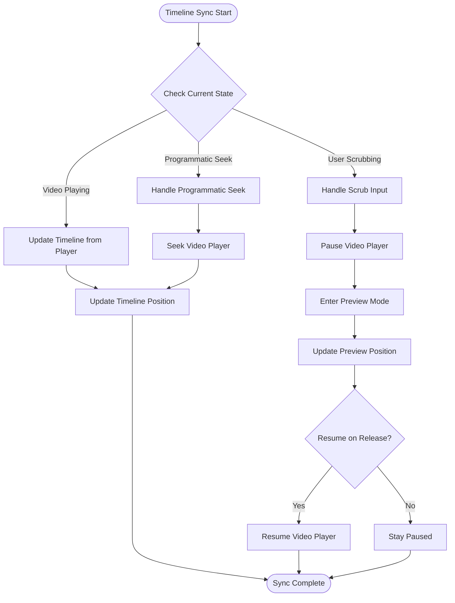
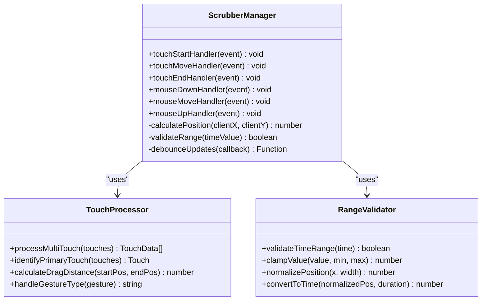
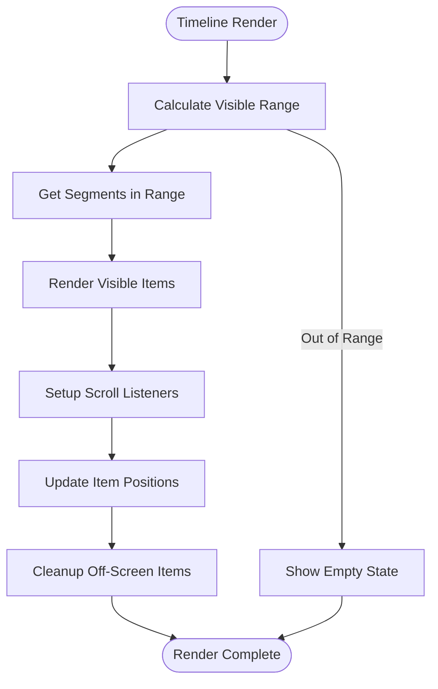
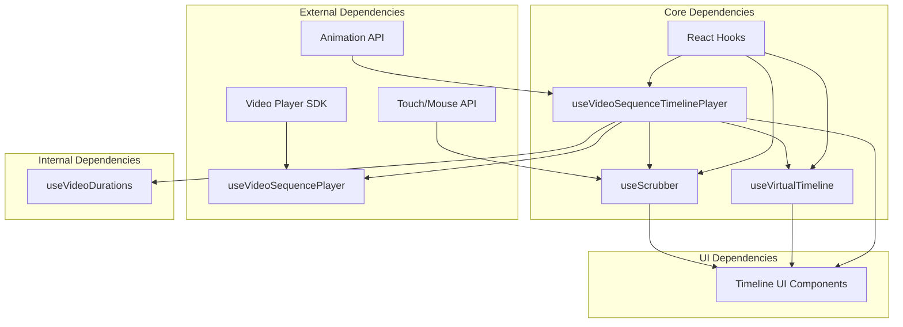

# Timeline State Coordination

<cite>
**Referenced Files in This Document**
- [useVideoSequenceTimelinePlayer.ts](file://hooks/useVideoSequenceTimelinePlayer.ts)
- [useVideoSequencePlayer.ts](file://hooks/useVideoSequencePlayer.ts)
- [useScrubber.ts](file://hooks/useScrubber.ts)
- [useVirtualTimeline.ts](file://hooks/useVirtualTimeline.ts)
- [useVideoDurations.tsx](file://hooks/useVideoDurations.tsx)
- [App.tsx](file://App.tsx)
</cite>

## Table of Contents
1. [Introduction](#introduction)
2. [Project Structure](#project-structure)
3. [Core Components](#core-components)
4. [Architecture Overview](#architecture-overview)
5. [Detailed Component Analysis](#detailed-component-analysis)
6. [Dependency Analysis](#dependency-analysis)
7. [Performance Considerations](#performance-considerations)
8. [Troubleshooting Guide](#troubleshooting-guide)
9. [Conclusion](#conclusion)

## Introduction

This document provides comprehensive documentation for timeline state coordination between video players and timeline components in a React Native video application. The focus is on how the `useVideoSequenceTimelinePlayer` hook synchronizes playback state with timeline visualization, including scrubbing interactions, time-based updates, and bidirectional state synchronization.

The system implements an event-driven architecture that keeps video playback and timeline display in sync, supporting complex user interactions like multi-touch scrubbing and custom timeline behaviors.

## Project Structure

The timeline coordination system is organized into specialized hooks that handle different aspects of video playback and timeline synchronization:

**Diagram sources**
- [App.tsx](file://App.tsx)
- [useVideoSequenceTimelinePlayer.ts](file://hooks/useVideoSequenceTimelinePlayer.ts)
- [useVideoSequencePlayer.ts](file://hooks/useVideoSequencePlayer.ts)
- [useScrubber.ts](file://hooks/useScrubber.ts)
- [useVirtualTimeline.ts](file://hooks/useVirtualTimeline.ts)
- [useVideoDurations.tsx](file://hooks/useVideoDurations.tsx)

**Section sources**
- [App.tsx](file://App.tsx)
- [useVideoSequenceTimelinePlayer.ts](file://hooks/useVideoSequenceTimelinePlayer.ts)

## Core Components

The timeline coordination system consists of several interconnected hooks that work together to maintain synchronized state between video playback and timeline visualization.

### useVideoSequenceTimelinePlayer Hook

This is the central orchestrator that manages the synchronization between video playback state and timeline visualization. It handles:

- **Bidirectional State Synchronization**: Ensures that changes in video playback position are reflected in the timeline and vice versa
- **Event-Driven Updates**: Uses React's state management to trigger re-renders when timeline position changes
- **Scrubbing Coordination**: Manages the interaction between user input and video seeking operations
- **Time-Based Updates**: Handles regular updates during playback to keep the timeline current

### useVideoSequencePlayer Hook

Manages the underlying video player instance and its core functionality:

- **Playback Control**: Play, pause, seek, and volume control
- **Event Emission**: Emits events for playback state changes (playing, paused, ended)
- **Duration Management**: Tracks total duration and current playback position
- **Error Handling**: Manages loading states and error conditions

### useScrubber Hook

Handles touch and mouse interactions for timeline scrubbing:

- **Multi-Touch Support**: Processes multiple simultaneous touch points
- **Gesture Recognition**: Distinguishes between tapping, dragging, and releasing actions
- **Boundary Handling**: Prevents scrubbing outside valid time ranges
- **Smooth Interactions**: Provides smooth scrubbing experience with proper event throttling

### useVirtualTimeline Hook

Optimizes timeline rendering for large video sequences:

- **Virtualization**: Only renders visible timeline segments
- **Performance Optimization**: Reduces memory usage for long videos
- **Scroll Integration**: Coordinates with container scrolling for smooth navigation

### useVideoDurations Hook

Calculates and manages timing information:

- **Duration Parsing**: Parses various duration formats
- **Time Formatting**: Converts milliseconds to human-readable formats
- **Segment Timing**: Calculates timing for individual video segments

**Section sources**
- [useVideoSequenceTimelinePlayer.ts](file://hooks/useVideoSequenceTimelinePlayer.ts)
- [useVideoSequencePlayer.ts](file://hooks/useVideoSequencePlayer.ts)
- [useScrubber.ts](file://hooks/useScrubber.ts)
- [useVirtualTimeline.ts](file://hooks/useVirtualTimeline.ts)
- [useVideoDurations.tsx](file://hooks/useVideoDurations.tsx)

## Architecture Overview

The timeline coordination system follows an event-driven architecture pattern that ensures consistent state across all components:

**Diagram sources**
- [useScrubber.ts](file://hooks/useScrubber.ts)
- [useVideoSequenceTimelinePlayer.ts](file://hooks/useVideoSequenceTimelinePlayer.ts)
- [useVideoSequencePlayer.ts](file://hooks/useVideoSequencePlayer.ts)

### State Synchronization Strategy

The system uses a unidirectional data flow pattern with careful state management:

1. **Single Source of Truth**: Video player state is the authoritative source for playback position
2. **Derived State**: Timeline position is calculated from video player state
3. **User Input Handling**: User interactions are processed through dedicated handlers
4. **Debounced Updates**: Frequent updates are debounced to prevent performance issues

### Event-Driven Communication

Components communicate through a well-defined event system:

- **Playback Events**: playing, paused, ended, seeking
- **Timeline Events**: scrubStart, scrubUpdate, scrubEnd
- **State Events**: durationChange, currentTimeChange
- **Error Events**: loadError, networkError

**Section sources**
- [useVideoSequenceTimelinePlayer.ts](file://hooks/useVideoSequenceTimelinePlayer.ts)
- [useScrubber.ts](file://hooks/useScrubber.ts)

## Detailed Component Analysis

### useVideoSequenceTimelinePlayer Implementation

This hook serves as the central coordinator for timeline synchronization. It manages the complex interactions between video playback state and timeline visualization.

#### Key Responsibilities

- **State Management**: Maintains current playback position, duration, and playback state
- **Event Subscription**: Subscribes to video player events and emits timeline updates
- **Seeking Logic**: Handles both programmatic and user-initiated seeking operations
- **Performance Optimization**: Implements efficient state updates and prevents unnecessary re-renders

#### Bidirectional Synchronization

The hook implements two-way synchronization between video player and timeline:

**Diagram sources**
- [useVideoSequenceTimelinePlayer.ts](file://hooks/useVideoSequenceTimelinePlayer.ts)

#### Time-Based Updates

The hook implements efficient time-based updates using requestAnimationFrame:

- **Frame-Synced Updates**: Updates align with screen refresh rate for smooth animation
- **Throttled Updates**: Prevents excessive state updates during rapid playback
- **Memory Management**: Properly cleans up timers and event listeners

**Section sources**
- [useVideoSequenceTimelinePlayer.ts](file://hooks/useVideoSequenceTimelinePlayer.ts)

### useScrubber Implementation

The scrubber hook handles complex touch and mouse interactions for timeline manipulation.

#### Multi-Touch Support

**Diagram sources**
- [useScrubber.ts](file://hooks/useScrubber.ts)

#### Gesture Recognition

The scrubber distinguishes between different types of user interactions:

- **Tap Detection**: Single tap without movement
- **Drag Detection**: Continuous movement during touch/mouse down
- **Long Press**: Extended touch duration for context menus
- **Multi-Finger Gestures**: Pinch and zoom for timeline navigation

**Section sources**
- [useScrubber.ts](file://hooks/useScrubber.ts)

### useVirtualTimeline Implementation

The virtual timeline component optimizes rendering performance for large video sequences.

#### Virtualization Strategy

**Diagram sources**
- [useVirtualTimeline.ts](file://hooks/useVirtualTimeline.ts)

#### Performance Optimizations

- **Lazy Loading**: Only loads timeline segments when they become visible
- **Memory Pooling**: Reuses DOM elements and calculation objects
- **Batched Updates**: Groups multiple state updates into single re-renders
- **Intersection Observer**: Uses modern browser APIs for efficient visibility detection

**Section sources**
- [useVirtualTimeline.ts](file://hooks/useVirtualTimeline.ts)

### Customization and Extension Points

The timeline system provides several extension points for customization:

#### Custom Timeline Behaviors

- **Custom Segment Rendering**: Override default segment appearance
- **Custom Event Handlers**: Add custom behavior for timeline interactions
- **Custom Time Formatting**: Implement custom time display formats
- **Custom Validation Rules**: Define custom rules for valid time ranges

#### Complex User Interactions

- **Multi-Track Timeline**: Support for multiple parallel timelines
- **Keyframe Editing**: Interactive editing of keyframes and markers
- **Zoom and Pan**: Advanced navigation controls for long timelines
- **Collaborative Editing**: Real-time collaboration features

**Section sources**
- [useVideoSequenceTimelinePlayer.ts](file://hooks/useVideoSequenceTimelinePlayer.ts)
- [useScrubber.ts](file://hooks/useScrubber.ts)

## Dependency Analysis

The timeline coordination system has clear dependency relationships between components:

**Diagram sources**
- [useVideoSequenceTimelinePlayer.ts](file://hooks/useVideoSequenceTimelinePlayer.ts)
- [useVideoSequencePlayer.ts](file://hooks/useVideoSequencePlayer.ts)
- [useScrubber.ts](file://hooks/useScrubber.ts)
- [useVirtualTimeline.ts](file://hooks/useVirtualTimeline.ts)
- [useVideoDurations.tsx](file://hooks/useVideoDurations.tsx)

### Coupling Analysis

- **Low Coupling**: Each hook maintains clear boundaries and minimal dependencies
- **High Cohesion**: Related functionality is grouped within appropriate hooks
- **Interface Contracts**: Well-defined interfaces between components ensure stability
- **Dependency Inversion**: Abstractions allow for easy testing and replacement

### Circular Dependency Prevention

The system avoids circular dependencies through:

- **Event Bus Pattern**: Components communicate through events rather than direct calls
- **State Lifting**: Shared state is managed at appropriate levels
- **Interface Segregation**: Small, focused interfaces reduce coupling

**Section sources**
- [useVideoSequenceTimelinePlayer.ts](file://hooks/useVideoSequenceTimelinePlayer.ts)
- [useVideoSequencePlayer.ts](file://hooks/useVideoSequencePlayer.ts)

## Performance Considerations

The timeline coordination system is optimized for performance in several ways:

### Memory Management

- **Efficient State Updates**: Only updates necessary state properties
- **Proper Cleanup**: All event listeners and timers are properly cleaned up
- **Object Pooling**: Reuses frequently created objects to reduce garbage collection

### Rendering Optimization

- **Memoization**: Uses React.memo and useMemo for expensive calculations
- **Conditional Rendering**: Only renders visible timeline segments
- **Batched Updates**: Groups multiple state updates to minimize re-renders

### Network and I/O Optimization

- **Lazy Loading**: Loads timeline data only when needed
- **Caching**: Caches frequently accessed timeline segments
- **Progressive Loading**: Shows partial timeline while loading completes

### Mobile Performance

- **Touch Optimization**: Optimized for mobile touch interactions
- **Battery Efficiency**: Minimizes CPU usage during idle periods
- **Memory Constraints**: Careful memory management for mobile devices

## Troubleshooting Guide

### Common Issues and Solutions

#### Timeline Not Updating

**Symptoms**: Timeline position doesn't match video playback position

**Causes**:
- Missing event subscriptions
- Incorrect state synchronization logic
- Performance throttling issues

**Solutions**:
- Verify event subscription setup
- Check state update logic in timeline hook
- Review performance optimization settings

#### Scrubbing Issues

**Symptoms**: Scrubbing doesn't work or behaves unexpectedly

**Causes**:
- Touch event conflicts
- Invalid time range validation
- Performance throttling too aggressive

**Solutions**:
- Check touch event propagation
- Validate time range boundaries
- Adjust scrubbing sensitivity settings

#### Performance Problems

**Symptoms**: Laggy timeline or video playback

**Causes**:
- Excessive re-renders
- Memory leaks
- Inefficient timeline calculations

**Solutions**:
- Use React DevTools to identify re-render issues
- Implement proper cleanup in useEffect hooks
- Optimize timeline calculations with memoization

### Debugging Techniques

#### State Inspection

Use React DevTools to inspect component state and verify synchronization:

- Check timeline position vs video player position
- Verify event emission and subscription
- Monitor memory usage during scrubbing

#### Event Logging

Add logging to track event flow:

- Log all timeline-related events
- Track scrubbing interactions
- Monitor performance metrics

**Section sources**
- [useVideoSequenceTimelinePlayer.ts](file://hooks/useVideoSequenceTimelinePlayer.ts)
- [useScrubber.ts](file://hooks/useScrubber.ts)

## Conclusion

The timeline state coordination system in this React Native video application demonstrates a robust approach to synchronizing video playback with timeline visualization. The event-driven architecture ensures reliable state synchronization while maintaining high performance and excellent user experience.

Key strengths of the implementation include:

- **Comprehensive State Management**: Centralized coordination of video player and timeline state
- **Advanced User Interactions**: Support for complex touch gestures and multi-touch scenarios
- **Performance Optimization**: Efficient rendering and memory management for smooth operation
- **Extensibility**: Clear extension points for custom behaviors and interactions

The system successfully addresses the challenges of maintaining synchronization between video playback and timeline visualization while providing a foundation for advanced timeline features and customizations.