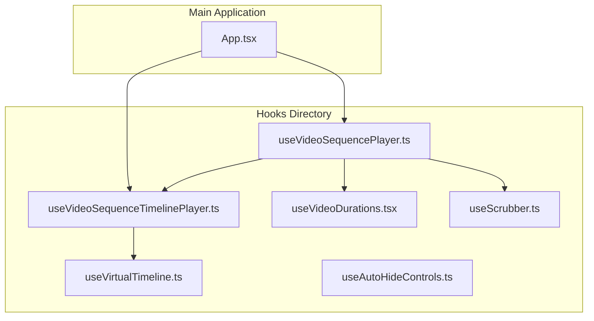
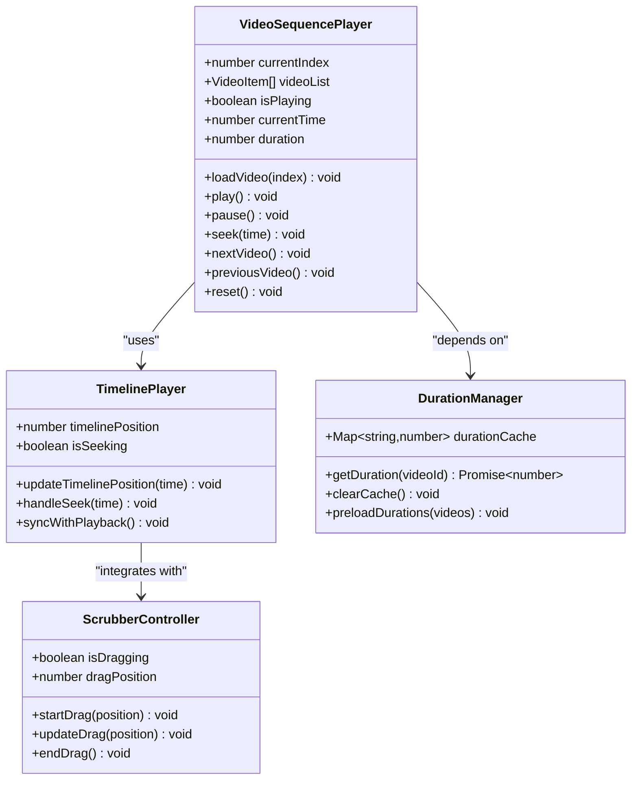
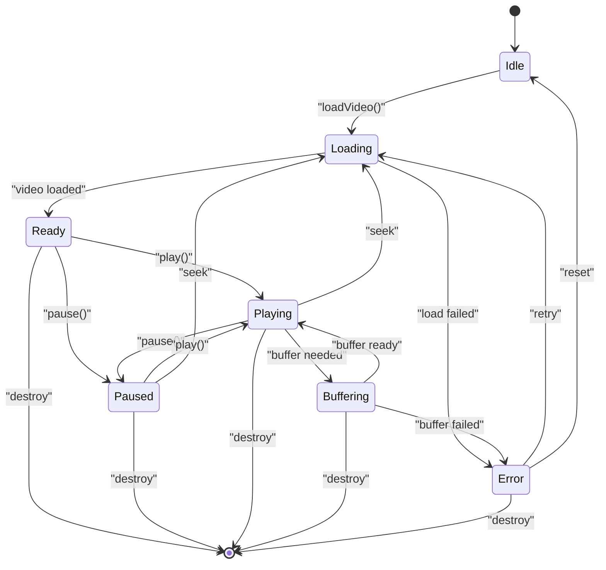
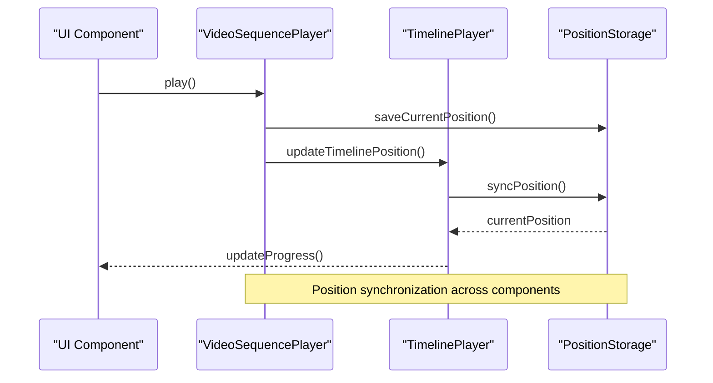
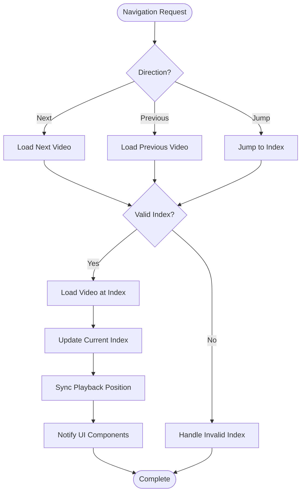
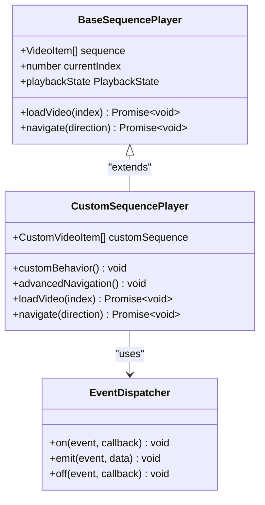
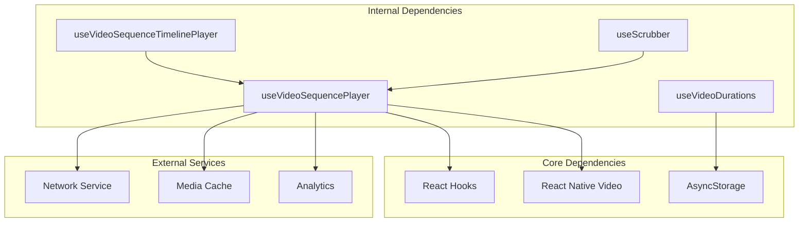

# Video Sequence State Management

<cite>
**Referenced Files in This Document**
- [useVideoSequencePlayer.ts](file://hooks/useVideoSequencePlayer.ts)
- [useVideoSequenceTimelinePlayer.ts](file://hooks/useVideoSequenceTimelinePlayer.ts)
- [useVideoDurations.tsx](file://hooks/useVideoDurations.tsx)
- [useScrubber.ts](file://hooks/useScrubber.ts)
- [App.tsx](file://App.tsx)
- [HOOKS.md](file://docs/HOOKS.md)
</cite>

## Table of Contents
1. [Introduction](#introduction)
2. [Project Structure](#project-structure)
3. [Core Components](#core-components)
4. [Architecture Overview](#architecture-overview)
5. [Detailed Component Analysis](#detailed-component-analysis)
6. [Dependency Analysis](#dependency-analysis)
7. [Performance Considerations](#performance-considerations)
8. [Troubleshooting Guide](#troubleshooting-guide)
9. [Conclusion](#conclusion)

## Introduction

The video sequence state management system is designed to handle complex video playback scenarios across multiple videos in a React Native application. This system provides comprehensive state management for video sequences, including current video tracking, playback position synchronization, and seamless navigation between videos. The implementation follows React hooks patterns to ensure efficient state updates and optimal performance.

## Project Structure

The video sequence management system is organized within the `hooks` directory, containing specialized hooks for different aspects of video playback:

**Diagram sources**
- [useVideoSequencePlayer.ts](file://hooks/useVideoSequencePlayer.ts)
- [useVideoSequenceTimelinePlayer.ts](file://hooks/useVideoSequenceTimelinePlayer.ts)
- [useVideoDurations.tsx](file://hooks/useVideoDurations.tsx)
- [useScrubber.ts](file://hooks/useScrubber.ts)
- [App.tsx](file://App.tsx)

**Section sources**
- [App.tsx](file://App.tsx)
- [HOOKS.md](file://docs/HOOKS.md)

## Core Components

### useVideoSequencePlayer Hook

The primary hook responsible for managing video sequence state and playback logic. This hook handles:

- **Current Video Tracking**: Maintains the index and metadata of the currently playing video
- **Playback Position Synchronization**: Ensures consistent playback positions across video transitions
- **Sequence Navigation**: Provides methods for navigating forward, backward, and jumping to specific videos
- **State Management**: Manages loading states, error handling, and playback status

### useVideoSequenceTimelinePlayer Hook

A specialized hook that extends the base sequence player functionality with timeline-specific features:

- **Timeline Integration**: Connects video playback with visual timeline components
- **Progress Tracking**: Monitors and updates playback progress in real-time
- **Seeking Support**: Enables precise seeking within video timelines
- **Timeline Events**: Handles user interactions with timeline controls

### Supporting Hooks

- **useVideoDurations**: Manages video duration calculations and caching
- **useScrubber**: Provides scrubbing functionality for manual time seeking
- **useVirtualTimeline**: Optimizes timeline rendering for large video sequences
- **useAutoHideControls**: Manages UI control visibility during playback

**Section sources**
- [useVideoSequencePlayer.ts](file://hooks/useVideoSequencePlayer.ts)
- [useVideoSequenceTimelinePlayer.ts](file://hooks/useVideoSequenceTimelinePlayer.ts)
- [useVideoDurations.tsx](file://hooks/useVideoDurations.tsx)
- [useScrubber.ts](file://hooks/useScrubber.ts)

## Architecture Overview

The video sequence state management system follows a modular architecture with clear separation of concerns:

**Diagram sources**
- [useVideoSequencePlayer.ts](file://hooks/useVideoSequencePlayer.ts)
- [useVideoSequenceTimelinePlayer.ts](file://hooks/useVideoSequenceTimelinePlayer.ts)
- [useVideoDurations.tsx](file://hooks/useVideoDurations.tsx)
- [useScrubber.ts](file://hooks/useScrubber.ts)

## Detailed Component Analysis

### Video Sequence State Structure

The core state structure manages all aspects of video playback:

**Diagram sources**
- [useVideoSequencePlayer.ts](file://hooks/useVideoSequencePlayer.ts)

### Playback Position Synchronization

The system ensures consistent playback positions through a centralized synchronization mechanism:

**Diagram sources**
- [useVideoSequencePlayer.ts](file://hooks/useVideoSequencePlayer.ts)
- [useVideoSequenceTimelinePlayer.ts](file://hooks/useVideoSequenceTimelinePlayer.ts)

### Sequence Navigation Logic

Navigation between videos follows a structured flow:

**Diagram sources**
- [useVideoSequencePlayer.ts](file://hooks/useVideoSequencePlayer.ts)

### Custom Sequence Behaviors

Implementing custom sequence behaviors involves extending the base hook functionality:

**Diagram sources**
- [useVideoSequencePlayer.ts](file://hooks/useVideoSequencePlayer.ts)

**Section sources**
- [useVideoSequencePlayer.ts](file://hooks/useVideoSequencePlayer.ts)
- [useVideoSequenceTimelinePlayer.ts](file://hooks/useVideoSequenceTimelinePlayer.ts)

## Dependency Analysis

The video sequence system has well-defined dependencies between components:

**Diagram sources**
- [useVideoSequencePlayer.ts](file://hooks/useVideoSequencePlayer.ts)
- [useVideoSequenceTimelinePlayer.ts](file://hooks/useVideoSequenceTimelinePlayer.ts)
- [useVideoDurations.tsx](file://hooks/useVideoDurations.tsx)
- [useScrubber.ts](file://hooks/useScrubber.ts)

**Section sources**
- [useVideoSequencePlayer.ts](file://hooks/useVideoSequencePlayer.ts)
- [useVideoSequenceTimelinePlayer.ts](file://hooks/useVideoSequenceTimelinePlayer.ts)

## Performance Considerations

The video sequence system implements several performance optimizations:

### Memory Management
- **Lazy Loading**: Videos are loaded only when needed
- **Memory Cleanup**: Automatic cleanup of unused video resources
- **Object Pooling**: Reuse of video player instances where possible

### Caching Strategies
- **Duration Caching**: Video durations are cached to prevent repeated calculations
- **Thumbnail Caching**: Preloaded thumbnails for faster UI updates
- **Metadata Caching**: Video metadata stored locally for quick access

### Rendering Optimization
- **Virtual Scrolling**: Efficient rendering of large video lists
- **Debounced Updates**: Throttled state updates to prevent excessive re-renders
- **Memoization**: Cached computations for expensive operations

## Troubleshooting Guide

### Common Issues and Solutions

#### Video Loading Errors
- **Network Failures**: Implement retry logic with exponential backoff
- **Invalid URLs**: Validate video URLs before loading
- **Format Compatibility**: Check supported video formats for target platforms

#### Playback Synchronization Issues
- **Time Drift**: Regularly sync playback time with actual video position
- **Buffer Underruns**: Implement adaptive buffering strategies
- **Memory Leaks**: Monitor memory usage during long playback sessions

#### UI State Inconsistencies
- **Stale References**: Ensure proper cleanup of event listeners
- **Race Conditions**: Use proper async/await patterns for state updates
- **Component Unmounting**: Handle component lifecycle properly

### Debugging Techniques
- **Logging**: Enable detailed logging for playback events
- **Performance Monitoring**: Track memory usage and render performance
- **Error Boundaries**: Implement error boundaries to catch and report issues

**Section sources**
- [useVideoSequencePlayer.ts](file://hooks/useVideoSequencePlayer.ts)
- [useVideoSequenceTimelinePlayer.ts](file://hooks/useVideoSequenceTimelinePlayer.ts)

## Conclusion

The video sequence state management system provides a robust foundation for handling complex video playback scenarios in React Native applications. Through its modular architecture and comprehensive state management, it enables seamless navigation between videos, synchronized playback positions, and responsive UI updates. The system's design prioritizes performance, reliability, and extensibility, making it suitable for both simple and complex video sequencing requirements.

Key benefits include:
- **Modular Design**: Clear separation of concerns allows for easy maintenance and extension
- **Performance Optimized**: Implements caching, lazy loading, and memory management
- **Error Resilient**: Comprehensive error handling and recovery mechanisms
- **Extensible**: Easy to customize behavior through hook composition

The system successfully addresses the challenges of multi-video playback while maintaining clean code organization and optimal user experience.