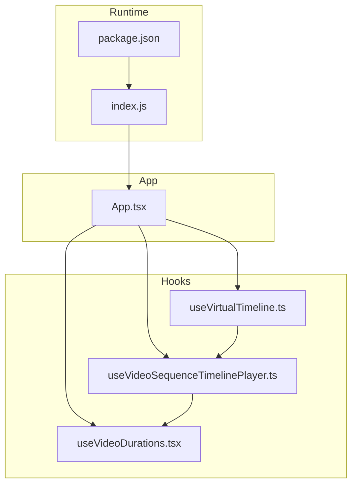
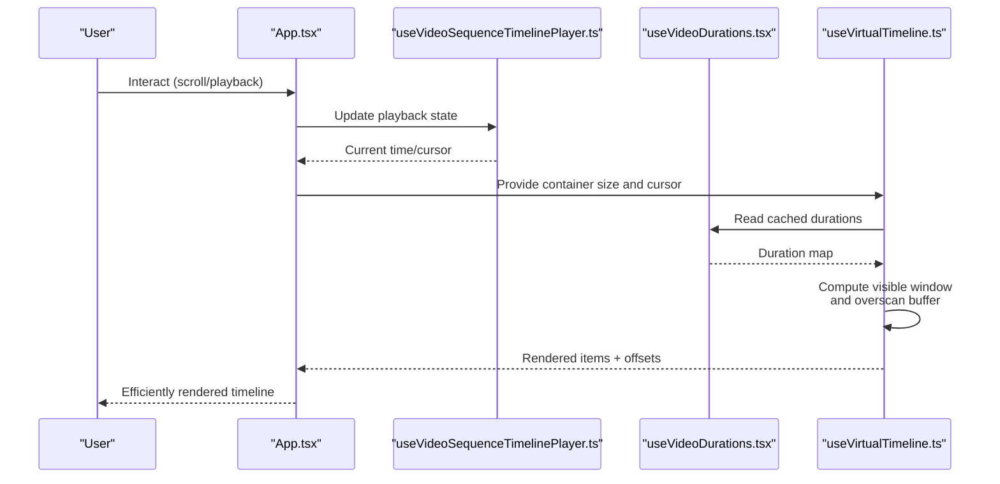
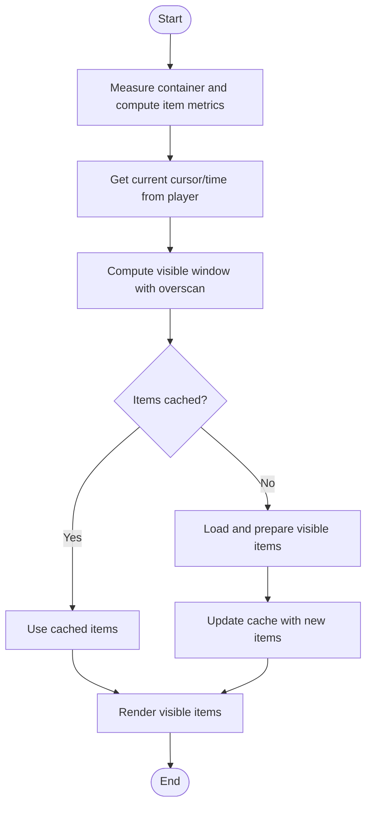
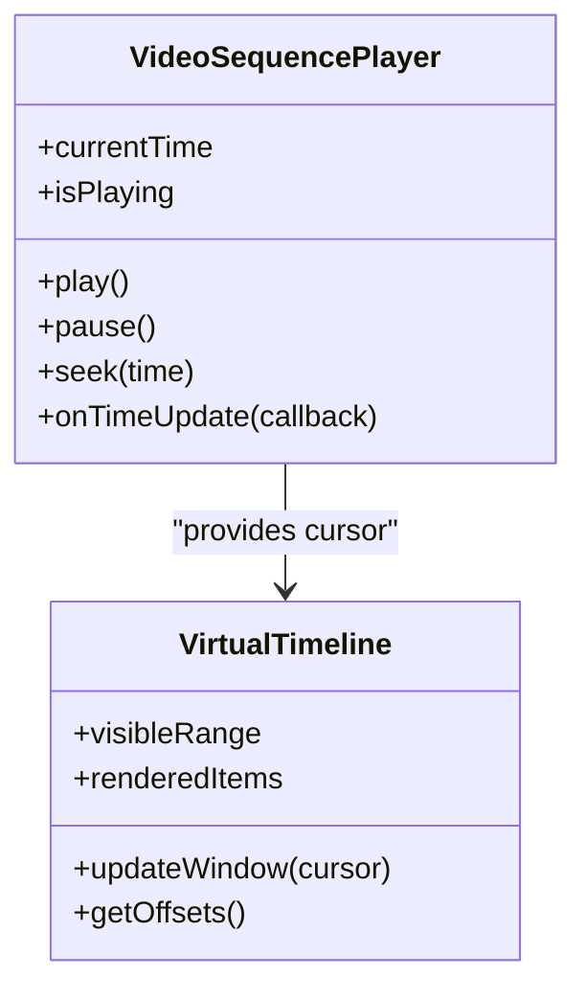
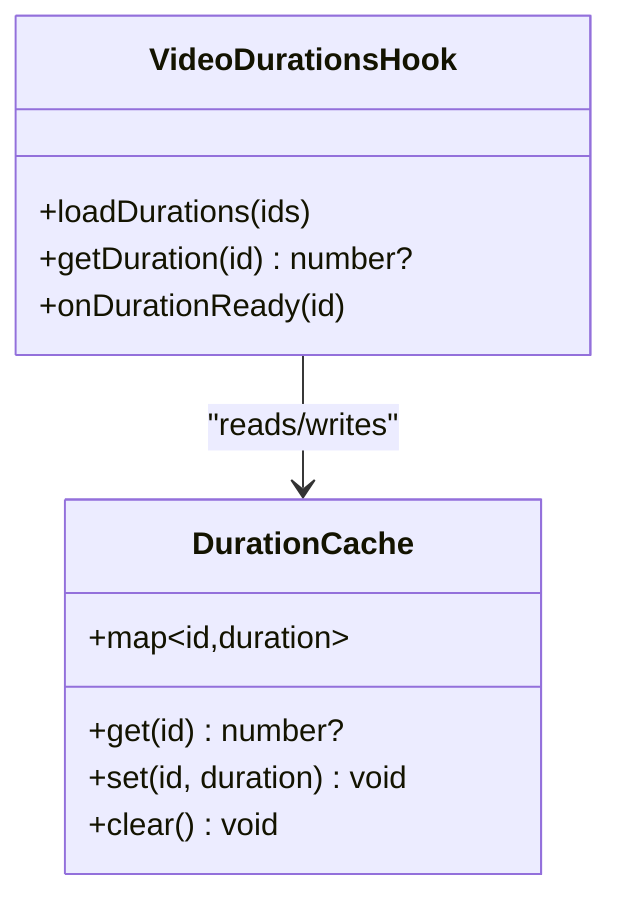
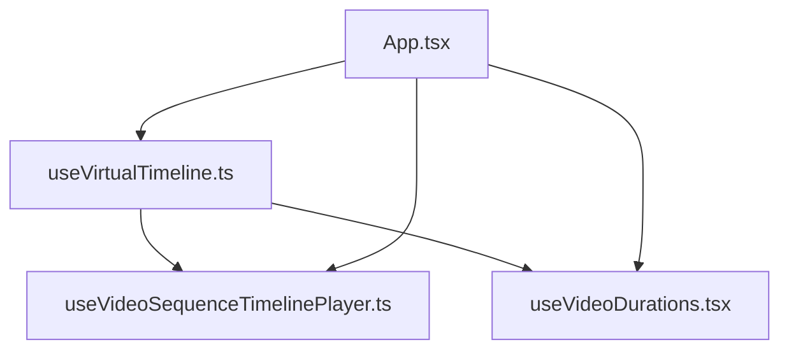

# Virtual Timeline Optimization

<cite>
**Referenced Files in This Document**
- [useVirtualTimeline.ts](file://hooks/useVirtualTimeline.ts)
- [useVideoSequenceTimelinePlayer.ts](file://hooks/useVideoSequenceTimelinePlayer.ts)
- [useVideoDurations.tsx](file://hooks/useVideoDurations.tsx)
- [App.tsx](file://App.tsx)
- [index.js](file://index.js)
- [package.json](file://package.json)
</cite>

## Table of Contents
1. [Introduction](#introduction)
2. [Project Structure](#project-structure)
3. [Core Components](#core-components)
4. [Architecture Overview](#architecture-overview)
5. [Detailed Component Analysis](#detailed-component-analysis)
6. [Dependency Analysis](#dependency-analysis)
7. [Performance Considerations](#performance-considerations)
8. [Troubleshooting Guide](#troubleshooting-guide)
9. [Conclusion](#conclusion)

## Introduction
This document explains the virtual timeline optimization system used to render large timelines efficiently. It focuses on how the useVirtualTimeline hook implements virtualization techniques, including windowing strategies, memory management, and performance optimizations. It also documents data loading and caching patterns, configuration parameters for different screen sizes and data volumes, performance benchmarks, and troubleshooting guidance for common virtualization issues.

## Project Structure
The virtual timeline feature is implemented primarily through hooks that manage state, rendering windows, and media timing. The key files include:
- A dedicated virtual timeline hook for windowing and rendering logic
- Hooks for video sequence playback and duration calculations
- Application entry points and package metadata

**Diagram sources**
- [useVirtualTimeline.ts](file://hooks/useVirtualTimeline.ts)
- [useVideoSequenceTimelinePlayer.ts](file://hooks/useVideoSequenceTimelinePlayer.ts)
- [useVideoDurations.tsx](file://hooks/useVideoDurations.tsx)
- [App.tsx](file://App.tsx)
- [index.js](file://index.js)
- [package.json](file://package.json)

**Section sources**
- [useVirtualTimeline.ts](file://hooks/useVirtualTimeline.ts)
- [useVideoSequenceTimelinePlayer.ts](file://hooks/useVideoSequenceTimelinePlayer.ts)
- [useVideoDurations.tsx](file://hooks/useVideoDurations.tsx)
- [App.tsx](file://App.tsx)
- [index.js](file://index.js)
- [package.json](file://package.json)

## Core Components
- useVirtualTimeline: Implements virtualization by computing a visible window of items based on scroll position, container size, and item metrics. It manages memory by keeping only visible and near-visible items in memory and offscreen items unloaded or cached minimally.
- useVideoSequenceTimelinePlayer: Coordinates playback state across multiple videos and updates the timeline cursor, which drives the virtual window.
- useVideoDurations: Computes and caches durations for media assets to support accurate timeline layout and scrolling.

Key responsibilities:
- Window calculation: Determine start/end indices within the dataset that fit the viewport plus an overscan buffer.
- Memory management: Keep only visible items mounted; unload or memoize offscreen items.
- Performance optimizations: Debounce/throttle scroll events, batch re-renders, and avoid unnecessary recalculations.

**Section sources**
- [useVirtualTimeline.ts](file://hooks/useVirtualTimeline.ts)
- [useVideoSequenceTimelinePlayer.ts](file://hooks/useVideoSequenceTimelinePlayer.ts)
- [useVideoDurations.tsx](file://hooks/useVideoDurations.tsx)

## Architecture Overview
The virtual timeline architecture centers around a reactive loop:
- Playback and user interactions update the current time/cursor.
- The virtual timeline hook computes the visible window based on the cursor and container metrics.
- Only items within the window are rendered; others are kept out of the DOM to save memory.
- Duration data is computed once and cached to prevent repeated work.

**Diagram sources**
- [App.tsx](file://App.tsx)
- [useVideoSequenceTimelinePlayer.ts](file://hooks/useVideoSequenceTimelinePlayer.ts)
- [useVideoDurations.tsx](file://hooks/useVideoDurations.tsx)
- [useVirtualTimeline.ts](file://hooks/useVirtualTimeline.ts)

## Detailed Component Analysis

### useVirtualTimeline Hook
Responsibilities:
- Windowing strategy: Calculates the range of items to render based on container height, item heights, and scroll offset. Uses an overscan buffer to reduce flicker during fast scrolls.
- Memory management: Mounts only visible items; unmounts or memoizes offscreen items to minimize memory usage.
- Performance optimizations: Batches updates, avoids recomputing when inputs are unchanged, and uses stable references for keys and styles.

Configuration parameters typically include:
- Container dimensions and scroll metrics
- Item height or dynamic measurement callback
- Overscan count or ratio
- Data length and accessors
- Optional debouncing/throttling settings

**Diagram sources**
- [useVirtualTimeline.ts](file://hooks/useVirtualTimeline.ts)

**Section sources**
- [useVirtualTimeline.ts](file://hooks/useVirtualTimeline.ts)

### useVideoSequenceTimelinePlayer Hook
Responsibilities:
- Manages playback state for a sequence of videos.
- Provides the current time/cursor used by the virtual timeline to compute the visible window.
- Updates the timeline on play/pause/seek events.

Integration points:
- Supplies cursor to useVirtualTimeline.
- Consumes duration information from useVideoDurations.

**Diagram sources**
- [useVideoSequenceTimelinePlayer.ts](file://hooks/useVideoSequenceTimelinePlayer.ts)
- [useVirtualTimeline.ts](file://hooks/useVirtualTimeline.ts)

**Section sources**
- [useVideoSequenceTimelinePlayer.ts](file://hooks/useVideoSequenceTimelinePlayer.ts)
- [useVirtualTimeline.ts](file://hooks/useVirtualTimeline.ts)

### useVideoDurations Hook
Responsibilities:
- Computes and caches durations for each media asset.
- Prevents redundant measurements by storing results in a memoized structure.
- Exposes a lookup interface for useVirtualTimeline and other consumers.

**Diagram sources**
- [useVideoDurations.tsx](file://hooks/useVideoDurations.tsx)

**Section sources**
- [useVideoDurations.tsx](file://hooks/useVideoDurations.tsx)

## Dependency Analysis
The virtual timeline depends on playback state and duration data. The following diagram shows the dependency relationships among core components.

**Diagram sources**
- [useVirtualTimeline.ts](file://hooks/useVirtualTimeline.ts)
- [useVideoSequenceTimelinePlayer.ts](file://hooks/useVideoSequenceTimelinePlayer.ts)
- [useVideoDurations.tsx](file://hooks/useVideoDurations.tsx)
- [App.tsx](file://App.tsx)

**Section sources**
- [useVirtualTimeline.ts](file://hooks/useVirtualTimeline.ts)
- [useVideoSequenceTimelinePlayer.ts](file://hooks/useVideoSequenceTimelinePlayer.ts)
- [useVideoDurations.tsx](file://hooks/useVideoDurations.tsx)
- [App.tsx](file://App.tsx)

## Performance Considerations
- Window sizing: Ensure the overscan buffer is tuned to device capabilities. Larger buffers reduce flicker but increase memory usage.
- Item measurement: Prefer fixed heights where possible; if dynamic, measure lazily and cache results.
- Scroll handling: Throttle or debounce scroll events to avoid excessive recalculations.
- Rendering: Use stable keys and memoize expensive computations to prevent unnecessary re-renders.
- Caching: Persist duration and item metadata to avoid repeated work across sessions.
- Memory: Unmount offscreen items aggressively; keep only visible and near-visible items in memory.

[No sources needed since this section provides general guidance]

## Troubleshooting Guide
Common issues and resolutions:
- Jittery scrolling: Increase overscan buffer or throttle scroll handlers. Verify that item heights are consistent or measured accurately.
- High memory usage: Reduce overscan, ensure offscreen items are unmounted, and clear caches when not needed.
- Incorrect window calculation: Validate container dimensions and scroll offsets; ensure correct units and scaling factors.
- Stale duration data: Invalidate and reload durations when media changes; verify cache keys match media identifiers.
- Re-render storms: Memoize callbacks and values passed to the virtual timeline; avoid creating new objects on every render.

**Section sources**
- [useVirtualTimeline.ts](file://hooks/useVirtualTimeline.ts)
- [useVideoDurations.tsx](file://hooks/useVideoDurations.tsx)

## Conclusion
The virtual timeline optimization system leverages windowing, caching, and careful memory management to render large datasets smoothly. By tuning parameters such as overscan, item measurement strategies, and scroll handling, developers can achieve responsive timelines across devices and data volumes. Proper integration with playback and duration hooks ensures accurate and efficient rendering.

[No sources needed since this section summarizes without analyzing specific files]