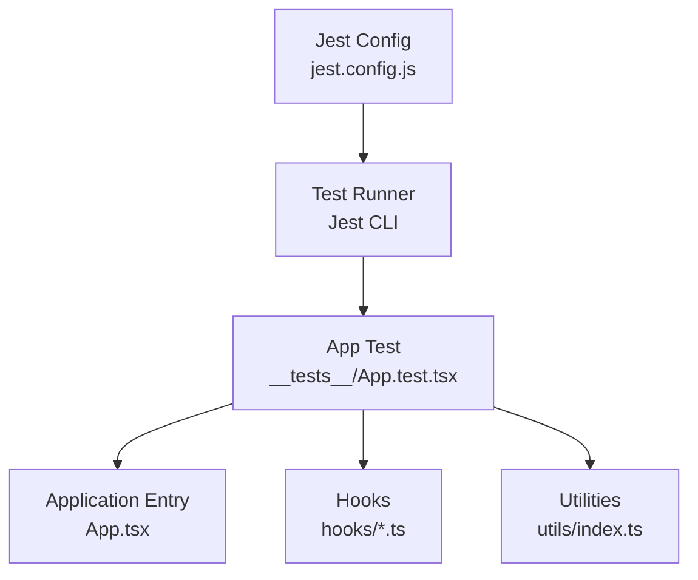
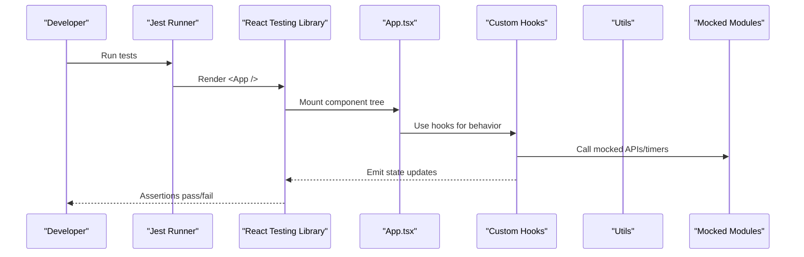
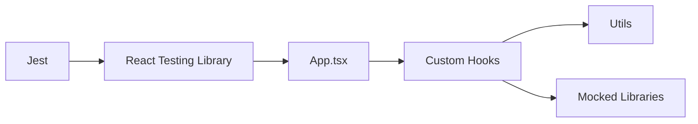

# Testing Strategy

<cite>
**Referenced Files in This Document**
- [jest.config.js](file://jest.config.js)
- [package.json](file://package.json)
- [App.test.tsx](file://__tests__/App.test.tsx)
- [App.tsx](file://App.tsx)
- [useAutoHideControls.ts](file://hooks/useAutoHideControls.ts)
- [useScrubber.ts](file://hooks/useScrubber.ts)
- [useVideoDurations.tsx](file://hooks/useVideoDurations.tsx)
- [useVideoSequencePlayer.ts](file://hooks/useVideoSequencePlayer.ts)
- [useVideoSequenceTimelinePlayer.ts](file://hooks/useVideoSequenceTimelinePlayer.ts)
- [useVirtualTimeline.ts](file://hooks/useVirtualTimeline.ts)
- [index.ts](file://utils/index.ts)
</cite>

## Table of Contents
1. [Introduction](#introduction)
2. [Project Structure](#project-structure)
3. [Core Components](#core-components)
4. [Architecture Overview](#architecture-overview)
5. [Detailed Component Analysis](#detailed-component-analysis)
6. [Dependency Analysis](#dependency-analysis)
7. [Performance Considerations](#performance-considerations)
8. [Troubleshooting Guide](#troubleshooting-guide)
9. [Conclusion](#conclusion)
10. [Appendices](#appendices)

## Introduction
This document explains the testing strategy and implementation for the video-rn application. It covers Jest configuration, framework setup, unit testing patterns for React Native components and custom hooks, best practices for video-related functionality, asynchronous operations, and user interactions. It also provides guidance on mocking strategies for video libraries and external dependencies, along with examples of how to structure tests for hooks, components, and utility functions.

## Project Structure
The testing setup is centered around a Jest configuration file and a minimal test entry point under __tests__. The application exposes hooks for video playback behavior and utilities that can be independently tested. The project’s package configuration includes the necessary dependencies for running tests in a React Native environment.

**Diagram sources**
- [jest.config.js](file://jest.config.js)
- [App.test.tsx](file://__tests__/App.test.tsx)
- [App.tsx](file://App.tsx)
- [useAutoHideControls.ts](file://hooks/useAutoHideControls.ts)
- [useScrubber.ts](file://hooks/useScrubber.ts)
- [useVideoDurations.tsx](file://hooks/useVideoDurations.tsx)
- [useVideoSequencePlayer.ts](file://hooks/useVideoSequencePlayer.ts)
- [useVideoSequenceTimelinePlayer.ts](file://hooks/useVideoSequenceTimelinePlayer.ts)
- [useVirtualTimeline.ts](file://hooks/useVirtualTimeline.ts)
- [index.ts](file://utils/index.ts)

**Section sources**
- [jest.config.js](file://jest.config.js)
- [package.json](file://package.json)
- [App.test.tsx](file://__tests__/App.test.tsx)

## Core Components
- Jest Configuration: Centralizes transform settings, module name mapping, and environment configuration for React Native.
- App Test: Serves as an example of rendering the application root and asserting basic UI behavior.
- Hooks: Implement stateful logic for controls visibility, scrubbing, durations, sequence playback, timeline playback, and virtualized timelines. These are ideal candidates for unit tests using React Testing Library and hook-testing utilities.
- Utilities: Pure functions or helpers that can be tested in isolation without React context.

Key responsibilities:
- Validate component rendering and interactions (e.g., button presses).
- Assert hook state transitions and side effects (e.g., timers, async calls).
- Mock external modules such as video playback libraries and native APIs.

**Section sources**
- [App.test.tsx](file://__tests__/App.test.tsx)
- [useAutoHideControls.ts](file://hooks/useAutoHideControls.ts)
- [useScrubber.ts](file://hooks/useScrubber.ts)
- [useVideoDurations.tsx](file://hooks/useVideoDurations.tsx)
- [useVideoSequencePlayer.ts](file://hooks/useVideoSequencePlayer.ts)
- [useVideoSequenceTimelinePlayer.ts](file://hooks/useVideoSequenceTimelinePlayer.ts)
- [useVirtualTimeline.ts](file://hooks/useVirtualTimeline.ts)
- [index.ts](file://utils/index.ts)

## Architecture Overview
The testing architecture follows a layered approach:
- Jest orchestrates test execution and transforms code via babel-jest.
- React Testing Library renders components and hooks for assertions.
- Custom mocks isolate external dependencies (video libraries, timers, network).
- Tests are organized by feature: components, hooks, and utilities.

**Diagram sources**
- [jest.config.js](file://jest.config.js)
- [App.test.tsx](file://__tests__/App.test.tsx)
- [App.tsx](file://App.tsx)
- [useAutoHideControls.ts](file://hooks/useAutoHideControls.ts)
- [useScrubber.ts](file://hooks/useScrubber.ts)
- [useVideoDurations.tsx](file://hooks/useVideoDurations.tsx)
- [useVideoSequencePlayer.ts](file://hooks/useVideoSequencePlayer.ts)
- [useVideoSequenceTimelinePlayer.ts](file://hooks/useVideoSequenceTimelinePlayer.ts)
- [useVirtualTimeline.ts](file://hooks/useVirtualTimeline.ts)
- [index.ts](file://utils/index.ts)

## Detailed Component Analysis

### Jest Configuration and Framework Setup
- Environment: Configure jest-expo or react-native/jest preset depending on Expo usage.
- Transform: Use babel-jest to transpile TypeScript and JSX.
- Module Mapping: Map native modules and third-party libraries to mock implementations.
- Coverage: Enable coverage reporting for hooks and utilities.

Best practices:
- Keep global mocks centralized in a setup file.
- Isolate platform-specific behaviors behind interfaces.
- Use timers mocks for deterministic async testing.

**Section sources**
- [jest.config.js](file://jest.config.js)
- [package.json](file://package.json)

### Unit Testing Patterns for React Native Components
- Rendering: Use render from React Testing Library to mount components.
- Interactions: Simulate user actions like press, change, and focus events.
- Assertions: Query elements by role, text, or testID; assert visible states and props.
- Async: Wait for promises and timers using waitFor and act.

Example workflow:
- Render the component.
- Trigger interaction.
- Assert state changes and UI updates.
- Verify side effects via mocked callbacks.

**Section sources**
- [App.test.tsx](file://__tests__/App.test.tsx)
- [App.tsx](file://App.tsx)

### Unit Testing Patterns for Custom Hooks
- Hook Testing: Use @testing-library/react-hooks or React Testing Library’s renderHook.
- State Transitions: Assert initial state, updates after inputs, and cleanup behavior.
- Async Operations: Mock timers and promises; use flushPromises and advanceTimersByTime.
- Side Effects: Mock external calls and verify invocation counts and arguments.

Recommended patterns:
- Provide controlled inputs to hooks via parameters or context.
- Separate pure logic into utils for easier assertion.
- Use stable fixtures for repeated scenarios.

**Section sources**
- [useAutoHideControls.ts](file://hooks/useAutoHideControls.ts)
- [useScrubber.ts](file://hooks/useScrubber.ts)
- [useVideoDurations.tsx](file://hooks/useVideoDurations.tsx)
- [useVideoSequencePlayer.ts](file://hooks/useVideoSequencePlayer.ts)
- [useVideoSequenceTimelinePlayer.ts](file://hooks/useVideoSequenceTimelinePlayer.ts)
- [useVirtualTimeline.ts](file://hooks/useVirtualTimeline.ts)

### Testing Utility Functions
- Isolation: Import and call functions directly without React context.
- Determinism: Avoid randomness; seed values where needed.
- Edge Cases: Cover null/undefined, empty arrays, boundary values.

Approach:
- Define input/output pairs.
- Assert return values and thrown errors.
- Use parameterized tests for multiple cases.

**Section sources**
- [index.ts](file://utils/index.ts)

### Video-Related Functionality Testing
- Playback Control: Mock play/pause methods and assert state changes.
- Duration Handling: Stub duration fetch and validate computed times.
- Scrubbing: Simulate seek events and verify position updates.
- Sequence Playback: Assert order of items and transitions.

Mocking strategies:
- Replace native video modules with jest.mock.
- Provide fake event emitters for progress and metadata.
- Use timers to simulate playback progression.

**Section sources**
- [useVideoDurations.tsx](file://hooks/useVideoDurations.tsx)
- [useVideoSequencePlayer.ts](file://hooks/useVideoSequencePlayer.ts)
- [useVideoSequenceTimelinePlayer.ts](file://hooks/useVideoSequenceTimelinePlayer.ts)
- [useScrubber.ts](file://hooks/useScrubber.ts)

### Asynchronous Operations and User Interactions
- Promises: Resolve/reject with controlled data; assert loading states.
- Timers: Advance time deterministically; clear intervals/timeouts.
- Events: Dispatch touch/click events; assert handler invocations.

Patterns:
- Wrap async updates in act.
- Use waitFor to handle delayed assertions.
- Mock network requests with fetch or axios mocks.

**Section sources**
- [useAutoHideControls.ts](file://hooks/useAutoHideControls.ts)
- [useVirtualTimeline.ts](file://hooks/useVirtualTimeline.ts)

### Examples of Writing Tests
- Hook Example: Test initial state, update on input change, and cleanup.
- Component Example: Render, interact, and assert UI changes.
- Utility Example: Call function with inputs and assert outputs.

Guidelines:
- Keep tests focused and readable.
- Prefer descriptive test names over inline comments.
- Minimize coupling between tests.

[No sources needed since this section provides general guidance]

## Dependency Analysis
Testing dependencies include Jest, React Testing Library, and optional hook-testing utilities. External modules like video libraries should be mocked to avoid native dependencies during tests.

**Diagram sources**
- [jest.config.js](file://jest.config.js)
- [package.json](file://package.json)
- [App.test.tsx](file://__tests__/App.test.tsx)
- [App.tsx](file://App.tsx)
- [useAutoHideControls.ts](file://hooks/useAutoHideControls.ts)
- [useScrubber.ts](file://hooks/useScrubber.ts)
- [useVideoDurations.tsx](file://hooks/useVideoDurations.tsx)
- [useVideoSequencePlayer.ts](file://hooks/useVideoSequencePlayer.ts)
- [useVideoSequenceTimelinePlayer.ts](file://hooks/useVideoSequenceTimelinePlayer.ts)
- [useVirtualTimeline.ts](file://hooks/useVirtualTimeline.ts)
- [index.ts](file://utils/index.ts)

**Section sources**
- [package.json](file://package.json)
- [jest.config.js](file://jest.config.js)

## Performance Considerations
- Keep test suites fast by avoiding heavy mocks and unnecessary renders.
- Use shallow rendering only when appropriate; prefer full rendering for integration-like tests.
- Batch async operations and minimize timer advances.
- Leverage memoization in hooks to reduce re-renders during tests.

[No sources needed since this section provides general guidance]

## Troubleshooting Guide
Common issues and resolutions:
- Module not found: Ensure jest-expo or react-native preset is configured correctly.
- Native module errors: Mock all native modules used by video libraries.
- Timer failures: Use jest.useFakeTimers and advance timers explicitly.
- Flaky tests: Stabilize async flows with waitFor and controlled mocks.

Debugging tips:
- Log component trees sparingly to avoid noise.
- Isolate failing tests and reproduce locally.
- Review mock implementations for missing methods.

**Section sources**
- [jest.config.js](file://jest.config.js)
- [App.test.tsx](file://__tests__/App.test.tsx)

## Conclusion
A robust testing strategy for video-rn combines Jest configuration tailored for React Native, isolated unit tests for hooks and utilities, and comprehensive mocking of video libraries and async operations. By following consistent patterns and best practices, you can ensure reliable, maintainable tests that cover critical playback behaviors and user interactions.

[No sources needed since this section summarizes without analyzing specific files]

## Appendices
- Recommended libraries: @testing-library/react-native, jest-expo, @testing-library/react-hooks.
- Mocking references: jest.mock for modules, manual mocks in __mocks__, timers mocks for deterministic timing.
- CI integration: Run tests in headless mode with proper environment variables.

[No sources needed since this section provides general guidance]