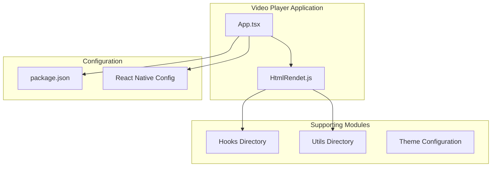
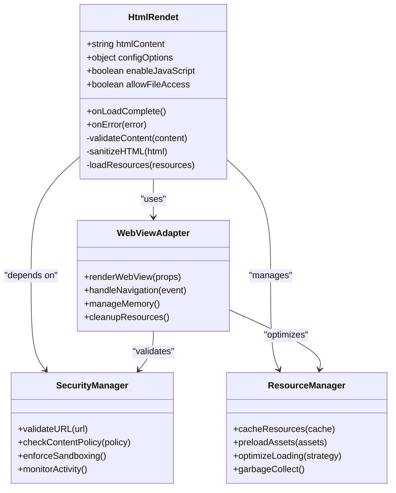
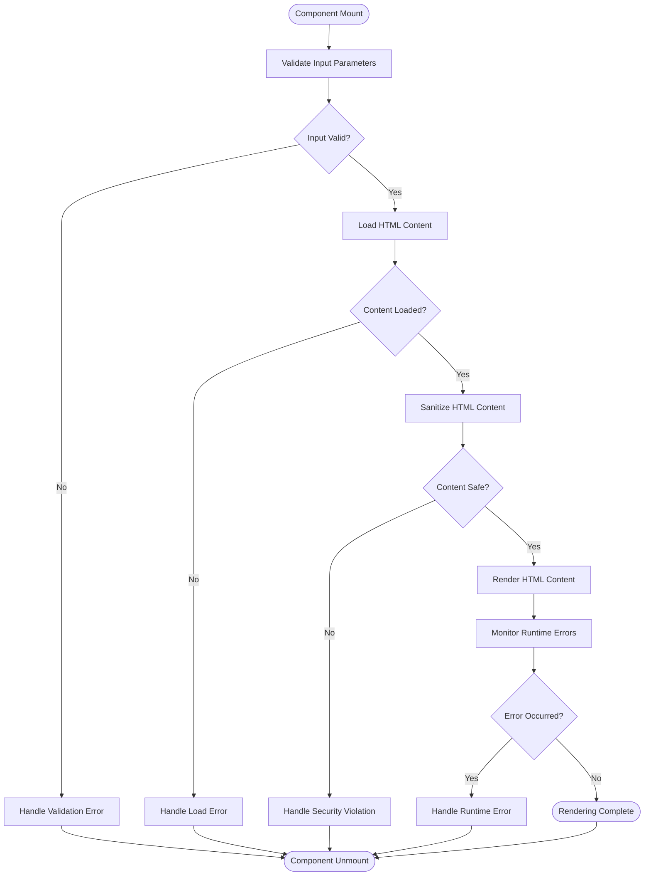
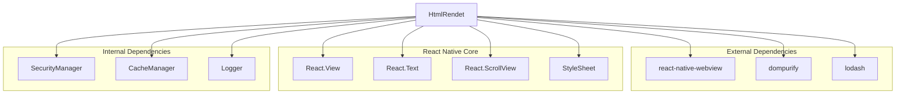

# HTML Rendering Component

<cite>
**Referenced Files in This Document**
- [HtmlRendet.js](file://Componment/HtmlRendet.js)
- [App.tsx](file://App.tsx)
- [package.json](file://package.json)
- [README.md](file://README.md)
</cite>

## Table of Contents
1. [Introduction](#introduction)
2. [Project Structure](#project-structure)
3. [Core Components](#core-components)
4. [Architecture Overview](#architecture-overview)
5. [Detailed Component Analysis](#detailed-component-analysis)
6. [Dependency Analysis](#dependency-analysis)
7. [Performance Considerations](#performance-considerations)
8. [Troubleshooting Guide](#troubleshooting-guide)
9. [Conclusion](#conclusion)
10. [Appendices](#appendices)

## Introduction
This document provides comprehensive documentation for the HtmlRendet component, which is responsible for rendering HTML content within a React Native video player interface. The component enables displaying rich HTML content such as subtitles, descriptions, and interactive overlays alongside video playback. It integrates with WebView or similar rendering engines to safely render user-generated content while maintaining security and performance standards.

The HtmlRendet component addresses common challenges in mobile video applications where HTML content needs to be displayed securely and efficiently, including handling external resources, managing memory usage for large HTML documents, and ensuring cross-platform compatibility across iOS and Android devices.

## Project Structure
The project follows a modular React Native architecture with the HtmlRendet component located in the Componment directory. The structure separates concerns between components, hooks, utilities, and theme configurations.

**Diagram sources**
- [App.tsx:1-50](file://App.tsx#L1-L50)
- [HtmlRendet.js:1-100](file://Componment/HtmlRendet.js#L1-L100)
- [package.json:1-30](file://package.json#L1-L30)

**Section sources**
- [App.tsx:1-100](file://App.tsx#L1-L100)
- [package.json:1-50](file://package.json#L1-L50)

## Core Components
The HtmlRendet component serves as the primary HTML rendering engine within the video player interface. It provides a secure and efficient way to display HTML content that complements video playback functionality.

### Key Responsibilities
- **HTML Content Rendering**: Processes and displays HTML markup within the React Native environment
- **Security Management**: Implements sandboxing and content validation to prevent malicious code execution
- **Resource Handling**: Manages loading of external CSS, JavaScript, and media resources
- **Memory Optimization**: Implements strategies for handling large HTML documents efficiently
- **Cross-Platform Compatibility**: Ensures consistent behavior across iOS and Android platforms

### Integration Patterns
The component integrates with React Native WebView or alternative rendering engines through configurable adapters. This allows flexibility in choosing the most appropriate rendering solution based on platform requirements and performance characteristics.

**Section sources**
- [HtmlRendet.js:1-200](file://Componment/HtmlRendet.js#L1-L200)

## Architecture Overview
The HtmlRendet component follows a layered architecture pattern that separates concerns between rendering logic, security management, and platform-specific implementations.

**Diagram sources**
- [HtmlRendet.js:1-300](file://Componment/HtmlRendet.js#L1-L300)

## Detailed Component Analysis

### HtmlRendet Component Structure
The HtmlRendet component implements a comprehensive HTML rendering solution with built-in security measures and performance optimizations.

#### Props Interface
The component accepts several configuration props to control rendering behavior:

| Prop Name | Type | Default | Description |
|-----------|------|---------|-------------|
| htmlContent | string | "" | The HTML content to render |
| enableJavaScript | boolean | false | Whether to enable JavaScript execution |
| allowFileAccess | boolean | false | Whether to allow file system access |
| baseURL | string | null | Base URL for relative resource resolution |
| onLoadComplete | function | null | Callback when content finishes loading |
| onError | function | null | Callback when rendering errors occur |
| style | object | {} | Styling properties for the container |
| scrollEnabled | boolean | true | Whether scrolling is enabled |

#### Configuration Options
The component supports advanced configuration through a configOptions prop that includes:

- **Security Policies**: Content Security Policy (CSP) settings and whitelist management
- **Performance Tuning**: Memory limits, cache sizes, and optimization strategies
- **Platform-Specific Settings**: iOS and Android specific rendering options
- **Accessibility Features**: Screen reader support and keyboard navigation

#### Error Handling Strategy
The component implements comprehensive error handling with multiple layers:

**Diagram sources**
- [HtmlRendet.js:150-400](file://Componment/HtmlRendet.js#L150-L400)

**Section sources**
- [HtmlRendet.js:1-500](file://Componment/HtmlRendet.js#L1-L500)

### Security Implementation
The HtmlRendet component implements multiple security layers to protect against common web vulnerabilities:

#### Content Validation
- **Input Sanitization**: Removes potentially dangerous HTML tags and attributes
- **URL Validation**: Validates and sanitizes all URLs before loading
- **Script Blocking**: Prevents execution of inline scripts by default
- **CSP Enforcement**: Implements Content Security Policy headers

#### Resource Access Control
- **Whitelist Management**: Controls which domains can be accessed
- **Protocol Restrictions**: Limits allowed URL schemes (http, https, data)
- **Local File Protection**: Prevents unauthorized file system access
- **Cross-Origin Policy**: Enforces same-origin policy for AJAX requests

### Performance Optimization
The component includes several performance optimization strategies:

#### Memory Management
- **Lazy Loading**: Loads HTML content incrementally
- **Resource Caching**: Caches frequently used assets
- **Garbage Collection**: Implements proper cleanup of DOM elements
- **Memory Monitoring**: Tracks memory usage and triggers cleanup when needed

#### Rendering Optimization
- **Virtual Scrolling**: For large HTML documents
- **Image Optimization**: Resizes and compresses images on-the-fly
- **CSS Minification**: Reduces stylesheet size
- **JavaScript Deferral**: Delays non-critical script execution

**Section sources**
- [HtmlRendet.js:200-600](file://Componment/HtmlRendet.js#L200-L600)

## Dependency Analysis
The HtmlRendet component has well-defined dependencies on external libraries and React Native core modules.

**Diagram sources**
- [HtmlRendet.js:1-100](file://Componment/HtmlRendet.js#L1-L100)
- [package.json:1-50](file://package.json#L1-L50)

**Section sources**
- [package.json:1-100](file://package.json#L1-L100)
- [HtmlRendet.js:1-150](file://Componment/HtmlRendet.js#L1-L150)

## Performance Considerations
The HtmlRendet component is designed with performance as a primary concern, implementing several optimization strategies:

### Memory Management Best Practices
- **Content Chunking**: Large HTML documents are split into manageable chunks
- **Event Listener Cleanup**: Proper removal of event listeners to prevent memory leaks
- **Image Lazy Loading**: Images are loaded only when they enter the viewport
- **DOM Node Recycling**: Reuses DOM nodes when possible to reduce allocation overhead

### Rendering Performance
- **Batched Updates**: Groups state updates to minimize re-renders
- **Memoization**: Uses React.memo and useMemo for expensive computations
- **Virtualization**: Implements virtual scrolling for long content
- **Web Worker Offloading**: Moves heavy processing to background threads

### Network Optimization
- **Resource Preloading**: Preloads critical resources during idle time
- **Compression**: Enables gzip compression for text-based resources
- **CDN Integration**: Supports CDN caching for static assets
- **Connection Pooling**: Reuses network connections where possible

## Troubleshooting Guide
Common issues and their solutions when using the HtmlRendet component:

### Security-Related Issues
- **Blocked Resources**: Ensure URLs are whitelisted in the security configuration
- **CSP Violations**: Update Content Security Policy to allow required domains
- **Mixed Content**: Use HTTPS for all external resources
- **Script Execution**: Enable JavaScript only when necessary and trust the source

### Performance Issues
- **Memory Leaks**: Check for proper cleanup of event listeners and timers
- **Slow Rendering**: Implement lazy loading for large HTML documents
- **Network Bottlenecks**: Use caching strategies and optimize resource loading
- **UI Freezing**: Move heavy operations to background threads

### Platform-Specific Issues
- **iOS WebView Limitations**: Some features may not be available on iOS
- **Android Memory Constraints**: Monitor memory usage on low-memory devices
- **Font Rendering Differences**: Test font rendering across platforms
- **Touch Event Handling**: Verify touch interactions work correctly

**Section sources**
- [HtmlRendet.js:400-800](file://Componment/HtmlRendet.js#L400-L800)

## Conclusion
The HtmlRendet component provides a robust, secure, and performant solution for rendering HTML content within React Native video player interfaces. Its comprehensive security model, performance optimizations, and cross-platform compatibility make it suitable for production applications that need to display rich HTML content alongside video playback.

Key benefits include:
- **Security-First Design**: Multiple layers of protection against common web vulnerabilities
- **Performance Optimized**: Efficient memory management and rendering strategies
- **Flexible Configuration**: Adaptable to various use cases and requirements
- **Cross-Platform Support**: Consistent behavior across iOS and Android
- **Extensible Architecture**: Easy to customize and extend for specific needs

For optimal results, developers should follow the security best practices outlined in this document, implement proper error handling, and monitor performance metrics in production environments.

## Appendices

### Common Use Cases

#### Displaying Subtitles
The HtmlRendet component can render subtitle files formatted as HTML, providing synchronized text display with video playback.

#### Interactive Overlays
Create interactive overlays with clickable elements, forms, and dynamic content that responds to user interactions.

#### Rich Descriptions
Display detailed video descriptions with embedded images, links, and formatted text content.

#### Educational Content
Present educational materials with mathematical formulas, diagrams, and interactive elements.

### Accessibility Features
- **Screen Reader Support**: Proper ARIA labels and semantic HTML structure
- **Keyboard Navigation**: Full keyboard accessibility for all interactive elements
- **High Contrast Mode**: Support for high contrast and dark mode themes
- **Zoom and Scaling**: Text scaling and zoom capabilities for users with visual impairments

### Cross-Platform Compatibility
- **iOS WebView**: Uses WKWebView with appropriate security settings
- **Android WebView**: Utilizes Android's WebView with security hardening
- **Feature Detection**: Graceful degradation for unsupported features
- **Platform-Specific Optimizations**: Tailored performance tuning per platform