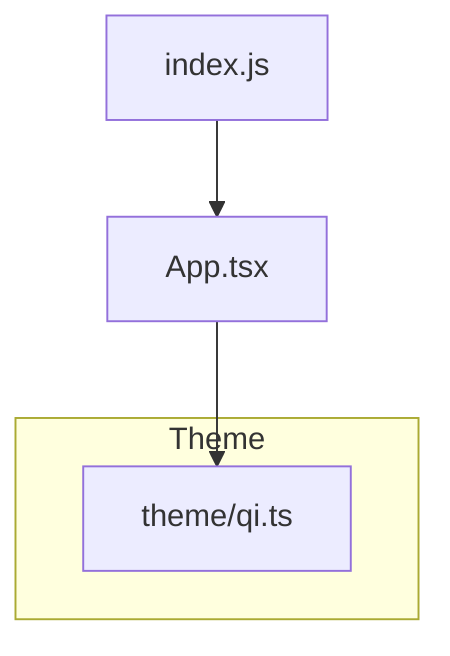
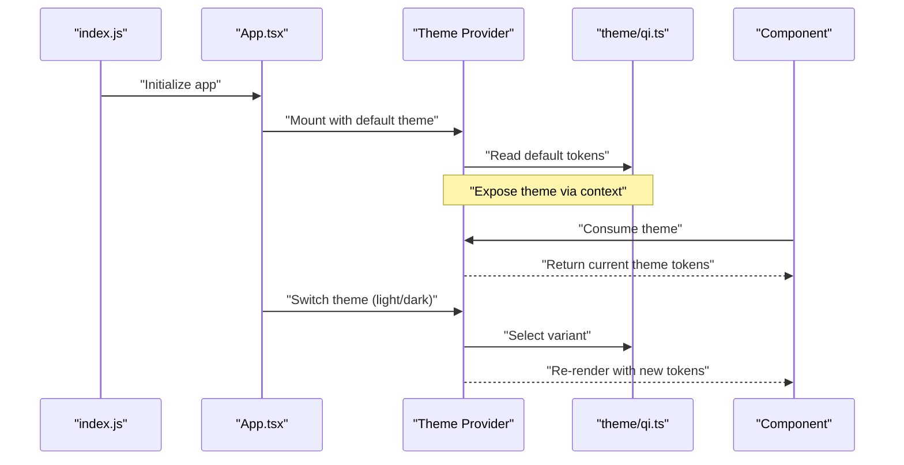
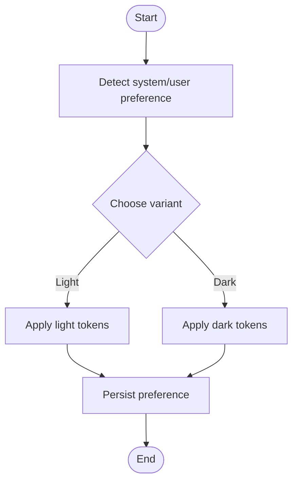
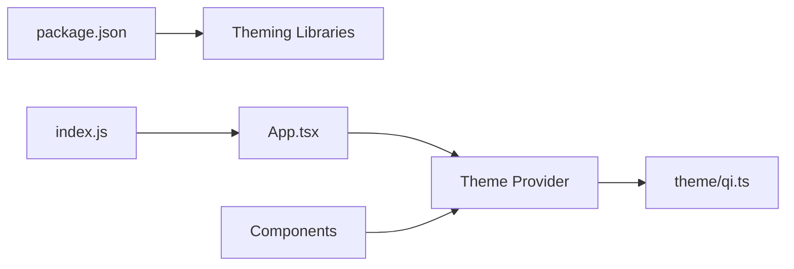

# Theme System

<cite>
**Referenced Files in This Document**
- [App.tsx](file://App.tsx)
- [index.js](file://index.js)
- [theme/qi.ts](file://theme/qi.ts)
- [package.json](file://package.json)
</cite>

## Table of Contents
1. [Introduction](#introduction)
2. [Project Structure](#project-structure)
3. [Core Components](#core-components)
4. [Architecture Overview](#architecture-overview)
5. [Detailed Component Analysis](#detailed-component-analysis)
6. [Dependency Analysis](#dependency-analysis)
7. [Performance Considerations](#performance-considerations)
8. [Troubleshooting Guide](#troubleshooting-guide)
9. [Conclusion](#conclusion)
10. [Appendices](#appendices)

## Introduction
This document explains the theme system architecture in the video-rn application. It covers how themes are defined, provided to the app, consumed by components, and extended for different visual styles or brand requirements. It also documents dynamic theme switching (including dark/light mode), best practices, performance implications, and debugging techniques.

## Project Structure
The theme system is centered around a dedicated theme module and its integration at the application entry points:
- The theme definition lives under the theme directory.
- The app’s root component and entry files wire up providers and consume theme values.
- Dependencies are declared in the package manifest.

**Diagram sources**
- [index.js](file://index.js)
- [App.tsx](file://App.tsx)
- [theme/qi.ts](file://theme/qi.ts)

**Section sources**
- [theme/qi.ts](file://theme/qi.ts)
- [App.tsx](file://App.tsx)
- [index.js](file://index.js)

## Core Components
- Theme definition module: centralizes color schemes, typography, spacing, and component styling tokens.
- App provider layer: exposes theme values to the component tree via React context or a UI library provider.
- Consumers: components read theme tokens through hooks or props to style themselves consistently.

Key responsibilities:
- Define default tokens and variants (e.g., light/dark).
- Provide a stable API for extending or overriding tokens.
- Ensure consistent consumption across components.

**Section sources**
- [theme/qi.ts](file://theme/qi.ts)
- [App.tsx](file://App.tsx)

## Architecture Overview
At runtime, the theme flows from the theme module into the app’s provider layer and then down to components that consume it. Dynamic switching updates the active theme without reloading the app.

**Diagram sources**
- [index.js](file://index.js)
- [App.tsx](file://App.tsx)
- [theme/qi.ts](file://theme/qi.ts)

## Detailed Component Analysis

### Theme Definition Module
Purpose:
- Central source of truth for colors, typography, spacing, and component tokens.
- Exposes variants such as light and dark modes.
- Provides APIs for merging, overriding, and validating tokens.

What to look for:
- Color palette keys (e.g., primary, secondary, background, surface, text).
- Typography scale (font families, sizes, weights, line heights).
- Spacing scale (margins, paddings, gaps).
- Component tokens (buttons, inputs, cards, overlays).
- Variant selectors (light/dark) and fallback behavior.

How consumers use it:
- Import tokens directly where needed.
- Use hooks or higher-order utilities to access the active theme.
- Apply tokens to style properties consistently.

Best practices:
- Keep token names semantic and domain-neutral.
- Avoid hardcoding values in components; always reference tokens.
- Group related tokens logically to improve maintainability.

**Section sources**
- [theme/qi.ts](file://theme/qi.ts)

### App Provider Layer
Purpose:
- Wraps the app with a theme provider to expose theme values throughout the component tree.
- Manages state for the active theme variant.
- Supports programmatic theme switching.

Responsibilities:
- Initialize with a default theme variant.
- Persist user preference if applicable.
- Re-render children when theme changes.

Integration points:
- Root component mounts the provider once.
- Child components consume theme via hooks or context.

Dynamic switching:
- Triggered by user actions or system preferences.
- Updates the active variant and propagates changes efficiently.

**Section sources**
- [App.tsx](file://App.tsx)

### Consumer Pattern in Components
Purpose:
- Read theme tokens to apply consistent styling.
- Adapt to theme changes without manual reconfiguration.

Common patterns:
- Hook-based consumption for functional components.
- Context-based consumption for class components or custom hooks.
- Token composition to derive derived values (e.g., contrast colors).

Guidelines:
- Prefer small, focused hooks for readability.
- Memoize derived values to avoid unnecessary recalculations.
- Validate token availability and provide sensible defaults.

**Section sources**
- [App.tsx](file://App.tsx)
- [theme/qi.ts](file://theme/qi.ts)

### Example Flows

#### Creating Custom Theme Variables
Steps:
- Extend the base theme with new tokens.
- Merge overrides while preserving defaults.
- Register new tokens for components to consume.

Considerations:
- Maintain naming conventions.
- Ensure accessibility (contrast ratios).
- Test across variants (light/dark).

#### Overriding Default Styles
Approach:
- Override specific tokens rather than entire themes.
- Use conditional logic to apply overrides based on platform or feature flags.
- Keep overrides localized to minimize side effects.

#### Implementing Dark/Light Mode
Flow:
- Detect system preference or user selection.
- Select appropriate variant from theme definitions.
- Update provider state to trigger re-renders.
- Persist choice for future sessions.

[No sources needed since this diagram shows conceptual workflow, not actual code structure]

## Dependency Analysis
The theme system depends on:
- The theme definition module for tokens.
- The app provider for exposing and managing theme state.
- Optional libraries declared in the package manifest for theming utilities.

**Diagram sources**
- [package.json](file://package.json)
- [index.js](file://index.js)
- [App.tsx](file://App.tsx)
- [theme/qi.ts](file://theme/qi.ts)

**Section sources**
- [package.json](file://package.json)
- [index.js](file://index.js)
- [App.tsx](file://App.tsx)
- [theme/qi.ts](file://theme/qi.ts)

## Performance Considerations
- Minimize re-renders: memoize theme-derived values and avoid deep object recreation on each render.
- Prefer shallow comparisons for theme objects to reduce diff overhead.
- Lazy-load heavy theme computations only when needed.
- Avoid frequent theme switches in tight loops; batch updates where possible.
- Use stable token references to prevent unnecessary style recalculations.

## Troubleshooting Guide
Common issues and resolutions:
- Missing tokens: ensure all referenced tokens exist in the active variant; add fallbacks.
- Incorrect contrast: validate color pairs against accessibility guidelines.
- Unexpected re-renders: check for unstable theme objects or excessive context updates.
- Platform differences: verify token compatibility across platforms; abstract platform-specific values.
- Debugging tips:
  - Log the active theme variant during development.
  - Inspect computed styles in the debugger.
  - Add visual indicators for missing or overridden tokens.

## Conclusion
A robust theme system centralizes design tokens, provides a clear provider pattern, and enables dynamic switching. By following best practices—semantic token naming, consistent consumption, and careful performance management—you can maintain a scalable, accessible, and brand-aligned interface across your application.

## Appendices

### Quick Reference: Extending and Customizing Themes
- Extend base tokens with new variables.
- Merge overrides selectively.
- Create variants for different brands or modes.
- Document token usage and constraints.

### Best Practices Checklist
- Use semantic token names.
- Keep tokens flat and composable.
- Validate accessibility early.
- Centralize overrides in one place.
- Test across devices and orientations.