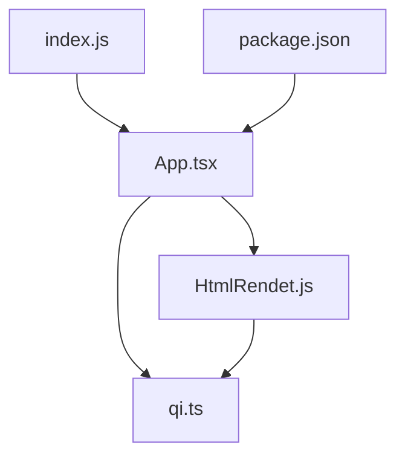
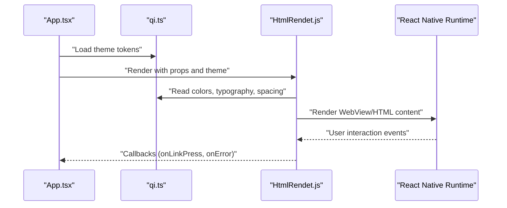
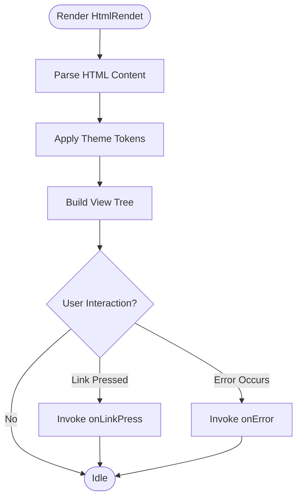
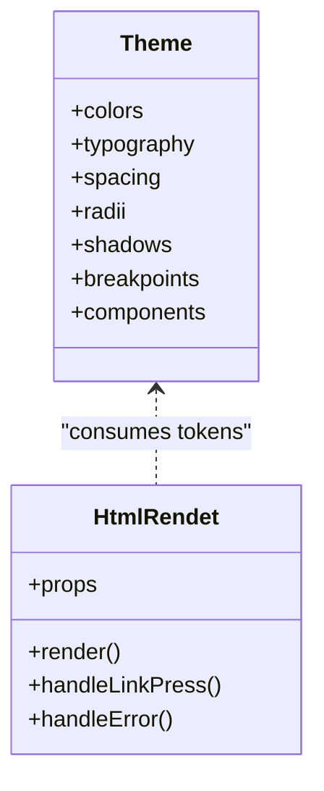
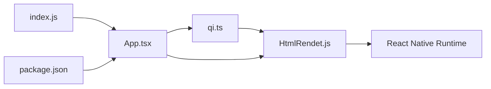

# UI Components

<cite>
**Referenced Files in This Document**
- [HtmlRendet.js](file://Componment/HtmlRendet.js)
- [qi.ts](file://theme/qi.ts)
- [App.tsx](file://App.tsx)
- [index.js](file://index.js)
- [package.json](file://package.json)
</cite>

## Table of Contents
1. [Introduction](#introduction)
2. [Project Structure](#project-structure)
3. [Core Components](#core-components)
4. [Architecture Overview](#architecture-overview)
5. [Detailed Component Analysis](#detailed-component-analysis)
6. [Dependency Analysis](#dependency-analysis)
7. [Performance Considerations](#performance-considerations)
8. [Troubleshooting Guide](#troubleshooting-guide)
9. [Conclusion](#conclusion)
10. [Appendices](#appendices)

## Introduction
This document explains the UI layer of the video-rn application with a focus on:
- The HtmlRendet component for rendering rich HTML content within the video player interface
- The theme system architecture and how to customize visual appearance across the app
- Component composition patterns, prop interfaces, and styling approaches
- Creating custom components that integrate seamlessly with the design system
- Accessibility considerations and responsive design patterns used throughout the UI layer

The goal is to make it easy for both new and experienced developers to understand, extend, and maintain the UI consistently.

## Project Structure
The UI-related code relevant to this documentation lives primarily in:
- Componment/HtmlRendet.js: The HTML renderer component
- theme/qi.ts: Centralized theme definitions and tokens
- App.tsx: Application entry point where the theme may be applied
- index.js: React Native entry point
- package.json: Dependencies that influence UI behavior (e.g., webview or HTML rendering libraries)

**Diagram sources**
- [App.tsx](file://App.tsx)
- [HtmlRendet.js](file://Componment/HtmlRendet.js)
- [qi.ts](file://theme/qi.ts)
- [index.js](file://index.js)
- [package.json](file://package.json)

**Section sources**
- [App.tsx](file://App.tsx)
- [index.js](file://index.js)
- [package.json](file://package.json)

## Core Components
- HtmlRendet: Renders rich HTML content inside the video player UI. It typically integrates with a WebView or similar mechanism to display formatted text, links, images, and other HTML elements.
- Theme (qi.ts): Provides centralized design tokens such as colors, typography, spacing, breakpoints, and component-specific styles.

Key responsibilities:
- HtmlRendet
  - Accepts HTML string or structured content
  - Applies theme-aware styling
  - Handles user interactions (links, taps) safely
  - Integrates with accessibility features (labels, roles)
- Theme
  - Exposes consistent tokens for colors, fonts, spacing, radii, shadows
  - Supports dynamic updates (light/dark mode)
  - Defines responsive breakpoints and layout scales

**Section sources**
- [HtmlRendet.js](file://Componment/HtmlRendet.js)
- [qi.ts](file://theme/qi.ts)

## Architecture Overview
The UI architecture follows a clear separation between presentation and theming:
- App.tsx orchestrates providers and global configuration
- HtmlRendet consumes theme tokens to render HTML content consistently
- qi.ts centralizes all style variables and responsive rules

**Diagram sources**
- [App.tsx](file://App.tsx)
- [qi.ts](file://theme/qi.ts)
- [HtmlRendet.js](file://Componment/HtmlRendet.js)

## Detailed Component Analysis

### HtmlRendet Component
Purpose:
- Display rich HTML content within the video player UI while maintaining theme consistency and accessibility.

Typical prop interface:
- html: string or object containing HTML content
- containerStyle: optional overrides for container layout
- textStyle: optional overrides for text styling
- linkColor: color for hyperlinks
- onLinkPress: callback when a link is pressed
- onError: callback for rendering errors
- accessible: boolean to enable accessibility traversal
- accessibilityLabel: label for screen readers
- allowFileAccess: whether file access is allowed in the underlying renderer
- injectedJavaScript: optional script injection for enhanced behavior

Styling approach:
- Uses theme tokens from qi.ts for colors, typography, spacing
- Supports responsive scaling via breakpoint-aware values
- Allows component-level overrides through style props

Accessibility:
- Ensures proper roles and labels for interactive elements
- Supports keyboard navigation where applicable
- Announces link destinations and error states

Responsive behavior:
- Adapts font sizes and spacing based on device width
- Scales images and media appropriately

**Diagram sources**
- [HtmlRendet.js](file://Componment/HtmlRendet.js)

**Section sources**
- [HtmlRendet.js](file://Componment/HtmlRendet.js)

### Theme System (qi.ts)
Purpose:
- Centralize design tokens and responsive rules to ensure consistent visual appearance across the app.

Tokens typically include:
- Colors: primary, secondary, background, surface, text, link, error, success
- Typography: font families, sizes, weights, line heights
- Spacing: scale for margins, paddings, gaps
- Radii: border radius values for cards, buttons, inputs
- Shadows: elevation and shadow definitions
- Breakpoints: responsive thresholds for layouts
- Component themes: default styles for common UI elements

Customization:
- Override tokens at app level to implement brand changes
- Support dynamic themes (light/dark) by swapping token sets
- Extend tokens for new components without breaking existing usage

**Diagram sources**
- [qi.ts](file://theme/qi.ts)
- [HtmlRendet.js](file://Componment/HtmlRendet.js)

**Section sources**
- [qi.ts](file://theme/qi.ts)

### App Integration
- App.tsx initializes the theme provider and renders HtmlRendet with appropriate props
- index.js bootstraps the React Native app and ensures environment readiness
- package.json lists dependencies that impact UI behavior (e.g., webview libraries)

Best practices:
- Keep theme configuration centralized
- Pass minimal necessary props to HtmlRendet
- Use callbacks for interactions rather than direct state mutations

**Section sources**
- [App.tsx](file://App.tsx)
- [index.js](file://index.js)
- [package.json](file://package.json)

## Dependency Analysis
HtmlRendet depends on:
- Theme tokens from qi.ts for consistent styling
- Underlying rendering engine (WebView or similar) for HTML display
- React Native runtime for platform-specific behaviors

App depends on:
- Theme provider to supply tokens globally
- HtmlRendet for HTML rendering needs

**Diagram sources**
- [qi.ts](file://theme/qi.ts)
- [HtmlRendet.js](file://Componment/HtmlRendet.js)
- [App.tsx](file://App.tsx)
- [index.js](file://index.js)
- [package.json](file://package.json)

**Section sources**
- [qi.ts](file://theme/qi.ts)
- [HtmlRendet.js](file://Componment/HtmlRendet.js)
- [App.tsx](file://App.tsx)
- [index.js](file://index.js)
- [package.json](file://package.json)

## Performance Considerations
- Minimize re-renders of HtmlRendet by memoizing HTML content and stable props
- Avoid heavy JavaScript injection unless necessary; prefer native capabilities
- Use lazy loading for large HTML payloads
- Debounce frequent user interactions (e.g., link presses) if needed
- Prefer static assets over inline HTML when possible to reduce payload size

[No sources needed since this section provides general guidance]

## Troubleshooting Guide
Common issues and resolutions:
- HTML not rendering: Verify WebView permissions and allowFileAccess settings
- Links not responding: Ensure onLinkPress is provided and event propagation is handled
- Styling inconsistencies: Check theme token availability and override precedence
- Accessibility failures: Confirm accessible and accessibilityLabel are set correctly
- Performance drops: Reduce injected scripts and optimize HTML structure

**Section sources**
- [HtmlRendet.js](file://Componment/HtmlRendet.js)
- [qi.ts](file://theme/qi.ts)

## Conclusion
The UI layer of video-rn centers around a robust HtmlRendet component and a flexible theme system. By following the documented patterns—centralized tokens, clear prop interfaces, and accessibility-first design—you can create custom components that integrate seamlessly and maintain a consistent, responsive, and accessible experience across devices.

[No sources needed since this section summarizes without analyzing specific files]

## Appendices

### Creating Custom Components
Steps:
- Define component props with clear types and defaults
- Consume theme tokens from qi.ts for consistent styling
- Implement accessibility attributes (accessible, accessibilityLabel, role)
- Provide callbacks for user interactions (e.g., onPress, onLinkPress)
- Test responsiveness across breakpoints

Example pattern:
- Create a wrapper component that composes HtmlRendet with additional logic
- Use theme tokens for colors, typography, and spacing
- Expose minimal, focused props to consumers

[No sources needed since this section provides general guidance]

### Responsive Design Patterns
- Use breakpoint-aware values from theme tokens
- Scale typography and spacing proportionally
- Ensure touch targets meet minimum size guidelines
- Validate layouts on various screen densities

[No sources needed since this section provides general guidance]