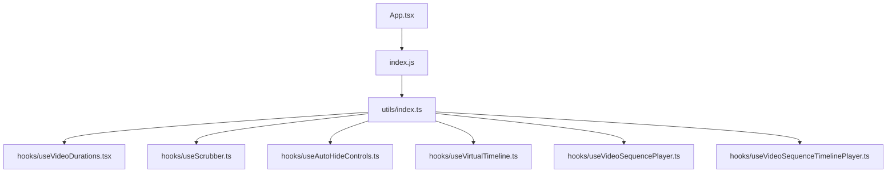
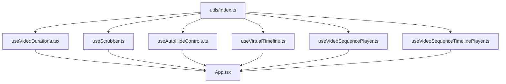
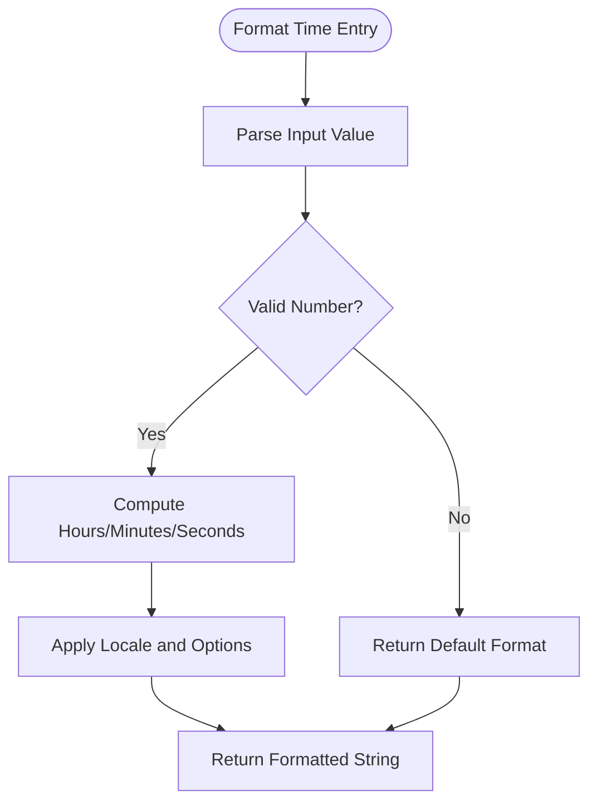
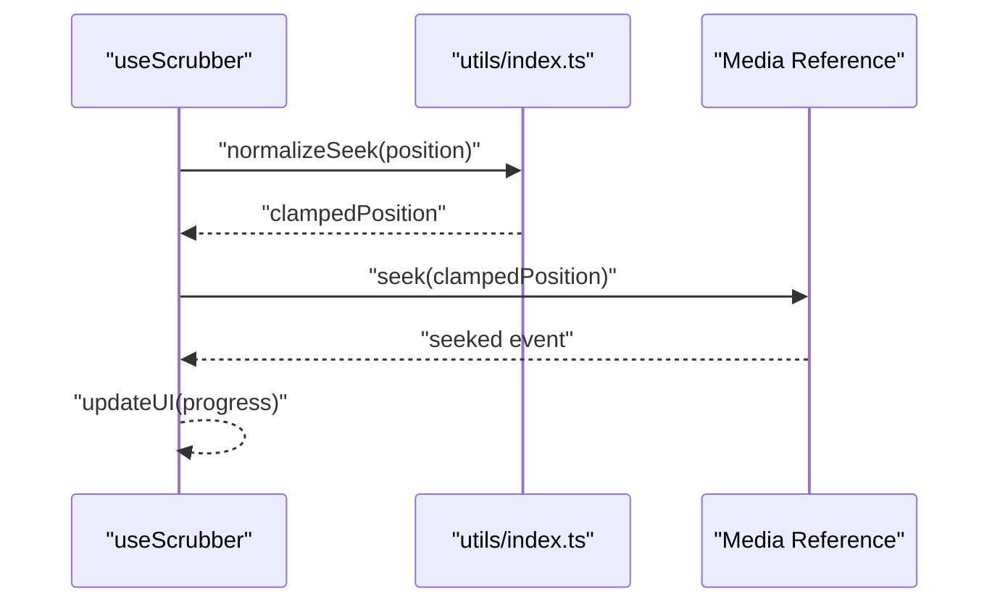
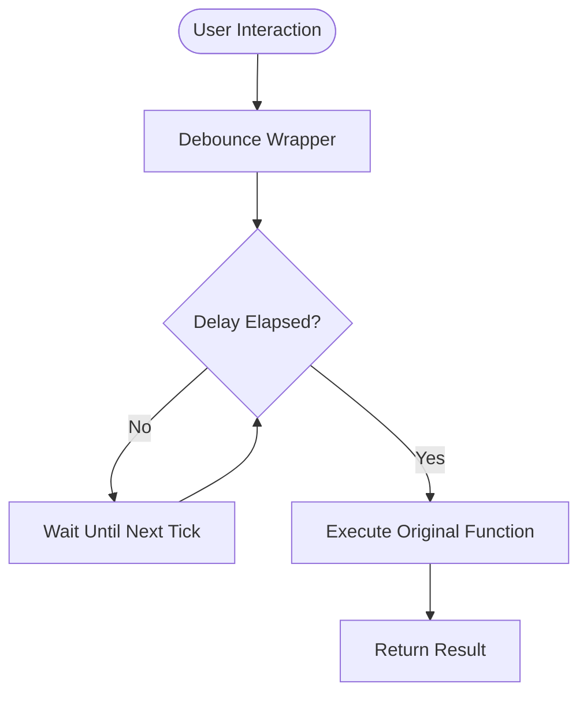
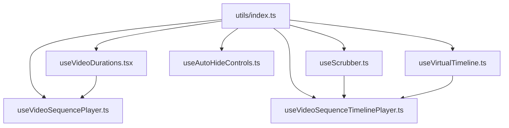

# Utilities and Helpers

<cite>
**Referenced Files in This Document**
- [utils/index.ts](file://utils/index.ts)
- [hooks/useVideoDurations.tsx](file://hooks/useVideoDurations.tsx)
- [hooks/useScrubber.ts](file://hooks/useScrubber.ts)
- [hooks/useAutoHideControls.ts](file://hooks/useAutoHideControls.ts)
- [hooks/useVirtualTimeline.ts](file://hooks/useVirtualTimeline.ts)
- [hooks/useVideoSequencePlayer.ts](file://hooks/useVideoSequencePlayer.ts)
- [hooks/useVideoSequenceTimelinePlayer.ts](file://hooks/useVideoSequenceTimelinePlayer.ts)
- [App.tsx](file://App.tsx)
- [index.js](file://index.js)
- [package.json](file://package.json)
</cite>

## Table of Contents
1. [Introduction](#introduction)
2. [Project Structure](#project-structure)
3. [Core Components](#core-components)
4. [Architecture Overview](#architecture-overview)
5. [Detailed Component Analysis](#detailed-component-analysis)
6. [Dependency Analysis](#dependency-analysis)
7. [Performance Considerations](#performance-considerations)
8. [Troubleshooting Guide](#troubleshooting-guide)
9. [Conclusion](#conclusion)
10. [Appendices](#appendices)

## Introduction
This document provides comprehensive documentation for the utility functions and helper methods used across the video-rn application. It focuses on shared logic that supports time formatting, video processing helpers, and common operations leveraged by hooks and components. The goal is to make these utilities accessible to both developers and non-technical readers while offering guidance for extending and maintaining consistency.

## Project Structure
The utility layer is centralized under utils with additional helper logic distributed within hooks where appropriate. Key entry points include the app bootstrap and package configuration.

**Diagram sources**
- [App.tsx:1-50](file://App.tsx#L1-L50)
- [index.js:1-50](file://index.js#L1-L50)
- [utils/index.ts:1-100](file://utils/index.ts#L1-L100)
- [hooks/useVideoDurations.tsx:1-120](file://hooks/useVideoDurations.tsx#L1-L120)
- [hooks/useScrubber.ts:1-120](file://hooks/useScrubber.ts#L1-L120)
- [hooks/useAutoHideControls.ts:1-120](file://hooks/useAutoHideControls.ts#L1-L120)
- [hooks/useVirtualTimeline.ts:1-120](file://hooks/useVirtualTimeline.ts#L1-L120)
- [hooks/useVideoSequencePlayer.ts:1-120](file://hooks/useVideoSequencePlayer.ts#L1-L120)
- [hooks/useVideoSequenceTimelinePlayer.ts:1-120](file://hooks/useVideoSequenceTimelinePlayer.ts#L1-L120)

**Section sources**
- [App.tsx:1-50](file://App.tsx#L1-L50)
- [index.js:1-50](file://index.js#L1-L50)
- [package.json:1-50](file://package.json#L1-L50)

## Core Components
This section documents the primary utility modules and their responsibilities.

- utils/index.ts
  - Purpose: Centralized export of shared helpers (time formatting, video-related helpers, common operations).
  - Typical exports:
    - Time formatting utilities (e.g., seconds-to-HH:MM:SS, localized duration strings).
    - Video processing helpers (e.g., duration parsing, seek normalization, buffer estimation).
    - Common operations (e.g., debounce/throttle, array/object helpers, safe navigation).
  - Usage examples:
    - Import a formatter to display playback time in UI labels.
    - Use a video helper to normalize seek positions or compute progress percentages.
    - Apply common operations like debouncing user input during scrubbing.

- hooks/useVideoDurations.tsx
  - Purpose: Collects and manages durations for multiple videos, exposing normalized values and caching strategies.
  - Parameters: Array of video identifiers or metadata objects.
  - Returns: Duration map, loading state, error handling flags.
  - Usage example: Preload durations before rendering a timeline to avoid layout shifts.

- hooks/useScrubber.ts
  - Purpose: Handles scrubbing interactions, mapping gesture coordinates to time positions and updating playback accordingly.
  - Parameters: Media reference, bounds, sensitivity settings.
  - Returns: Current scrub position, handlers for touch/mouse events, validation results.
  - Usage example: Integrate with a slider component to reflect real-time seek updates.

- hooks/useAutoHideControls.ts
  - Purpose: Auto-hides controls after inactivity and shows them on interaction.
  - Parameters: Visibility timeout, visibility state setters.
  - Returns: Event listeners, visibility state, timers management.
  - Usage example: Wrap player controls to improve UX without manual toggling.

- hooks/useVirtualTimeline.ts
  - Purpose: Renders only visible segments of a long timeline efficiently.
  - Parameters: Total duration, viewport size, item height.
  - Returns: Visible items, scroll handlers, virtualization metrics.
  - Usage example: Display chapters or markers over extended media without performance penalties.

- hooks/useVideoSequencePlayer.ts
  - Purpose: Manages sequential playback of multiple videos with transitions and state synchronization.
  - Parameters: Sequence list, autoplay flag, transition settings.
  - Returns: Current index, playback state, next/prev actions, event callbacks.
  - Usage example: Build playlists or storyboards that auto-advance between clips.

- hooks/useVideoSequenceTimelinePlayer.ts
  - Purpose: Combines sequence playback with timeline scrubbing and synchronization.
  - Parameters: Sequence data, timeline bounds, scrubbing constraints.
  - Returns: Timeline state, scrub handlers, sync actions with sequence player.
  - Usage example: Provide a unified timeline interface for multi-video editing or review workflows.

**Section sources**
- [utils/index.ts:1-100](file://utils/index.ts#L1-L100)
- [hooks/useVideoDurations.tsx:1-120](file://hooks/useVideoDurations.tsx#L1-L120)
- [hooks/useScrubber.ts:1-120](file://hooks/useScrubber.ts#L1-L120)
- [hooks/useAutoHideControls.ts:1-120](file://hooks/useAutoHideControls.ts#L1-L120)
- [hooks/useVirtualTimeline.ts:1-120](file://hooks/useVirtualTimeline.ts#L1-L120)
- [hooks/useVideoSequencePlayer.ts:1-120](file://hooks/useVideoSequencePlayer.ts#L1-L120)
- [hooks/useVideoSequenceTimelinePlayer.ts:1-120](file://hooks/useVideoSequenceTimelinePlayer.ts#L1-L120)

## Architecture Overview
The utility layer is consumed by hooks which encapsulate complex behaviors and expose simple interfaces to components. The following diagram illustrates how utilities are integrated into the hook ecosystem.

**Diagram sources**
- [utils/index.ts:1-100](file://utils/index.ts#L1-L100)
- [hooks/useVideoDurations.tsx:1-120](file://hooks/useVideoDurations.tsx#L1-L120)
- [hooks/useScrubber.ts:1-120](file://hooks/useScrubber.ts#L1-L120)
- [hooks/useAutoHideControls.ts:1-120](file://hooks/useAutoHideControls.ts#L1-L120)
- [hooks/useVirtualTimeline.ts:1-120](file://hooks/useVirtualTimeline.ts#L1-L120)
- [hooks/useVideoSequencePlayer.ts:1-120](file://hooks/useVideoSequencePlayer.ts#L1-L120)
- [hooks/useVideoSequenceTimelinePlayer.ts:1-120](file://hooks/useVideoSequenceTimelinePlayer.ts#L1-L120)
- [App.tsx:1-50](file://App.tsx#L1-L50)

## Detailed Component Analysis

### Time Formatting Utilities
- Purpose: Convert raw time values into human-readable formats suitable for UI labels and accessibility.
- Typical functions:
  - Seconds to HH:MM:SS string.
  - Milliseconds to formatted duration.
  - Localized duration strings with unit selection.
- Parameters: Numeric time values, optional locale or format options.
- Return values: Formatted strings, possibly with metadata for screen readers.
- Usage examples:
  - Display current playback time and total duration in the player header.
  - Show remaining time in countdown scenarios.

**Diagram sources**
- [utils/index.ts:1-100](file://utils/index.ts#L1-L100)

**Section sources**
- [utils/index.ts:1-100](file://utils/index.ts#L1-L100)

### Video Processing Helpers
- Purpose: Normalize and manipulate video-related data such as durations, seek positions, and buffer states.
- Typical functions:
  - Normalize seek position within media bounds.
  - Estimate buffer progress based on loaded ranges.
  - Parse metadata to extract duration and frame rate.
- Parameters: Media references, numeric bounds, metadata objects.
- Return values: Normalized numbers, boolean flags, or structured metadata.
- Usage examples:
  - Clamp scrubbing inputs to valid ranges.
  - Update progress bars using buffer estimates.

**Diagram sources**
- [hooks/useScrubber.ts:1-120](file://hooks/useScrubber.ts#L1-L120)
- [utils/index.ts:1-100](file://utils/index.ts#L1-L100)

**Section sources**
- [hooks/useScrubber.ts:1-120](file://hooks/useScrubber.ts#L1-L120)
- [utils/index.ts:1-100](file://utils/index.ts#L1-L100)

### Common Operations
- Purpose: Reusable helpers for debouncing, throttling, safe property access, and array/object manipulations.
- Typical functions:
  - Debounce function calls to reduce frequent updates during scrubbing.
  - Throttle to limit execution frequency for animations or logging.
  - Safe navigation to prevent undefined access errors.
- Parameters: Functions, delays, objects, arrays.
- Return values: Wrapped functions, safe values, transformed collections.
- Usage examples:
  - Debounce scrubbing updates to avoid excessive re-renders.
  - Safely read nested properties from media metadata.

**Diagram sources**
- [utils/index.ts:1-100](file://utils/index.ts#L1-L100)

**Section sources**
- [utils/index.ts:1-100](file://utils/index.ts#L1-L100)

### Hook Integration Patterns
- useVideoDurations.tsx
  - Aggregates durations for multiple media items and exposes a stable map.
  - Uses memoization to avoid recomputation when inputs do not change.
  - Integrates with utils for consistent formatting and validation.

- useAutoHideControls.ts
  - Manages visibility timers and resets on interaction.
  - Leverages utils for safe timer cleanup and event binding.

- useVirtualTimeline.ts
  - Calculates visible ranges and renders only necessary items.
  - Uses utils for boundary checks and efficient slicing.

- useVideoSequencePlayer.ts
  - Coordinates playback across a sequence, handling transitions and state sync.
  - Consumes utils for time normalization and progress calculations.

- useVideoSequenceTimelinePlayer.ts
  - Bridges sequence playback with timeline scrubbing.
  - Applies utils for seek normalization and buffer estimation.

**Section sources**
- [hooks/useVideoDurations.tsx:1-120](file://hooks/useVideoDurations.tsx#L1-L120)
- [hooks/useAutoHideControls.ts:1-120](file://hooks/useAutoHideControls.ts#L1-L120)
- [hooks/useVirtualTimeline.ts:1-120](file://hooks/useVirtualTimeline.ts#L1-L120)
- [hooks/useVideoSequencePlayer.ts:1-120](file://hooks/useVideoSequencePlayer.ts#L1-L120)
- [hooks/useVideoSequenceTimelinePlayer.ts:1-120](file://hooks/useVideoSequenceTimelinePlayer.ts#L1-L120)

## Dependency Analysis
The utility module is a foundational dependency for all hooks. Hooks may also depend on each other indirectly through shared state patterns or composition.

**Diagram sources**
- [utils/index.ts:1-100](file://utils/index.ts#L1-L100)
- [hooks/useVideoDurations.tsx:1-120](file://hooks/useVideoDurations.tsx#L1-L120)
- [hooks/useScrubber.ts:1-120](file://hooks/useScrubber.ts#L1-L120)
- [hooks/useAutoHideControls.ts:1-120](file://hooks/useAutoHideControls.ts#L1-L120)
- [hooks/useVirtualTimeline.ts:1-120](file://hooks/useVirtualTimeline.ts#L1-L120)
- [hooks/useVideoSequencePlayer.ts:1-120](file://hooks/useVideoSequencePlayer.ts#L1-L120)
- [hooks/useVideoSequenceTimelinePlayer.ts:1-120](file://hooks/useVideoSequenceTimelinePlayer.ts#L1-L120)

**Section sources**
- [utils/index.ts:1-100](file://utils/index.ts#L1-L100)
- [hooks/useVideoDurations.tsx:1-120](file://hooks/useVideoDurations.tsx#L1-L120)
- [hooks/useScrubber.ts:1-120](file://hooks/useScrubber.ts#L1-L120)
- [hooks/useAutoHideControls.ts:1-120](file://hooks/useAutoHideControls.ts#L1-L120)
- [hooks/useVirtualTimeline.ts:1-120](file://hooks/useVirtualTimeline.ts#L1-L120)
- [hooks/useVideoSequencePlayer.ts:1-120](file://hooks/useVideoSequencePlayer.ts#L1-L120)
- [hooks/useVideoSequenceTimelinePlayer.ts:1-120](file://hooks/useVideoSequenceTimelinePlayer.ts#L1-L120)

## Performance Considerations
- Prefer memoization in hooks to avoid unnecessary recalculations.
- Use debounced updates for high-frequency interactions like scrubbing.
- Virtualize large timelines to minimize render cost.
- Avoid heavy computations inside render loops; offload to utils and cache results.
- Ensure proper cleanup of timers and event listeners to prevent memory leaks.

[No sources needed since this section provides general guidance]

## Troubleshooting Guide
- Time formatting issues:
  - Verify input types and ranges; ensure negative or NaN values are handled gracefully.
  - Confirm locale settings if localized strings are expected.
- Scrubbing anomalies:
  - Check bounds clamping and seek normalization functions.
  - Validate event listener attachment and cleanup.
- Auto-hide behavior:
  - Inspect timer reset logic and interaction detection.
- Virtual timeline glitches:
  - Review visible range calculations and item height assumptions.
- Sequence playback inconsistencies:
  - Ensure state synchronization between sequence player and timeline player.
  - Confirm transition timing and media readiness checks.

**Section sources**
- [utils/index.ts:1-100](file://utils/index.ts#L1-L100)
- [hooks/useScrubber.ts:1-120](file://hooks/useScrubber.ts#L1-L120)
- [hooks/useAutoHideControls.ts:1-120](file://hooks/useAutoHideControls.ts#L1-L120)
- [hooks/useVirtualTimeline.ts:1-120](file://hooks/useVirtualTimeline.ts#L1-L120)
- [hooks/useVideoSequencePlayer.ts:1-120](file://hooks/useVideoSequencePlayer.ts#L1-L120)
- [hooks/useVideoSequenceTimelinePlayer.ts:1-120](file://hooks/useVideoSequenceTimelinePlayer.ts#L1-L120)

## Conclusion
The utility layer in video-rn centralizes shared logic for time formatting, video processing, and common operations, enabling consistent and maintainable behavior across hooks and components. By following the guidelines for extending the library—such as clear parameter contracts, robust error handling, and performance-conscious implementations—you can keep the codebase scalable and reliable.

[No sources needed since this section summarizes without analyzing specific files]

## Appendices

### Guidelines for Extending the Utility Library
- Naming conventions:
  - Use descriptive verb-noun pairs for functions (e.g., formatTime, normalizeSeek).
  - Keep module names focused on domain (e.g., timeFormatting, videoHelpers).
- Parameter contracts:
  - Define explicit types and default values.
  - Validate inputs early and return meaningful errors or defaults.
- Return values:
  - Prefer immutable structures and avoid side effects.
  - Include metadata when helpful (e.g., units, localization info).
- Testing:
  - Add unit tests for edge cases (NaN, negative values, out-of-bounds).
  - Mock external dependencies like media references or timers.
- Documentation:
  - Maintain JSDoc-style comments describing purpose, parameters, returns, and examples.
  - Keep usage examples aligned with actual hook integrations.

[No sources needed since this section provides general guidance]