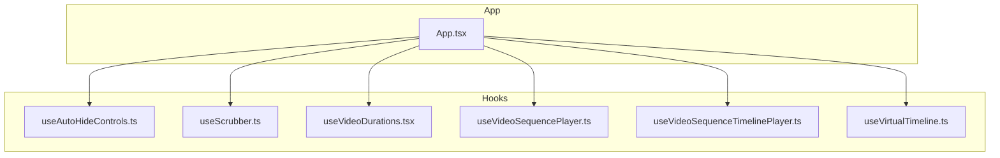
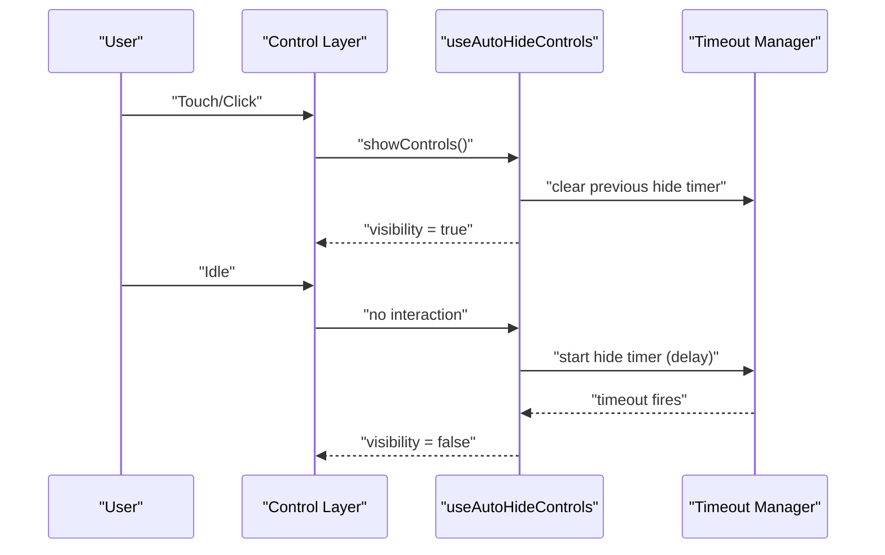
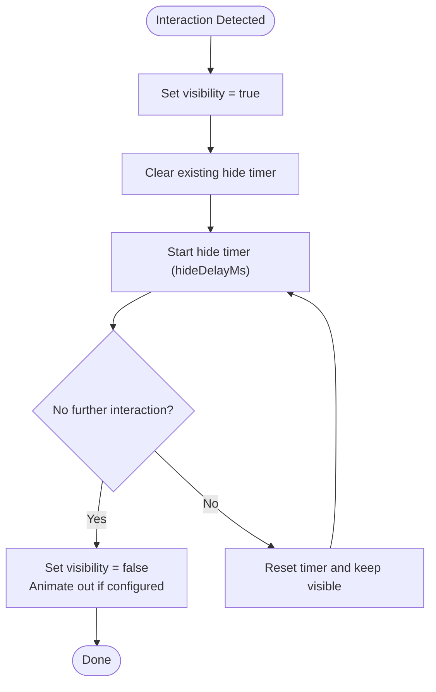
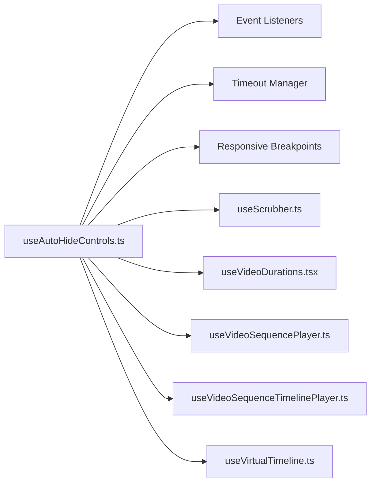

# Auto-Hiding Controls System

<cite>
**Referenced Files in This Document**
- [useAutoHideControls.ts](file://hooks/useAutoHideControls.ts)
- [App.tsx](file://App.tsx)
- [README.md](file://README.md)
- [useScrubber.ts](file://hooks/useScrubber.ts)
- [useVideoDurations.tsx](file://hooks/useVideoDurations.tsx)
- [useVideoSequencePlayer.ts](file://hooks/useVideoSequencePlayer.ts)
- [useVideoSequenceTimelinePlayer.ts](file://hooks/useVideoSequenceTimelinePlayer.ts)
- [useVirtualTimeline.ts](file://hooks/useVirtualTimeline.ts)
</cite>

## Table of Contents
1. [Introduction](#introduction)
2. [Project Structure](#project-structure)
3. [Core Components](#core-components)
4. [Architecture Overview](#architecture-overview)
5. [Detailed Component Analysis](#detailed-component-analysis)
6. [Dependency Analysis](#dependency-analysis)
7. [Performance Considerations](#performance-considerations)
8. [Troubleshooting Guide](#troubleshooting-guide)
9. [Conclusion](#conclusion)

## Introduction
This document explains the auto-hiding controls system used in the video player, focusing on how control visibility is managed during playback. It covers automatic hiding after user inactivity, manual show/hide triggers, touch event handling, timeout mechanisms, configuration options (hide delays, animation transitions, responsive behavior), and examples for customizing appearance and integrating with other player features.

## Project Structure
The auto-hiding controls are implemented primarily through a dedicated hook that encapsulates visibility state, timers, and event handling. Other hooks provide complementary functionality such as scrubbing, duration tracking, and timeline management.

**Diagram sources**
- [useAutoHideControls.ts](file://hooks/useAutoHideControls.ts)
- [useScrubber.ts](file://hooks/useScrubber.ts)
- [useVideoDurations.tsx](file://hooks/useVideoDurations.tsx)
- [useVideoSequencePlayer.ts](file://hooks/useVideoSequencePlayer.ts)
- [useVideoSequenceTimelinePlayer.ts](file://hooks/useVideoSequenceTimelinePlayer.ts)
- [useVirtualTimeline.ts](file://hooks/useVirtualTimeline.ts)
- [App.tsx](file://App.tsx)

**Section sources**
- [App.tsx](file://App.tsx)
- [useAutoHideControls.ts](file://hooks/useAutoHideControls.ts)
- [useScrubber.ts](file://hooks/useScrubber.ts)
- [useVideoDurations.tsx](file://hooks/useVideoDurations.tsx)
- [useVideoSequencePlayer.ts](file://hooks/useVideoSequencePlayer.ts)
- [useVideoSequenceTimelinePlayer.ts](file://hooks/useVideoSequenceTimelinePlayer.ts)
- [useVirtualTimeline.ts](file://hooks/useVirtualTimeline.ts)

## Core Components
- useAutoHideControls: Central hook managing control visibility, timeouts, and events.
- App: Orchestrates hooks and composes UI elements that react to control visibility.
- Supporting hooks: Scrubber, durations, sequence players, and virtual timeline integrate with visibility to ensure consistent UX across interactions.

Key responsibilities:
- Maintain a boolean visibility state for controls.
- Start/stop timers to hide controls after inactivity.
- Respond to touch/mouse events to show controls.
- Expose methods to manually show/hide controls.
- Provide configuration for hide delay, animation transitions, and responsive behavior.

**Section sources**
- [useAutoHideControls.ts](file://hooks/useAutoHideControls.ts)
- [App.tsx](file://App.tsx)

## Architecture Overview
The auto-hiding controls follow a clear separation of concerns:
- State and timers live in the hook.
- UI components subscribe to visibility state and trigger actions via exposed handlers.
- Player events (play/pause, seek) can influence visibility behavior.

**Diagram sources**
- [useAutoHideControls.ts](file://hooks/useAutoHideControls.ts)
- [App.tsx](file://App.tsx)

## Detailed Component Analysis

### useAutoHideControls Hook
Responsibilities:
- Visibility state: tracks whether controls should be shown or hidden.
- Timeout management: schedules hide operations after inactivity; clears timers on new interactions.
- Event handling: listens to touch/mouse events to reset the inactivity timer and show controls.
- Manual control: exposes show/hide functions for programmatic control.
- Configuration: accepts options for hide delay, animation transition settings, and responsive thresholds.

Typical API surface:
- State: isVisible (boolean)
- Handlers: onTouchStart/onMouseDown, onMouseMove, onScroll, onClick
- Methods: showControls(), hideControls()
- Config: hideDelayMs, animationDuration, animationEasing, responsive breakpoints

Behavioral flow:
- On any user interaction within the controlled area, set visibility to true and restart the hide timer.
- If no interaction occurs within hideDelayMs, hide controls and optionally animate out.
- When playback starts/stops or seeking begins/ends, adjust visibility according to policy (e.g., keep visible while scrubbing).

**Diagram sources**
- [useAutoHideControls.ts](file://hooks/useAutoHideControls.ts)

Configuration options:
- hideDelayMs: Number of milliseconds of inactivity before hiding controls.
- animationDuration: Duration of show/hide transitions.
- animationEasing: Easing function for smooth transitions.
- responsiveBreakpoints: Object mapping screen width ranges to different hideDelayMs values.
- alwaysShowOnInteractions: Boolean to keep controls visible during specific interactions like scrubbing.

Integration points:
- Subscribe to player events (play, pause, seek) to influence visibility.
- Combine with scrubber and timeline hooks to prevent premature hiding during user edits.

**Section sources**
- [useAutoHideControls.ts](file://hooks/useAutoHideControls.ts)

### Touch and Mouse Event Handling
- Touch events: onTouchStart, onTouchMove, onTouchEnd to detect user gestures.
- Mouse events: onMouseDown, onMouseMove, onMouseUp, onClick for desktop-like interactions.
- Debouncing/throttling: Prevent excessive timer resets by debouncing frequent move events.
- Coalescing: Merge rapid touches to avoid flicker between visible/hidden states.

Best practices:
- Attach listeners to the container element that wraps controls and media.
- Ignore events outside the controlled region to avoid accidental shows.
- Ensure accessibility: keyboard focus and Enter/Space keys should toggle visibility.

**Section sources**
- [useAutoHideControls.ts](file://hooks/useAutoHideControls.ts)

### Timeout Mechanisms
- Single active timer: Only one hide timer runs at a time; new interactions clear it and start a fresh one.
- Graceful cancellation: Timers are cleared on unmount to prevent memory leaks.
- Pause/resume: Optionally pause timers when the app loses focus or the video pauses.

Edge cases:
- Rapid toggling: Debounce to avoid unnecessary re-renders.
- Long idle sessions: Ensure timers do not fire after component unmount.
- Cross-device differences: Normalize touch vs mouse events consistently.

**Section sources**
- [useAutoHideControls.ts](file://hooks/useAutoHideControls.ts)

### Responsive Behavior
- Breakpoint-based delays: Adjust hideDelayMs based on screen width (e.g., longer delays on mobile).
- Orientation changes: Recalculate thresholds on orientation change.
- Platform-specific defaults: Use platform heuristics to set sensible defaults for iOS/Android/web.

Implementation tips:
- Use a responsive hook or context to supply current breakpoint.
- Memoize computed delays to avoid unnecessary recalculations.

**Section sources**
- [useAutoHideControls.ts](file://hooks/useAutoHideControls.ts)

### Animation Transitions
- Show/hide animations: Fade or slide controls in/out with configurable duration and easing.
- GPU-friendly properties: Prefer opacity and transform for smooth animations.
- Reduced motion: Respect system preferences for reduced motion.

**Section sources**
- [useAutoHideControls.ts](file://hooks/useAutoHideControls.ts)

### Integration with Player Features
- Scrubber: Keep controls visible while dragging; hide after release if idle.
- Timeline: Sync visibility with timeline editing state.
- Sequence players: For multi-video sequences, maintain visibility across transitions.
- Virtual timeline: Avoid hiding controls while rendering large timelines.

**Section sources**
- [useScrubber.ts](file://hooks/useScrubber.ts)
- [useVideoDurations.tsx](file://hooks/useVideoDurations.tsx)
- [useVideoSequencePlayer.ts](file://hooks/useVideoSequencePlayer.ts)
- [useVideoSequenceTimelinePlayer.ts](file://hooks/useVideoSequenceTimelinePlayer.ts)
- [useVirtualTimeline.ts](file://hooks/useVirtualTimeline.ts)

### Customization Examples
- Customize appearance:
  - Wrap controls in a themed container.
  - Apply conditional styles based on visibility state.
- Integrate with other features:
  - Toggle captions/subtitles without forcing controls to stay visible indefinitely.
  - Show a mini-player overlay while keeping main controls hidden.
- Accessibility:
  - Provide aria-live regions to announce visibility changes.
  - Support keyboard navigation and focus management.

[No sources needed since this section provides general guidance]

## Dependency Analysis
The auto-hiding controls depend on event systems, timers, and optional responsive utilities. They interact with other hooks to coordinate visibility with player state.

**Diagram sources**
- [useAutoHideControls.ts](file://hooks/useAutoHideControls.ts)
- [useScrubber.ts](file://hooks/useScrubber.ts)
- [useVideoDurations.tsx](file://hooks/useVideoDurations.tsx)
- [useVideoSequencePlayer.ts](file://hooks/useVideoSequencePlayer.ts)
- [useVideoSequenceTimelinePlayer.ts](file://hooks/useVideoSequenceTimelinePlayer.ts)
- [useVirtualTimeline.ts](file://hooks/useVirtualTimeline.ts)

**Section sources**
- [useAutoHideControls.ts](file://hooks/useAutoHideControls.ts)
- [useScrubber.ts](file://hooks/useScrubber.ts)
- [useVideoDurations.tsx](file://hooks/useVideoDurations.tsx)
- [useVideoSequencePlayer.ts](file://hooks/useVideoSequencePlayer.ts)
- [useVideoSequenceTimelinePlayer.ts](file://hooks/useVideoSequenceTimelinePlayer.ts)
- [useVirtualTimeline.ts](file://hooks/useVirtualTimeline.ts)

## Performance Considerations
- Minimize re-renders: Memoize visibility state and derived values.
- Debounce frequent events: Throttle mousemove/touchmove to reduce timer churn.
- Efficient timers: Clear timers promptly; avoid overlapping intervals.
- Animation performance: Use compositor-friendly properties; respect reduced motion.
- Memory safety: Clean up listeners and timers on unmount.

[No sources needed since this section provides general guidance]

## Troubleshooting Guide
Common issues and resolutions:
- Controls never hide:
  - Verify hideDelayMs is set correctly.
  - Check for lingering event listeners preventing timer clearance.
- Controls flicker:
  - Ensure debounce/throttle is applied to movement events.
  - Avoid toggling visibility inside high-frequency callbacks.
- Animations feel laggy:
  - Switch to opacity/transform animations.
  - Disable heavy effects on low-end devices.
- Mobile responsiveness incorrect:
  - Confirm breakpoint detection updates on orientation change.
  - Validate platform-specific defaults.

Debugging tips:
- Log visibility transitions and timer lifecycle.
- Add visual indicators for active timers.
- Test with slow network and CPU throttling.

[No sources needed since this section provides general guidance]

## Conclusion
The auto-hiding controls system centralizes visibility logic, timers, and event handling into a reusable hook. By configuring hide delays, animations, and responsive behavior, developers can deliver a polished, accessible experience across devices. Integrating with scrubbing, timelines, and sequence players ensures consistent UX during complex interactions.

[No sources needed since this section summarizes without analyzing specific files]