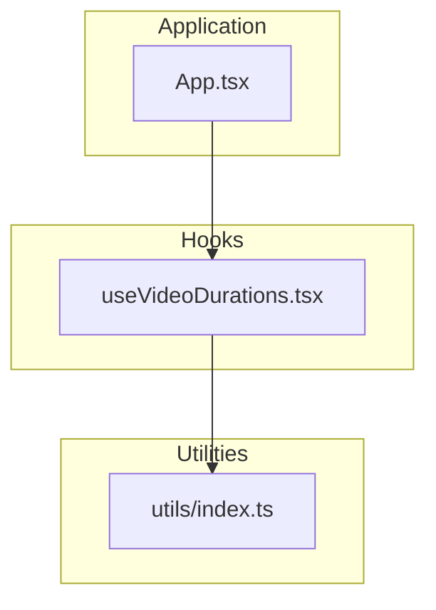
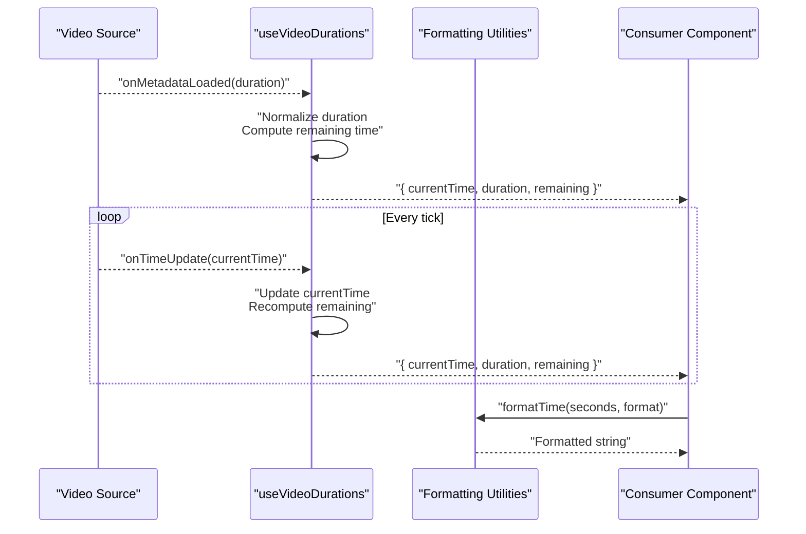
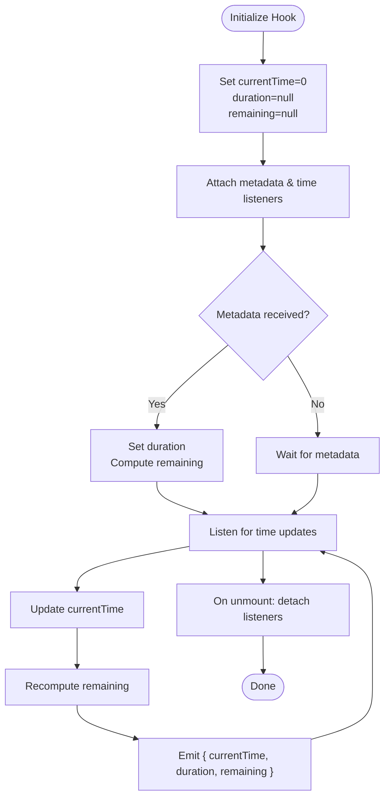
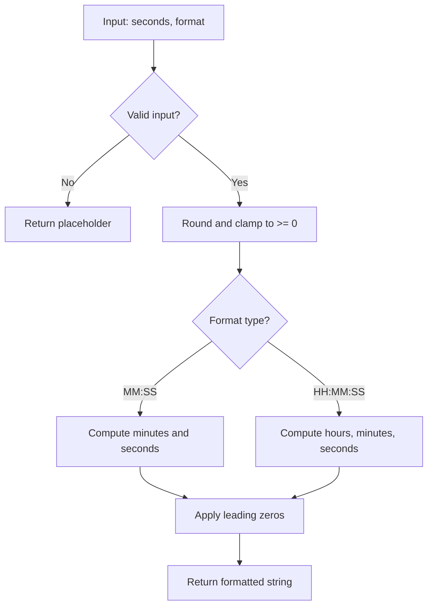
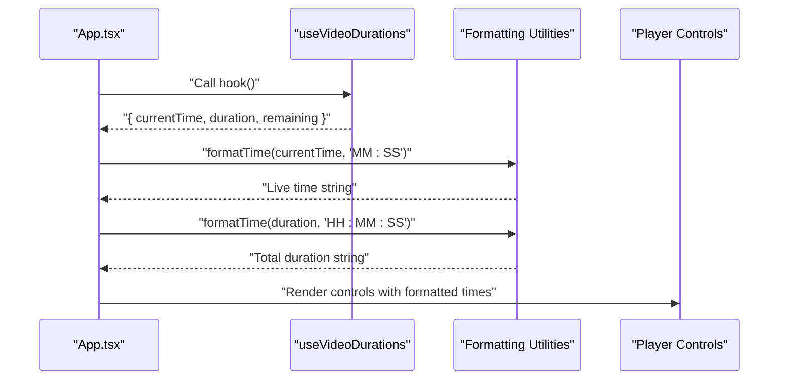
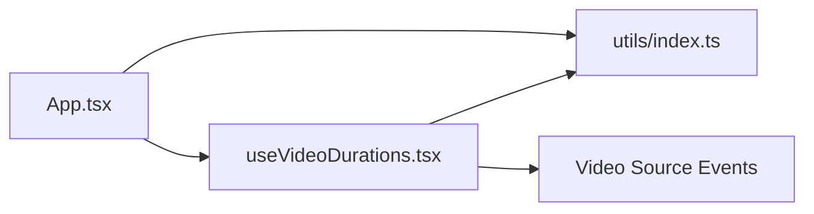

# Duration Tracking System

<cite>
**Referenced Files in This Document**
- [useVideoDurations.tsx](file://hooks/useVideoDurations.tsx)
- [index.ts](file://utils/index.ts)
- [App.tsx](file://App.tsx)
</cite>

## Table of Contents
1. [Introduction](#introduction)
2. [Project Structure](#project-structure)
3. [Core Components](#core-components)
4. [Architecture Overview](#architecture-overview)
5. [Detailed Component Analysis](#detailed-component-analysis)
6. [Dependency Analysis](#dependency-analysis)
7. [Performance Considerations](#performance-considerations)
8. [Troubleshooting Guide](#troubleshooting-guide)
9. [Conclusion](#conclusion)
10. [Appendices](#appendices)

## Introduction
This document explains the duration tracking system used to monitor and display video timing information, including current playback position, total duration, and remaining time. It covers how real-time updates synchronize with video playback progress, formatting utilities for displaying time in various formats (MM:SS, HH:MM:SS), error handling for videos with unknown durations, and optimization strategies for frequent state updates. It also provides examples of customizing time display formats and integrating with other player components.

## Project Structure
The duration tracking system is implemented as a React hook that encapsulates timing logic and exposes a stable interface for consumers. Formatting utilities are provided in a shared utility module. The main application integrates these hooks and utilities to render accurate time displays across the UI.

**Diagram sources**
- [useVideoDurations.tsx](file://hooks/useVideoDurations.tsx)
- [index.ts](file://utils/index.ts)
- [App.tsx](file://App.tsx)

**Section sources**
- [useVideoDurations.tsx](file://hooks/useVideoDurations.tsx)
- [index.ts](file://utils/index.ts)
- [App.tsx](file://App.tsx)

## Core Components
- useVideoDurations hook: Monitors video metadata and playback events to compute current time, total duration, and remaining time. It emits updates at appropriate intervals to keep the UI synchronized with playback.
- Formatting utilities: Provide functions to format seconds into human-readable strings such as MM:SS or HH:MM:SS, with support for optional leading zeros and locale-aware behavior.

Key responsibilities:
- Subscribe to video events for metadata availability and time updates.
- Normalize duration values and handle unknown durations gracefully.
- Compute derived values like remaining time from current time and total duration.
- Expose a clean API for consumers to render time displays.

**Section sources**
- [useVideoDurations.tsx](file://hooks/useVideoDurations.tsx)
- [index.ts](file://utils/index.ts)

## Architecture Overview
The duration tracking system follows a unidirectional data flow:
- Video source emits events (metadata loaded, time update).
- The hook listens to these events and updates internal state.
- Derived values (current time, total duration, remaining time) are computed.
- Consumers subscribe to the hook’s output and render formatted time strings via utilities.

**Diagram sources**
- [useVideoDurations.tsx](file://hooks/useVideoDurations.tsx)
- [index.ts](file://utils/index.ts)
- [App.tsx](file://App.tsx)

## Detailed Component Analysis

### useVideoDurations Hook
Responsibilities:
- Initialize state for current time, total duration, and remaining time.
- Attach event listeners for metadata and time updates.
- Handle edge cases where duration is unknown or zero.
- Debounce or throttle updates to avoid excessive re-renders.
- Provide a stable object shape for consumers.

Data model:
- currentTime: number (seconds)
- duration: number | null (unknown if not available)
- remaining: number | null (computed; null when duration is unknown)

Event flow:
- On metadata load: set duration, compute initial remaining.
- On time update: update currentTime, recompute remaining.
- On cleanup: remove listeners to prevent memory leaks.

Error handling:
- If duration is NaN or negative, treat as unknown and show placeholder.
- Guard against undefined events or unsupported platforms.

Optimization strategies:
- Use memoization for derived values.
- Throttle time updates to a reasonable interval (e.g., every 250–500ms).
- Avoid unnecessary state updates by comparing previous values.

Integration points:
- Consumed by player controls, scrubbers, and overlays.
- Works alongside sequence players and timeline components.

**Diagram sources**
- [useVideoDurations.tsx](file://hooks/useVideoDurations.tsx)

**Section sources**
- [useVideoDurations.tsx](file://hooks/useVideoDurations.tsx)

### Formatting Utilities
Responsibilities:
- Convert seconds to formatted strings (MM:SS, HH:MM:SS).
- Support optional leading zeros and padding.
- Handle null/undefined inputs gracefully.
- Provide consistent formatting across the app.

Common behaviors:
- Round seconds to nearest integer before formatting.
- Clamp negative values to zero.
- Return placeholder text when input is invalid.

Usage patterns:
- Format current time for live display.
- Format total duration once after metadata load.
- Format remaining time for countdown indicators.

**Diagram sources**
- [index.ts](file://utils/index.ts)

**Section sources**
- [index.ts](file://utils/index.ts)

### Consumer Integration (App.tsx)
Responsibilities:
- Consume useVideoDurations to obtain timing state.
- Render formatted time strings using utilities.
- Integrate with player controls and overlays.

Typical usage:
- Call the hook within a component tree that has access to the video instance.
- Pass currentTime, duration, and remaining to UI elements.
- Apply formatting based on context (live vs. static).

**Diagram sources**
- [App.tsx](file://App.tsx)
- [useVideoDurations.tsx](file://hooks/useVideoDurations.tsx)
- [index.ts](file://utils/index.ts)

**Section sources**
- [App.tsx](file://App.tsx)
- [useVideoDurations.tsx](file://hooks/useVideoDurations.tsx)
- [index.ts](file://utils/index.ts)

## Dependency Analysis
The duration tracking system has minimal external dependencies:
- useVideoDurations depends on the video source events and platform-specific APIs.
- Formatting utilities are pure functions with no side effects.
- Consumers depend on both the hook and utilities for rendering.

**Diagram sources**
- [App.tsx](file://App.tsx)
- [useVideoDurations.tsx](file://hooks/useVideoDurations.tsx)
- [index.ts](file://utils/index.ts)

**Section sources**
- [App.tsx](file://App.tsx)
- [useVideoDurations.tsx](file://hooks/useVideoDurations.tsx)
- [index.ts](file://utils/index.ts)

## Performance Considerations
- Throttle time updates to reduce re-render frequency while maintaining smooth UI feedback.
- Memoize derived values to prevent unnecessary computations.
- Avoid creating new objects on each update; reuse shapes where possible.
- Defer heavy formatting until render time and cache results if needed.
- Ensure proper cleanup of event listeners to prevent memory leaks.

[No sources needed since this section provides general guidance]

## Troubleshooting Guide
Common issues and resolutions:
- Unknown duration: Display placeholder or “--:--” when duration is unavailable.
- Negative or NaN values: Clamp to zero and log warnings for debugging.
- Stale UI: Verify event listeners are attached and updated correctly.
- Excessive re-renders: Implement throttling and memoization.
- Platform differences: Test on iOS and Android to ensure consistent behavior.

**Section sources**
- [useVideoDurations.tsx](file://hooks/useVideoDurations.tsx)
- [index.ts](file://utils/index.ts)

## Conclusion
The duration tracking system provides a robust foundation for monitoring and displaying video timing information. By combining a well-structured hook with reliable formatting utilities, it ensures accurate, performant, and user-friendly time displays across the application. Proper error handling and optimization strategies make it resilient in diverse playback scenarios.

[No sources needed since this section summarizes without analyzing specific files]

## Appendices

### Customizing Time Display Formats
- Extend formatting utilities to support additional formats (e.g., decimal seconds, localized strings).
- Allow consumers to pass custom formatters to the hook for advanced use cases.
- Provide presets for common formats and enable dynamic switching at runtime.

### Integrating with Other Player Components
- Share timing state with scrubber components for seek functionality.
- Sync overlay timers with playback progress for visual feedback.
- Coordinate with sequence players to display per-video durations in playlists.

[No sources needed since this section provides general guidance]