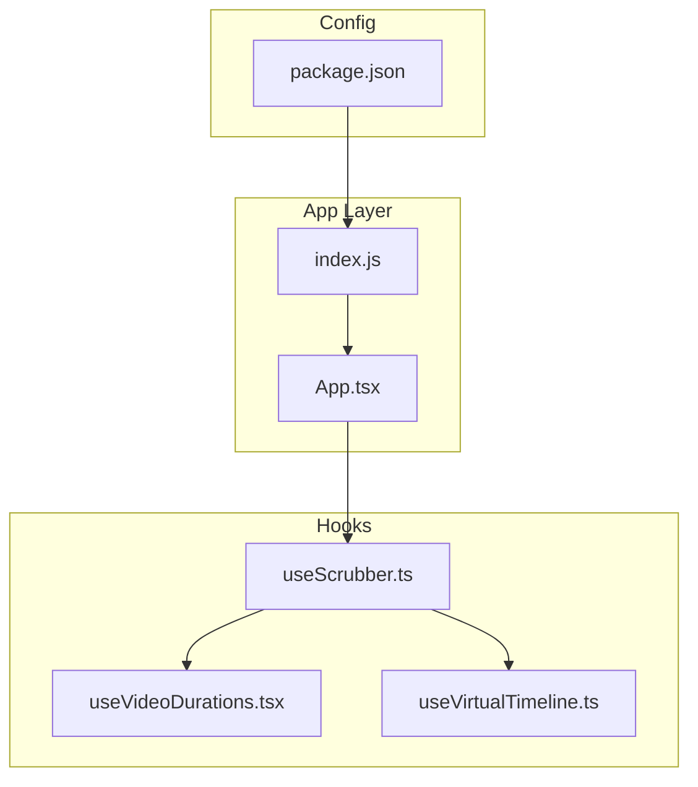
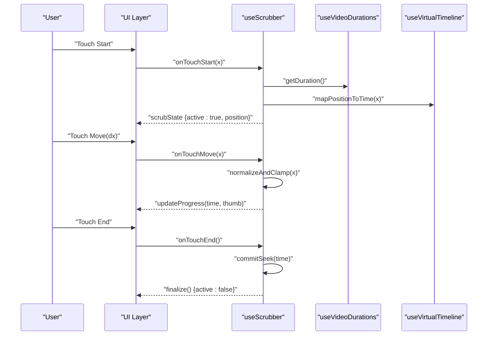
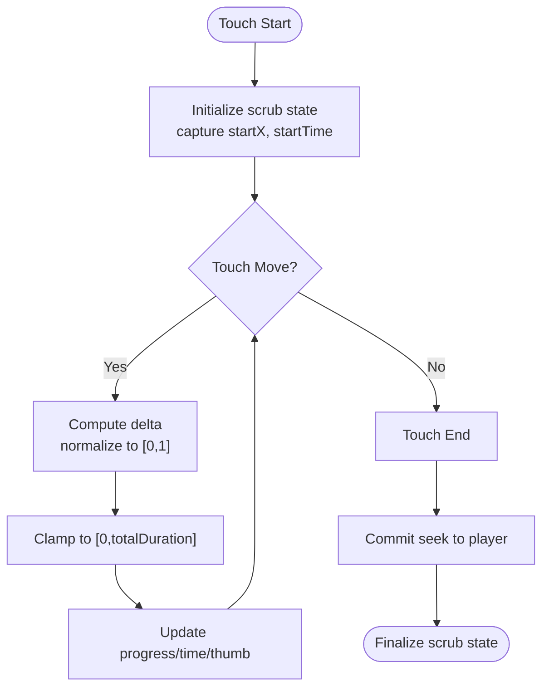
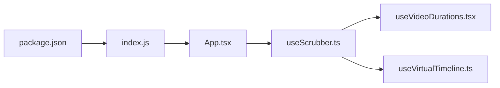

# Interactive Scrubber Functionality

<cite>
**Referenced Files in This Document**
- [useScrubber.ts](file://hooks/useScrubber.ts)
- [useVideoDurations.tsx](file://hooks/useVideoDurations.tsx)
- [useVirtualTimeline.ts](file://hooks/useVirtualTimeline.ts)
- [App.tsx](file://App.tsx)
- [index.js](file://index.js)
- [package.json](file://package.json)
</cite>

## Table of Contents
1. [Introduction](#introduction)
2. [Project Structure](#project-structure)
3. [Core Components](#core-components)
4. [Architecture Overview](#architecture-overview)
5. [Detailed Component Analysis](#detailed-component-analysis)
6. [Dependency Analysis](#dependency-analysis)
7. [Performance Considerations](#performance-considerations)
8. [Troubleshooting Guide](#troubleshooting-guide)
9. [Conclusion](#conclusion)
10. [Appendices](#appendices)

## Introduction
This document explains the interactive scrubber system implemented with the useScrubber hook. It covers how touch-based video seeking is achieved through drag gestures, precise position selection, and smooth user interactions. The documentation also describes visual feedback mechanisms such as preview thumbnails, time indicators, and progress updates during scrubbing. Implementation details include calculating seek positions, handling boundary conditions, and optimizing performance during rapid scrubbing. Finally, it provides guidance on customizing the scrubber’s appearance and behavior to fit different UI requirements.

## Project Structure
The scrubber functionality is primarily implemented within the hooks directory, with supporting files for durations and timeline utilities. The main application entry point integrates these hooks into the UI layer.

**Diagram sources**
- [useScrubber.ts](file://hooks/useScrubber.ts)
- [useVideoDurations.tsx](file://hooks/useVideoDurations.tsx)
- [useVirtualTimeline.ts](file://hooks/useVirtualTimeline.ts)
- [App.tsx](file://App.tsx)
- [index.js](file://index.js)
- [package.json](file://package.json)

**Section sources**
- [useScrubber.ts](file://hooks/useScrubber.ts)
- [useVideoDurations.tsx](file://hooks/useVideoDurations.tsx)
- [useVirtualTimeline.ts](file://hooks/useVirtualTimeline.ts)
- [App.tsx](file://App.tsx)
- [index.js](file://index.js)
- [package.json](file://package.json)

## Core Components
- useScrubber hook: Implements gesture recognition for touch start, move, and end events; calculates seek positions based on drag coordinates; manages visual feedback (progress bar, time indicator, preview thumbnail); and debounces or throttles updates during rapid scrubbing.
- useVideoDurations: Provides total duration and segment durations used by the scrubber to normalize positions and compute accurate seek targets.
- useVirtualTimeline: Supplies virtualized timeline data and helpers for efficient rendering and interaction mapping across long timelines.

Key responsibilities:
- Gesture handling: Detects pointer/touch events, tracks movement deltas, and determines when a scrub is active.
- Position calculation: Converts screen coordinates to normalized values (0–1), maps to time ranges, and clamps to valid boundaries.
- Visual feedback: Updates progress bar fill, shows current time label, and renders preview thumbnails aligned with the cursor.
- Performance optimization: Uses requestAnimationFrame or throttling to avoid excessive re-renders during fast drags.

**Section sources**
- [useScrubber.ts](file://hooks/useScrubber.ts)
- [useVideoDurations.tsx](file://hooks/useVideoDurations.tsx)
- [useVirtualTimeline.ts](file://hooks/useVirtualTimeline.ts)

## Architecture Overview
The scrubber architecture centers around the useScrubber hook, which composes duration and timeline utilities to deliver a cohesive scrubbing experience. The UI layer consumes the hook’s state and callbacks to render interactive controls.

**Diagram sources**
- [useScrubber.ts](file://hooks/useScrubber.ts)
- [useVideoDurations.tsx](file://hooks/useVideoDurations.tsx)
- [useVirtualTimeline.ts](file://hooks/useVirtualTimeline.ts)

## Detailed Component Analysis

### useScrubber Hook
The useScrubber hook encapsulates all logic required for interactive scrubbing. It exposes state and event handlers that the UI binds to touch/pointer events.

Responsibilities:
- Gesture recognition: Handles touch start, move, and end events to initiate, update, and finalize scrubbing.
- Position normalization: Converts raw coordinates to normalized values and maps them to time segments.
- Boundary handling: Ensures positions stay within valid ranges (0 to total duration).
- Visual updates: Emits progress changes, time labels, and preview thumbnail positions.
- Performance tuning: Throttles or batches updates during rapid movement to reduce re-renders.

**Diagram sources**
- [useScrubber.ts](file://hooks/useScrubber.ts)

**Section sources**
- [useScrubber.ts](file://hooks/useScrubber.ts)

### useVideoDurations Utility
Provides duration information necessary for accurate scrubbing:
- Total duration of the media
- Segment durations for multi-part content
- Helpers to convert between normalized positions and time values

Usage patterns:
- Normalize input coordinates to [0,1]
- Map normalized values to absolute time
- Validate against total duration

**Section sources**
- [useVideoDurations.tsx](file://hooks/useVideoDurations.tsx)

### useVirtualTimeline Utility
Supports efficient rendering and interaction mapping for long timelines:
- Virtualizes visible segments
- Maps screen coordinates to timeline indices
- Provides helpers for snapping and preview generation

Integration points:
- useScrubber uses timeline mapping to determine preview thumbnails and segment highlights
- Ensures smooth scrolling and responsive UI even with large datasets

**Section sources**
- [useVirtualTimeline.ts](file://hooks/useVirtualTimeline.ts)

### App Integration
The app layer binds the hook’s event handlers to UI components:
- Renders progress bar and time indicator
- Displays preview thumbnails aligned with cursor
- Calls commitSeek upon touch end to perform actual playback seek

Customization points:
- Style progress bar colors and thickness
- Adjust preview thumbnail size and positioning
- Configure debounce/throttle intervals for responsiveness vs. accuracy trade-offs

**Section sources**
- [App.tsx](file://App.tsx)

## Dependency Analysis
The scrubber system has clear dependencies between the hook and utility modules. The UI layer depends on the hook’s exposed API, while the hook relies on duration and timeline utilities for calculations.

**Diagram sources**
- [App.tsx](file://App.tsx)
- [useScrubber.ts](file://hooks/useScrubber.ts)
- [useVideoDurations.tsx](file://hooks/useVideoDurations.tsx)
- [useVirtualTimeline.ts](file://hooks/useVirtualTimeline.ts)
- [index.js](file://index.js)
- [package.json](file://package.json)

**Section sources**
- [App.tsx](file://App.tsx)
- [useScrubber.ts](file://hooks/useScrubber.ts)
- [useVideoDurations.tsx](file://hooks/useVideoDurations.tsx)
- [useVirtualTimeline.ts](file://hooks/useVirtualTimeline.ts)
- [index.js](file://index.js)
- [package.json](file://package.json)

## Performance Considerations
- Throttling/Debouncing: Limit update frequency during rapid drags to prevent excessive re-renders.
- Request Animation Frame: Batch UI updates using animation frames for smoother visuals.
- Memoization: Cache computed positions and previews to avoid redundant calculations.
- Virtualization: Render only visible timeline segments to minimize memory usage.
- Boundary Checks: Early exit on out-of-bounds inputs to reduce processing overhead.

[No sources needed since this section provides general guidance]

## Troubleshooting Guide
Common issues and resolutions:
- Seek not triggering: Ensure onTouchEnd commits the seek and that duration values are valid.
- Jittery progress: Increase throttle interval or switch to requestAnimationFrame batching.
- Preview thumbnails misaligned: Verify coordinate-to-time mapping and timeline index calculations.
- Out-of-range seeks: Confirm clamping logic enforces [0, totalDuration].
- Touch events not firing: Check platform-specific pointer/touch event bindings and z-index stacking.

**Section sources**
- [useScrubber.ts](file://hooks/useScrubber.ts)
- [useVideoDurations.tsx](file://hooks/useVideoDurations.tsx)
- [useVirtualTimeline.ts](file://hooks/useVirtualTimeline.ts)

## Conclusion
The interactive scrubber system leverages the useScrubber hook to deliver a robust, touch-driven video seeking experience. By combining gesture recognition, precise position calculation, and optimized visual feedback, it ensures smooth and responsive scrubbing. Customization options allow developers to tailor appearance and behavior to meet specific design and performance needs.

[No sources needed since this section summarizes without analyzing specific files]

## Appendices

### Customization Examples
- Appearance:
  - Progress bar color and height
  - Thumb radius and color
  - Time label font and placement
- Behavior:
  - Debounce interval for updates
  - Snapping to segment boundaries
  - Preview thumbnail density and size

[No sources needed since this section provides general guidance]