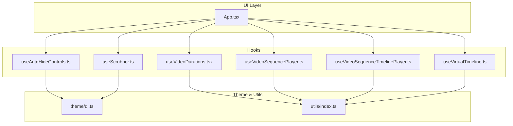
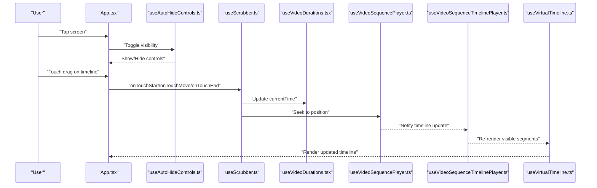
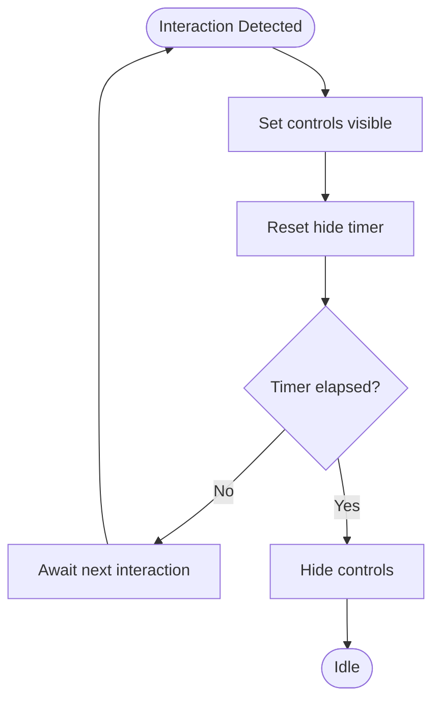
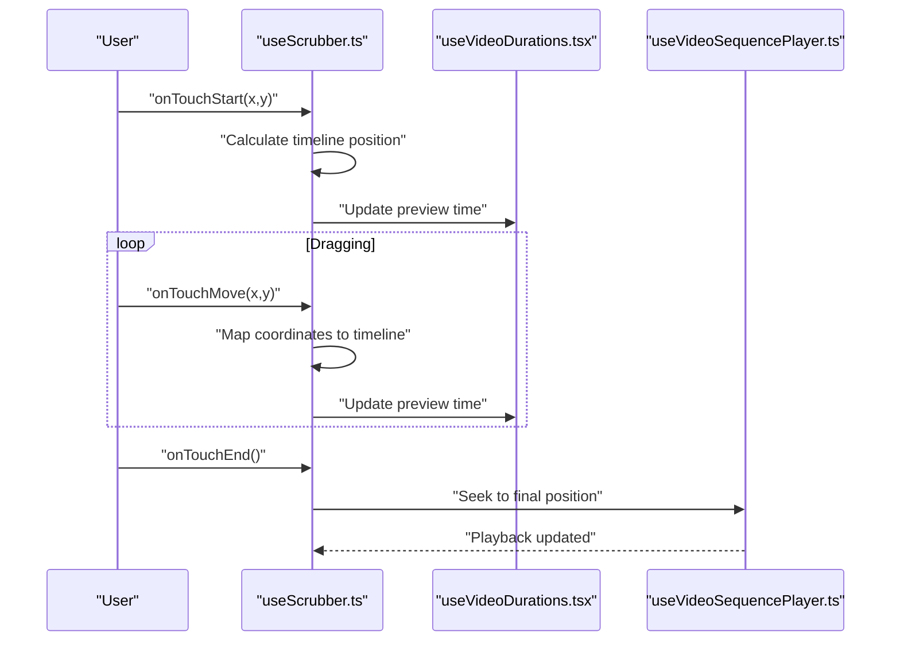
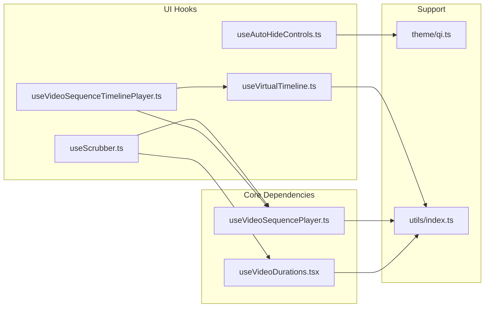

# Video Player Features

<cite>
**Referenced Files in This Document**
- [useAutoHideControls.ts](file://hooks/useAutoHideControls.ts)
- [useScrubber.ts](file://hooks/useScrubber.ts)
- [useVideoDurations.tsx](file://hooks/useVideoDurations.tsx)
- [useVideoSequencePlayer.ts](file://hooks/useVideoSequencePlayer.ts)
- [useVideoSequenceTimelinePlayer.ts](file://hooks/useVideoSequenceTimelinePlayer.ts)
- [useVirtualTimeline.ts](file://hooks/useVirtualTimeline.ts)
- [App.tsx](file://App.tsx)
- [qi.ts](file://theme/qi.ts)
- [index.ts](file://utils/index.ts)
</cite>

## Table of Contents
1. [Introduction](#introduction)
2. [Project Structure](#project-structure)
3. [Core Components](#core-components)
4. [Architecture Overview](#architecture-overview)
5. [Detailed Component Analysis](#detailed-component-analysis)
6. [Dependency Analysis](#dependency-analysis)
7. [Performance Considerations](#performance-considerations)
8. [Troubleshooting Guide](#troubleshooting-guide)
9. [Conclusion](#conclusion)

## Introduction
This document explains the video player features implemented in the application, focusing on:
- Auto-hiding controls for a clean playback interface
- Interactive scrubbing via touch gestures for precise navigation
- Duration tracking and timing display
- Timeline visualization and manipulation
- Touch event handling, gesture recognition, and responsive control behavior
- Customization through props and configuration options

The implementation is organized into focused hooks that encapsulate specific behaviors, making the player modular and easy to extend.

## Project Structure
The video player functionality is primarily implemented in the hooks directory, with supporting theme and utility modules:
- hooks: Core logic for auto-hiding controls, scrubbing, duration tracking, sequence playback, timeline management, and virtual timeline rendering
- theme: Styling tokens and design system integration
- utils: Shared helpers used across components and hooks
- App.tsx: Entry point demonstrating how the hooks are composed and consumed

**Diagram sources**
- [App.tsx](file://App.tsx)
- [useAutoHideControls.ts](file://hooks/useAutoHideControls.ts)
- [useScrubber.ts](file://hooks/useScrubber.ts)
- [useVideoDurations.tsx](file://hooks/useVideoDurations.tsx)
- [useVideoSequencePlayer.ts](file://hooks/useVideoSequencePlayer.ts)
- [useVideoSequenceTimelinePlayer.ts](file://hooks/useVideoSequenceTimelinePlayer.ts)
- [useVirtualTimeline.ts](file://hooks/useVirtualTimeline.ts)
- [qi.ts](file://theme/qi.ts)
- [index.ts](file://utils/index.ts)

**Section sources**
- [App.tsx](file://App.tsx)
- [useAutoHideControls.ts](file://hooks/useAutoHideControls.ts)
- [useScrubber.ts](file://hooks/useScrubber.ts)
- [useVideoDurations.tsx](file://hooks/useVideoDurations.tsx)
- [useVideoSequencePlayer.ts](file://hooks/useVideoSequencePlayer.ts)
- [useVideoSequenceTimelinePlayer.ts](file://hooks/useVideoSequenceTimelinePlayer.ts)
- [useVirtualTimeline.ts](file://hooks/useVirtualTimeline.ts)
- [qi.ts](file://theme/qi.ts)
- [index.ts](file://utils/index.ts)

## Core Components
The video player is built from cohesive hooks that each manage a distinct concern:
- Auto-hide controls: Manages visibility timers and user interaction states to hide/show controls during playback
- Scrubber: Handles touch events and gestures to seek within the video timeline
- Duration tracking: Computes and exposes current time and total duration for display
- Sequence player: Coordinates playback state across multiple videos or segments
- Timeline player: Bridges sequence state with timeline UI updates
- Virtual timeline: Renders large timelines efficiently by only drawing visible segments

These hooks expose simple APIs for the UI layer to render controls, update the progress bar, and respond to user input.

**Section sources**
- [useAutoHideControls.ts](file://hooks/useAutoHideControls.ts)
- [useScrubber.ts](file://hooks/useScrubber.ts)
- [useVideoDurations.tsx](file://hooks/useVideoDurations.tsx)
- [useVideoSequencePlayer.ts](file://hooks/useVideoSequencePlayer.ts)
- [useVideoSequenceTimelinePlayer.ts](file://hooks/useVideoSequenceTimelinePlayer.ts)
- [useVirtualTimeline.ts](file://hooks/useVirtualTimeline.ts)

## Architecture Overview
The player architecture separates concerns into hooks that communicate through shared state and callbacks. The UI layer composes these hooks to render controls, timeline, and feedback elements.

**Diagram sources**
- [App.tsx](file://App.tsx)
- [useAutoHideControls.ts](file://hooks/useAutoHideControls.ts)
- [useScrubber.ts](file://hooks/useScrubber.ts)
- [useVideoDurations.tsx](file://hooks/useVideoDurations.tsx)
- [useVideoSequencePlayer.ts](file://hooks/useVideoSequencePlayer.ts)
- [useVideoSequenceTimelinePlayer.ts](file://hooks/useVideoSequenceTimelinePlayer.ts)
- [useVirtualTimeline.ts](file://hooks/useVirtualTimeline.ts)

## Detailed Component Analysis

### Auto-Hiding Control System
The auto-hide system ensures controls appear on user interaction and fade out after a period of inactivity, providing an unobstructed view during playback. It manages:
- Visibility state based on active interactions (touch, hover, focus)
- Timers to automatically hide controls after a configurable delay
- Debounced re-showing when new interactions occur
- Responsive behavior across different screen sizes and orientations

Customization points include:
- Hide delay duration
- Show/hide animation timings
- Trigger conditions (tap, swipe, focus)
- Conditional visibility based on playback state

**Diagram sources**
- [useAutoHideControls.ts](file://hooks/useAutoHideControls.ts)

**Section sources**
- [useAutoHideControls.ts](file://hooks/useAutoHideControls.ts)

### Interactive Scrubbing Functionality
The scrubber enables precise video navigation through touch gestures:
- Touch start captures initial position and initiates seeking mode
- Touch move calculates delta positions and maps them to timeline coordinates
- Touch end finalizes the seek operation and updates playback position
- Gesture recognition distinguishes between dragging (seeking) and tapping (play/pause)
- Visual feedback shows preview thumbnails or time indicators during scrubbing

Implementation highlights:
- Coordinate transformation from screen space to timeline percentages
- Boundary clamping to prevent invalid seek positions
- Smooth interpolation for fluid scrubbing experience
- Integration with media engine for accurate seeking

**Diagram sources**
- [useScrubber.ts](file://hooks/useScrubber.ts)
- [useVideoDurations.tsx](file://hooks/useVideoDurations.tsx)
- [useVideoSequencePlayer.ts](file://hooks/useVideoSequencePlayer.ts)

**Section sources**
- [useScrubber.ts](file://hooks/useScrubber.ts)
- [useVideoDurations.tsx](file://hooks/useVideoDurations.tsx)
- [useVideoSequencePlayer.ts](file://hooks/useVideoSequencePlayer.ts)

### Duration Tracking System
The duration tracking system provides accurate timing information for display and navigation:
- Current time monitoring through media event listeners
- Total duration calculation from media metadata
- Time formatting utilities for consistent display
- Real-time updates synchronized with playback state
- Buffering state awareness for accurate progress indication

Key features:
- Millisecond precision for smooth progress bars
- Formatting functions for human-readable time display
- Integration with playback state (playing, paused, buffering)
- Error handling for unavailable duration data

**Section sources**
- [useVideoDurations.tsx](file://hooks/useVideoDurations.tsx)

### Timeline Visualization and Manipulation
The timeline component renders the video timeline with interactive capabilities:
- Progress bar showing current playback position
- Buffer indicator displaying loaded content
- Thumbnail previews at hover/scrub positions
- Seekable regions with visual feedback
- Responsive layout adapting to different screen sizes

Advanced features:
- Virtualized rendering for long videos
- Segment markers for chapters or keyframes
- Customizable colors and styling
- Accessibility support with keyboard navigation

**Section sources**
- [useVirtualTimeline.ts](file://hooks/useVirtualTimeline.ts)
- [useVideoSequenceTimelinePlayer.ts](file://hooks/useVideoSequenceTimelinePlayer.ts)

### Touch Event Handling and Gesture Recognition
The touch handling system processes various gesture types:
- Single tap for play/pause toggle
- Long press for detailed scrubbing
- Swipe gestures for volume/brightness control
- Pinch gestures for zoom operations
- Multi-touch support for complex interactions

Gesture recognition includes:
- Velocity detection for momentum-based scrolling
- Directional sensitivity for horizontal vs vertical swipes
- Threshold configuration for different gesture types
- Conflict resolution between overlapping gestures

**Section sources**
- [useScrubber.ts](file://hooks/useScrubber.ts)

### Responsive Control Behavior
Controls adapt to different contexts and devices:
- Mobile-optimized touch targets and spacing
- Tablet-specific multi-column layouts
- Desktop enhancements with mouse hover effects
- Orientation change handling for dynamic resizing
- Accessibility considerations for screen readers

Adaptive behaviors:
- Automatic scaling based on screen density
- Context-aware control visibility
- Performance optimization for low-end devices
- Cross-platform compatibility considerations

**Section sources**
- [useAutoHideControls.ts](file://hooks/useAutoHideControls.ts)

## Dependency Analysis
The video player hooks have clear dependency relationships and communication patterns:

**Diagram sources**
- [useAutoHideControls.ts](file://hooks/useAutoHideControls.ts)
- [useScrubber.ts](file://hooks/useScrubber.ts)
- [useVideoDurations.tsx](file://hooks/useVideoDurations.tsx)
- [useVideoSequencePlayer.ts](file://hooks/useVideoSequencePlayer.ts)
- [useVideoSequenceTimelinePlayer.ts](file://hooks/useVideoSequenceTimelinePlayer.ts)
- [useVirtualTimeline.ts](file://hooks/useVirtualTimeline.ts)
- [qi.ts](file://theme/qi.ts)
- [index.ts](file://utils/index.ts)

**Section sources**
- [useAutoHideControls.ts](file://hooks/useAutoHideControls.ts)
- [useScrubber.ts](file://hooks/useScrubber.ts)
- [useVideoDurations.tsx](file://hooks/useVideoDurations.tsx)
- [useVideoSequencePlayer.ts](file://hooks/useVideoSequencePlayer.ts)
- [useVideoSequenceTimelinePlayer.ts](file://hooks/useVideoSequenceTimelinePlayer.ts)
- [useVirtualTimeline.ts](file://hooks/useVirtualTimeline.ts)
- [qi.ts](file://theme/qi.ts)
- [index.ts](file://utils/index.ts)

## Performance Considerations
Optimization strategies implemented in the video player:
- Virtualized timeline rendering to handle long videos efficiently
- Debounced state updates to prevent excessive re-renders
- Memory-efficient gesture processing with proper cleanup
- Lazy loading of timeline segments and thumbnails
- Optimized touch event handling with passive listeners

Best practices:
- Minimize state updates during rapid user interactions
- Use memoization for expensive calculations
- Implement proper cleanup for event listeners and timers
- Profile performance on target devices and platforms

## Troubleshooting Guide
Common issues and solutions:
- Controls not hiding: Check timer configuration and interaction handlers
- Scrubbing not working: Verify coordinate mapping and boundary calculations
- Duration display incorrect: Ensure media metadata is available and formatted correctly
- Timeline lag: Review virtualization settings and segment size calculations
- Touch conflicts: Adjust gesture thresholds and priority settings

Debugging tips:
- Enable verbose logging for interaction events
- Monitor memory usage during extended playback sessions
- Test on multiple device types and screen sizes
- Validate accessibility features with screen readers

**Section sources**
- [useAutoHideControls.ts](file://hooks/useAutoHideControls.ts)
- [useScrubber.ts](file://hooks/useScrubber.ts)
- [useVideoDurations.tsx](file://hooks/useVideoDurations.tsx)
- [useVirtualTimeline.ts](file://hooks/useVirtualTimeline.ts)

## Conclusion
The video player implementation provides a comprehensive set of features including auto-hiding controls, interactive scrubbing, duration tracking, and responsive timeline visualization. The modular hook-based architecture makes it easy to customize and extend functionality while maintaining clean separation of concerns. The system handles complex touch interactions gracefully and adapts to different device types and screen sizes effectively.

Key strengths include:
- Clean separation of responsibilities through focused hooks
- Robust touch gesture recognition and handling
- Efficient rendering for large timelines
- Comprehensive customization options
- Cross-platform compatibility considerations

The implementation serves as a solid foundation for building sophisticated video player experiences in React Native applications.