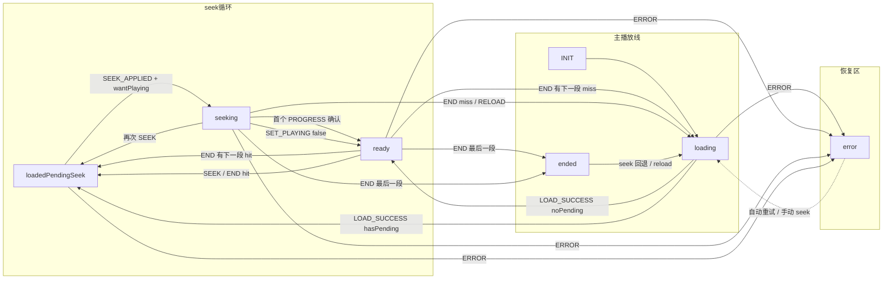
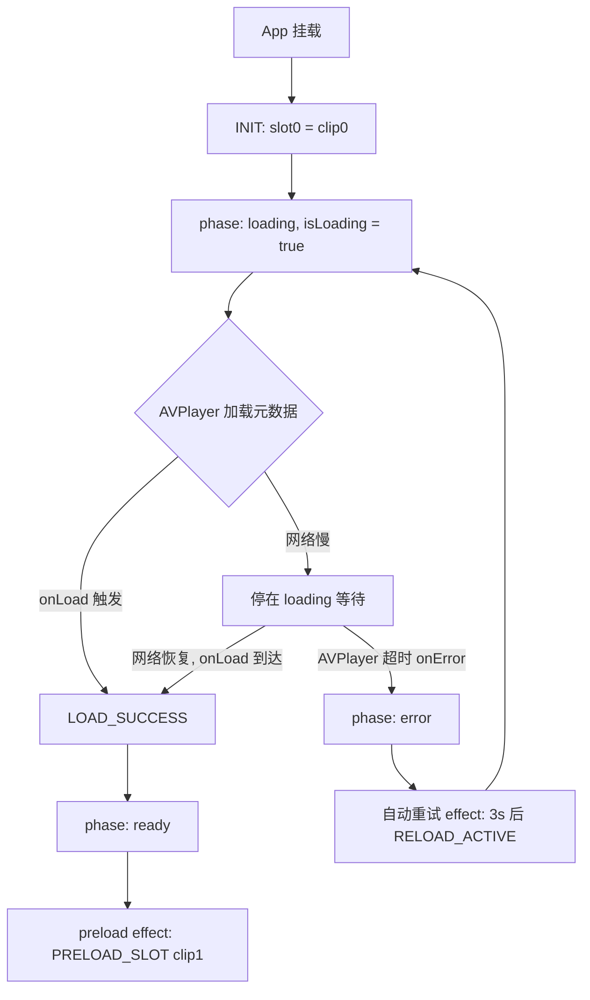
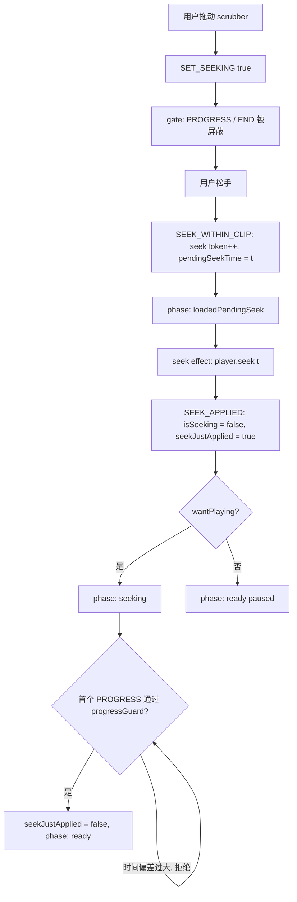
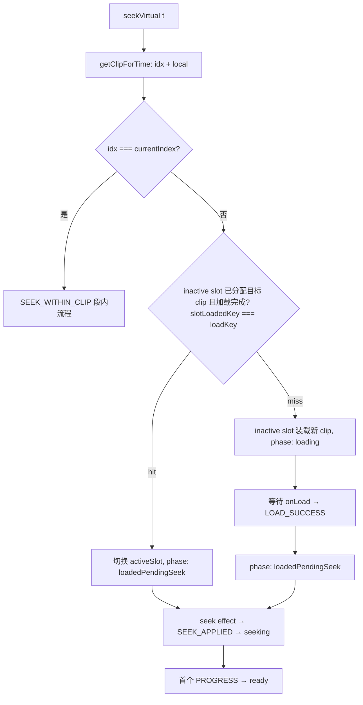
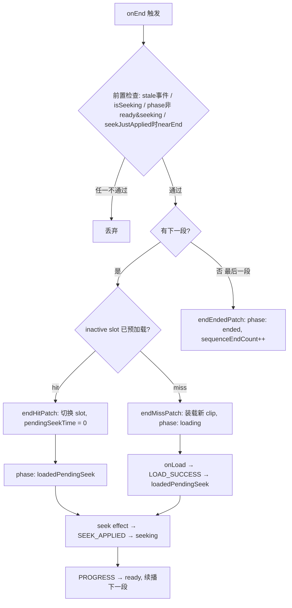
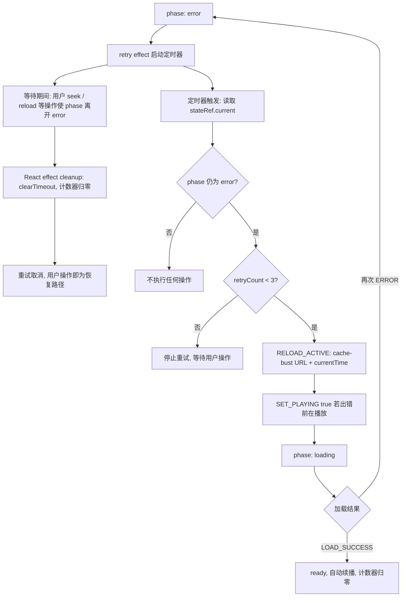
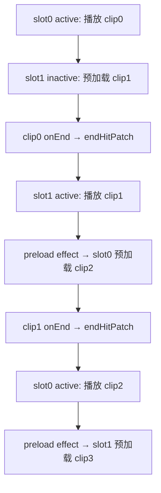

# useVideoSequencePlayer 流程图

本文档以 Mermaid 流程图形式描述状态机的核心流程，与 [STATE_MACHINE.md](./STATE_MACHINE.md)（文字 + 转移矩阵）互补。

---

## 1. 状态机总览（Phase 转移）

分三层读：

- **上层** — seek 循环（用户拖动 / clip 切换时的短暂过渡态）
- **中层** — 主播放线（INIT → loading → ready → ended）
- **下层** — 恢复区（error 的自动/手动恢复）

> 详细转移规则见 [STATE_MACHINE.md 第 5 节：各 Phase 的转移规则](./STATE_MACHINE.md#5-各-phase-的转移规则)。

---

## 2. 首次加载流程

---

## 3. 段内 Seek 流程（SEEK_WITHIN_CLIP）

---

## 4. 跨 Clip Seek（SEEK_TO_CLIP）

---

## 5. Clip 切换流程（onEnd）

---

## 6. Error 自动重试流程

---

## 7. 双播放器 Slot 轮转

